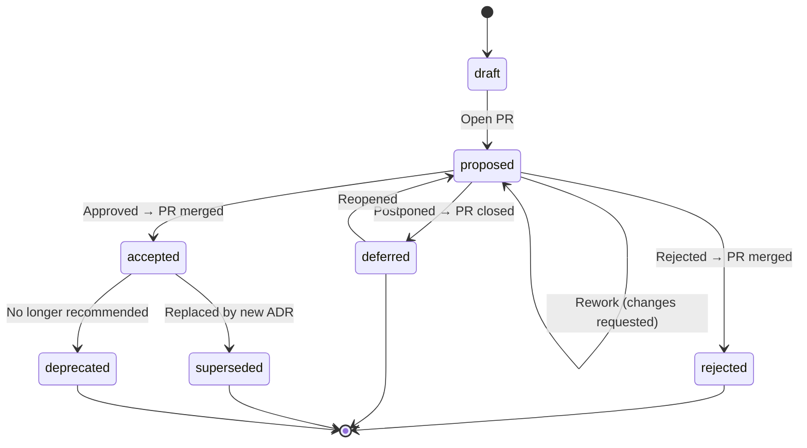

# adr-governance

A schema-governed, AI-native **Architecture Decision Record (ADR)** framework for teams that want their architectural decisions to be **structured**, **traceable**, and **asynchronous** — not debated in meetings, forgotten in Slack threads, or buried in wiki pages nobody reads.

## The Problem

Most teams make **Architecture Decisions (ADs)** every week. Few document them well. Decisions happen in meetings, context is lost the moment people leave the room, and six months later nobody can explain *why* something was built the way it was.

### 1. The decision-making process is broken

- **Meetings are the wrong medium for decisions.** They reward whoever is present and articulate in the moment, not whoever has done the deepest analysis. They produce no durable artifact. They don't scale across time zones.
- **Decisions without structure are decisions without quality.** When there's no template forcing you to consider alternatives, tradeoffs, and risks, corners get cut. Important ADs get made on gut feeling.
- **Stakeholder input is ad-hoc.** The right person wasn't in the room, the email got buried, the Slack thread moved on. Decisions get made without the people most affected by them ever weighing in.
- **The process is entirely human-centric.** AI can find gaps in reasoning, check consistency across decisions, suggest alternatives the team didn't consider, and validate conclusions against broad industry knowledge. But traditional decision-making doesn't leverage any of this — it relies solely on whoever is in the room and what they happen to remember. A process that isn't AI-native today is leaving compounding value on the table, and the gap will only widen as AI capabilities improve.

### 2. Decisions aren't traceable or enforceable

- **Undocumented decisions create compliance gaps.** Auditors ask for evidence of decision-making and get blank stares. New team members have no way to understand *why* the architecture looks the way it does.
- **Documented decisions that aren't enforced are just suggestions.** Even teams that write **Architecture Decision Records (ADRs)** rarely close the loop. The decision says "use DPoP," but nothing stops someone from committing mTLS code. Without a feedback mechanism from the **Architecture Decision Log (ADL)** back to the codebase, decisions and implementation drift apart silently.
- **Decisions rot.** A decision made 18 months ago under different constraints may no longer be the right call — but nobody scheduled a review, nobody re-evaluated, and by the time someone notices, the technical debt is structural.

### 3. Traditional tooling can't scale

- **Knowledge platforms are opaque to machines.** Decisions captured in Confluence pages, SharePoint wikis, PowerPoint decks, Notion databases, or meeting minutes in Microsoft Teams can't be schema-validated, can't support programmable multi-party approval workflows, can't be diffed or version-controlled with meaningful merges, and — critically — can't be consumed by AI agents or CI pipelines for automated enforcement.
- **SDLC artifacts are ephemeral by design.** Decisions buried in Jira ticket comments, user story refinement notes, Azure DevOps work item discussions, or sprint retrospective action items *feel* tracked because they live in a managed tool. But closed tickets are rarely revisited, decisions are scattered across hundreds of issues with no index, and there's no structured way to query "what did we decide about authentication?" six months later.
- **Proprietary formats are an integration liability.** As AI becomes central to the software delivery chain, decisions locked in formats that can't be programmatically queried, validated, or fed to agents become a bottleneck. A structured, Git-native, schema-governed ADL is AI-native by design — every improvement in AI tooling automatically makes your decision management better, because the data is already in the right shape.

### This framework's approach

**Shift-left decision-making.** Instead of debating in a meeting, the proposer prepares a well-structured ADR upfront — context, alternatives, risks, tradeoffs — and submits it as a pull request. Every stakeholder can review it asynchronously, on their own time, with full context in front of them. The decision process becomes a design review, not a calendar invite. And because it's GitOps-native, every approval by every relevant stakeholder is traceable — who approved what, when, and with what context — for free.

**AI-native by design.** A well-structured schema means AI assistants can help **author** ADRs through Socratic dialogue (probing for gaps, challenging vague rationale, surfacing unstated assumptions), **review** them before any human sees them (verifying completeness, flagging ambiguities, checking cross-reference consistency), and **enforce** them against your codebase (validating code compliance with accepted decisions in CI). The proposer doesn't fill in a template manually — they have a *conversation* with an AI assistant that interrogates them until every section is clear, complete, and internally consistent. By the time the ADR reaches a human reviewer, the low-hanging issues are already resolved. And because the data is structured, every advance in AI capability automatically improves your decision-making — better models mean sharper reviews, deeper gap analysis, and the ability to revisit your entire decision log against new information at scale.

**Architecture Knowledge Management (AKM).** Decisions are first-class engineering artifacts — not afterthoughts. Each AD is captured as an ADR, and the collection of all ADRs for a project forms the ADL — the `architecture-decision-log/` directory in this repository. This framework gives you the tooling and governance process to build an ADL that is schema-validated, Git-governed, AI-assisted, and auditable.

## What This Provides

- **JSON Schema** (Draft 2020-12) defining the complete ADR meta-model — every field, enum, and constraint
- **GitOps-based governance process** — ADR status transitions happen through Git commits and pull requests, not manual coordination
- **Validation tooling** — a Python validator that checks schema compliance, referential integrity, and semantic consistency on every PR
- **Pre-built CI/CD pipelines** for GitHub Actions, Azure DevOps, GCP Cloud Build, AWS CodeBuild, and GitLab CI — ready to copy into your repo and enforce as a merge gate
- **Approval identity enforcement** — CI verifies that the people listed in `approvals[]` have actually approved the pull request, creating an auditable link between ADR approvals and Git platform approvals
- **Governance rules** — configurable single-ADR-per-PR enforcement, substantive vs. maintenance change classification, and admin overrides — all defined in a platform-agnostic [`.adr-governance/config.yaml`](.adr-governance/config.yaml)
- **LLM-ready setup prompts** — copy-paste prompts for AI assistants to set up CI for your platform in minutes
- [`llms.txt`](llms.txt) + [`llms-full.txt`](llms-full.txt) — Machine-readable project summaries for AI assistants ([llms.txt convention](https://llmstxt.org/)). `llms.txt` provides a concise overview with links; `llms-full.txt` embeds the complete documentation inline for context injection
- **Agent Skill** ([agentskills.io](https://agentskills.io) spec) for AI-assisted ADR authoring and review — works with Google Antigravity, Claude Code, VS Code Copilot, and any conforming agent. The skill knows the schema and the governance process, and will guide you through every field interactively
- **Decision enforcement** — the ADL can serve as a single source of truth for Spec-Driven Development (SDD): AI coding agents can search the bundled ADL to align code with architectural decisions, and CI pipelines can validate compliance before merge
- **Repomix bundling** — the entire ADL is concatenated into a single Markdown file that agents can search with standard tools, enabling cross-repository decision enforcement
- **Example ADRs** from a fictional IAM department (NovaTrust Financial Services) in [`examples-reference/`](examples-reference/) — real-world contended decisions with sizable pros and cons on each side, not strawman examples. Kept as a reference for quality and style; not real decisions

## Philosophy

Every ADR is **self-contained**. All context, **Architecturally Significant Requirements (ASRs)**, alternatives, consequences, and audit trails are embedded directly in the YAML file. There are no foreign-key dependencies between ADRs — the only explicit link is the `lifecycle.supersedes` / `superseded_by` chain for replacements. An ADR can *mention* other ADR IDs in prose, but it must be fully understandable on its own.

The ADL is an **append-only decision log**. ADRs are never deleted — they transition through a governed lifecycle. Rejected and superseded ADRs remain as historical records, preserving the decision-making trail for auditors, new team members, and your future self.

## ADR Lifecycle

Every ADR follows a governed state machine. All transitions happen through pull requests.



See [`docs/adr-process.md`](docs/adr-process.md) for the full normative governance process, including review checklists, the Architectural Significance Test, branch protection rules, and CODEOWNERS configuration.

## Quick Start — Adopting for Your Organization

> **⚡ Fastest path.** Paste the prompt below into any AI coding assistant (Codex, Claude Code, Antigravity, Copilot) to have it set up the entire framework for your organization in one shot. For manual step-by-step instructions, skip to [Manual Setup](#manual-setup).

```
I'm adopting the adr-governance framework (https://github.com/ivanstambuk/adr-governance) for my organization.

Please help me:
1. Fork or clone the repo into my organization as a new repository named "architecture-decisions".
2. Delete the examples-reference/ directory (those are fictional reference ADRs).
3. Update ADR-0000 (architecture-decision-log/ADR-0000-adopt-governed-adr-process.yaml):
   - Replace authors, decision_owner, reviewers, and approvals with my name/identity
   - Update adr.project to my organization name
   - Update timestamps and audit trail entries
4. Set up CI validation as a required merge gate for my platform.
5. Enable the pre-commit hook (git config core.hooksPath .githooks).
6. Configure CODEOWNERS with my team handle.
7. Verify the setup by creating a test branch with an intentionally malformed ADR and opening a PR to confirm the check fails.

My organization name is: [INSERT ORG NAME]
My CI platform is: [GitHub Actions / Azure DevOps / GCP Cloud Build / AWS CodeBuild / GitLab CI]
My architecture team handle is: [INSERT TEAM HANDLE, e.g., @myorg/architects]
My name is: [INSERT YOUR NAME]
My Git identity is: [INSERT YOUR GIT USERNAME]
```

---

<details>
<summary><h3>Manual Setup</h3> <em>If you used the AI prompt above, skip this section.</em></summary>

#### 1. Create your ADR repository

Create a new repository in your organization and clone this framework into it:

```bash
# Create a new repo in your org (GitHub example)
gh repo create your-org/architecture-decisions --private --clone

# Pull the framework into it
cd architecture-decisions
git remote add upstream https://github.com/ivanstambuk/adr-governance.git
git pull upstream main
git remote remove upstream
git push origin main
```

Or fork the repository directly from GitHub and rename it.

#### 2. Review examples *(optional cleanup)*

The [`examples-reference/`](examples-reference/) directory contains 8 fictional ADRs from "NovaTrust Financial Services" — they demonstrate the meta-model at production quality. **These are not real decisions.** You can:

- **Keep them** as a reference for your team (recommended initially)
- **Delete them** once your team is comfortable with the format:
  ```bash
  rm -rf examples-reference/
  git add -A && git commit -m "chore: remove reference examples"
  ```

#### 3. Customize ADR-0000

[`architecture-decision-log/ADR-0000-adopt-governed-adr-process.yaml`](architecture-decision-log/ADR-0000-adopt-governed-adr-process.yaml) is the **meta-ADR** — it documents the decision to adopt this governance framework. Update it for your organization:

- Replace the `authors`, `decision_owner`, `reviewers`, and `approvals` names and identities
- Update `adr.project` to your project or organisation name
- Update timestamps and audit trail entries
- Adjust the `context.summary` if your adoption rationale differs

#### 4. Set up CI

Copy the pipeline file for your platform to the repository root:

| Platform | Copy from | Copy to |
|----------|-----------|---------|
| **GitHub Actions** | Already at [`.github/workflows/validate-adr.yml`](.github/workflows/validate-adr.yml) | *(nothing to do)* |
| Azure DevOps | [`ci/azure-devops/azure-pipelines.yml`](ci/azure-devops/azure-pipelines.yml) | `azure-pipelines.yml` |
| GCP Cloud Build | [`ci/gcp-cloud-build/cloudbuild.yaml`](ci/gcp-cloud-build/cloudbuild.yaml) | `cloudbuild.yaml` |
| AWS CodeBuild | [`ci/aws-codebuild/buildspec.yml`](ci/aws-codebuild/buildspec.yml) | `buildspec.yml` |
| GitLab CI | [`ci/gitlab-ci/.gitlab-ci.yml`](ci/gitlab-ci/.gitlab-ci.yml) | `.gitlab-ci.yml` |

Then configure branch protection to make the CI check a **required merge gate** — see **[`docs/ci-setup.md`](docs/ci-setup.md)** for platform-specific instructions and LLM-ready setup prompts.

#### 5. Enable the pre-commit hook

```bash
git config core.hooksPath .githooks
```

This activates automatic Markdown rendering — every commit that touches `architecture-decision-log/*.yaml` will regenerate the human-friendly files in `rendered/` and the decision log index. Both the YAML source and its Markdown rendering are committed together, so reviewers approve both in the same PR.

#### 6. Configure CODEOWNERS *(optional but recommended)*

```bash
cp CODEOWNERS.example .github/CODEOWNERS
```

Edit `.github/CODEOWNERS` to replace the placeholder team handles (`@org/architecture-team`, etc.) with your real GitHub teams. This ensures ADRs and schema changes automatically request review from the right people.

#### 7. Copy the Agent Skill to your code repositories *(optional)*

The [`.skills/adr-author/`](.skills/adr-author/) directory is a portable AI skill. Copy it to any repository where developers will be authoring ADRs — agents like Antigravity, Claude Code, and Copilot will pick it up automatically and guide ADR creation through interactive questioning.

#### 8. Create your first real ADR

Use an AI assistant with the `adr-author` skill — it will guide you through every field via Socratic dialogue:

```
"I need to create a new ADR for [your decision]. Guide me through it."
```

Or copy the template manually:

```bash
cp .skills/adr-author/assets/adr-template.yaml \
   architecture-decision-log/ADR-0001-your-decision-title.yaml
```

#### 9. Validate and submit

```bash
# Install dependencies
pip install jsonschema pyyaml yamllint

# Validate schema + semantic consistency
python3 scripts/validate-adr.py architecture-decision-log/ADR-0001-your-decision-title.yaml

# Pre-review quality gate (pipe to your LLM for Socratic feedback)
python3 scripts/review-adr.py architecture-decision-log/ADR-0001-your-decision-title.yaml

# Open a PR — CI validates automatically
git checkout -b adr/0001-your-decision-title
git add architecture-decision-log/ADR-0001-your-decision-title.yaml
git commit -m "feat(adr): ADR-0001 your decision title"
git push origin adr/0001-your-decision-title
```

The CI pipeline validates schema compliance and lints the YAML. Reviewers are auto-assigned via CODEOWNERS. The PR becomes the decision forum — all discussion, feedback, and approval happens asynchronously in the PR thread.

</details>


## ADR Meta-Model

Each ADR YAML file captures a single **architecturally significant** decision — not every design choice, but the ones that shape the system's structure, quality attributes, and long-term constraints. Each file contains these sections:

| Section | Required | Description |
|---------|:--------:|-------------|
| `adr` | ✅ | ID, title, status, summary, timestamps, project, tags, priority, decision type, schema version |
| `authors` | ✅ | Who drafted the ADR |
| `decision_owner` | ✅ | Single accountable person |
| `context` | ✅ | Problem summary (Markdown), business/technical drivers, constraints |
| `alternatives` | ✅ | ≥2 alternatives with summary (Markdown), pros, cons, cost, risk, rejection rationale |
| `decision` | ✅ | Chosen alternative, rationale (Markdown), tradeoffs (Markdown), date, confidence |
| `consequences` | ✅ | Positive and negative outcomes |
| `confirmation` | ✅ | How the decision's implementation will be verified; artifact IDs (optional, backfilled later) |
| `reviewers` | | People who reviewed |
| `approvals` | | Formal approvals with timestamps and platform identities for CI verification |
| `requirements` | | **Architecturally Significant Requirements (ASRs)** — quality attributes, architectural constraints, and non-functional requirements that drove this decision. Not feature-level requirements |
| `dependencies` | | Internal and external dependencies |
| `references` | | External references, standards, evidence |
| `lifecycle` | | Review cadence, supersession chain, archival |
| `audit_trail` | | Immutable append-only event log |

> **Markdown-native fields** support full Markdown including embedded Mermaid diagrams via code fences. Use YAML literal block scalars (`|`) for multiline content.

## CI/CD Setup

Automated validation is the enforcement mechanism that makes the governance process real. Without it, the schema is a suggestion; with it, the schema is a contract.

**GitHub Actions** is preconfigured — the workflow at [`.github/workflows/validate-adr.yml`](.github/workflows/validate-adr.yml) runs on every PR. You just need to [enable branch protection](docs/ci-setup.md#github-actions) to make it a merge gate.

**Other platforms** have ready-to-use pipeline files in the `ci/` directory:

| Platform | Pipeline file | Copy to |
|----------|---------------|---------|
| Azure DevOps | [`ci/azure-devops/azure-pipelines.yml`](ci/azure-devops/azure-pipelines.yml) | `azure-pipelines.yml` (repo root) |
| GCP Cloud Build | [`ci/gcp-cloud-build/cloudbuild.yaml`](ci/gcp-cloud-build/cloudbuild.yaml) | `cloudbuild.yaml` (repo root) |
| AWS CodeBuild | [`ci/aws-codebuild/buildspec.yml`](ci/aws-codebuild/buildspec.yml) | `buildspec.yml` (repo root) |
| GitLab CI | [`ci/gitlab-ci/.gitlab-ci.yml`](ci/gitlab-ci/.gitlab-ci.yml) | `.gitlab-ci.yml` (repo root) |

**Step-by-step setup instructions**, platform-specific enforcement configuration, troubleshooting, and **LLM-ready prompts** (copy-paste into any AI assistant to have it set up CI for you) are in **[`docs/ci-setup.md`](docs/ci-setup.md)**.

## AI-Assisted Authoring & Pre-Review

ADRs are not meant to be filled in manually like a form. They are authored through **Socratic dialogue with an AI assistant** — the AI asks probing questions, challenges weak rationale, surfaces missing edge cases, and iteratively refines the document until it is clear, complete, and internally consistent.

This is a fundamental shift: instead of the proposer writing a draft in isolation and scheduling a meeting to "walk through" it (where reviewers discover ambiguities in real time), the AI assistant resolves those ambiguities *before the first human reviewer ever sees the document*.

The framework provides two paths:

- **Agent Skill** ([`.skills/adr-author/`](.skills/adr-author/)) — works with Google Antigravity, Claude Code, VS Code Copilot, and any [agentskills.io](https://agentskills.io)-conforming agent. The skill knows the full meta-model and governance lifecycle, and guides ADR creation through interactive questioning — probing for ASRs, demanding balanced alternatives, and verifying that rationale connects to stated drivers.
- **Web Chat** — upload the Repomix bundle (`adr-governance-bundle.md`) to any web-based AI chat (ChatGPT, Claude.ai, Gemini, Copilot) for the same authoring capability without a coding agent. See [`docs/web-chat-quickstart.md`](docs/web-chat-quickstart.md).

A **pre-review quality gate** ([`scripts/review-adr.py`](scripts/review-adr.py)) generates a structured AI review prompt that covers semantic clarity, completeness, logical consistency, assumption risks, and cross-reference consistency. The result: human reviewers receive ADRs that are already coherent — review meetings become strategic discussions about the *decision*, not debugging sessions about what the proposer meant.

See **[`docs/ai-authoring.md`](docs/ai-authoring.md)** for agent skill setup, web chat quickstart, pre-review usage, and stakeholder summaries.


## ADL as Source of Truth

The Architecture Decision Log isn't just documentation — it's a **machine-readable specification** that AI agents and CI pipelines can enforce against your codebase. This closes the gap between *deciding* and *doing*.

- **Spec-Driven Development (SDD)** — AI coding agents can use the bundled ADL as a single source of truth during code generation. When the ADL says "use DPoP for sender-constrained tokens," the agent searches the bundled decision log, finds the decision with its full rationale and constraints, and generates code that aligns with it — without the developer having to explain the context in every prompt.
- **Semantic guardrails in CI** — the ADL can serve as a pre-merge guardrail in your *code* repositories. A CI step extracts active decisions, generates an LLM compliance prompt with the code diff, and flags architectural drift before merge.
- **Cross-repository enforcement** — the ADL repo and the code repo don't need to be the same. Point your agent at the ADL bundle from any repository. The decisions are self-contained.

| Scenario | Without ADL enforcement | With ADL enforcement |
|----------|------------------------|---------------------|
| New developer joins | Reads (or doesn't read) wiki docs | Agent has full ADL context; generates compliant code from day one |
| PR introduces mTLS | Merges — nobody notices the ADR says DPoP | CI flags the drift; reviewer is alerted |
| Architect proposes supersession | Searches Slack history for context | Searches the ADL bundle; full decision chain is traceable |
| Annual audit | Scramble to reconstruct decision history | ADL is the audit trail; every decision is timestamped, attributed, and version-controlled |
| LLM generates code | Guesses at patterns based on training data | Searches the ADL and follows your organization's actual decisions |

See **[`docs/decision-enforcement.md`](docs/decision-enforcement.md)** for SDD workflow, CI pipeline examples, decision extraction CLI, and Repomix bundle details.

## Rendered Markdown (Human-Friendly Views)

ADRs are authored and stored as **structured YAML** — optimised for machine consumption, validation, and AI-assisted workflows. But humans need a readable format too. Every ADR YAML file has a corresponding **Markdown rendering** in [`rendered/`](rendered/), auto-generated via a Git pre-commit hook. Both the YAML source and its Markdown rendering are committed together — reviewers approve both in the same PR.

- **[`rendered/architecture-decision-log.md`](rendered/architecture-decision-log.md)** — the decision log index with status, dates, and clickable links
- **`rendered/ADR-NNNN-*.md`** — individual ADR renderings with a provenance disclaimer

> **⚠️ Do not edit files in `rendered/` directly.** They are auto-generated from the YAML source.

See **[`docs/rendering.md`](docs/rendering.md)** for pre-commit hook setup, manual rendering commands, and the rationale behind the dual-format model.


## Example ADRs

The [`examples-reference/`](examples-reference/) directory contains interconnected ADRs from a **fictional** IAM department at NovaTrust Financial Services. These are **not real decisions** — they demonstrate the meta-model at production quality. Use them as a reference for style, depth, and interconnection:

| ID | Title | Status | Rendered | Source |
|----|-------|--------|:--------:|:------:|
| ADR-0001 | Use DPoP over mTLS for Sender-Constrained Tokens | accepted | [Markdown](examples-reference/rendered/ADR-0001-dpop-over-mtls-for-sender-constrained-tokens.md) | [YAML](examples-reference/ADR-0001-dpop-over-mtls-for-sender-constrained-tokens.yaml) |
| ADR-0002 | Use Reference Tokens over JWTs for Gateway Introspection | accepted | [Markdown](examples-reference/rendered/ADR-0002-reference-tokens-over-jwt-for-gateway-introspection.md) | [YAML](examples-reference/ADR-0002-reference-tokens-over-jwt-for-gateway-introspection.yaml) |
| ADR-0003 | Use Pairwise Subject Identifiers for OIDC Relying Parties | accepted | [Markdown](examples-reference/rendered/ADR-0003-pairwise-subject-identifiers-for-oidc-relying-parties.md) | [YAML](examples-reference/ADR-0003-pairwise-subject-identifiers-for-oidc-relying-parties.yaml) |
| ADR-0004 | Use Ed25519 over RSA-2048 for JWT Signing Keys | accepted | [Markdown](examples-reference/rendered/ADR-0004-ed25519-over-rsa-for-jwt-signing.md) | [YAML](examples-reference/ADR-0004-ed25519-over-rsa-for-jwt-signing.yaml) |
| ADR-0005 | Use BFF Token Mediator for SPA Token Acquisition | accepted | [Markdown](examples-reference/rendered/ADR-0005-bff-token-mediator-for-spa-token-acquisition.md) | [YAML](examples-reference/ADR-0005-bff-token-mediator-for-spa-token-acquisition.yaml) |
| ADR-0006 | Use Session Enrichment for Step-Up Authentication Proof | accepted | [Markdown](examples-reference/rendered/ADR-0006-session-enrichment-for-step-up-authentication.md) | [YAML](examples-reference/ADR-0006-session-enrichment-for-step-up-authentication.yaml) |
| ADR-0007 | Reject Centralized HashiCorp Vault for API Runtime Secrets | **rejected** | [Markdown](examples-reference/rendered/ADR-0007-centralized-secret-store-for-api-keys.md) | [YAML](examples-reference/ADR-0007-centralized-secret-store-for-api-keys.yaml) |
| ADR-0008 | Defer OpenID Federation for Automated Trust Establishment | **deferred** | [Markdown](examples-reference/rendered/ADR-0008-defer-openid-federation-for-trust-establishment.md) | [YAML](examples-reference/ADR-0008-defer-openid-federation-for-trust-establishment.yaml) |

See the [rendered example index](examples-reference/rendered/architecture-decision-log.md) for a full overview, or [`examples-reference/README.md`](examples-reference/README.md) for details on each example.

Additionally, [`architecture-decision-log/ADR-0000`](architecture-decision-log/ADR-0000-adopt-governed-adr-process.yaml) is a meta-ADR documenting the AD to adopt this governance process itself.

> **Bootstrap exception:** ADR-0000 was self-approved by the initial author as the bootstrapping meta-decision. The "no self-approval" rule (§3.4) applies to all subsequent ADRs.

## License

MIT
