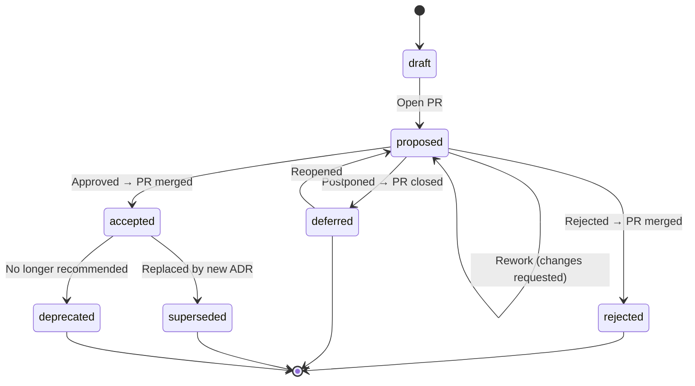

# adr-governance

A schema-governed, AI-native **Architecture Decision Record (ADR)** framework for teams that want their architectural decisions to be **structured**, **traceable**, and **asynchronous** — not debated in meetings, forgotten in Slack threads, or buried in wiki pages nobody reads.

## The Problem

Most teams make **Architecture Decisions (ADs)** every week. Few document them well. Decisions happen in meetings where the loudest voice wins, context is lost the moment people leave the room, and six months later nobody can explain *why* something was built the way it was.

- **Meetings are the wrong medium for decisions.** They reward whoever is present and articulate in the moment, not whoever has done the deepest analysis. They produce no durable artifact. They don't scale across time zones.
- **Decisions without structure are decisions without quality.** When there's no template forcing you to consider alternatives, tradeoffs, and risks, corners get cut. Important ADs get made on gut feeling.
- **Undocumented decisions create compliance gaps.** Auditors ask for evidence of decision-making and get blank stares. New team members have no way to understand *why* the architecture looks the way it does.
- **Documented decisions that aren't enforced are just suggestions.** Even teams that write **Architecture Decision Records (ADRs)** rarely close the loop. The decision says "use DPoP," but nothing stops someone from committing mTLS code. Without a feedback mechanism from the **Architecture Decision Log (ADL)** back to the codebase, decisions and implementation drift apart silently.
- **Traditional tooling is a dead end for scalable decision management.** Decisions captured in Confluence pages, SharePoint wikis, PowerPoint decks, Notion databases, or meeting minutes in Microsoft Teams are *opaque to machines*. They can't be schema-validated, they don't support programmable multi-party approval workflows, they can't be diffed or version-controlled with meaningful merges, and — critically — they can't be consumed by AI agents or CI pipelines for automated enforcement. As AI becomes central to the software delivery chain, decisions locked in proprietary formats become an integration liability. A structured, Git-native, schema-governed ADL is AI-native by design — every improvement in AI tooling automatically makes your decision management better, because the data is already in the right shape.

The alternative is **shift-left decision-making**: instead of debating in a meeting, the proposer prepares a well-structured ADR upfront — context, alternatives, risks, tradeoffs — and submits it as a pull request. Every stakeholder can review it asynchronously, on their own time, with full context in front of them. The decision process becomes a code review, not a calendar invite. And because it's GitOps-native, every approval by every relevant stakeholder is traceable — who approved what, when, and with what context — for free.

AI makes this dramatically better — and not just for validation. A well-structured schema means AI assistants can help **author** ADRs through Socratic dialogue (probing for gaps, challenging vague rationale, surfacing unstated assumptions), **review** them before any human sees them (verifying completeness, flagging ambiguities, checking cross-reference consistency), and **enforce** them against your codebase (validating code compliance with accepted decisions in CI). The proposer doesn't fill in a template manually — they have a *conversation* with an AI assistant that interrogates them until every section is clear, complete, and internally consistent. By the time the ADR reaches a human reviewer, the low-hanging issues are already resolved. The reviewer focuses on strategic judgement, not on asking "what do you mean by 'scalable'?" This is what shift-left means for architecture governance.

Good **Architecture Knowledge Management (AKM)** treats decisions as first-class engineering artifacts — not afterthoughts. Each AD is captured as an ADR, and the collection of all ADRs for a project forms the ADL — the `architecture-decision-log/` directory in this repository. This framework gives you the tooling and governance process to build an ADL that is schema-validated, Git-governed, AI-assisted, and auditable.

## What This Provides

- **JSON Schema** (Draft 2020-12) defining the complete ADR meta-model — every field, enum, and constraint
- **GitOps-based governance process** — ADR status transitions happen through Git commits and pull requests, not manual coordination
- **Validation tooling** — a Python validator that checks schema compliance, referential integrity, and semantic consistency on every PR
- **Pre-built CI/CD pipelines** for GitHub Actions, Azure DevOps, GCP Cloud Build, AWS CodeBuild, and GitLab CI — ready to copy into your repo and enforce as a merge gate
- **Approval identity enforcement** — CI verifies that the people listed in `approvals[]` have actually approved the pull request, creating an auditable link between ADR approvals and Git platform approvals
- **Governance rules** — configurable single-ADR-per-PR enforcement, substantive vs. maintenance change classification, and admin overrides — all defined in a platform-agnostic `.adr-governance/config.yaml`
- **LLM-ready setup prompts** — copy-paste prompts for AI assistants to set up CI for your platform in minutes
- **Agent Skill** ([agentskills.io](https://agentskills.io) spec) for AI-assisted ADR authoring and review — works with Google Antigravity, Claude Code, VS Code Copilot, and any conforming agent. The skill knows the schema and the governance process, and will guide you through every field interactively
- **Decision enforcement** — the ADL can serve as a single source of truth for Spec-Driven Development (SDD): AI coding agents can search the bundled ADL to align code with architectural decisions, and CI pipelines can validate compliance before merge
- **Repomix bundling** — the entire ADL is concatenated into a single Markdown file that agents can search with standard tools, enabling cross-repository decision enforcement
- **Example ADRs** from a fictional IAM department (NovaTrust Financial Services) in [`examples-reference/`](examples-reference/) — real-world contended decisions with sizable pros and cons on each side, not strawman examples. Kept as a reference for quality and style; not real decisions

## Philosophy

Every ADR is **self-contained**. All context, Architecturally Significant Requirements (ASRs), alternatives, consequences, and audit trails are embedded directly in the YAML file. There are no foreign-key dependencies between ADRs — the only explicit link is the `lifecycle.supersedes` / `superseded_by` chain for replacements. An ADR can *mention* other ADR IDs in prose, but it must be fully understandable on its own.

The ADL is an **append-only decision log**. ADRs are never deleted — they transition through a governed lifecycle. Rejected and superseded ADRs remain as historical records, preserving the decision-making trail for auditors, new team members, and your future self.

## ADR Lifecycle

Every ADR follows a governed state machine. All transitions happen through pull requests.



> **Why are rejected ADRs merged?** They are part of the ADL — they document *why* an option was evaluated and not pursued. Closing the PR without merging would lose this history from `main`.

See [`docs/adr-process.md`](docs/adr-process.md) for the full normative governance process, including review checklists, the Architectural Significance Test, branch protection rules, and CODEOWNERS configuration.

## Quick Start — Adopting for Your Organization

### 1. Create your ADR repository

Create a new repository in your organization and clone this framework into it:

```bash
# Create a new repo in your org (GitHub example)
gh repo create your-org/architecture-decisions --private --clone

# Pull the framework into it
cd architecture-decisions
git remote add upstream https://github.com/ivanstambuk/adr-governance.git
git pull upstream main
git remote remove upstream
git push origin main
```

Or fork the repository directly from GitHub and rename it.

### 2. Review examples *(optional cleanup)*

The [`examples-reference/`](examples-reference/) directory contains 8 fictional ADRs from "NovaTrust Financial Services" — they demonstrate the meta-model at production quality. **These are not real decisions.** You can:

- **Keep them** as a reference for your team (recommended initially)
- **Delete them** once your team is comfortable with the format:
  ```bash
  rm -rf examples-reference/
  git add -A && git commit -m "chore: remove reference examples"
  ```

### 3. Customize ADR-0000

`architecture-decision-log/ADR-0000-adopt-governed-adr-process.yaml` is the **meta-ADR** — it documents the decision to adopt this governance framework. Update it for your organization:

- Replace the `authors`, `decision_owner`, `reviewers`, and `approvals` names and identities
- Update `adr.project` to your project or organisation name
- Update timestamps and audit trail entries
- Adjust the `context.summary` if your adoption rationale differs

### 4. Set up CI

Copy the pipeline file for your platform to the repository root:

| Platform | Copy from | Copy to |
|----------|-----------|---------|
| **GitHub Actions** | Already at `.github/workflows/validate-adr.yml` | *(nothing to do)* |
| Azure DevOps | `ci/azure-devops/azure-pipelines.yml` | `azure-pipelines.yml` |
| GCP Cloud Build | `ci/gcp-cloud-build/cloudbuild.yaml` | `cloudbuild.yaml` |
| AWS CodeBuild | `ci/aws-codebuild/buildspec.yml` | `buildspec.yml` |
| GitLab CI | `ci/gitlab-ci/.gitlab-ci.yml` | `.gitlab-ci.yml` |

Then configure branch protection to make the CI check a **required merge gate** — see **[`docs/ci-setup.md`](docs/ci-setup.md)** for platform-specific instructions and LLM-ready setup prompts.

### 5. Configure CODEOWNERS *(optional but recommended)*

```bash
cp CODEOWNERS.example .github/CODEOWNERS
```

Edit `.github/CODEOWNERS` to replace the placeholder team handles (`@org/architecture-team`, etc.) with your real GitHub teams. This ensures ADRs and schema changes automatically request review from the right people.

### 6. Copy the Agent Skill to your code repositories *(optional)*

The `.skills/adr-author/` directory is a portable AI skill. Copy it to any repository where developers will be authoring ADRs — agents like Antigravity, Claude Code, and Copilot will pick it up automatically and guide ADR creation through interactive questioning.

### 7. Create your first real ADR

Use an AI assistant with the `adr-author` skill — it will guide you through every field via Socratic dialogue:

```
"I need to create a new ADR for [your decision]. Guide me through it."
```

Or copy the template manually:

```bash
cp .skills/adr-author/assets/adr-template.yaml \
   architecture-decision-log/ADR-0001-your-decision-title.yaml
```

### 8. Validate and submit

```bash
# Install dependencies
pip install jsonschema pyyaml yamllint

# Validate schema + semantic consistency
python3 scripts/validate-adr.py architecture-decision-log/ADR-0001-your-decision-title.yaml

# Pre-review quality gate (pipe to your LLM for Socratic feedback)
python3 scripts/review-adr.py architecture-decision-log/ADR-0001-your-decision-title.yaml

# Open a PR — CI validates automatically
git checkout -b adr/0001-your-decision-title
git add architecture-decision-log/ADR-0001-your-decision-title.yaml
git commit -m "feat(adr): ADR-0001 your decision title"
git push origin adr/0001-your-decision-title
```

The CI pipeline validates schema compliance and lints the YAML. Reviewers are auto-assigned via CODEOWNERS. The PR becomes the decision forum — all discussion, feedback, and approval happens asynchronously in the PR thread.

## Directory Structure

```
.
├── .adr-governance/
│   └── config.yaml              # Governance rules: admins, single-ADR-per-PR, change classification
├── schemas/
│   └── adr.schema.json          # JSON Schema (Draft 2020-12) — the ADR meta-model
├── docs/
│   ├── adr-process.md           # Normative governance process
│   ├── ci-setup.md              # CI/CD setup guide (all platforms)
│   ├── glossary.md              # Terms, enum values, abbreviations
│   └── research/                # Template & process comparison research
├── architecture-decision-log/   # The ADL — your ADRs go here
│   └── ADR-0000-adopt-governed-adr-process.yaml  # Meta-ADR (bootstrap)
├── examples-reference/           # 8 fictional example ADRs (NovaTrust Financial Services) — reference only
│   ├── ADR-0001-dpop-over-mtls-for-sender-constrained-tokens.yaml
│   ├── ADR-0002-reference-tokens-over-jwt-for-gateway-introspection.yaml
│   ├── ADR-0003-pairwise-subject-identifiers-for-oidc-relying-parties.yaml
│   ├── ADR-0004-ed25519-over-rsa-for-jwt-signing.yaml
│   ├── ADR-0005-bff-token-mediator-for-spa-token-acquisition.yaml
│   ├── ADR-0006-session-enrichment-for-step-up-authentication.yaml
│   ├── ADR-0007-centralized-secret-store-for-api-keys.yaml
│   └── ADR-0008-defer-openid-federation-for-trust-establishment.yaml
├── ci/                          # Pre-built CI pipelines for other platforms
│   ├── azure-devops/
│   │   └── azure-pipelines.yml
│   ├── gcp-cloud-build/
│   │   └── cloudbuild.yaml
│   ├── aws-codebuild/
│   │   └── buildspec.yml
│   └── gitlab-ci/
│       └── .gitlab-ci.yml
├── .skills/
│   └── adr-author/              # Agent Skill (agentskills.io spec)
│       ├── SKILL.md
│       ├── assets/
│       │   └── adr-template.yaml
│       └── references/
│           ├── GLOSSARY.md
│           └── SCHEMA_REFERENCE.md
├── scripts/
│   ├── validate-adr.py          # Schema + semantic validation
│   ├── verify-approvals.py      # CI approval identity enforcement
│   ├── extract-decisions.py     # ADL → Markdown/JSON for agent context & CI enforcement
│   ├── review-adr.py            # Pre-review Socratic quality gate (LLM prompt generator)
│   ├── render-adr.py            # YAML → Markdown renderer (Mermaid passthrough)
│   └── bundle.sh                # Repomix bundling
├── .github/
│   └── workflows/
│       └── validate-adr.yml     # PR validation CI (GitHub Actions)
└── repomix.config.json          # Bundles core project (excludes examples-reference + CI)
```

## ADR Meta-Model

Each ADR YAML file contains these sections:

| Section | Required | Description |
|---------|:--------:|-------------|
| `adr` | ✅ | ID, title, status, summary, timestamps, project, tags, priority, decision type, schema version |
| `authors` | ✅ | Who drafted the ADR |
| `decision_owner` | ✅ | Single accountable person |
| `context` | ✅ | Problem summary (**Markdown**), business/technical drivers, constraints |
| `alternatives` | ✅ | ≥2 alternatives with summary (**Markdown**), pros, cons, cost, risk, rejection rationale |
| `decision` | ✅ | Chosen alternative, rationale (**Markdown**), tradeoffs (**Markdown**), date, confidence |
| `consequences` | ✅ | Positive and negative outcomes |
| `confirmation` | ✅ | How the decision's implementation will be verified; artifact IDs (optional, backfilled later) |
| `reviewers` | | People who reviewed |
| `approvals` | | Formal approvals with timestamps and platform identities for CI verification |
| `requirements` | | Embedded functional and non-functional requirements (ASRs) |
| `dependencies` | | Internal and external dependencies |
| `references` | | External references, standards, evidence |
| `lifecycle` | | Review cadence, supersession chain, archival |
| `audit_trail` | | Immutable append-only event log |

> **Markdown-native fields** support full Markdown including embedded Mermaid diagrams via code fences. Use YAML literal block scalars (`|`) for multiline content.

## CI/CD Setup

Automated validation is the enforcement mechanism that makes the governance process real. Without it, the schema is a suggestion; with it, the schema is a contract.

**GitHub Actions** is preconfigured — the workflow at `.github/workflows/validate-adr.yml` runs on every PR. You just need to [enable branch protection](docs/ci-setup.md#github-actions) to make it a merge gate.

**Other platforms** have ready-to-use pipeline files in the `ci/` directory:

| Platform | Pipeline file | Copy to |
|----------|---------------|---------|
| Azure DevOps | [`ci/azure-devops/azure-pipelines.yml`](ci/azure-devops/azure-pipelines.yml) | `azure-pipelines.yml` (repo root) |
| GCP Cloud Build | [`ci/gcp-cloud-build/cloudbuild.yaml`](ci/gcp-cloud-build/cloudbuild.yaml) | `cloudbuild.yaml` (repo root) |
| AWS CodeBuild | [`ci/aws-codebuild/buildspec.yml`](ci/aws-codebuild/buildspec.yml) | `buildspec.yml` (repo root) |
| GitLab CI | [`ci/gitlab-ci/.gitlab-ci.yml`](ci/gitlab-ci/.gitlab-ci.yml) | `.gitlab-ci.yml` (repo root) |

**Step-by-step setup instructions**, platform-specific enforcement configuration, troubleshooting, and **LLM-ready prompts** (copy-paste into any AI assistant to have it set up CI for you) are in **[`docs/ci-setup.md`](docs/ci-setup.md)**.

## AI-Assisted Authoring & Pre-Review

ADRs are not meant to be filled in manually like a form. They are authored through **Socratic dialogue with an AI assistant** — the AI asks probing questions, challenges weak rationale, surfaces missing edge cases, and iteratively refines the document until it is clear, complete, and internally consistent.

This is a fundamental shift from traditional architecture governance: instead of the proposer writing a draft in isolation and then scheduling a meeting to "walk through" it (where reviewers discover ambiguities in real time and the meeting devolves into clarification rather than decision-making), the AI assistant resolves those ambiguities *before the first human reviewer ever sees the document*.

### Agent Skill

The `.skills/adr-author/` directory follows the [agentskills.io specification](https://agentskills.io/specification) and works with:

- **Google Antigravity** (VS Code)
- **Claude Code** (terminal)
- **VS Code Copilot** (with skills support)
- Any agent implementing the Agent Skills standard

The skill guides AI assistants to author ADRs through interactive questioning — probing for Architecturally Significant Requirements (ASRs), demanding balanced alternatives (not strawmen), checking that constraints are testable, and verifying that the rationale actually connects to the stated drivers. It understands the full meta-model and governance lifecycle.

### Pre-Review Quality Gate

Before submitting an ADR for human review, run it through an AI semantic review using `scripts/review-adr.py`:

```bash
# Generate a Socratic review prompt (pipe to your LLM)
python3 scripts/review-adr.py architecture-decision-log/ADR-0009.yaml

# Include cross-reference context from existing decisions
python3 scripts/review-adr.py architecture-decision-log/ADR-0009.yaml \
  --context-from architecture-decision-log/

# Pipe directly to an LLM
python3 scripts/review-adr.py architecture-decision-log/ADR-0009.yaml | \
  llm -m gpt-4o
```

The generated prompt instructs the LLM to perform a structured review covering:
- **Semantic clarity** — are there ambiguous terms or vague claims?
- **Completeness** — are alternatives balanced, constraints testable, consequences honest?
- **Logical consistency** — does the rationale align with the pros/cons?
- **Assumption risks** — what happens if the assumptions are wrong?
- **Missing perspectives** — are there unconsidered stakeholders or alternatives?
- **Cross-reference consistency** — does this decision conflict with existing ADRs?

The AI outputs a verdict (**READY FOR REVIEW**, **NEEDS REWORK**, or **MAJOR GAPS**), a list of issues with severity, and open questions for the proposer. The proposer addresses the feedback, re-runs the check, and iterates until the ADR passes. *Then* they open the PR.

> **The result:** Human reviewers receive ADRs that are already semantically coherent and complete. Review meetings become strategic discussions about the *decision* — not debugging sessions about what the proposer meant.

## ADL as Source of Truth

The Architecture Decision Log isn't just documentation — it's a **machine-readable specification** that AI agents and CI pipelines can enforce against your codebase. This closes the gap between *deciding* and *doing*.

### Spec-Driven Development (SDD)

AI coding agents (Copilot, Claude Code, Antigravity, Cursor, etc.) can use the bundled ADL as a **single source of truth** during code generation. When the ADL says "use DPoP for sender-constrained tokens" (ADR-0001), the agent can search the bundled decision log, find the decision with its full rationale and constraints, and generate code that aligns with it — without the developer having to explain the architectural context in every prompt.

The workflow:

1. **Bundle the ADL** into a single file:
   ```bash
   ./scripts/bundle.sh
   ```
   This generates `adr-governance-bundle.md` — the entire governance framework, schema, and all accepted decisions in one searchable file.

2. **Point your agent to it.** Paste the bundle into an LLM context window, add it to your agent's project knowledge, or reference it as a file. The agent can then use standard text search (grep, semantic search, `Ctrl+F`) to find relevant decisions.

3. **Generate code that complies.** When the agent encounters an architectural question — which token format to use, which signing algorithm, which authentication pattern — it searches the ADL instead of guessing or asking you.

> **Cross-repository enforcement:** The ADL repo and the code repo don't need to be the same. Point your agent at the ADL bundle from *any* repository. The decisions are self-contained — each ADR includes the full context, rationale, and constraints needed to understand and apply it.

### Semantic Guardrails in CI

The ADL can also serve as a **pre-merge guardrail** in your *code* repositories — not just the ADR repository itself. Before a PR is merged, a CI step can validate that the code changes are consistent with accepted architectural decisions.

This works at two levels:

**1. Local enforcement (during development):**
Coding agents that have the ADL in context will naturally align with it. When you ask "implement the token endpoint," an agent with ADR-0001 in context will use DPoP, not mTLS — because the decision and its rationale are right there in the searchable bundle.

**2. CI pipeline enforcement (pre-merge):**
Use `scripts/extract-decisions.py` to extract active decisions and generate an LLM compliance prompt. Add a step in your code repository's CI pipeline:

```yaml
# Example: GitHub Actions step in your CODE repo (not this repo)
- name: Check ADR compliance
  run: |
    # Fetch the extraction script and ADR files from the governance repo
    git clone --depth 1 https://github.com/your-org/adr-governance.git /tmp/adl
    pip install pyyaml

    # Generate a compliance prompt with the code diff
    python3 /tmp/adl/scripts/extract-decisions.py \
      --compliance-prompt \
      --diff <(git diff origin/main...HEAD) \
      /tmp/adl/architecture-decision-log/ \
      > /tmp/compliance-prompt.md

    # Pipe to your LLM of choice for automated review
    # (replace with your preferred LLM CLI — openai, claude, gemini, llm, etc.)
    cat /tmp/compliance-prompt.md | your-llm-cli "Review this for compliance"
```

The key insight: **the ADL is structured YAML that any tool can parse**. The `extract-decisions.py` script handles the parsing and prompt generation — you just plug in your LLM provider.

### Decision Extraction

The `scripts/extract-decisions.py` script is the bridge between the ADL and downstream enforcement tooling:

```bash
# Markdown summary of all accepted decisions (for agent context)
python3 scripts/extract-decisions.py architecture-decision-log/

# JSON output for programmatic consumption
python3 scripts/extract-decisions.py --format json architecture-decision-log/

# Filter by tags (e.g., only OAuth-related decisions)
python3 scripts/extract-decisions.py --tags oauth,security architecture-decision-log/

# Generate an LLM compliance-check prompt with a code diff
python3 scripts/extract-decisions.py --compliance-prompt \
  --diff <(git diff main) architecture-decision-log/

# Save to a file for agent context injection
python3 scripts/extract-decisions.py -o active-decisions.md architecture-decision-log/
```

### What This Enables

| Scenario | Without ADL enforcement | With ADL enforcement |
|----------|------------------------|---------------------|
| New developer joins | Reads (or doesn't read) wiki docs | Agent has full ADL context; generates compliant code from day one |
| PR introduces mTLS | Merges — nobody notices the ADR says DPoP | CI flags the drift; reviewer is alerted |
| Architect proposes supersession | Searches Slack history for context | Searches the ADL bundle; full decision chain is traceable |
| Annual audit | Scramble to reconstruct decision history | ADL is the audit trail; every decision is timestamped, attributed, and version-controlled |
| LLM generates code | Guesses at patterns based on training data | Searches the ADL and follows your organization's actual decisions |

### Repomix Bundle

To create the single-file bundle:

```bash
./scripts/bundle.sh
```

This generates `adr-governance-bundle.md` — the entire ADR governance framework and decision log in one file. The bundle includes the schema, process documentation, glossary, and all ADRs in `architecture-decision-log/` (it excludes [`examples-reference/`](examples-reference/) and CI files).

**Usage options:**
- **Paste** into any LLM context window for instant AKM context
- **Add** to your coding agent's project knowledge base
- **Fetch** from CI pipelines in other repositories (as shown above)
- **Commit** to other repositories as a versioned reference artifact

## Rendering ADRs to Markdown

To render ADR YAML files to polished Markdown (with Mermaid passthrough):

```bash
# Single file to stdout
python3 scripts/render-adr.py examples-reference/ADR-0001-*.yaml

# All examples to a directory
python3 scripts/render-adr.py --output-dir rendered/ examples-reference/
```

## Example ADRs

The [`examples-reference/`](examples-reference/) directory contains interconnected ADRs from a **fictional** IAM department at NovaTrust Financial Services. These are **not real decisions** — they demonstrate the meta-model at production quality. Use them as a reference for style, depth, and interconnection:

| ID | Title | Status |
|----|-------|--------|
| ADR-0001 | Use DPoP over mTLS for Sender-Constrained Tokens | accepted |
| ADR-0002 | Use Reference Tokens over JWTs for Gateway Introspection | accepted |
| ADR-0003 | Use Pairwise Subject Identifiers for OIDC Relying Parties | accepted |
| ADR-0004 | Use Ed25519 over RSA-2048 for JWT Signing Keys | accepted |
| ADR-0005 | Use BFF Token Mediator for SPA Token Acquisition | accepted |
| ADR-0006 | Use Session Enrichment for Step-Up Authentication Proof | accepted |
| ADR-0007 | Reject Centralized HashiCorp Vault for API Runtime Secrets | **rejected** |
| ADR-0008 | Defer OpenID Federation for Automated Trust Establishment | **deferred** |

See [`examples-reference/README.md`](examples-reference/README.md) for details on each example.

Additionally, `architecture-decision-log/ADR-0000` is a meta-ADR documenting the AD to adopt this governance process itself.

> **Bootstrap exception:** ADR-0000 was self-approved by the initial author as the bootstrapping meta-decision. The "no self-approval" rule (§3.4) applies to all subsequent ADRs.

## License

MIT
