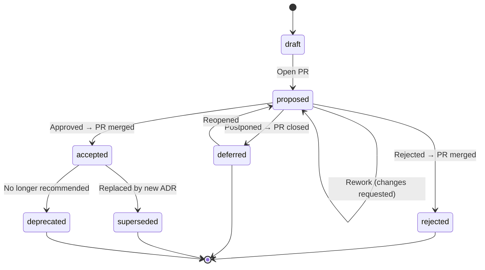

# adr-governance

A schema-governed, AI-native Architecture Decision Record (ADR) framework for teams that want their architectural decisions to be **structured**, **traceable**, and **asynchronous** — not debated in meetings, forgotten in Slack threads, or buried in wiki pages nobody reads.

## The Problem

Most teams make Architecture Decisions (ADs) every week. Few document them well. Decisions happen in meetings where the loudest voice wins, context is lost the moment people leave the room, and six months later nobody can explain *why* something was built the way it was.

- **Meetings are the wrong medium for decisions.** They reward whoever is present and articulate in the moment, not whoever has done the deepest analysis. They produce no durable artifact. They don't scale across time zones.
- **Decisions without structure are decisions without quality.** When there's no template forcing you to consider alternatives, tradeoffs, and risks, corners get cut. Important ADs get made on gut feeling.
- **Undocumented decisions create compliance gaps.** Auditors ask for evidence of decision-making and get blank stares. New team members have no way to understand *why* the architecture looks the way it does.

The alternative is **shift-left decision-making**: instead of debating in a meeting, the proposer prepares a well-structured ADR upfront — context, alternatives, risks, tradeoffs — and submits it as a pull request. Every stakeholder can review it asynchronously, on their own time, with full context in front of them. The decision process becomes a code review, not a calendar invite. And because it's GitOps-native, every approval by every relevant stakeholder is traceable — who approved what, when, and with what context — for free.

AI makes this dramatically better. A well-structured schema means AI assistants can help **author** ADRs (probing for gaps, suggesting alternatives, checking consistency), **review** them (verifying completeness, flagging missing risks), and **validate** them (schema compliance, referential integrity). The better the structure, the better the AI assistance. The better the AI assistance, the better the decisions. This is an AI-native way of working.

Good Architecture Knowledge Management (AKM) treats decisions as first-class engineering artifacts — not afterthoughts. Each AD is captured as an ADR, and the collection of all ADRs for a project forms an Architecture Decision Log (ADL) — the `architecture-decision-log/` directory in this repository. This framework gives you the tooling and governance process to build an ADL that is schema-validated, Git-governed, AI-assisted, and auditable.

## What This Provides

- **JSON Schema** (Draft 2020-12) defining the complete ADR meta-model — every field, enum, and constraint
- **GitOps-based governance process** — ADR status transitions happen through Git commits and pull requests, not manual coordination
- **Validation tooling** — a Python validator that checks schema compliance, referential integrity, and semantic consistency on every PR
- **Pre-built CI/CD pipelines** for GitHub Actions, Azure DevOps, GCP Cloud Build, AWS CodeBuild, and GitLab CI — ready to copy into your repo and enforce as a merge gate
- **LLM-ready setup prompts** — copy-paste prompts for AI assistants to set up CI for your platform in minutes
- **Agent Skill** ([agentskills.io](https://agentskills.io) spec) for AI-assisted ADR authoring and review — works with Google Antigravity, Claude Code, VS Code Copilot, and any conforming agent. The skill knows the schema and the governance process, and will guide you through every field interactively
- **Repomix bundling** for LLM context injection
- **Example ADRs** from a fictional IAM department (NovaTrust Financial Services) — real-world contended decisions with sizable pros and cons on each side, not strawman examples

## Philosophy

Every ADR is **self-contained**. All context, Architecturally Significant Requirements (ASRs), alternatives, consequences, and audit trails are embedded directly in the YAML file. Related ADRs are cross-referenced by ID but never structurally depended upon.

The ADL is an **append-only decision log**. ADRs are never deleted — they transition through a governed lifecycle. Rejected and superseded ADRs remain as historical records, preserving the decision-making trail for auditors, new team members, and your future self.

## ADR Lifecycle

Every ADR follows a governed state machine. All transitions happen through pull requests.



> **Why are rejected ADRs merged?** They are part of the ADL — they document *why* an option was evaluated and not pursued. Closing the PR without merging would lose this history from `main`.

See [`docs/adr-process.md`](docs/adr-process.md) for the full normative governance process, including review checklists, the Architectural Significance Test, branch protection rules, and CODEOWNERS configuration.

## Quick Start

### 1. Create a new ADR

Copy the template and fill in all required sections:

```bash
cp .skills/adr-author/assets/adr-template.yaml architecture-decision-log/ADR-NNNN-your-title.yaml
```

Or use an AI assistant with the `adr-author` skill installed — it will guide you through every field interactively.

### 2. Validate

```bash
pip install jsonschema pyyaml
python3 scripts/validate-adr.py architecture-decision-log/ADR-NNNN-your-title.yaml
```

The validator checks:
- JSON Schema compliance (structure, types, enums)
- Semantic consistency (chosen alternative matches alternatives list, status ↔ audit trail events, supersession symmetry)
- Quality signals (missing summaries, premature confidence on drafts, temporal inconsistencies)

### 3. Submit a PR

The CI pipeline automatically validates your ADR against the schema and lints the YAML on every PR. GitHub Actions is preconfigured; for other platforms see [CI/CD Setup](#cicd-setup) below.

## Directory Structure

```
.
├── schemas/
│   └── adr.schema.json          # JSON Schema (Draft 2020-12) — the ADR meta-model
├── docs/
│   ├── adr-process.md           # Normative governance process
│   ├── ci-setup.md              # CI/CD setup guide (all platforms)
│   ├── glossary.md              # Terms, enum values, abbreviations
│   └── research/                # Template & process comparison research
├── architecture-decision-log/   # The ADL — your ADRs go here
│   └── ADR-0000-adopt-governed-adr-process.yaml  # Meta-ADR (bootstrap)
├── examples/                    # 8 well-formed example ADRs
│   ├── ADR-0001-dpop-over-mtls-for-sender-constrained-tokens.yaml
│   ├── ADR-0002-reference-tokens-over-jwt-for-gateway-introspection.yaml
│   ├── ADR-0003-pairwise-subject-identifiers-for-oidc-relying-parties.yaml
│   ├── ADR-0004-ed25519-over-rsa-for-jwt-signing.yaml
│   ├── ADR-0005-bff-token-mediator-for-spa-token-acquisition.yaml
│   ├── ADR-0006-session-enrichment-for-step-up-authentication.yaml
│   ├── ADR-0007-centralized-secret-store-for-api-keys.yaml
│   └── ADR-0008-defer-openid-federation-for-trust-establishment.yaml
├── ci/                          # Pre-built CI pipelines for other platforms
│   ├── azure-devops/
│   │   └── azure-pipelines.yml
│   ├── gcp-cloud-build/
│   │   └── cloudbuild.yaml
│   ├── aws-codebuild/
│   │   └── buildspec.yml
│   └── gitlab-ci/
│       └── .gitlab-ci.yml
├── .skills/
│   └── adr-author/              # Agent Skill (agentskills.io spec)
│       ├── SKILL.md
│       ├── assets/
│       │   └── adr-template.yaml
│       └── references/
│           ├── GLOSSARY.md
│           └── SCHEMA_REFERENCE.md
├── scripts/
│   ├── validate-adr.py          # Schema + semantic validation
│   ├── render-adr.py            # YAML → Markdown renderer (Mermaid passthrough)
│   └── bundle.sh                # Repomix bundling
├── .github/
│   └── workflows/
│       └── validate-adr.yml     # PR validation CI (GitHub Actions)
└── repomix.config.json          # Bundles core project (excludes examples + CI)
```

## ADR Meta-Model

Each ADR YAML file contains these sections:

| Section | Required | Description |
|---------|:--------:|-------------|
| `adr` | ✅ | ID, title, status, summary, timestamps, project, tags, priority, decision type, schema version |
| `authors` | ✅ | Who drafted the ADR |
| `decision_owner` | ✅ | Single accountable person |
| `context` | ✅ | Problem summary (**Markdown**), business/technical drivers, constraints |
| `alternatives` | ✅ | ≥2 alternatives with summary (**Markdown**), pros, cons, cost, risk, rejection rationale |
| `decision` | ✅ | Chosen alternative, rationale (**Markdown**), tradeoffs (**Markdown**), date, confidence |
| `consequences` | ✅ | Positive and negative outcomes |
| `confirmation` | ✅ | How the decision's implementation will be verified; artifact IDs (optional, backfilled later) |
| `reviewers` | | People who reviewed |
| `approvals` | | Formal approvals with timestamps |
| `requirements` | | Embedded functional and non-functional requirements (ASRs) |
| `dependencies` | | Internal and external dependencies |
| `references` | | External references, standards, evidence |
| `lifecycle` | | Review cadence, supersession chain, archival |
| `audit_trail` | | Immutable append-only event log |

> **Markdown-native fields** support full Markdown including embedded Mermaid diagrams via code fences. Use YAML literal block scalars (`|`) for multiline content.

## CI/CD Setup

Automated validation is the enforcement mechanism that makes the governance process real. Without it, the schema is a suggestion; with it, the schema is a contract.

**GitHub Actions** is preconfigured — the workflow at `.github/workflows/validate-adr.yml` runs on every PR. You just need to [enable branch protection](docs/ci-setup.md#github-actions) to make it a merge gate.

**Other platforms** have ready-to-use pipeline files in the `ci/` directory:

| Platform | Pipeline file | Copy to |
|----------|---------------|---------|
| Azure DevOps | [`ci/azure-devops/azure-pipelines.yml`](ci/azure-devops/azure-pipelines.yml) | `azure-pipelines.yml` (repo root) |
| GCP Cloud Build | [`ci/gcp-cloud-build/cloudbuild.yaml`](ci/gcp-cloud-build/cloudbuild.yaml) | `cloudbuild.yaml` (repo root) |
| AWS CodeBuild | [`ci/aws-codebuild/buildspec.yml`](ci/aws-codebuild/buildspec.yml) | `buildspec.yml` (repo root) |
| GitLab CI | [`ci/gitlab-ci/.gitlab-ci.yml`](ci/gitlab-ci/.gitlab-ci.yml) | `.gitlab-ci.yml` (repo root) |

**Step-by-step setup instructions**, platform-specific enforcement configuration, troubleshooting, and **LLM-ready prompts** (copy-paste into any AI assistant to have it set up CI for you) are in **[`docs/ci-setup.md`](docs/ci-setup.md)**.

## Agent Skill

The `.skills/adr-author/` directory follows the [agentskills.io specification](https://agentskills.io/specification) and works with:

- **Google Antigravity** (VS Code)
- **Claude Code** (terminal)
- **VS Code Copilot** (with skills support)
- Any agent implementing the Agent Skills standard

The skill enables AI assistants to author new ADRs through guided questioning, review existing ADRs for completeness, validate YAML against the schema, and navigate the governance lifecycle (supersession, deprecation, archival). It understands the full meta-model and will probe for Architecturally Significant Requirements (ASRs), balanced alternatives, and consequences.

## Repomix Bundle

To create a single-file bundle of the core project (excluding examples and CI):

```bash
./scripts/bundle.sh
```

This generates `adr-governance-bundle.md` — paste it into any LLM context window for instant AKM context.

## Rendering ADRs to Markdown

To render ADR YAML files to polished Markdown (with Mermaid passthrough):

```bash
# Single file to stdout
python3 scripts/render-adr.py examples/ADR-0001-*.yaml

# All examples to a directory
python3 scripts/render-adr.py --output-dir rendered/ examples/
```

## Example ADRs

The `examples/` directory contains interconnected ADRs from a fictional IAM department. These are **low-level implementation decisions** — the kind of contended ADs you face *within* an already-adopted technology, with sizable pros and cons on each side:

| ID | Title | Status |
|----|-------|--------|
| ADR-0001 | Use DPoP over mTLS for Sender-Constrained Tokens | accepted |
| ADR-0002 | Use Reference Tokens over JWTs for Gateway Introspection | accepted |
| ADR-0003 | Use Pairwise Subject Identifiers for OIDC Relying Parties | accepted |
| ADR-0004 | Use Ed25519 over RSA-2048 for JWT Signing Keys | accepted |
| ADR-0005 | Use BFF Token Mediator for SPA Token Acquisition | accepted |
| ADR-0006 | Use Session Enrichment for Step-Up Authentication Proof | accepted |
| ADR-0007 | Reject Centralized HashiCorp Vault for API Runtime Secrets | **rejected** |
| ADR-0008 | Defer OpenID Federation for Automated Trust Establishment | **deferred** |

Additionally, `architecture-decision-log/ADR-0000` is a meta-ADR documenting the AD to adopt this governance process itself.

> **Bootstrap exception:** ADR-0000 was self-approved by the initial author as the bootstrapping meta-decision. The "no self-approval" rule (§3.4) applies to all subsequent ADRs.

## License

MIT
