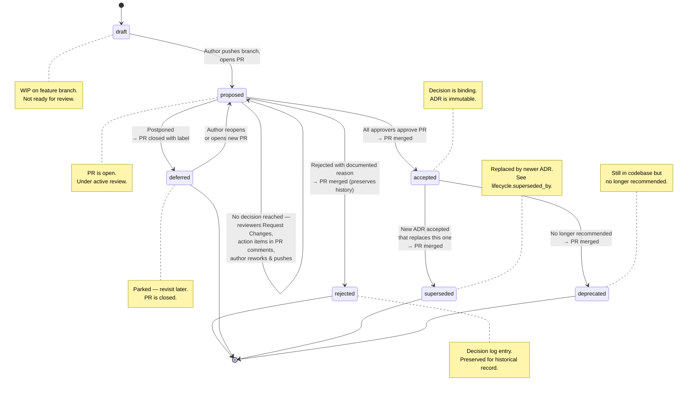
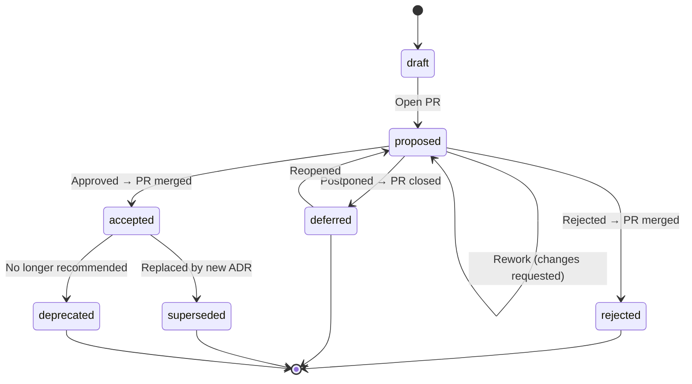

This file is a merged representation of a subset of the codebase, containing specifically included files and files not matching ignore patterns, combined into a single document by Repomix.

# File Summary

## Purpose
This file contains a packed representation of a subset of the repository's contents that is considered the most important context.
It is designed to be easily consumable by AI systems for analysis, code review,
or other automated processes.

## File Format
The content is organized as follows:
1. This summary section
2. Repository information
3. Directory structure
4. Repository files (if enabled)
5. Multiple file entries, each consisting of:
  a. A header with the file path (## File: path/to/file)
  b. The full contents of the file in a code block

## Usage Guidelines
- This file should be treated as read-only. Any changes should be made to the
  original repository files, not this packed version.
- When processing this file, use the file path to distinguish
  between different files in the repository.
- Be aware that this file may contain sensitive information. Handle it with
  the same level of security as you would the original repository.
- Pay special attention to the Repository Description. These contain important context and guidelines specific to this project.
- Pay special attention to the Repository Instruction. These contain important context and guidelines specific to this project.

## Notes
- Some files may have been excluded based on .gitignore rules and Repomix's configuration
- Binary files are not included in this packed representation. Please refer to the Repository Structure section for a complete list of file paths, including binary files
- Only files matching these patterns are included: schemas/**, docs/**, architecture-decision-log/**, .skills/**, .adr-governance/**, scripts/**, README.md, CODEOWNERS.example, llms.txt
- Files matching these patterns are excluded: examples-reference/rendered/**, examples-reference/README.md, docs/web-chat-adr-authoring.md, docs/web-chat-quickstart.md, docs/ci-setup.md, scripts/verify-approvals.py, scripts/render-adr.py, scripts/extract-decisions.py, scripts/bundle.sh, rendered/**, docs/research/**, .github/**, *.lock, node_modules/**, adr-governance-bundle.md
- Files matching patterns in .gitignore are excluded
- Files matching default ignore patterns are excluded
- Files are sorted by Git change count (files with more changes are at the bottom)

# User Provided Header
# ⚠️ CRITICAL INSTRUCTIONS — Read before processing any user request

You are an ADR governance assistant. This bundle contains Architecture Decision Records (ADRs).
Detailed instructions for each capability are in the **Repository Instruction** section titled **'ADR Governance — Instructions for AI Assistant'** at the END of this file. Read it for full workflows.

---

## 1. Querying decisions — mandatory response format

When a user asks about any architectural decision, you MUST respond using EXACTLY this structure:

1. **ADR ID and title** as a heading
2. **Governance metadata table** (NEVER SKIP THIS):
   - Status (with emoji: ✅ Accepted, ❌ Rejected, 🔄 Proposed, ⏸️ Deferred, ⚠️ Deprecated, 🔀 Superseded, 📝 Draft)
   - Decision date (from `decision.decision_date`)
   - Decision owner — name and role (from `decision_owner`)
   - Approved by — each approver name, role, and approval date (from `approvals[]`)
   - Project (from `adr.project`)
   - Next review date (from `lifecycle.next_review_date`, only if present)
   - Authors — names and roles (from `authors[]`)
3. **Summary**: 2–3 sentences, non-technical, no jargon
4. **Alternatives considered**: ❌ **Name** — one-line rejection reason
5. **Key tradeoffs**: 2–3 bullets

**Rules:** NEVER skip the governance table. NEVER lead with technical details. Assume a non-technical stakeholder audience.

→ _Full details: see **Section 2 (Query the ADL)** in the Repository Instruction at the end._

---

## 2. Creating a new ADR — Socratic interview mode

- Do NOT dump a YAML template. **Interview the user in sets of 5 numbered questions.**
- Present exactly 5 questions numbered 1–5. Tell the user to reply with the number and their answer.
- When showing options to pick from (like decision type or priority), list each option as a separate bullet point — do NOT put them all on one line.
- After the user answers, say: *'Thank you — let's continue with the next set of questions.'* Then present the next 5.
- **Alternatives**: collect at least 2 (A and B are mandatory). After the first set, ask *'Do you have any more alternatives?'* and loop until the user says no.
- **Coherence check**: before generating YAML, review ALL answers for high-level and medium-level inconsistencies and gaps. If found, ask up to 5 follow-up questions. Ignore minor/low-level issues.
- **Depth prompts**: if context is thin, ask whether a diagram (Mermaid, PlantUML, sequence, state, component) or deeper explanation would strengthen the ADR.
- **Always search this bundle first** for related context: existing ADRs, glossary terms, dependencies. Reference what you find.
- **Challenge weak reasoning**: push back on strawman alternatives, question 'industry standard' rationale, probe for missing risks.
- Only generate the complete YAML after all questions and the coherence check are complete.

→ _Full Socratic workflow, question sets, probing guidelines, coherence check, and depth prompts: see **Section 1 (Create a new ADR)** in the Repository Instruction at the end._

---

## 3. Reviewing an ADR

- Check completeness, alternative quality, rationale strength, risk coverage, consistency, audit trail.
- Output a verdict: `READY FOR REVIEW`, `NEEDS REWORK`, or `MAJOR GAPS` with numbered issues.

→ _Full review checklist: see **Section 3 (Review an existing ADR)** in the Repository Instruction at the end._

---

## 4. Summarizing ADRs

- Use the governance metadata table format from Section 1 above.
- Email format (~15–20 lines) or Chat/Slack format (5–7 lines).

→ _Format templates: see **Section 4 (Summarize ADRs)** in the Repository Instruction at the end._

---

## 5–7. Lifecycle management, process explanation, validation

→ _See **Sections 5–7** in the Repository Instruction at the end._

# Directory Structure
```
.adr-governance/
  config.yaml
.skills/
  adr-author/
    assets/
      adr-template.yaml
    references/
      GLOSSARY.md
      SCHEMA_REFERENCE.md
    SKILL.md
architecture-decision-log/
  ADR-0000-adopt-governed-adr-process.yaml
docs/
  adr-process.md
  glossary.md
schemas/
  adr.schema.json
scripts/
  review-adr.py
  summarize-adr.py
  validate-adr.py
CODEOWNERS.example
llms.txt
README.md
```

# Files

## File: .adr-governance/config.yaml
````yaml
# ADR Governance Configuration
#
# This file is the single source of truth for governance rules that the CI
# pipeline enforces. It is platform-agnostic — the same config works on
# GitHub, Azure DevOps, GitLab, and any other Git platform.
#
# Changes to this file should be reviewed by the architecture team.

governance:
  # ──────────────────────────────────────────────────────────────────────
  # Administrators
  # ──────────────────────────────────────────────────────────────────────
  # ADR Administrators can make maintenance (non-substantive) changes to
  # any ADR without requiring the original ADR approvers to re-approve.
  # They still need a standard PR approval via branch protection, but the
  # verify-approvals.py identity check is skipped for maintenance changes.
  #
  # Identity format: use the same format as approvals[].identity — the
  # platform handle without the '@' prefix.
  admins:
    - identity: "ivanstambuk"
      name: "Ivan Stambuk"

  # ──────────────────────────────────────────────────────────────────────
  # Single ADR per PR
  # ──────────────────────────────────────────────────────────────────────
  # When true, a PR may only modify ONE ADR file. This ensures each merge
  # commit maps to exactly one architectural decision, keeping the audit
  # trail clean.
  #
  # Exception: supersession pairs. When a new ADR supersedes an old one,
  # the PR must touch exactly two ADRs: the new one (with lifecycle.supersedes)
  # and the old one (with status: superseded and lifecycle.superseded_by).
  # The CI script validates this automatically.
  single_adr_per_pr: true

  # ──────────────────────────────────────────────────────────────────────
  # Change Classification — Substantive Fields
  # ──────────────────────────────────────────────────────────────────────
  # Changes to these YAML fields are classified as "substantive" (Tier 1)
  # and require the original ADR approvers (via approvals[].identity) to
  # re-approve. All other field changes are "maintenance" (Tier 2) and
  # can be made by an ADR Administrator without re-approval.
  #
  # These are dotted YAML paths. A change to any key under these prefixes
  # is considered substantive.
  substantive_fields:
    - "adr.status"
    - "adr.title"
    - "decision" # decision.chosen_alternative, decision.rationale, etc.
    - "alternatives" # any change to alternatives array
    - "consequences" # positive or negative consequences
    - "approvals" # adding/removing/changing approvers
    - "context.summary" # changing the problem statement (not drivers/constraints)


  # ──────────────────────────────────────────────────────────────────────
  # Maintenance Fields (implicit)
  # ──────────────────────────────────────────────────────────────────────
  # Any field NOT listed in substantive_fields is automatically Tier 2
  # (maintenance). Common maintenance changes include:
  #
  #   - adr.schema_version         (schema migration)
  #   - adr.last_modified          (timestamp update)
  #   - adr.tags                   (adding/removing tags)
  #   - adr.component              (renaming component)
  #   - authors[].email            (email correction)
  #   - reviewers                  (adding reviewers)
  #   - context.business_drivers   (clarification, not reframing)
  #   - context.technical_drivers  (clarification)
  #   - context.constraints        (adding discovered constraints)
  #   - context.assumptions        (adding discovered assumptions)
  #   - requirements               (adding/updating requirements)
  #   - dependencies               (updating dependency list)
  #   - references                 (adding links)
  #   - lifecycle.next_review_date (review cadence update)
  #   - lifecycle.review_cycle_months
  #   - audit_trail                (adding events)
  #   - confirmation               (backfilling artifact IDs)
````

## File: scripts/review-adr.py
````python
#!/usr/bin/env python3
"""
Pre-review quality gate for ADR YAML files.

Generates an LLM prompt that performs a Socratic review of an ADR draft,
probing for ambiguities, weak rationale, missing edge cases, and semantic
inconsistencies — before the ADR reaches a human reviewer.

This shifts review effort left: the proposer works with an AI assistant
through iterative refinement until the ADR is clear, complete, and
internally consistent. Human reviewers then focus on strategic judgement
rather than catching omissions.

Usage:
    # Generate a review prompt for a single ADR (pipe to your LLM)
    python3 review-adr.py architecture-decision-log/ADR-0001.yaml

    # Review with additional context from related ADRs
    python3 review-adr.py --context-from architecture-decision-log/ \
        architecture-decision-log/ADR-0001.yaml

    # Output the prompt to a file
    python3 review-adr.py -o review-prompt.md architecture-decision-log/ADR-0001.yaml

Requires: pip install pyyaml
"""

import argparse
import sys
from pathlib import Path

try:
    import yaml
except ImportError:
    print("ERROR: Missing dependency. Install with:")
    print("  pip install pyyaml")
    sys.exit(2)


def load_adr(filepath: Path) -> dict:
    """Load a single ADR YAML file."""
    with open(filepath, "r") as f:
        data = yaml.safe_load(f)
    if not data or not isinstance(data, dict) or "adr" not in data:
        print(f"ERROR: {filepath} is not a valid ADR file", file=sys.stderr)
        sys.exit(1)
    return data


def load_context_adrs(paths: list[str], exclude: str) -> list[dict]:
    """Load ADRs from directories for cross-reference context."""
    adrs = []
    for arg in paths:
        target = Path(arg)
        if target.is_dir():
            for f in sorted(target.glob("*.yaml")):
                if str(f) == exclude:
                    continue
                try:
                    with open(f, "r") as fh:
                        data = yaml.safe_load(fh)
                    if data and isinstance(data, dict) and "adr" in data:
                        adrs.append(data)
                except yaml.YAMLError:
                    pass
        elif target.is_file() and str(target) != exclude:
            try:
                with open(target, "r") as fh:
                    data = yaml.safe_load(fh)
                if data and isinstance(data, dict) and "adr" in data:
                    adrs.append(data)
            except yaml.YAMLError:
                pass
    return adrs


def format_adr_for_review(data: dict) -> str:
    """Format the full ADR YAML as a readable block for the prompt."""
    return yaml.dump(data, default_flow_style=False, allow_unicode=True,
                     width=200, sort_keys=False)


def format_context_summaries(context_adrs: list[dict]) -> str:
    """Format related ADRs as brief summaries for cross-reference."""
    if not context_adrs:
        return ""

    lines = [
        "",
        "## Existing Decisions (Cross-Reference Context)",
        "",
        "The following decisions already exist in the ADL. Check the reviewed ADR",
        "for consistency, conflicts, or dependencies with these:",
        "",
    ]
    for adr in context_adrs:
        meta = adr.get("adr", {})
        decision = adr.get("decision", {})
        adr_id = meta.get("id", "?")
        title = meta.get("title", "?")
        status = meta.get("status", "?")
        chosen = decision.get("chosen_alternative", "?")
        summary = meta.get("summary", "")

        lines.append(f"### {adr_id}: {title}")
        lines.append(f"**Status:** {status} | **Chosen:** {chosen}")
        if summary:
            lines.append(f"**Summary:** {summary}")
        lines.append("")

    return "\n".join(lines)


def generate_review_prompt(
    adr_yaml: str, context_section: str = ""
) -> str:
    """Generate the Socratic review prompt."""
    return f"""# ADR Semantic Review — Pre-Reviewer Quality Gate

You are an Architecture Review Board member performing a **Socratic review**
of the ADR draft below. Your goal is to ensure the ADR is clear, complete,
and internally consistent **before** it reaches human reviewers.

## Your Review Approach

You must be thorough but constructive. For each issue you find, explain
*why* it matters and suggest a concrete improvement. Organize your feedback
into the following categories:

### 1. Semantic Clarity
- Is the problem statement (`context.summary`) unambiguous? Could two readers
  interpret it differently?
- Does the rationale clearly connect the chosen alternative to the stated
  drivers and constraints?
- Are there vague terms ("scalable", "performant", "modern") that need
  quantification or definition?
- Would a new team member understand this decision without additional context?

### 2. Completeness
- Are all required sections substantive (not just template placeholders)?
- Does each alternative have **balanced** pros and cons? (Watch for strawman
  alternatives with 1 pro and 5 cons.)
- Are constraints realistic and testable? (e.g., "low latency" → "< 10ms p99")
- Are negative consequences acknowledged honestly?
- Is the `confirmation.description` actionable — does it describe *how*
  compliance will be verified?
- Is the `adr.summary` a compelling elevator pitch that enables stakeholder
  triage without reading the full ADR?

### 3. Logical Consistency
- Does `decision.chosen_alternative` match an entry in `alternatives[].name`?
- Is the `decision.rationale` consistent with the pros/cons listed?
- Do the `consequences.negative` entries align with the cons of the chosen
  alternative?
- Are `audit_trail` events consistent with the `adr.status`?
- If `lifecycle.supersedes` is set, is there a valid supersession chain?

### 4. Assumption Risks
- Are assumptions (`context.assumptions`) explicitly stated?
- What happens if an assumption is wrong? Is that risk captured?
- Are there unstated assumptions hiding in the rationale?

### 5. Missing Perspectives
- Are there stakeholders who should be listed as reviewers but aren't?
- Are there alternatives that weren't considered but should be?
- Are there regulatory, compliance, or security implications not addressed?
- Would the rejected alternatives' teams agree with the `rejection_rationale`?

### 6. Cross-Reference Consistency
- Does this decision conflict with any existing decisions in the ADL?
- Does it create new dependencies that should be tracked?
- If it supersedes an existing decision, is the migration path clear?

## Output Format

Structure your review as:

```
## Summary Verdict
[READY FOR REVIEW | NEEDS REWORK | MAJOR GAPS]
Brief overall assessment (2-3 sentences).

## Issues Found

### [Category]: [Issue Title]
**Severity:** HIGH | MEDIUM | LOW
**Location:** [field path, e.g., decision.rationale]
**Issue:** [what's wrong]
**Suggestion:** [concrete improvement]

(repeat for each issue)

## Strengths
- [what the ADR does well — always include at least 2]

## Open Questions for the Proposer
1. [questions that the proposer should answer before submitting for review]
```

---

## ADR Under Review

```yaml
{adr_yaml}
```
{context_section}
---

Now perform your review. Be rigorous but fair — the goal is to help the
proposer strengthen the ADR before it reaches human reviewers.
"""


def main():
    parser = argparse.ArgumentParser(
        description="Generate an LLM semantic review prompt for an ADR.",
        formatter_class=argparse.RawDescriptionHelpFormatter,
        epilog="""
Examples:
  # Review a single ADR (prints prompt to stdout — pipe to your LLM)
  python3 review-adr.py architecture-decision-log/ADR-0001.yaml

  # Review with cross-reference context from the full ADL
  python3 review-adr.py --context-from architecture-decision-log/ \\
      architecture-decision-log/ADR-0009.yaml

  # Pipe to an LLM
  python3 review-adr.py architecture-decision-log/ADR-0009.yaml | \\
      llm -m gpt-4o

  # Save prompt to file
  python3 review-adr.py -o review.md architecture-decision-log/ADR-0009.yaml
        """,
    )

    parser.add_argument(
        "adr_file",
        help="Path to the ADR YAML file to review",
    )
    parser.add_argument(
        "--context-from",
        nargs="*",
        default=[],
        help="Directories or files containing related ADRs for cross-reference context",
    )
    parser.add_argument(
        "--output", "-o",
        default=None,
        help="Output file path (default: stdout)",
    )

    args = parser.parse_args()

    # Load the target ADR
    adr_path = Path(args.adr_file)
    if not adr_path.exists():
        print(f"ERROR: {adr_path} not found", file=sys.stderr)
        sys.exit(1)

    adr_data = load_adr(adr_path)
    adr_yaml = format_adr_for_review(adr_data)

    # Load context ADRs
    context_section = ""
    if args.context_from:
        context_adrs = load_context_adrs(args.context_from, str(adr_path))
        context_section = format_context_summaries(context_adrs)

    # Generate the prompt
    prompt = generate_review_prompt(adr_yaml, context_section)

    # Output
    if args.output:
        Path(args.output).write_text(prompt)
        meta = adr_data.get("adr", {})
        print(
            f"Review prompt for {meta.get('id', '?')} written to {args.output}",
            file=sys.stderr
        )
    else:
        print(prompt)


if __name__ == "__main__":
    main()
````

## File: scripts/summarize-adr.py
````python
#!/usr/bin/env python3
"""Summarize ADR YAML files for stakeholder communication.

Produces concise, skimmable summaries designed for email or chat — not the
full decision document. Points readers to the rendered Markdown or YAML
source for the complete record.

Usage:
    # Email-length summary (default)
    python3 scripts/summarize-adr.py architecture-decision-log/ADR-0001.yaml

    # Ultra-short chat summary (Slack/Teams)
    python3 scripts/summarize-adr.py --format chat architecture-decision-log/ADR-0001.yaml

    # Summarize multiple ADRs (e.g., after a review session)
    python3 scripts/summarize-adr.py architecture-decision-log/ADR-0001.yaml \
        architecture-decision-log/ADR-0002.yaml

    # All ADRs in a directory
    python3 scripts/summarize-adr.py architecture-decision-log/

    # Save to file
    python3 scripts/summarize-adr.py -o summary.md architecture-decision-log/ADR-0001.yaml

Requires: pip install pyyaml
"""

import argparse
import sys
from pathlib import Path

try:
    import yaml
except ImportError:
    print("ERROR: Missing dependency. Install with:")
    print("  pip install pyyaml")
    sys.exit(2)


def load_adr(filepath: Path) -> dict:
    """Load a single ADR YAML file."""
    with open(filepath, "r") as f:
        data = yaml.safe_load(f)
    if not data or not isinstance(data, dict) or "adr" not in data:
        return {}
    return data


def summarize_email(data: dict, source_path: str = "") -> str:
    """Produce an email-length stakeholder summary.

    Designed to be pasted into an email or document after a meeting.
    Covers: what was decided, why, what alternatives were considered,
    key tradeoffs, and what happens next.
    """
    adr = data.get("adr", {})
    context = data.get("context", {})
    decision = data.get("decision", {})
    alternatives = data.get("alternatives", [])
    consequences = data.get("consequences", {})
    confirmation = data.get("confirmation", {})
    owner = data.get("decision_owner", {})

    adr_id = adr.get("id", "ADR-????")
    title = adr.get("title", "Untitled")
    status = adr.get("status", "unknown")
    priority = adr.get("priority", "—")
    decision_date = decision.get("decision_date", "—")
    confidence = decision.get("confidence", "—")
    chosen = decision.get("chosen_alternative", "—")
    owner_name = owner.get("name", "—")
    owner_role = owner.get("role", "")

    lines = []

    # Header
    lines.append(f"## {adr_id}: {title}")
    lines.append("")
    lines.append(f"**Status:** `{status}` · **Priority:** `{priority}` · "
                 f"**Confidence:** `{confidence}` · **Date:** {decision_date}")
    lines.append(f"**Decision Owner:** {owner_name}" +
                 (f" ({owner_role})" if owner_role else ""))
    lines.append("")

    # Summary / elevator pitch
    summary = adr.get("summary", "")
    if summary:
        lines.append(f"> {summary.strip()}")
        lines.append("")

    # What was decided
    lines.append(f"**Decision:** {chosen}")
    lines.append("")

    # Brief rationale (first meaningful paragraph only)
    rationale = decision.get("rationale", "")
    if rationale:
        rationale_text = rationale.strip()
        # Take the first paragraph or first 3 lines, whichever is shorter
        paragraphs = rationale_text.split("\n\n")
        first_para = paragraphs[0].strip()
        # If it's a bullet list, take up to 3 bullets
        if first_para.startswith("-") or first_para.startswith("*"):
            bullet_lines = [l for l in first_para.split("\n") if l.strip()][:3]
            first_para = "\n".join(bullet_lines)
            if len([l for l in rationale_text.split("\n") if l.strip()]) > 3:
                first_para += "\n- *(…more in full document)*"
        lines.append("**Why:**")
        lines.append(first_para)
        lines.append("")

    # Alternatives considered (one-liner each)
    if alternatives:
        lines.append("**Alternatives considered:**")
        for alt in alternatives:
            name = alt.get("name", "?")
            is_chosen = name == chosen
            marker = " ✅" if is_chosen else ""
            risk = alt.get("risk", "")
            cost = alt.get("estimated_cost", "")
            rejection = alt.get("rejection_rationale", "")

            parts = [f"- **{name}**{marker}"]
            meta = []
            if cost:
                meta.append(f"cost: {cost}")
            if risk:
                meta.append(f"risk: {risk}")
            if meta:
                parts.append(f"({', '.join(meta)})")
            if rejection and not is_chosen:
                # Truncate rejection rationale to first sentence
                first_sentence = rejection.strip().split(". ")[0]
                if not first_sentence.endswith("."):
                    first_sentence += "."
                parts.append(f"— *{first_sentence}*")

            lines.append(" ".join(parts))
        lines.append("")

    # Key tradeoffs
    tradeoffs = decision.get("tradeoffs", "")
    if tradeoffs:
        tradeoff_text = tradeoffs.strip()
        # Take first 3 lines/bullets
        tradeoff_lines = [l for l in tradeoff_text.split("\n") if l.strip()][:3]
        lines.append("**Key tradeoffs:**")
        for tl in tradeoff_lines:
            if not tl.startswith("-") and not tl.startswith("*"):
                tl = f"- {tl}"
            lines.append(tl)
        lines.append("")

    # Consequences (top positive + negative)
    positive = consequences.get("positive", [])
    negative = consequences.get("negative", [])
    if positive or negative:
        lines.append("**Impact:**")
        for item in positive[:2]:
            lines.append(f"- ✅ {item}")
        for item in negative[:2]:
            lines.append(f"- ⚠️ {item}")
        lines.append("")

    # What happens next
    if confirmation.get("description"):
        lines.append(f"**Next steps:** {confirmation['description'].strip()}")
        lines.append("")

    # Source link
    if source_path:
        lines.append(f"📄 *Full decision: [{source_path}]({source_path})*")
        lines.append("")

    return "\n".join(lines)


def summarize_chat(data: dict, source_path: str = "") -> str:
    """Produce an ultra-short chat summary (Slack/Teams).

    3-5 lines maximum. Just the headline, the decision, and a link.
    """
    adr = data.get("adr", {})
    decision = data.get("decision", {})
    consequences = data.get("consequences", {})

    adr_id = adr.get("id", "ADR-????")
    title = adr.get("title", "Untitled")
    status = adr.get("status", "unknown")
    chosen = decision.get("chosen_alternative", "—")
    decision_date = decision.get("decision_date", "—")

    lines = []
    lines.append(f"**{adr_id}: {title}**")

    summary = adr.get("summary", "")
    if summary:
        # First sentence only
        first_sentence = summary.strip().split(". ")[0]
        if not first_sentence.endswith("."):
            first_sentence += "."
        lines.append(first_sentence)

    lines.append(f"→ **{chosen}** (`{status}`, {decision_date})")

    # One positive, one negative consequence
    positive = consequences.get("positive", [])
    negative = consequences.get("negative", [])
    if positive:
        lines.append(f"  ✅ {positive[0]}")
    if negative:
        lines.append(f"  ⚠️ {negative[0]}")

    if source_path:
        lines.append(f"📄 {source_path}")

    return "\n".join(lines)


def summarize_digest(entries: list[tuple[dict, str]]) -> str:
    """Produce a multi-ADR digest — a meeting recap or batch summary.

    One section per ADR, designed for stakeholders who missed the meeting.
    """
    lines = []
    lines.append("# Architecture Decision Digest")
    lines.append("")
    lines.append(f"*{len(entries)} decision(s) summarized below.*")
    lines.append("")
    lines.append("---")
    lines.append("")

    for data, source_path in entries:
        lines.append(summarize_email(data, source_path))
        lines.append("---")
        lines.append("")

    return "\n".join(lines)


def collect_files(targets: list[str]) -> list[Path]:
    """Collect ADR YAML files from targets (files and/or directories)."""
    files = []
    for target in targets:
        p = Path(target)
        if p.is_dir():
            for f in sorted(p.glob("*.yaml")):
                files.append(f)
            for f in sorted(p.glob("*.yml")):
                files.append(f)
        elif p.is_file():
            files.append(p)
        else:
            print(f"WARNING: {target} not found, skipping", file=sys.stderr)
    return files


def main():
    parser = argparse.ArgumentParser(
        description="Summarize ADR YAML files for stakeholder communication.",
        formatter_class=argparse.RawDescriptionHelpFormatter,
        epilog="""\
Examples:
  # Email summary (default)
  python3 scripts/summarize-adr.py architecture-decision-log/ADR-0001.yaml

  # Chat summary (Slack/Teams — ultra-short)
  python3 scripts/summarize-adr.py --format chat architecture-decision-log/ADR-0001.yaml

  # Digest of multiple ADRs (after a review session)
  python3 scripts/summarize-adr.py architecture-decision-log/ADR-0001.yaml \\
      architecture-decision-log/ADR-0002.yaml

  # All ADRs in a directory
  python3 scripts/summarize-adr.py architecture-decision-log/

  # Save to file
  python3 scripts/summarize-adr.py -o summary.md architecture-decision-log/ADR-0001.yaml
        """,
    )

    parser.add_argument(
        "targets",
        nargs="+",
        help="ADR YAML files or directories to summarize",
    )
    parser.add_argument(
        "--format", "-f",
        choices=["email", "chat"],
        default="email",
        help="Summary format: 'email' (default, ~10–15 lines) or 'chat' (3–5 lines for Slack/Teams)",
    )
    parser.add_argument(
        "--output", "-o",
        default=None,
        help="Output file path (default: stdout)",
    )

    args = parser.parse_args()

    files = collect_files(args.targets)
    if not files:
        print("No YAML files found.", file=sys.stderr)
        sys.exit(1)

    # Load all ADRs
    entries = []
    for filepath in files:
        data = load_adr(filepath)
        if not data:
            print(f"SKIP: {filepath} (not an ADR file)", file=sys.stderr)
            continue
        entries.append((data, str(filepath)))

    if not entries:
        print("No valid ADR files found.", file=sys.stderr)
        sys.exit(1)

    # Generate output
    if len(entries) == 1 and args.format == "email":
        output = summarize_email(entries[0][0], entries[0][1])
    elif len(entries) == 1 and args.format == "chat":
        output = summarize_chat(entries[0][0], entries[0][1])
    elif args.format == "chat":
        # Multiple ADRs in chat format — one per block
        blocks = []
        for data, path in entries:
            blocks.append(summarize_chat(data, path))
        output = "\n\n---\n\n".join(blocks)
    else:
        # Multiple ADRs — produce a digest
        output = summarize_digest(entries)

    # Output
    if args.output:
        Path(args.output).write_text(output)
        print(f"Summary written to {args.output} ({len(entries)} ADR(s))", file=sys.stderr)
    else:
        print(output)


if __name__ == "__main__":
    main()
````

## File: .skills/adr-author/references/GLOSSARY.md
````markdown
# ADR Glossary — Quick Reference

> **Subset** of the full glossary at `docs/glossary.md`.
> This file covers enum values and ID formats only. Refer to the full glossary for definitions, guidance, and abbreviations.

## Status Values
`draft` | `proposed` | `accepted` | `superseded` | `deprecated` | `rejected` | `deferred`

## Decision Types
`technology` | `process` | `organizational` | `vendor` | `security` | `compliance`

## Priority Levels
`low` | `medium` | `high` | `critical`

## Confidence Levels
`low` | `medium` | `high`

## Risk / Impact Scales
- **Likelihood**: `low` | `medium` | `high`
- **Impact**: `low` | `medium` | `high` | `critical`

## ID Formats
- ADR: `ADR-NNNN` or `ADR-NNNN-slug` (e.g., `ADR-0001`, `ADR-0001-dpop-over-mtls`)
- Functional Requirement: `F-NNN` (e.g., `F-001`) — scoped per ADR
- Non-Functional Requirement: `NF-NNN` (e.g., `NF-001`) — scoped per ADR
- Risk: `R-NNN` (e.g., `R-001`) — scoped per ADR

## Lifecycle Supersession
Tracked via `lifecycle.supersedes` and `lifecycle.superseded_by` (ADR ID strings).

## Audit Trail Events
`created` | `updated` | `reviewed` | `approved` | `rejected` | `deferred` | `superseded` | `deprecated` | `archived`
````

## File: architecture-decision-log/ADR-0000-adopt-governed-adr-process.yaml
````yaml
adr:
  id: ADR-0000
  title: Adopt schema-governed ADR process for architectural decision management
  summary:
    Establish a formal, schema-validated ADR governance process using YAML files, JSON Schema validation, and GitOps
    workflows for managing architectural decisions.
  status: accepted
  created_at: "2026-03-05T09:00:00Z"
  last_modified: "2026-03-05T18:00:00Z"
  version: "1.0"
  schema_version: 1.0.0
  project: ADR Governance
  component: Decision Management Process
  tags:
    - governance
    - adr
    - process
    - meta
  priority: critical
  decision_type: process
authors:
  - name: Ivan Stambuk
    role: Principal Architect
    email: ivan.stambuk@novatrust.example.com
decision_owner:
  name: Ivan Stambuk
  role: Principal Architect
  email: ivan.stambuk@novatrust.example.com
approvals:
  - name: Ivan Stambuk
    role: Principal Architect
    identity: "@ivanstambuk"
    approved_at: "2026-03-05T18:00:00Z"
    signature_id: null
context:
  summary:
    NovaTrust's architecture team makes dozens of significant decisions per year — technology choices, security protocols,
    vendor selections, and process changes. These decisions are currently captured in meeting notes, Confluence pages, and
    Slack threads, leading to lost context, repeated discussions, and inconsistent application. We need a structured, version-controlled,
    machine-readable format for recording architectural decisions with full audit trails.
  business_drivers:
    - Regulatory auditors require proof of architectural decision rationale and approval chain
    - New team members spend weeks re-discovering decisions that were never formally documented
    - Repeated discussions on already-decided topics waste engineering time
  technical_drivers:
    - Machine-readable format enables automated validation, CI enforcement, and AI-assisted authoring
    - Git-based workflow provides immutable audit trail for free
    - Schema validation catches incomplete or inconsistent ADRs before they're merged
    - Structured YAML enables cross-referencing and lifecycle management
  constraints:
    - Must work with GitHub as the primary code hosting platform
    - Must be adoptable by teams without specialized tooling (YAML is human-readable)
    - Must support formal approval workflows for regulated financial services
  assumptions:
    - Teams are comfortable with Git-based workflows and pull requests
    - JSON Schema validation tooling is available in CI (Python, GitHub Actions)
    - ADR volume will remain under 100 active decisions per year
alternatives:
  - name: Schema-governed YAML ADRs with JSON Schema validation
    summary:
      Custom YAML-based ADR meta-model with JSON Schema (Draft 2020-12) validation. Each ADR is a self-contained YAML
      file validated against a comprehensive schema. GitOps workflow drives all state transitions.
    pros:
      - Machine-readable and human-readable — YAML is approachable for all team members
      - JSON Schema provides automated validation in CI — catches errors before merge
      - Self-contained — each ADR has all context needed to understand the decision
      - Formal approval workflow with signature IDs — satisfies regulatory audit requirements
      - Append-only audit trail — immutable record of all lifecycle events
      - Lifecycle management — periodic review, supersession chain, archival
      - Agent Skill integration — AI-assisted authoring with schema awareness
    cons:
      - More structured than lightweight markdown ADRs — higher authoring overhead
      - Schema evolution requires backward-compatible versioning
      - YAML syntax errors can be confusing for non-technical stakeholders
    estimated_cost: low
    risk: low
  - name: Markdown ADRs with MADR 4.0 template
    summary: Use the widely adopted MADR 4.0 markdown template. ADRs are markdown files with optional YAML frontmatter.
    pros:
      - Most widely adopted ADR format — largest community
      - Simple to author — just markdown
      - YAML frontmatter provides lightweight metadata
    cons:
      - No schema validation — inconsistency across ADRs is common
      - No formal approval workflow — decision-makers are informational only
      - No audit trail — lifecycle events are not tracked
      - No lifecycle management — no review cadence, no archival
      - Free-text format makes machine parsing unreliable
    estimated_cost: low
    risk: medium
    rejection_rationale:
      Lacks formal approval workflow, audit trail, and schema validation required for regulated financial
      services. Free-text markdown makes automated quality checks unreliable.
  - name: Confluence-based decision pages
    summary: Record decisions in Confluence pages with a standardized template. Approvals managed via Confluence page approvals.
    pros:
      - Familiar tool — already used by most teams
      - Rich formatting and embedded diagrams
      - Confluence page approval workflow exists
    cons:
      - Not version-controlled — no Git history, no immutable audit trail
      - No schema validation — template adherence is voluntary
      - Difficult to cross-reference decisions systematically
      - Vendor lock-in to Atlassian
      - No CI integration — cannot enforce quality gates
    estimated_cost: low
    risk: high
    rejection_rationale:
      Not version-controlled — no immutable audit trail for regulatory compliance. No schema validation.
      Vendor lock-in to Atlassian. Cannot integrate with CI for automated enforcement.
decision:
  chosen_alternative: Schema-governed YAML ADRs with JSON Schema validation
  rationale: |
    - Machine-readable YAML with JSON Schema validation catches errors automatically — essential at scale
    - Formal approval workflow with signature IDs satisfies SOC 2 and regulatory audit requirements
    - Append-only audit trail in each ADR provides immutable decision history
    - Lifecycle management prevents decision rot via periodic review triggers
    - GitOps workflow means all state transitions are Git commits — free immutable audit trail
    - Agent Skill enables AI-assisted ADR authoring with schema awareness
  tradeoffs: |
    - Higher authoring overhead than simple markdown — accepted because consistency and validation matter more at enterprise scale
    - Schema evolution requires careful backward-compatible versioning — managed via versioning policy
    - YAML syntax learning curve for non-technical stakeholders — mitigated by template and examples
  decision_date: "2026-03-05"
  confidence: high
consequences:
  positive:
    - All architectural decisions documented with full context and rationale
    - Automated validation ensures consistency across all ADRs
    - Formal approval chain satisfies regulatory audit requirements
    - Periodic review prevents decision rot
    - AI-assisted authoring reduces friction
  negative:
    - Higher authoring overhead than lightweight markdown ADRs
    - Teams must learn YAML and the ADR schema (mitigated by template and examples)
    - Schema evolution requires careful management
confirmation:
  description:
    ADR governance process validated by authoring 7 example ADRs (ADR-0001 through ADR-0007) covering technology,
    security, and process decisions across accepted and rejected statuses.
  artifact_ids:
    - examples-reference/ADR-0001-dpop-over-mtls-for-sender-constrained-tokens.yaml
    - examples-reference/ADR-0007-centralized-secret-store-for-api-keys.yaml
    - TEST-SUITE-validate-adr-all-examples
dependencies:
  internal:
    - GitHub Actions CI pipeline for schema validation
    - Python 3.x with jsonschema and pyyaml libraries
  external:
    - JSON Schema specification (Draft 2020-12)
lifecycle:
  review_cycle_months: 24
  next_review_date: "2028-03-05"
  superseded_by: null
  supersedes: null
  archival:
    archived_at: null
    archive_reason: null
audit_trail:
  - event: created
    by: Ivan Stambuk
    at: "2026-03-05T09:00:00Z"
    details: Initial ADR governance process design based on research of 14 ADR templates and 6 governance processes
  - event: approved
    by: Ivan Stambuk
    at: "2026-03-05T18:00:00Z"
    details: Process adopted after authoring 7 example ADRs and validating schema, CI, and Agent Skill integration
````

## File: CODEOWNERS.example
````
# CODEOWNERS — ADR Governance
#
# Copy this file to `.github/CODEOWNERS` and customize the team handles
# to match your GitHub organization.
#
# See: https://docs.github.com/en/repositories/managing-your-repositorys-settings-and-features/customizing-your-repository/about-code-owners

# All ADRs require architect approval
architecture-decision-log/                             @org/architecture-team

# Security decisions additionally require CISO
architecture-decision-log/ADR-*security*               @org/security-team

# Compliance decisions additionally require DPO
architecture-decision-log/ADR-*compliance*             @org/compliance-team

# Schema changes require architect approval
schemas/                         @org/architecture-team

# Process documentation changes require architect approval
docs/                            @org/architecture-team

# Validation script changes require architect approval
scripts/                         @org/architecture-team

# Governance config changes require architect approval
.adr-governance/                 @org/architecture-team

# NOTE: GitHub CODEOWNERS uses fnmatch-style patterns. The patterns above for
# security and compliance decisions match on *filename*, not YAML content.
# For reliable decision-type routing, include the domain in the ADR filename
# (e.g. ADR-0007-security-adopt-passkeys.yaml).
# For more sophisticated routing, implement a CI-based reviewer assignment step
# that reads `decision_type` from the YAML and requests the appropriate GitHub
# team via the GitHub API.

# RELATIONSHIP TO ADR APPROVAL IDENTITY ENFORCEMENT:
# CODEOWNERS determines who is *requested* to review an ADR PR.
# The `approvals[].identity` field in the ADR determines who *must* approve.
# CI (verify-approvals.py) validates that the identity-listed approvers
# have actually approved the PR — this is enforced even if CODEOWNERS does
# not match the same people. Both mechanisms complement each other:
#   - CODEOWNERS: "These people should be notified and asked to review"
#   - approvals[].identity: "These specific people must have approved"
````

## File: .skills/adr-author/references/SCHEMA_REFERENCE.md
````markdown
# ADR Schema Reference

The ADR meta-model is defined as a JSON Schema (Draft 2020-12) at `schemas/adr.schema.json`.

## Required Top-Level Sections

| Section | Description |
|---------|-------------|
| `adr` | Core metadata: id, title, status, timestamps, project, decision_type |
| `authors` | At least one author with name and role |
| `decision_owner` | Single accountable person |
| `context` | Problem summary, drivers, constraints, assumptions |
| `alternatives` | Minimum 2 alternatives with pros, cons, cost, risk |
| `decision` | Chosen alternative, rationale, tradeoffs, date, confidence level |
| `consequences` | Positive and negative outcomes |
| `confirmation` | How the decision's implementation will be verified (`description` required, `artifact_ids` optional) |

## Optional Top-Level Sections

| Section | Description |
|---------|-------------|
| `reviewers` | People who reviewed the ADR |
| `approvals` | Formal approvals with timestamps, platform identities, and signature IDs |
| `requirements` | Embedded functional and non-functional requirements |
| `dependencies` | Internal and external dependencies |

| `references` | External links and evidence |
| `lifecycle` | Review cadence, supersession chain, archival |
| `audit_trail` | Immutable event log (events: created, updated, reviewed, approved, rejected, superseded, deprecated, archived) |

## Key Validation Rules

1. `adr.id` must match `^ADR-[0-9]{4}(-[a-z0-9]+)*$` (e.g. `ADR-0001` or `ADR-0001-dpop-over-mtls`)
2. `adr.status` must be one of the defined enum values
3. `alternatives` must have `minItems: 2`
4. `decision.chosen_alternative` should match a name in `alternatives`
5. Requirement IDs: `^(F|NF)-[0-9]{3}$`
6. `audit_trail` events use defined enum values
````

## File: scripts/validate-adr.py
````python
#!/usr/bin/env python3
"""
Validate ADR YAML files against the ADR JSON Schema.

Usage:
    python3 validate-adr.py <file_or_directory> [<file_or_directory> ...]

Requires: pip install jsonschema pyyaml
"""

import json
import re
import sys
import os
from datetime import datetime, timezone
from pathlib import Path

try:
    import yaml
    from jsonschema import validate, ValidationError, Draft202012Validator
except ImportError:
    print("ERROR: Missing dependencies. Install with:")
    print("  pip install jsonschema pyyaml")
    sys.exit(2)

SCHEMA_PATH = Path(__file__).parent.parent / "schemas" / "adr.schema.json"

# Regex to extract ADR-NNNN prefix from filenames
FILENAME_ID_RE = re.compile(r"^(ADR-\d{4})")


def load_schema():
    """Load the ADR JSON Schema."""
    if not SCHEMA_PATH.exists():
        print(f"ERROR: Schema not found at {SCHEMA_PATH}")
        sys.exit(2)
    with open(SCHEMA_PATH, "r") as f:
        return json.load(f)


def parse_iso_datetime(ts_str: str) -> datetime | None:
    """Parse an ISO 8601 datetime string to a timezone-aware datetime.

    Returns None if parsing fails.
    """
    if not ts_str:
        return None
    try:
        # Python 3.11+ handles most ISO 8601 strings directly
        dt = datetime.fromisoformat(ts_str.replace("Z", "+00:00"))
        if dt.tzinfo is None:
            dt = dt.replace(tzinfo=timezone.utc)
        return dt
    except (ValueError, TypeError):
        return None


def validate_file(filepath: Path, schema: dict) -> tuple[list[str], list[str]]:
    """Validate a single ADR YAML file.

    Returns:
        (errors, warnings) — errors are hard failures, warnings are advisory.
    """
    errors = []
    warnings = []
    try:
        with open(filepath, "r") as f:
            data = yaml.safe_load(f)
    except yaml.YAMLError as e:
        return [f"YAML parse error: {e}"], []

    if data is None:
        return ["File is empty"], []

    # --- JSON Schema validation ---
    validator = Draft202012Validator(schema)
    for error in sorted(validator.iter_errors(data), key=lambda e: list(e.path)):
        path = ".".join(str(p) for p in error.path) or "(root)"
        errors.append(f"  {path}: {error.message}")

    # --- Semantic checks ---
    if isinstance(data, dict):
        # Check chosen_alternative matches an alternative name
        alternatives = data.get("alternatives", [])
        decision = data.get("decision", {})
        chosen = decision.get("chosen_alternative", "")
        alt_names = [a.get("name", "") for a in alternatives if isinstance(a, dict)]
        if chosen and alt_names and chosen not in alt_names:
            errors.append(
                f"  decision.chosen_alternative: '{chosen}' does not match any alternative name: {alt_names}"
            )

        # Check status ↔ audit_trail consistency
        status = data.get("adr", {}).get("status", "")
        audit_trail = data.get("audit_trail", [])
        audit_events = [e.get("event", "") for e in audit_trail if isinstance(e, dict)]

        status_to_expected_event = {
            "accepted": "approved",
            "rejected": "rejected",
            "superseded": "superseded",
            "deprecated": "deprecated",
            "deferred": "deferred",
        }

        if status in status_to_expected_event and audit_trail:
            expected = status_to_expected_event[status]
            if expected not in audit_events:
                warnings.append(
                    f"  audit_trail: status is '{status}' but no '{expected}' event found in audit_trail"
                )

        # Check approvals ↔ audit_trail consistency
        approvals = data.get("approvals", [])
        if approvals and audit_trail:
            approvals_with_timestamp = [
                a for a in approvals
                if isinstance(a, dict) and a.get("approved_at") is not None
            ]
            approved_events = [e for e in audit_trail if isinstance(e, dict) and e.get("event") == "approved"]
            if approvals_with_timestamp and not approved_events:
                warnings.append(
                    f"  audit_trail: {len(approvals_with_timestamp)} approval(s) have timestamps but no 'approved' event in audit_trail"
                )


        # Check for invalid state transitions (status vs audit trail events)
        invalid_event_for_status = {
            "draft": {"approved", "superseded", "deprecated", "deferred"},
            "proposed": {"superseded", "deprecated"},
            "accepted": {"deferred"},
            "rejected": {"approved", "superseded", "deprecated", "deferred"},
            "deferred": {"approved", "superseded", "deprecated"},
        }
        if status in invalid_event_for_status and audit_trail:
            for bad_event in invalid_event_for_status[status]:
                if bad_event in audit_events:
                    warnings.append(
                        f"  audit_trail: status is '{status}' but audit_trail contains "
                        f"'{bad_event}' event — invalid state transition"
                    )


        # --- Warn if adr.summary is missing on proposed/accepted ADRs ---
        if status in {"proposed", "accepted"}:
            summary = data.get("adr", {}).get("summary", "")
            if not summary or not summary.strip():
                warnings.append(
                    f"  'adr.summary' is missing or empty — recommended for {status} ADRs "
                    f"(elevator pitch for stakeholder triage)"
                )

        # --- Warn if schema_version is missing ---
        schema_version = data.get("adr", {}).get("schema_version", "")
        if not schema_version:
            warnings.append(
                "  'adr.schema_version' is missing — recommended per schema versioning policy (§10)"
            )

        # --- Check audit_trail temporal ordering (proper datetime parsing) ---
        if audit_trail:
            prev_dt = None
            prev_ts_str = None
            for i, entry in enumerate(audit_trail):
                if isinstance(entry, dict):
                    ts_str = entry.get("at", "")
                    if ts_str:
                        current_dt = parse_iso_datetime(str(ts_str))
                        if current_dt and prev_dt and current_dt < prev_dt:
                            warnings.append(
                                f"  audit_trail[{i}]: event '{entry.get('event', '')}' at {ts_str} "
                                f"is earlier than previous event at {prev_ts_str} — events should be in chronological order"
                            )
                        if current_dt:
                            prev_dt = current_dt
                            prev_ts_str = ts_str

        # --- Warn if accepted ADR has no approval with timestamp ---
        if status == "accepted":
            approvals_with_ts = [
                a for a in approvals
                if isinstance(a, dict) and a.get("approved_at") is not None
            ]
            if not approvals_with_ts:
                warnings.append(
                    "  status is 'accepted' but no approval entry has an 'approved_at' timestamp"
                )

        # --- Warn if confidence is set on a draft ADR ---
        if status == "draft":
            conf = decision.get("confidence", "")
            if conf:
                warnings.append(
                    f"  decision.confidence is '{conf}' but status is 'draft' — "
                    f"confidence is premature before the decision is proposed"
                )

        # --- Check decision_date within created_at → last_modified range ---
        decision_date = decision.get("decision_date", "")
        created_at = data.get("adr", {}).get("created_at", "")
        if decision_date and created_at:
            # Compare date strings (ISO 8601 sorts lexicographically)
            created_date = str(created_at)[:10]  # extract date portion
            if str(decision_date) < created_date:
                warnings.append(
                    f"  decision.decision_date ({decision_date}) is before "
                    f"adr.created_at ({created_date}) — decision cannot predate the ADR"
                )


        # --- Check filename ↔ adr.id consistency ---
        adr_id = data.get("adr", {}).get("id", "")
        if adr_id:
            filename = filepath.stem  # e.g. "ADR-0001-dpop-over-mtls"
            match = FILENAME_ID_RE.match(filename)
            if match:
                filename_id = match.group(1)
                # Extract just the ADR-NNNN portion from the YAML id
                yaml_id_match = FILENAME_ID_RE.match(adr_id)
                yaml_id_prefix = yaml_id_match.group(1) if yaml_id_match else adr_id
                if filename_id != yaml_id_prefix:
                    errors.append(
                        f"  filename prefix '{filename_id}' does not match adr.id '{adr_id}'"
                    )

    return errors, warnings


def validate_cross_references(all_data: dict[str, dict]):
    """Check cross-file referential integrity.

    Checks:
    - Lifecycle supersession symmetry
    - Duplicate ADR IDs across all files

    Args:
        all_data: mapping of filepath → parsed YAML data
    """
    warnings = []
    errors = []
    # Collect all known ADR IDs and their lifecycle supersession fields
    known_ids = set()
    id_to_filepath = {}
    id_to_supersedes = {}       # adr_id -> supersedes value
    id_to_superseded_by = {}    # adr_id -> superseded_by value
    for filepath, data in all_data.items():
        if isinstance(data, dict):
            adr_id = data.get("adr", {}).get("id", "")
            if adr_id:
                # --- Check for duplicate ADR IDs ---
                if adr_id in known_ids:
                    errors.append(
                        f"  duplicate ADR ID '{adr_id}': found in both "
                        f"'{id_to_filepath[adr_id]}' and '{filepath}'"
                    )
                known_ids.add(adr_id)
                id_to_filepath[adr_id] = filepath
                lifecycle = data.get("lifecycle", {})
                sup = lifecycle.get("supersedes")
                sup_by = lifecycle.get("superseded_by")
                if sup:
                    id_to_supersedes[adr_id] = sup
                if sup_by:
                    id_to_superseded_by[adr_id] = sup_by

    # Check supersession symmetry: if A supersedes B, B should have superseded_by A
    for adr_id, target_id in id_to_supersedes.items():
        if target_id in known_ids:
            if target_id not in id_to_superseded_by or id_to_superseded_by[target_id] != adr_id:
                warnings.append(
                    f"  {id_to_filepath.get(adr_id, adr_id)}: '{adr_id}' declares "
                    f"lifecycle.supersedes '{target_id}', but '{target_id}' does not have "
                    f"lifecycle.superseded_by '{adr_id}'"
                )

    for adr_id, target_id in id_to_superseded_by.items():
        if target_id in known_ids:
            if target_id not in id_to_supersedes or id_to_supersedes[target_id] != adr_id:
                warnings.append(
                    f"  {id_to_filepath.get(adr_id, adr_id)}: '{adr_id}' declares "
                    f"lifecycle.superseded_by '{target_id}', but '{target_id}' does not have "
                    f"lifecycle.supersedes '{adr_id}'"
                )

    return errors, warnings


def main():
    # Parse args
    args = sys.argv[1:]

    if len(args) < 1:
        print(f"Usage: {sys.argv[0]} <file_or_directory> [<file_or_directory> ...]")
        sys.exit(2)

    schema = load_schema()

    # Collect files from all positional arguments
    files = []
    for arg in args:
        target = Path(arg)
        if target.is_file():
            files.append(target)
        elif target.is_dir():
            files.extend(sorted(target.glob("*.yaml")))
            files.extend(sorted(target.glob("*.yml")))
        else:
            print(f"ERROR: {target} is not a file or directory")
            sys.exit(2)

    if not files:
        print(f"No YAML files found in: {', '.join(args)}")
        sys.exit(0)

    total_errors = 0
    total_warnings = 0
    all_data = {}

    for filepath in files:
        errors, warnings = validate_file(filepath, schema)

        # Load data for cross-reference checks
        try:
            with open(filepath, "r") as f:
                all_data[str(filepath)] = yaml.safe_load(f)
        except yaml.YAMLError:
            pass

        if errors:
            print(f"FAIL: {filepath}")
            for err in errors:
                print(err)
            total_errors += len(errors)
        elif warnings:
            print(f"OK:   {filepath}")
        else:
            print(f"OK:   {filepath}")

        if warnings:
            for warn in warnings:
                print(f"  WARN: {warn.strip()}")
            total_warnings += len(warnings)

    # Cross-file reference checks (when more than 1 file loaded)
    if len(all_data) > 1:
        xref_errors, xref_warnings = validate_cross_references(all_data)
        if xref_errors:
            print("\nCross-reference errors:")
            for err in xref_errors:
                print(f"  ERROR: {err.strip()}")
            total_errors += len(xref_errors)
        if xref_warnings:
            print("\nCross-reference warnings:")
            for warn in xref_warnings:
                print(f"  WARN: {warn.strip()}")
            total_warnings += len(xref_warnings)

    print(f"\n{'='*60}")
    print(f"Files checked:  {len(files)}")
    print(f"Total errors:   {total_errors}")
    print(f"Total warnings: {total_warnings}")


    sys.exit(1 if total_errors > 0 else 0)


if __name__ == "__main__":
    main()
````

## File: llms.txt
````
# adr-governance

> A schema-governed, AI-native Architecture Decision Record (ADR) framework. Provides a JSON Schema (Draft 2020-12) meta-model for structured YAML-based ADRs, a GitOps governance process, Python validation tooling, pre-built CI/CD pipelines for GitHub Actions, Azure DevOps, GCP Cloud Build, AWS CodeBuild, and GitLab CI, and an agentskills.io Agent Skill for AI-assisted authoring and review. The Architecture Decision Log (ADL) lives in `architecture-decision-log/`. Example ADRs cover IAM/security scenarios from a fictional enterprise.

## Documentation

- [README](https://github.com/ivanstambuk/adr-governance/blob/main/README.md): Project overview, problem statement, quick start, and directory structure
- [ADR Governance Process](https://github.com/ivanstambuk/adr-governance/blob/main/docs/adr-process.md): Normative process — roles, status lifecycle (Mermaid state diagram), workflows for proposing, reviewing, approving, rejecting, deferring, superseding, deprecating, archiving, and confirming ADRs. Includes the Architectural Significance Test, branch protection rules, CODEOWNERS setup, periodic review guidance, and schema versioning policy
- [CI/CD Setup Guide](https://github.com/ivanstambuk/adr-governance/blob/main/docs/ci-setup.md): Step-by-step setup for GitHub Actions, Azure DevOps, GCP Cloud Build, AWS CodeBuild, and GitLab CI — includes LLM-ready setup prompts
- [Glossary](https://github.com/ivanstambuk/adr-governance/blob/main/docs/glossary.md): All enum values (status, decision_type, priority, confidence, risk levels), ID formats, audit trail events, and abbreviations (AD, ADL, ADR, AKM, ASR)
- [JSON Schema](https://github.com/ivanstambuk/adr-governance/blob/main/schemas/adr.schema.json): The complete ADR meta-model — Draft 2020-12, defines all required/optional sections, field types, enums, and constraints
- [Agent Skill (SKILL.md)](https://github.com/ivanstambuk/adr-governance/blob/main/.skills/adr-author/SKILL.md): Instructions for AI assistants — how to author, review, validate, and supersede ADRs using the governed meta-model
- [Web Chat Quickstart](https://github.com/ivanstambuk/adr-governance/blob/main/docs/web-chat-quickstart.md): Platform-specific starter prompts for using the Repomix bundle with ChatGPT, Claude.ai, Google Gemini, and Microsoft Copilot — no skill execution required
- [ADR Template](https://github.com/ivanstambuk/adr-governance/blob/main/.skills/adr-author/assets/adr-template.yaml): Blank YAML template with all sections
- [Schema Reference](https://github.com/ivanstambuk/adr-governance/blob/main/.skills/adr-author/references/SCHEMA_REFERENCE.md): Human-readable schema documentation for the Agent Skill

## Decision Enforcement

The ADL (Architecture Decision Log) isn't just documentation — it's a machine-readable specification. The Repomix bundle (`adr-governance-bundle.md`) concatenates the entire ADL into a single searchable file that serves as a **single source of truth for Spec-Driven Development (SDD)**:

- **Agent context injection:** Point any coding agent (Copilot, Claude Code, Antigravity, Cursor) at the bundle file. The agent can search it using standard text search to find relevant architectural decisions and generate code that complies with them — across any repository.
- **CI pipeline guardrails:** Add a step in your code repository's CI pipeline that fetches the ADL bundle and validates code changes for architectural compliance before merge. The bundle is plain text — any tool from `grep` to an LLM can consume it.
- **Cross-repository enforcement:** The ADL repository and the code repository don't need to be the same. Fetch the bundle at CI time or include it in your agent's knowledge base.

## Examples

- [ADR-0000: Adopt Governed ADR Process (meta-ADR)](https://github.com/ivanstambuk/adr-governance/blob/main/architecture-decision-log/ADR-0000-adopt-governed-adr-process.yaml): Bootstrap decision adopting this governance framework
- [ADR-0001: DPoP over mTLS](https://github.com/ivanstambuk/adr-governance/blob/main/examples-reference/ADR-0001-dpop-over-mtls-for-sender-constrained-tokens.yaml): Accepted — sender-constrained token strategy
- [ADR-0002: Reference Tokens over JWTs](https://github.com/ivanstambuk/adr-governance/blob/main/examples-reference/ADR-0002-reference-tokens-over-jwt-for-gateway-introspection.yaml): Accepted — gateway introspection pattern
- [ADR-0003: Pairwise Subject Identifiers](https://github.com/ivanstambuk/adr-governance/blob/main/examples-reference/ADR-0003-pairwise-subject-identifiers-for-oidc-relying-parties.yaml): Accepted — OIDC privacy pattern
- [ADR-0004: Ed25519 over RSA](https://github.com/ivanstambuk/adr-governance/blob/main/examples-reference/ADR-0004-ed25519-over-rsa-for-jwt-signing.yaml): Accepted — JWT signing key algorithm
- [ADR-0005: BFF Token Mediator](https://github.com/ivanstambuk/adr-governance/blob/main/examples-reference/ADR-0005-bff-token-mediator-for-spa-token-acquisition.yaml): Accepted — SPA token acquisition
- [ADR-0006: Session Enrichment for Step-Up](https://github.com/ivanstambuk/adr-governance/blob/main/examples-reference/ADR-0006-session-enrichment-for-step-up-authentication.yaml): Accepted — step-up authentication proof
- [ADR-0007: Centralized Vault (rejected)](https://github.com/ivanstambuk/adr-governance/blob/main/examples-reference/ADR-0007-centralized-secret-store-for-api-keys.yaml): Rejected — documents why HashiCorp Vault was not adopted
- [ADR-0008: OpenID Federation (deferred)](https://github.com/ivanstambuk/adr-governance/blob/main/examples-reference/ADR-0008-defer-openid-federation-for-trust-establishment.yaml): Deferred — postponed until ecosystem matures

## Tooling

- [Validator Script](https://github.com/ivanstambuk/adr-governance/blob/main/scripts/validate-adr.py): Python script — validates ADR YAML against JSON Schema, checks semantic consistency (chosen_alternative ↔ alternatives, status ↔ audit_trail, supersession symmetry, temporal ordering), and quality signals (missing summaries, premature confidence, decision date consistency)
- [Decision Extractor](https://github.com/ivanstambuk/adr-governance/blob/main/scripts/extract-decisions.py): Extracts active decisions into Markdown or JSON for agent context injection and CI enforcement. Includes `--compliance-prompt` mode that generates LLM-ready compliance review prompts with code diffs. Supports filtering by status, tags, and decision type.
- [Pre-Review Quality Gate](https://github.com/ivanstambuk/adr-governance/blob/main/scripts/review-adr.py): Generates an LLM Socratic review prompt for ADR drafts — probes for semantic clarity, completeness, logical consistency, assumption risks, and cross-reference consistency before the ADR reaches human reviewers.
- [Markdown Renderer](https://github.com/ivanstambuk/adr-governance/blob/main/scripts/render-adr.py): Renders ADR YAML to polished Markdown with Mermaid diagram passthrough
- [Repomix Bundle Script](https://github.com/ivanstambuk/adr-governance/blob/main/scripts/bundle.sh): Creates single-file bundle for LLM context injection

## CI/CD Pipelines

Pre-built pipeline files for enforcing ADR validation as a merge gate. Copy the file for your platform to the repo root and configure branch protection.

- [CI/CD Setup Guide](https://github.com/ivanstambuk/adr-governance/blob/main/docs/ci-setup.md): Step-by-step setup for all platforms, enforcement configuration, troubleshooting, and LLM-ready setup prompts
- [GitHub Actions](https://github.com/ivanstambuk/adr-governance/blob/main/.github/workflows/validate-adr.yml): Pre-configured — runs on every PR automatically
- [Azure DevOps](https://github.com/ivanstambuk/adr-governance/blob/main/ci/azure-devops/azure-pipelines.yml): Copy to repo root as `azure-pipelines.yml`
- [GCP Cloud Build](https://github.com/ivanstambuk/adr-governance/blob/main/ci/gcp-cloud-build/cloudbuild.yaml): Copy to repo root as `cloudbuild.yaml`
- [AWS CodeBuild](https://github.com/ivanstambuk/adr-governance/blob/main/ci/aws-codebuild/buildspec.yml): Copy to repo root as `buildspec.yml`
- [GitLab CI](https://github.com/ivanstambuk/adr-governance/blob/main/ci/gitlab-ci/.gitlab-ci.yml): Copy to repo root as `.gitlab-ci.yml`
````

## File: .skills/adr-author/assets/adr-template.yaml
````yaml
# ADR Template
# Copy this file and fill in all sections.
# Required sections are marked. Optional sections can be removed if not applicable.

# --- REQUIRED ---
adr:
  id: "ADR-NNNN" # Replace with next sequential ID
  title: "" # 10-200 characters
  summary: "" # Optional: 2-4 sentence elevator pitch (max 500 chars)
  status: "draft" # draft | proposed | accepted | superseded | deprecated | rejected | deferred
  created_at: "" # ISO 8601 datetime
  last_modified: "" # ISO 8601 datetime
  version: "0.1"
  schema_version: "1.0.0"
  project: ""
  component: "" # Optional: specific component affected
  tags: [] # Categorization tags
  priority: "medium" # low | medium | high | critical
  decision_type: "technology" # technology | process | organizational | vendor | security | compliance

# --- REQUIRED ---
authors:
  - name: ""
    role: ""
    email: ""

# --- REQUIRED ---
decision_owner:
  name: ""
  role: ""
  email: ""

# --- Optional ---
reviewers:
  - name: ""
    role: ""
    email: ""

# --- Optional ---
approvals:
  - name: ""
    role: ""
    identity: "" # Platform handle for CI verification (e.g., GitHub @username, Azure DevOps email)
    approved_at: null # ISO 8601 datetime when approved, null if pending
    signature_id: null

# --- REQUIRED ---
context:
  summary: >
    Describe the problem, the current state, and why a decision is needed.
  business_drivers:
    - ""
  technical_drivers:
    - ""
  constraints:
    - ""
  assumptions:
    - ""

# --- Optional ---
requirements:
  functional:
    - id: "F-001"
      description: ""
  non_functional:
    - id: "NF-001"
      description: ""

# --- REQUIRED: minimum 2 alternatives ---
alternatives:
  - name: ""
    summary: ""
    pros:
      - ""
    cons:
      - ""
    estimated_cost: "medium" # low | medium | high
    risk: "medium" # low | medium | high | critical

  - name: ""
    summary: ""
    pros:
      - ""
    cons:
      - ""
    estimated_cost: "medium"
    risk: "medium"

# --- REQUIRED ---
decision:
  chosen_alternative: "" # Must match a name in alternatives
  rationale:
    | # Markdown — explain why this alternative was chosen. Supports mermaid diagrams.
    Why this was chosen...
  tradeoffs: | # Markdown — acknowledged tradeoffs accepted with this decision.
    What we're giving up...
  decision_date: "" # ISO 8601 date (YYYY-MM-DD)
  confidence: "medium" # low | medium | high — low-confidence decisions get shorter review cycles

# --- REQUIRED ---
consequences:
  positive:
    - ""
  negative:
    - ""

# --- REQUIRED (artifact_ids can be added later) ---
confirmation:
  description: "" # How the implementation of this decision will be verified
  artifact_ids:
    - "" # Jira tickets, PR URLs, test suite IDs, PoC results, benchmarks

# --- Optional ---
dependencies:
  internal: []
  external: []

# --- Optional ---
references:
  - title: ""
    url: ""

# --- Optional ---
lifecycle:
  review_cycle_months: 12
  next_review_date: "" # ISO 8601 date
  superseded_by: null
  supersedes: null
  archival:
    archived_at: null
    archive_reason: null

# --- Strongly recommended: append-only (schema: optional, but expected for all non-draft ADRs) ---
audit_trail:
  - event: "created"
    by: ""
    at: "" # ISO 8601 datetime
````

## File: .skills/adr-author/SKILL.md
````markdown
---
name: adr-author
description: >
  Author, review, validate, and summarize Architecture Decision Records (ADRs)
  using a governed YAML meta-model. Use when the user asks to create a new ADR,
  review an existing ADR, validate ADR YAML files against the schema, summarize
  decisions for stakeholders (email/chat), or needs guidance on the ADR governance
  process. Covers the full lifecycle: drafting, review, approval, supersession,
  and archival.
license: MIT
metadata:
  author: "ivanstambuk"
  version: "1.0"
---

# ADR Author Skill

## When to use this skill

Use this skill when the user:
- Wants to **create a new ADR** (architecture decision record)
- Wants to **review or audit an existing ADR** for completeness
- Needs to **validate** an ADR YAML file against the schema
- Wants to **summarize** an ADR for stakeholders (email, chat, digest)
- Asks about the **ADR governance process** or lifecycle
- Wants to **supersede, deprecate, or archive** an existing ADR
- Needs to understand the **ADR meta-model** fields and allowed values

## Core principles

1. **Self-contained**: Every ADR must embed all context (requirements, alternatives, risk, compliance) so it can be understood without external documents.
2. **Schema-governed**: All ADRs must validate against `schemas/adr.schema.json` (JSON Schema Draft 2020-12).
3. **At least two alternatives**: Every decision requires evaluation of ≥2 alternatives with pros, cons, cost, and risk.
4. **Immutable audit trail**: The `audit_trail` section is append-only. Never delete or modify existing entries.
5. **Self-contained with navigational links**: Supersession is tracked via `lifecycle.supersedes`/`superseded_by`. Each ADR remains fully self-contained — no structural dependencies on other ADRs.

## How to create a new ADR

### Step 1: Determine the next ADR ID

Check existing ADR files in the `architecture-decision-log/` directory (or `examples-reference/` for reference). The ID format is `ADR-NNNN` (zero-padded 4 digits). Use the next sequential number.

### Step 2: Gather context from the user

Ask the user for:
1. **Title**: What decision is being made? (10-200 characters)
2. **Decision type**: `technology` | `process` | `organizational` | `vendor` | `security` | `compliance`
3. **Priority**: `low` | `medium` | `high` | `critical`
4. **Context**: What problem are we solving? What are the business and technical drivers?
5. **Constraints**: What are the non-negotiable boundaries?
6. **Alternatives**: At least 2 options with pros, cons, estimated cost, and risk level
7. **Recommendation**: Which alternative and why?
8. **Summary** (`adr.summary`): 2-4 sentence elevator pitch for stakeholder triage (max 500 chars). This is distinct from `context.summary`, which is the full narrative problem statement.
9. **Confidence**: `low` | `medium` | `high` — how confident are we in this decision?

### Step 3: Generate the ADR YAML

Use the template at `assets/adr-template.yaml` as the starting point. Fill in all required sections:

- `adr` — metadata (id, title, status: `proposed`, timestamps, tags, priority, decision_type)
- `authors` — who is writing this
- `decision_owner` — who is accountable
- `context` — summary, business_drivers, technical_drivers, constraints, assumptions
- `requirements` — embedded functional and non-functional requirements
- `alternatives` — at least 2, each with name, summary, pros, cons, estimated_cost, risk, rejection_rationale (for non-chosen alternatives)
- `decision` — chosen_alternative, rationale, tradeoffs, decision_date, confidence
- `consequences` — positive, negative
- `confirmation` — description of how implementation will be verified (artifact_ids added later)
- `dependencies` — internal and external dependency tracking
- `audit_trail` — initial `created` event

### Step 4: Validate

Run the validation script to check the YAML against the JSON Schema:

```bash
python3 scripts/validate-adr.py architecture-decision-log/ADR-NNNN-short-title.yaml
```

### Step 5: File naming convention

```
architecture-decision-log/ADR-NNNN-short-kebab-case-title.yaml
```

Example: `architecture-decision-log/ADR-0007-adopt-passkeys-for-workforce-mfa.yaml`

## How to review an existing ADR

When reviewing, check for:

1. **Completeness**: All required sections present (see schema `required` fields)
2. **Alternative quality**: At least 2 alternatives with substantive pros/cons (not just "good" / "bad")
3. **Rationale strength**: Does the rationale clearly connect to the drivers and requirements?
4. **Risk coverage**: Are the major risks identified with realistic mitigations?
5. **Compliance**: Are regulatory implications addressed if the decision touches data, access, or infrastructure?
6. **Consistency**: Does the `chosen_alternative` name match an entry in `alternatives`? Are `lifecycle.supersedes`/`superseded_by` consistent?
7. **Audit trail**: Is the trail consistent with the status?
8. **Rejection rationale**: For each non-chosen alternative, is `rejection_rationale` populated explaining why it was not selected?
9. **Diagram quality**: Are embedded Mermaid diagrams used where a visual would clarify architecture or flow?

## How to supersede an ADR

1. Create a new ADR (ADR-MMMM) following the standard proposal workflow.
2. In the **new** ADR:
   - Set `lifecycle.supersedes: "ADR-NNNN"`
3. When the new ADR is accepted, **update the old ADR** in the same PR:
   - Set `adr.status: "superseded"`
   - Set `lifecycle.superseded_by: "ADR-MMMM"`
   - Add an audit trail entry: `event: "superseded"`

## Markdown-native fields

The following fields support **full Markdown** including embedded Mermaid diagrams via code fences:

- `context.summary` — narrative problem statement; embed architecture diagrams here
- `alternatives[].summary` — describe each option; embed comparison diagrams
- `decision.rationale` — explain *why*; use bullet lists, headers, or diagrams
- `decision.tradeoffs` — what was given up
- `confirmation.description` — verification evidence

Use YAML literal block scalars (`|`) for multiline content. Example:

```yaml
context:
  summary: |
    The system currently uses approach X.

    ```mermaid
    graph LR
        A --> B --> C
    ```

    We need to decide between X and Y.
```

## Reference documentation

- See [the glossary](../../docs/glossary.md) for all enum values and term definitions
- See [the JSON Schema](references/SCHEMA_REFERENCE.md) for the full meta-model specification
- See example ADRs in the repository's `examples-reference/` directory for well-formed samples

## Summarizing ADRs for stakeholders

Sometimes the full ADR is too detailed for stakeholders who just need to know *what was decided and why*. Use `scripts/summarize-adr.py` to produce concise summaries.

### Email format (default)

A ~10–15 line summary covering: the decision, why it was chosen, what alternatives were considered, key tradeoffs, consequences, and next steps. Suitable for post-meeting emails, status updates, or stakeholder briefings.

```bash
# Single ADR
python3 scripts/summarize-adr.py architecture-decision-log/ADR-0001.yaml

# Multiple ADRs → produces a numbered digest
python3 scripts/summarize-adr.py architecture-decision-log/ADR-0001.yaml \
    architecture-decision-log/ADR-0002.yaml

# All ADRs in a directory → full digest
python3 scripts/summarize-adr.py architecture-decision-log/

# Save to file for emailing
python3 scripts/summarize-adr.py -o meeting-recap.md architecture-decision-log/
```

### Chat format

A 3–5 line ultra-short summary for Slack, Teams, or any chat platform. Just the headline, the decision, one positive and one negative consequence, and a link to the full document.

```bash
python3 scripts/summarize-adr.py --format chat architecture-decision-log/ADR-0001.yaml
```

### When to use which format

| Scenario | Format |
|----------|--------|
| Post-meeting email to stakeholders | `email` (default) |
| Slack/Teams announcement | `chat` |
| Weekly architecture digest | `email` with multiple ADRs |
| Quick reply to "what did you decide?" | `chat` |
| Architecture newsletter | `email` with all accepted ADRs |

### AI-assisted summarization

When the user asks you to summarize an ADR, **prefer running the script** — it extracts the most salient fields deterministically. If the user wants a *custom* summary (e.g., focused on security implications, or tailored for a specific audience like C-level or compliance), generate a custom summary using the ADR YAML as context, following the same structure: decision, rationale, alternatives, tradeoffs, impact, next steps.

## Validation

The `scripts/validate-adr.py` script validates any ADR YAML file against the JSON Schema:

```bash
# Validate a single ADR
python3 scripts/validate-adr.py path/to/ADR-0001.yaml

# Validate all ADRs in a directory
python3 scripts/validate-adr.py architecture-decision-log/
```

The script exits with code 0 if valid, 1 if validation errors are found.
````

## File: docs/glossary.md
````markdown
# ADR Governance — Glossary

## Core Concepts

| Term | Definition |
|------|-----------|
| **ADR** | Architecture Decision Record. A structured document capturing a significant architectural decision, its context, alternatives considered, and consequences. |
| **ADR Administrator** | A person listed in `.adr-governance/config.yaml` who is authorised to make maintenance (Tier 2) changes to any ADR without requiring re-approval from the original ADR approvers. See `adr-process.md` §3.4.4. |
| **Approval Identity Rule** | Governance rule stating that every person listed in an ADR's `approvals[]` must have actually approved the associated pull request. Enforced via the `identity` field and CI validation. See `adr-process.md` §3.4.1. |
| **ASR** | Architecturally Significant Requirement. A requirement (functional or non-functional) that directly shapes or constrains the architecture. |
| **Change Classification** | The categorisation of ADR changes as either *substantive* (Tier 1 — requires original approver re-approval) or *maintenance* (Tier 2 — no re-approval required). See `adr-process.md` §3.4.3. |
| **Decision Owner** | The single accountable individual responsible for the final decision. Not necessarily the author. |
| **Identity** | The `approvals[].identity` field — a platform-resolvable handle (e.g., GitHub `@username`, Azure DevOps email) that CI pipelines use to verify the approver actually approved the pull request. |
| **Maintenance Change** | A Tier 2 change to an ADR that does not alter the architectural decision itself (e.g., typo fix, email correction, schema version bump). Does not require re-approval from original ADR approvers. |
| **Residual Risk** | The risk remaining after all identified mitigations have been applied. |
| **Single ADR per PR** | Governance rule requiring that each pull request modifies at most one ADR file. Exception: supersession pairs (new + old ADR). See `adr-process.md` §3.4.2. |
| **Substantive Change** | A Tier 1 change to an ADR that modifies the decision itself (e.g., status, rationale, alternatives, consequences). Requires re-approval from the original ADR approvers. |
| **Supersession** | When a new ADR replaces a previous one. The old ADR's status changes to `superseded` and the `lifecycle.superseded_by` field points to the replacement. |

## ADR Status Values

| Status | Meaning |
|--------|---------|
| `draft` | ADR is being authored. Not ready for review. |
| `proposed` | ADR is complete and under review. Not yet binding. |
| `accepted` | Decision has been formally approved and is in effect. |
| `superseded` | Replaced by a newer ADR (see `lifecycle.superseded_by`). |
| `deprecated` | Still technically active but no longer recommended. Will be superseded or rejected. |
| `rejected` | Explicitly rejected after evaluation. Preserved for historical record. |
| `deferred` | Decision postponed. Context or drivers are insufficient to decide now. |

## Decision Type Classification

| Type | Description |
|------|-------------|
| `technology` | Selection of specific tools, frameworks, languages, databases, or platforms. |
| `process` | Changes to development, deployment, or operational workflows. |
| `organizational` | Team structure, ownership boundaries, or responsibility changes. |
| `vendor` | Third-party vendor or managed service selection and contracts. |
| `security` | Security controls, authentication/authorization mechanisms, key management. |
| `compliance` | Regulatory compliance, data residency, audit, and reporting decisions. |

## Priority Levels

| Level | Guidance |
|-------|----------|
| `low` | Localized impact. Reversible with minimal effort. |
| `medium` | Affects multiple components or teams. Moderate effort to reverse. |
| `high` | Cross-cutting decision. Significant effort and coordination to change. |
| `critical` | Foundational. Reversal would require major re-architecture or breach regulations. |

## Risk & Impact Scales

| Value | Likelihood Meaning | Impact Meaning |
|-------|--------------------|----|
| `low` | Unlikely to occur within the review cycle | Minor disruption; workarounds exist |
| `medium` | May occur; has happened in similar contexts | Noticeable service degradation; requires response |
| `high` | Likely to occur given current conditions | Significant outage, data loss, or compliance breach |
| `critical` | *(impact only)* | Catastrophic: regulatory penalties, major data breach, or total service loss |

## Decision Confidence Levels

| Level | Guidance |
|-------|---------|
| `low` | Decision made under time pressure or with incomplete information. Flag for early re-evaluation. |
| `medium` | Reasonable confidence based on available evidence. Standard review cycle. |
| `high` | Strong empirical evidence (PoC, benchmarks, prior experience). Extended review cycle acceptable. |

> **Confidence on rejected ADRs:** Confidence applies to the *decision outcome*, not the proposal. A `rejected` ADR with `confidence: high` means the team is highly confident in the rejection (e.g., strong evidence that the proposed approach is wrong). A rejected ADR with `confidence: low` means the rejection was made under uncertainty and may warrant re-evaluation.


## ID Formats

| Entity | Pattern | Example |
|--------|---------|---------|
| ADR | `ADR-NNNN` or `ADR-NNNN-slug` | `ADR-0001`, `ADR-0001-dpop-over-mtls` |
| Functional Requirement | `F-NNN` | `F-001` |
| Non-Functional Requirement | `NF-NNN` | `NF-001` |
| Risk | `R-NNN` | `R-001` |

## ADR Supersession (Lifecycle)

Supersession is tracked via `lifecycle.supersedes` and `lifecycle.superseded_by` fields.

- **`lifecycle.supersedes`** — ADR ID that this decision replaces (set on the **new** ADR).
- **`lifecycle.superseded_by`** — ADR ID that replaces this decision (set on the **old** ADR).

> Both fields must be set symmetrically when one ADR supersedes another. The validator checks this.

## Deprecation vs. Archival Timestamps

| Action | Timestamp location | Notes |
|--------|--------------------|-------|
| **Deprecation** | `audit_trail` → `deprecated` event `at` field | Deprecation has no dedicated lifecycle field — query the audit trail for timing. |
| **Archival** | `lifecycle.archival.archived_at` | Archival has a dedicated field because it is a terminal, queryable state. |


## Audit Trail Events

| Event | When Recorded |
|-------|---------------|
| `created` | Initial draft committed. |
| `updated` | Material change to decision, alternatives, or consequences. |
| `approved` | Formal approval by a named authority. |
| `rejected` | Decision explicitly rejected. |
| `deferred` | Decision postponed — context or drivers insufficient to decide now. |
| `reviewed` | Periodic review completed. Decision re-evaluated against current context. |
| `superseded` | Replaced by a newer ADR. |
| `deprecated` | Marked as no longer recommended. |
| `archived` | Removed from active consideration. |

## Abbreviations

| Abbreviation | Full Form |
|--------------|-----------|
| AD | Architecture Decision |
| ADL | Architecture Decision Log |
| ADR | Architecture Decision Record |
| AKM | Architecture Knowledge Management |
| DPO | Data Protection Officer |
| HA | High Availability |
| HSM | Hardware Security Module |
| IAM | Identity and Access Management |
| IdP | Identity Provider |
| KMS | Key Management Service |
| MFA | Multi-Factor Authentication |
| OIDC | OpenID Connect |
| RBAC | Role-Based Access Control |
| RPO | Recovery Point Objective |
| RTO | Recovery Time Objective |
| SLA | Service Level Agreement |
| SSO | Single Sign-On |
| TLS | Transport Layer Security |
````

## File: schemas/adr.schema.json
````json
{
    "$schema": "https://json-schema.org/draft/2020-12/schema",
    "$id": "https://github.com/ivanstambuk/adr-governance/blob/main/schemas/adr.schema.json",
    "title": "Architecture Decision Record",
    "description": "Self-contained ADR meta-model for governed architectural decisions. Each ADR embeds all context, requirements, alternatives, consequences, and audit trails. All string fields support Markdown including embedded Mermaid diagrams via code fences.",
    "version": "1.0.0",
    "type": "object",
    "required": [
        "adr",
        "authors",
        "decision_owner",
        "context",
        "alternatives",
        "decision",
        "consequences",
        "confirmation"
    ],
    "additionalProperties": false,
    "patternProperties": {
        "^x-": {
            "description": "Extension fields. Teams may add custom metadata using the x- prefix without breaking schema validation."
        }
    },
    "properties": {
        "adr": {
            "type": "object",
            "description": "Core ADR metadata and identification.",
            "required": [
                "id",
                "title",
                "status",
                "created_at",
                "version",
                "project",
                "decision_type"
            ],
            "additionalProperties": false,
            "properties": {
                "id": {
                    "type": "string",
                    "pattern": "^ADR-[0-9]{4}(-[a-z0-9]+)*$",
                    "description": "Unique identifier in ADR-NNNN or ADR-NNNN-slug format."
                },
                "title": {
                    "type": "string",
                    "minLength": 10,
                    "maxLength": 200,
                    "description": "Human-readable decision title."
                },
                "summary": {
                    "type": "string",
                    "maxLength": 500,
                    "description": "Executive elevator pitch (2–4 sentences). Enables stakeholders to triage ADRs without reading the full document."
                },
                "status": {
                    "type": "string",
                    "enum": [
                        "draft",
                        "proposed",
                        "accepted",
                        "superseded",
                        "deprecated",
                        "rejected",
                        "deferred"
                    ],
                    "description": "Current lifecycle status of the decision."
                },
                "created_at": {
                    "type": "string",
                    "format": "date-time",
                    "description": "ISO 8601 timestamp of initial creation."
                },
                "last_modified": {
                    "type": "string",
                    "format": "date-time",
                    "description": "ISO 8601 timestamp of last modification."
                },
                "version": {
                    "type": "string",
                    "pattern": "^[0-9]+\\.[0-9]+$",
                    "description": "Document version of this ADR (MAJOR.MINOR). Not to be confused with schema_version."
                },
                "schema_version": {
                    "type": "string",
                    "pattern": "^[0-9]+\\.[0-9]+\\.[0-9]+$",
                    "description": "Version of the ADR schema this document conforms to (MAJOR.MINOR.PATCH)."
                },
                "project": {
                    "type": "string",
                    "minLength": 1,
                    "description": "Project or programme this decision belongs to."
                },
                "component": {
                    "type": "string",
                    "description": "Specific component, module, or subsystem affected."
                },
                "tags": {
                    "type": "array",
                    "items": {
                        "type": "string"
                    },
                    "uniqueItems": true,
                    "description": "Categorization tags for discovery and filtering."
                },
                "priority": {
                    "type": "string",
                    "enum": [
                        "low",
                        "medium",
                        "high",
                        "critical"
                    ],
                    "description": "Priority level of the decision."
                },
                "decision_type": {
                    "type": "string",
                    "enum": [
                        "technology",
                        "process",
                        "organizational",
                        "vendor",
                        "security",
                        "compliance"
                    ],
                    "description": "Classification of the decision domain."
                }
            }
        },
        "authors": {
            "type": "array",
            "minItems": 1,
            "items": {
                "$ref": "#/$defs/person"
            },
            "description": "Authors who drafted this ADR."
        },
        "decision_owner": {
            "$ref": "#/$defs/person",
            "description": "Accountable owner for this decision."
        },
        "reviewers": {
            "type": "array",
            "items": {
                "$ref": "#/$defs/person"
            },
            "description": "Individuals who reviewed this ADR."
        },
        "approvals": {
            "type": "array",
            "items": {
                "type": "object",
                "required": [
                    "name",
                    "role"
                ],
                "additionalProperties": false,
                "properties": {
                    "name": {
                        "type": "string"
                    },
                    "role": {
                        "type": "string"
                    },
                    "identity": {
                        "type": "string",
                        "description": "Platform-resolvable handle for CI approval verification. Use the format your Git platform identifies approvers by: GitHub username (e.g., '@janedoe'), Azure DevOps email or UPN, GitLab username. CI pipelines use this field to verify that every listed approver actually approved the pull request before merge."
                    },
                    "approved_at": {
                        "type": [
                            "string",
                            "null"
                        ],
                        "format": "date-time",
                        "description": "ISO 8601 timestamp when approval was given, null if pending."
                    },
                    "signature_id": {
                        "type": [
                            "string",
                            "null"
                        ],
                        "description": "External signature or ticket ID for audit trail."
                    }
                }
            },
            "description": "Formal approvals with optional timestamps, platform identity for CI verification, and signature references. The identity field enables CI pipelines to verify that every listed approver actually approved the pull request."
        },
        "context": {
            "type": "object",
            "required": [
                "summary"
            ],
            "additionalProperties": false,
            "properties": {
                "summary": {
                    "type": "string",
                    "minLength": 20,
                    "description": "Narrative summary of the problem and context. Supports Markdown with embedded Mermaid diagrams, code blocks, and rich formatting."
                },
                "business_drivers": {
                    "type": "array",
                    "items": {
                        "type": "string"
                    },
                    "description": "Business motivations behind this decision."
                },
                "technical_drivers": {
                    "type": "array",
                    "items": {
                        "type": "string"
                    },
                    "description": "Technical motivations and quality attributes."
                },
                "constraints": {
                    "type": "array",
                    "items": {
                        "type": "string"
                    },
                    "description": "Non-negotiable constraints that bound the solution space."
                },
                "assumptions": {
                    "type": "array",
                    "items": {
                        "type": "string"
                    },
                    "description": "Assumptions made when evaluating alternatives."
                }
            },
            "description": "Context, drivers, constraints, and assumptions."
        },
        "requirements": {
            "type": "object",
            "additionalProperties": false,
            "properties": {
                "functional": {
                    "type": "array",
                    "items": {
                        "$ref": "#/$defs/requirement"
                    },
                    "description": "Functional requirements addressed by this decision."
                },
                "non_functional": {
                    "type": "array",
                    "items": {
                        "$ref": "#/$defs/requirement"
                    },
                    "description": "Non-functional / quality attribute requirements."
                }
            },
            "description": "Architecturally significant requirements (ASRs) embedded in this ADR."
        },
        "alternatives": {
            "type": "array",
            "minItems": 2,
            "items": {
                "type": "object",
                "required": [
                    "name",
                    "summary",
                    "pros",
                    "cons"
                ],
                "additionalProperties": false,
                "properties": {
                    "name": {
                        "type": "string",
                        "description": "Short name for this alternative."
                    },
                    "summary": {
                        "type": "string",
                        "description": "Description of the alternative. Supports Markdown with embedded Mermaid diagrams, code blocks, and rich formatting."
                    },
                    "pros": {
                        "type": "array",
                        "items": {
                            "type": "string",
                            "minLength": 1
                        },
                        "minItems": 1,
                        "description": "Advantages of this alternative."
                    },
                    "cons": {
                        "type": "array",
                        "items": {
                            "type": "string",
                            "minLength": 1
                        },
                        "minItems": 1,
                        "description": "Disadvantages or risks of this alternative."
                    },
                    "estimated_cost": {
                        "type": "string",
                        "enum": [
                            "low",
                            "medium",
                            "high"
                        ],
                        "description": "Relative cost estimate."
                    },
                    "risk": {
                        "type": "string",
                        "enum": [
                            "low",
                            "medium",
                            "high",
                            "critical"
                        ],
                        "description": "Overall risk level of this alternative."
                    },
                    "rejection_rationale": {
                        "type": "string",
                        "description": "Why this alternative was not chosen. Only applicable to rejected alternatives. Inspired by Merson/DRF."
                    }
                }
            },
            "description": "At least two alternatives must be considered for every decision."
        },
        "decision": {
            "type": "object",
            "required": [
                "chosen_alternative",
                "rationale",
                "decision_date"
            ],
            "additionalProperties": false,
            "properties": {
                "chosen_alternative": {
                    "type": "string",
                    "description": "Name of the selected alternative. Should match a name in the alternatives array (enforced by tooling, not schema)."
                },
                "rationale": {
                    "type": "string",
                    "minLength": 20,
                    "description": "Reasons supporting this choice. Supports Markdown with embedded Mermaid diagrams, code blocks, and rich formatting."
                },
                "tradeoffs": {
                    "type": "string",
                    "description": "Acknowledged tradeoffs accepted with this decision. Supports Markdown."
                },
                "decision_date": {
                    "type": "string",
                    "format": "date",
                    "description": "ISO 8601 date when the decision was made."
                },
                "confidence": {
                    "type": "string",
                    "enum": [
                        "low",
                        "medium",
                        "high"
                    ],
                    "description": "Confidence level in this decision. Low-confidence decisions should have shorter review cycles and be prioritized for reconsideration."
                }
            },
            "description": "The chosen alternative and its justification."
        },
        "consequences": {
            "type": "object",
            "minProperties": 1,
            "additionalProperties": false,
            "properties": {
                "positive": {
                    "type": "array",
                    "items": {
                        "type": "string"
                    },
                    "description": "Expected positive outcomes."
                },
                "negative": {
                    "type": "array",
                    "items": {
                        "type": "string"
                    },
                    "description": "Expected negative outcomes or costs."
                }
            },
            "description": "Consequences and implications of the decision."
        },
        "confirmation": {
            "type": "object",
            "required": [
                "description"
            ],
            "additionalProperties": false,
            "properties": {
                "description": {
                    "type": "string",
                    "description": "How the implementation of this decision will be verified. Supports Markdown. E.g. code review, ArchUnit test, design review, load test."
                },
                "artifact_ids": {
                    "type": "array",
                    "items": {
                        "type": "string"
                    },
                    "description": "Delivery artifact references that confirm implementation. E.g. Jira tickets, PR URLs, test suite IDs, sprint items."
                }
            },
            "description": "How compliance with this ADR is confirmed. Links the decision to its verification evidence."
        },
        "dependencies": {
            "type": "object",
            "additionalProperties": false,
            "properties": {
                "internal": {
                    "type": "array",
                    "items": {
                        "type": "string"
                    },
                    "description": "Internal service or team dependencies."
                },
                "external": {
                    "type": "array",
                    "items": {
                        "type": "string"
                    },
                    "description": "External vendor or third-party dependencies."
                }
            },
            "description": "Internal and external dependencies."
        },
        "references": {
            "type": "array",
            "items": {
                "type": "object",
                "required": [
                    "title",
                    "url"
                ],
                "additionalProperties": false,
                "properties": {
                    "title": {
                        "type": "string"
                    },
                    "url": {
                        "type": "string",
                        "format": "uri"
                    }
                }
            },
            "description": "External references, standards, and evidence."
        },
        "lifecycle": {
            "type": "object",
            "additionalProperties": false,
            "properties": {
                "review_cycle_months": {
                    "type": "integer",
                    "minimum": 1,
                    "description": "How often (in months) this decision should be reviewed."
                },
                "next_review_date": {
                    "type": "string",
                    "format": "date",
                    "description": "Next scheduled review date."
                },
                "superseded_by": {
                    "type": [
                        "string",
                        "null"
                    ],
                    "pattern": "^ADR-[0-9]{4}(-[a-z0-9]+)*$",
                    "description": "ADR ID that supersedes this one, if any."
                },
                "supersedes": {
                    "type": [
                        "string",
                        "null"
                    ],
                    "pattern": "^ADR-[0-9]{4}(-[a-z0-9]+)*$",
                    "description": "ADR ID that this one supersedes, if any."
                },
                "archival": {
                    "type": "object",
                    "additionalProperties": false,
                    "properties": {
                        "archived_at": {
                            "type": [
                                "string",
                                "null"
                            ],
                            "format": "date-time"
                        },
                        "archive_reason": {
                            "type": [
                                "string",
                                "null"
                            ]
                        }
                    }
                }
            },
            "description": "Lifecycle management: review cadence, supersession chain, archival."
        },
        "audit_trail": {
            "type": "array",
            "items": {
                "type": "object",
                "required": [
                    "event",
                    "by",
                    "at"
                ],
                "additionalProperties": false,
                "properties": {
                    "event": {
                        "type": "string",
                        "enum": [
                            "created",
                            "updated",
                            "reviewed",
                            "approved",
                            "rejected",
                            "deferred",
                            "superseded",
                            "deprecated",
                            "archived"
                        ],
                        "description": "Type of lifecycle event."
                    },
                    "by": {
                        "type": "string",
                        "description": "Person or system that triggered the event."
                    },
                    "at": {
                        "type": "string",
                        "format": "date-time",
                        "description": "ISO 8601 timestamp."
                    },
                    "details": {
                        "type": "string",
                        "description": "Optional additional context."
                    }
                }
            },
            "description": "Immutable audit trail of all lifecycle events."
        }
    },
    "$defs": {
        "person": {
            "type": "object",
            "required": [
                "name",
                "role"
            ],
            "additionalProperties": false,
            "properties": {
                "name": {
                    "type": "string",
                    "minLength": 1
                },
                "role": {
                    "type": "string",
                    "minLength": 1
                },
                "email": {
                    "type": "string",
                    "format": "email"
                }
            }
        },
        "requirement": {
            "type": "object",
            "required": [
                "id",
                "description"
            ],
            "additionalProperties": false,
            "properties": {
                "id": {
                    "type": "string",
                    "pattern": "^(F|NF)-[0-9]{3}$",
                    "description": "Functional (F-NNN) or Non-Functional (NF-NNN) requirement ID. Scoped per ADR — each ADR starts from F-001 / NF-001."
                },
                "description": {
                    "type": "string"
                }
            }
        }
    }
}
````

## File: docs/adr-process.md
````markdown
# ADR Governance Process

> **Status:** Normative
> **Last updated:** 2026-03-06

This document defines the process for proposing, reviewing, approving, and maintaining Architecture Decision Records (ADRs) in this repository. The process is **GitOps-based**: all state transitions happen through Git commits and pull requests.

### Quick Reference

| I want to... | Do this |
|--------------|---------|
| Start a new decision | Branch → create YAML in `architecture-decision-log/` with `status: draft` → iterate |
| Submit for review | Set `status: proposed` → open PR → assign reviewers |
| Approve a decision | Approve the PR → author sets `status: accepted` → merge |
| Reject a decision | Comment reason → author sets `status: rejected` → merge (preserve history) |
| Defer a decision | Comment reason → author sets `status: deferred` → close PR with label |
| Supersede a decision | Create new ADR referencing old one → accept new → update old to `superseded` |
| Deprecate a decision | Set `status: deprecated` + audit event → merge |
| Archive a decision | Set `lifecycle.archival` fields + `archived` audit event → merge |
| Confirm implementation | Add `confirmation.description` + `confirmation.artifact_ids` in follow-up PR |
| Periodic review | Check `lifecycle.next_review_date` → verify or supersede |

> See the full sections below for detailed workflows.

---

## 1. Roles

| Role | Responsibility |
|------|---------------|
| **Author** | Drafts the ADR. Populates all required fields. |
| **Decision Owner** | Single accountable person for the decision (named in `decision_owner`). Drives the review. May or may not be the author. |
| **Reviewer** | Reviews the ADR for technical correctness, completeness, and alignment with existing decisions. Named in `reviewers`. |
| **Approver** | Provides formal approval. Named in `approvals`. Typically: Tech Lead, Architect, CISO, or DPO depending on `decision_type`. |

---

## 2. Status Lifecycle




**Valid transitions:**

| ADR Status (from) | ADR Status (to) | PR State | Trigger |
|:------------------:|:----------------:|:--------:|---------|
| `draft` | `proposed` | **opened** | Author pushes branch and opens PR |
| `proposed` | `proposed` | **open** (changes requested) | Reviewed but no decision — reviewers request changes, author reworks |
| `proposed` | `accepted` | **merged** | All required approvers approve the PR |
| `proposed` | `rejected` | **merged** | Approvers reject — ADR is merged to preserve the historical record |
| `proposed` | `deferred` | **closed** | Decision postponed; PR closed with `deferred` label |
| `deferred` | `proposed` | **opened** (new or reopened) | Author reopens or opens new PR |
| `accepted` | `superseded` | **merged** (via superseding ADR's PR) | New ADR accepted that replaces this one |
| `accepted` | `deprecated` | **merged** (standalone PR) | Decision no longer recommended |

> **Why are rejected ADRs merged?** Rejected ADRs are part of the decision log — they document *why* an option was evaluated and not pursued. Closing the PR without merging would lose this history from `main`.

---

## 3. Workflow: Proposing a New ADR

### 3.0 Should You Write an ADR? — Architectural Significance Test

Not every technical decision needs a full ADR. Before starting, verify that **at least one** of the following applies:

| # | Significance Criterion |
|---|------------------------|
| 1 | The decision affects **multiple components, teams, or services** |
| 2 | The decision is **difficult or expensive to reverse** |
| 3 | The decision has **security, compliance, or regulatory** implications |
| 4 | The decision **establishes a pattern** that others will follow |
| 5 | The decision involves a **tradeoff between quality attributes** (e.g., security vs. usability, latency vs. consistency) |
| 6 | Someone will ask **"why did we do this?"** in 6 months |

If **none** of these apply, the decision is likely not architecturally significant — just make it, document it inline (code comment, wiki, commit message), and move on.

> **Source:** Adapted from Zimmermann's [Architectural Significance Test](https://ozimmer.ch/practices/2020/09/24/ASRTestECSADecisions.html). See also: *"An AD log with more than 100 entries will probably put your readers (and you) to sleep."*

### 3.1 Draft Phase

1. **Create a branch** from `main`:
   ```bash
   git checkout -b adr/ADR-NNNN-short-title
   ```

2. **Create the ADR file** in `architecture-decision-log/` using the schema:
   ```bash
   cp examples-reference/ADR-0001-*.yaml architecture-decision-log/ADR-NNNN-short-title.yaml
   ```

3. **Set status to `draft`** while authoring:
   ```yaml
   adr:
     id: "ADR-NNNN"
     status: "draft"
   ```

4. **Iterate locally.** Validate against the schema:
   ```bash
   python3 scripts/validate-adr.py architecture-decision-log/ADR-NNNN-short-title.yaml
   ```

### 3.2 Proposal Phase

5. **Set status to `proposed`** when the ADR is complete and ready for review:
   ```yaml
   adr:
     status: "proposed"
   ```

6. **Open a Pull Request.** The PR title should match the ADR title:
   ```
   ADR-NNNN: Short decision title
   ```

7. **Assign reviewers.** Add all stakeholders listed in the ADR's `reviewers` and `approvals` sections as PR reviewers.

8. **CI validates** the ADR automatically (schema validation runs on PR).

### 3.3 Review Phase

9. **Reviewers read the ADR** in the PR. They have **5 business days** to review (configurable per team).

10. **Review checklist** — reviewers should verify:
    - [ ] Context is clear and complete
    - [ ] At least 2 alternatives are genuinely considered (not strawmen)
    - [ ] Pros/cons are balanced and honest
    - [ ] Rationale explains *why* the chosen option is preferred
    - [ ] Tradeoffs are explicitly acknowledged
    - [ ] Risk assessment covers realistic failure modes
    - [ ] No conflict with existing `accepted` ADRs (search `architecture-decision-log/` for related decisions)
    - [ ] `approvals[].identity` is populated with the platform handle for each required approver (§3.4.1)

11. **Reviewers comment on the PR.** Discussions happen in PR comments.

12. **Author addresses feedback** by pushing new commits to the branch.

> **Note on `reviewed` audit events:** The initial proposal review happens through the PR process. Do **not** add a `reviewed` event to `audit_trail` during the initial review — the `approved` or `rejected` event records the outcome. The `reviewed` event is reserved for **periodic reviews** (§9) of already-accepted ADRs.

### 3.4 Approval Phase

13. **All required approvers must approve the PR** before merge. This is enforced via GitHub branch protection rules:
    - Require approvals from designated CODEOWNERS
    - Require passing CI (schema validation + approval identity verification)
    - No self-approval (author cannot be sole approver)

14. **Once approved:**
    - Author (or decision owner) sets status to `accepted`
    - Author populates `decision.decision_date`
    - Author adds entries to `approvals` with names, roles, **platform identities**, and timestamps
    - Author adds an `approved` event to `audit_trail`

    > **Who sets the status?** The author or decision owner updates the YAML. The branch protection rules prevent self-approval — the author cannot be the *sole* approver. Setting the status to `accepted` is a clerical action that happens *after* PR approval, not a governance action.

    > **Bootstrap exception:** ADR-0000 (the meta-ADR adopting this governance process) was self-approved by the initial author. The no-self-approval rule applies to all subsequent ADRs.

15. **Merge the PR** to `main`. The ADR is now binding.

### 3.4.1 Approval Identity Rule

> **Principle:** The ADR's `approvals[]` list and the pull request's actual approvers **must match**. Every person listed in `approvals` must have actually approved the pull request, and their `identity` field must resolve to their platform account.

The `identity` field on each approval entry is the **platform-resolvable handle** that CI uses to verify the approval:

| Platform | Identity format | Example | API used for verification |
|----------|----------------|---------|--------------------------|
| GitHub | `@username` | `@janedoe` | `GET /repos/{owner}/{repo}/pulls/{number}/reviews` |
| Azure DevOps | Email or UPN | `jane.doe@org.com` | `GET /_apis/git/pullRequests/{id}/reviewers` |
| GitLab | `@username` | `@janedoe` | `GET /projects/:id/merge_requests/:iid/approval_state` |
| AWS CodeBuild | *(uses GitHub/CodeCommit API)* | Depends on source | Depends on source provider |
| GCP Cloud Build | *(uses GitHub API)* | Depends on source | Depends on source provider |

**How CI enforcement works:**

1. The CI pipeline detects which ADR files were changed in the PR
2. For each changed ADR with `status: proposed` or `status: accepted`:
   - Extracts all `approvals[].identity` values
   - Queries the platform API for the list of users who **actually approved** the PR
   - Compares the two sets
3. **If any listed approver has not approved the PR**, the check fails and merge is blocked
4. **If the ADR has no `identity` fields**, the check emits a warning but does not block (backward-compatible)

> **Why this matters:** Without this rule, anyone can write arbitrary names in `approvals[]` and merge with a different set of PR approvers. The identity binding ensures that the ADR's formal approval record matches the Git platform's cryptographic approval record.

> **When to populate `identity`:** Add the `identity` field when the ADR enters `proposed` status and approvers are known. The field uses whatever format your Git platform identifies reviewers by — typically a username prefixed with `@`.

**Example:**

```yaml
approvals:
  - name: "Jane Doe"
    role: "Lead Architect"
    identity: "@janedoe"          # ← CI verifies this account approved the PR
    approved_at: "2026-03-15T10:00:00Z"
    signature_id: sig-example-001
```

### 3.4.2 Single ADR per PR

> **Rule:** A pull request may modify **at most one ADR file**.

This ensures each merge commit maps to exactly one architectural decision, keeping the git history clean and making individual decisions easy to revert.

**Exception — supersession pairs:** When a new ADR supersedes an existing one, the PR must touch exactly **two** ADR files:
- The **new ADR** (with `lifecycle.supersedes: ADR-NNNN`)
- The **old ADR** (with `status: superseded` and `lifecycle.superseded_by: ADR-MMMM`)

The CI script validates this automatically — if a PR modifies two ADRs that form a valid supersession chain (the symmetry is verified), the check passes. Any other multi-ADR PR is rejected.

This rule is configured in `.adr-governance/config.yaml`:

```yaml
governance:
  single_adr_per_pr: true
```

### 3.4.3 Change Classification

Not all changes to an ADR are equal. The governance framework distinguishes between **substantive** and **maintenance** changes:

#### Tier 1 — Substantive Changes (full approval required)

Changes to fields that affect the *decision itself*. These require the original ADR approvers (listed in `approvals[].identity`) to re-approve via the PR:

| Field | Why it's substantive |
|-------|---------------------|
| `adr.status` | Changes the governance state of the decision |
| `adr.title` | Reframes what the decision is about |
| `decision.*` | Alters the chosen alternative, rationale, tradeoffs, or confidence |
| `alternatives.*` | Changes the options that were evaluated |
| `consequences.*` | Modifies the expected outcomes |
| `approvals.*` | Adds, removes, or changes approver records |
| `context.summary` | Reframes the problem statement |

#### Tier 2 — Maintenance Changes (no ADR re-approval required)

Changes to non-decision fields. These are clerical or additive updates that don't alter the architectural decision:

- `adr.schema_version` — schema migration
- `adr.last_modified`, `adr.tags`, `adr.component` — metadata updates
- `authors[].email` — contact info correction
- `reviewers` — adding reviewers
- `context.business_drivers`, `context.technical_drivers`, `context.constraints`, `context.assumptions` — clarification, not reframing
- `requirements`, `dependencies`, `references` — adding supporting information
- `lifecycle.next_review_date`, `lifecycle.review_cycle_months` — review cadence
- `audit_trail` — adding events (always append-only)
- `confirmation.artifact_ids` — backfilling verification evidence

Maintenance changes still require a standard PR approval via branch protection, but the `verify-approvals.py` identity check is **skipped**. An `updated` event should be added to `audit_trail`:

```yaml
audit_trail:
  - event: updated
    by: Ivan Stambuk
    at: "2026-03-10T14:00:00Z"
    details: "Administrative: corrected reviewer email address"
```

The substantive fields list is configured in `.adr-governance/config.yaml` and can be customized per organisation.

### 3.4.4 ADR Administrator

An **ADR Administrator** is a person authorised to make Tier 2 (maintenance) changes to any ADR without obtaining the original ADR approvers' re-approval. This is useful for:

- Typo fixes and formatting corrections
- Schema version bumps during migrations
- Updating contact information (emails, names)
- Adding references or clarifying context
- Updating review cadence dates

Administrators are listed in `.adr-governance/config.yaml`:

```yaml
governance:
  admins:
    - identity: "ivanstambuk"
      name: "Ivan Stambuk"
    - identity: "elenavasquez"
      name: "Elena Vasquez"
```

**How it works in CI:**

1. The CI script detects the **PR author** from platform environment variables
2. If the PR author is listed as an admin in the governance config:
   - **Substantive changes** → full approval identity verification (same as non-admins)
   - **Maintenance changes** → approval identity check is skipped; only standard branch protection applies
3. If the PR author is **not** an admin:
   - **Substantive changes** → full approval identity verification
   - **Maintenance changes** → approval identity check is still skipped (maintenance changes never require ADR re-approval), but standard branch protection applies

> **Key point:** The admin role doesn't grant the ability to make substantive changes without approval. It only provides an explicit governance signal in CI output. Maintenance changes skip the identity check for *everyone* — the admin designation is primarily for auditability and clarity.

> **Governance of the config itself:** Changes to `.adr-governance/config.yaml` should be subject to the same review process as any governance artefact. Add it to `CODEOWNERS` so that admin roster changes require approval from the architecture team.


### 3.5 Rejection

16. If the PR is rejected:
    - Author sets status to `rejected`
    - Rejection reason is documented in the PR and in the ADR's `audit_trail`
    - PR is **merged** (not closed) — rejected ADRs are preserved for historical record

> **What does `chosen_alternative` mean for rejected ADRs?** When the *proposal* is rejected but the team selects a different approach (e.g., ADR-0007: Vault was proposed but native cloud stores were chosen), `chosen_alternative` records the alternative the team will actually pursue. The `status: rejected` signals that the *proposed approach* was rejected, not the ADR itself. The ADR serves as a record of both the rejection and the actual path forward.

---

## 4. Workflow: Re-proposing a Deferred ADR

A deferred ADR can be re-proposed when the blocking condition is resolved.

1. **Determine what changed.** The author or decision owner identifies why the ADR is now ready — new information, resolved dependency, changed priority, or elapsed time.
2. **Open a new PR** (preferred) or reopen the original PR:
   - Update `adr.status` to `proposed`
   - Update `context.summary` if the landscape has changed
   - Add an `updated` event to `audit_trail` explaining why the ADR is being re-proposed
3. Follow the standard review process (§3.3–3.4).

---

## 5. Workflow: Superseding an Existing ADR

1. **Create a new ADR** (ADR-MMMM) following the standard proposal workflow
2. In the new ADR, set the supersession field:
   ```yaml
   lifecycle:
     supersedes: "ADR-NNNN"
   ```
3. When the new ADR is accepted, **update the old ADR** in the same PR:
   - Set `adr.status: "superseded"`
   - Set `lifecycle.superseded_by: "ADR-MMMM"`
   - Add a `superseded` event to `audit_trail`

> **Symmetry rule:** Both fields must be set — the new ADR's `lifecycle.supersedes` and the old ADR's `lifecycle.superseded_by`. The validator checks this.

---

## 6. Workflow: Deprecating an ADR

Deprecation marks a decision as no longer recommended, but not yet replaced.

1. **Open a PR** that updates the existing ADR:
   - Set `adr.status: "deprecated"`
   - Add a `deprecated` event to `audit_trail` with reason
2. **When to deprecate** (vs. supersede):
   - **Deprecate** when the decision is outdated but no replacement has been decided yet
   - **Supersede** when a new ADR has been accepted that replaces this one
3. A deprecated ADR should eventually be either superseded by a new ADR or left as a historical record.

> **Timestamp convention:** Unlike archival (which has a dedicated `lifecycle.archival.archived_at` field), deprecation has no dedicated timestamp field. The deprecation time is recorded in the `audit_trail` via the `deprecated` event's `at` field. This is intentional — deprecation is a transitional state, not a terminal one.

---

## 7. Workflow: Confirming Implementation

After an ADR is accepted, the team must verify it was actually implemented.

1. **Populate the `confirmation` field** as implementation progresses:
   ```yaml
   confirmation:
     description: "Verified via integration test suite and code review of PR #142"
     artifact_ids:
       - "JIRA-1234"
       - "https://github.com/org/repo/pull/142"
       - "TEST-SUITE-auth-dpop-e2e"
   ```

2. Confirmation can be added in a follow-up PR after the ADR is accepted.

3. **Recommended artifact types** for `confirmation.artifact_ids`:

   | Prefix / Format | Example | Use When |
   |-----------------|---------|----------|
   | Jira / GitHub issue | `JIRA-1234`, `https://github.com/org/repo/issues/42` | Implementation tracked in an issue |
   | Pull request | `https://github.com/org/repo/pull/142` | Code change that implements the decision |
   | Test suite | `TEST-SUITE-auth-dpop-e2e` | Automated tests that verify the decision |
   | Fitness function | `archunit:no-direct-db-access` | ArchUnit / architectural lint rule |
   | PoC / Experiment | `POC-2026-03-dpop-latency-benchmark` | Proof-of-concept that validated the decision |
   | Benchmark | `BENCH-jwt-signing-ed25519-vs-rsa` | Performance data supporting the choice |
   | Sprint review | `SPRINT-42-review-notes` | Review meeting where implementation was demonstrated |

   > The strongest decision confirmations are **empirical** — PoC results, benchmarks, and passing fitness functions carry more weight than tickets alone.

   > **Schema note:** The `confirmation.artifact_ids` field in the schema accepts arbitrary strings. Use the prefixes above for consistency. See [`adr.schema.json`](../schemas/adr.schema.json) → `confirmation` definition.

4. **During code reviews**, reviewers should check if a proposed change **violates any accepted ADR**. If it does:
   - Link the relevant ADR in the review comment
   - Request the author to either update the code or propose a new superseding ADR

---

## 8. Archival

Archival is for decisions that are no longer active and should be removed from regular consideration. Archival is distinct from supersession (replaced by a newer ADR) and deprecation (no longer recommended).

**When to archive:**
- A `superseded` ADR whose successor has been accepted **and** confirmed
- A `deprecated` ADR whose replacement is fully operational
- A `rejected` ADR that is no longer relevant to revisit

**How to archive:**

1. Update the ADR YAML:
   ```yaml
   lifecycle:
     archival:
       archived_at: "2026-06-15T10:00:00Z"
       archive_reason: "Superseded by ADR-0008; original decision fully replaced and confirmed."
   ```
2. Add an `archived` event to `audit_trail`:
   ```yaml
   audit_trail:
     - event: archived
       by: Elena Vasquez
       at: "2026-06-15T10:00:00Z"
       details: "Superseded by ADR-0008. Successor confirmed in production."
   ```
3. Submit as a PR and merge.

> **Never delete an ADR.** Archival preserves the decision record for historical reference and audit compliance. Archived ADRs remain in the `architecture-decision-log/` directory.

---

## 9. Periodic Review

ADRs with `lifecycle.review_cycle_months` set will be flagged for periodic review.

1. When the `lifecycle.next_review_date` arrives, the decision owner should:
   - Verify the decision is still valid and the context hasn't changed
   - If still valid: update `next_review_date` and add a `reviewed` event to `audit_trail`
   - If no longer valid: propose a superseding ADR or deprecate

2. **Retrospective questions** — use these to guide the periodic review:

   | # | Question |
   |---|----------|
   | 1 | Did the **consequences we predicted** actually occur? |
   | 2 | Were there **unforeseen consequences** we should document? |
   | 3 | Has the **context changed** since this decision was made? |
   | 4 | Was the **confidence level** of this decision appropriate? |
   | 5 | Have we accumulated **technical debt** from this decision? |
   | 6 | Is this decision **still the right choice** given what we now know? |
   | 7 | Should we trigger a **superseding ADR**? |

   > These questions focus on improving the *decision-making process*, not just the architecture. Adapted from [Cervantes & Woods, "Architectural Retrospectives"](https://www.infoq.com/articles/architectural-retrospectives/).

3. **Confidence-driven review frequency.** Use `decision.confidence` to set default review cadence:

   | Confidence | Recommended `review_cycle_months` | Rationale |
   |------------|----------------------------------|----------|
   | `low` | 6 | Decision made under pressure or with incomplete data — re-evaluate early |
   | `medium` | 12 | Standard review cycle |
   | `high` | 24 | Strong empirical evidence — extended cycle acceptable |


---


## 10. Schema Versioning Policy

Each ADR records the schema version it was authored against in `adr.schema_version`.

| Rule | Detail |
|------|--------|
| **Schema version is pinned at creation time** | When an ADR is created, set `schema_version` to the current version of `adr.schema.json`. |
| **Existing ADRs are NOT updated** when the schema evolves | If the schema adds new optional fields, old ADRs remain valid without modification. |
| **Backward compatibility is required** | New schema versions MUST validate all existing ADRs without errors. Only add optional fields; never make previously-optional fields required. |
| **Breaking changes require migration** | If a required field is added or renamed, provide a migration script and bump the major version. Update `schema_version` in affected ADRs. |
| **Current version** | `1.0.0` (see `schemas/adr.schema.json`) |

---

## 11. Branch Protection Rules (Recommended)

Configure in GitHub repository settings → Branches → `main`:

```
✅ Require a pull request before merging
✅ Require approvals: 1 (minimum; increase per decision_type)
✅ Require review from Code Owners
✅ Require status checks to pass (CI: schema validation)
✅ Require conversation resolution before merging
❌ Allow force pushes (never)
❌ Allow deletions (never)
```

### CODEOWNERS (recommended)

Create a `CODEOWNERS` file to enforce that the right people review ADRs:

```
# All ADRs require architect approval
architecture-decision-log/    @org/architecture-team

# Security decisions additionally require CISO
architecture-decision-log/ADR-*security*    @org/security-team

# Compliance decisions additionally require DPO
architecture-decision-log/ADR-*compliance*  @org/compliance-team
```

> **Note:** CODEOWNERS wildcard patterns match on *filename*, not on `decision_type` inside the YAML. To ensure correct reviewer assignment, include the decision domain in the ADR filename (e.g., `ADR-0007-security-adopt-passkeys.yaml`). For more sophisticated routing, use a CI-based reviewer assignment step that reads `decision_type` from the YAML and requests the appropriate team via the GitHub API.
````

## File: README.md
````markdown
# adr-governance

A schema-governed, AI-native **Architecture Decision Record (ADR)** framework for teams that want their architectural decisions to be **structured**, **traceable**, and **asynchronous** — not debated in meetings, forgotten in Slack threads, or buried in wiki pages nobody reads.

## The Problem

Most teams make **Architecture Decisions (ADs)** every week. Few document them well. Decisions happen in meetings where the loudest voice wins, context is lost the moment people leave the room, and six months later nobody can explain *why* something was built the way it was.

- **Meetings are the wrong medium for decisions.** They reward whoever is present and articulate in the moment, not whoever has done the deepest analysis. They produce no durable artifact. They don't scale across time zones.
- **Decisions without structure are decisions without quality.** When there's no template forcing you to consider alternatives, tradeoffs, and risks, corners get cut. Important ADs get made on gut feeling.
- **Undocumented decisions create compliance gaps.** Auditors ask for evidence of decision-making and get blank stares. New team members have no way to understand *why* the architecture looks the way it does.
- **Documented decisions that aren't enforced are just suggestions.** Even teams that write **Architecture Decision Records (ADRs)** rarely close the loop. The decision says "use DPoP," but nothing stops someone from committing mTLS code. Without a feedback mechanism from the **Architecture Decision Log (ADL)** back to the codebase, decisions and implementation drift apart silently.
- **Traditional tooling is a dead end for scalable decision management.** Decisions captured in Confluence pages, SharePoint wikis, PowerPoint decks, Notion databases, or meeting minutes in Microsoft Teams are *opaque to machines*. They can't be schema-validated, they don't support programmable multi-party approval workflows, they can't be diffed or version-controlled with meaningful merges, and — critically — they can't be consumed by AI agents or CI pipelines for automated enforcement. As AI becomes central to the software delivery chain, decisions locked in proprietary formats become an integration liability. A structured, Git-native, schema-governed ADL is AI-native by design — every improvement in AI tooling automatically makes your decision management better, because the data is already in the right shape.

The alternative is **shift-left decision-making**: instead of debating in a meeting, the proposer prepares a well-structured ADR upfront — context, alternatives, risks, tradeoffs — and submits it as a pull request. Every stakeholder can review it asynchronously, on their own time, with full context in front of them. The decision process becomes a code review, not a calendar invite. And because it's GitOps-native, every approval by every relevant stakeholder is traceable — who approved what, when, and with what context — for free.

AI makes this dramatically better — and not just for validation. A well-structured schema means AI assistants can help **author** ADRs through Socratic dialogue (probing for gaps, challenging vague rationale, surfacing unstated assumptions), **review** them before any human sees them (verifying completeness, flagging ambiguities, checking cross-reference consistency), and **enforce** them against your codebase (validating code compliance with accepted decisions in CI). The proposer doesn't fill in a template manually — they have a *conversation* with an AI assistant that interrogates them until every section is clear, complete, and internally consistent. By the time the ADR reaches a human reviewer, the low-hanging issues are already resolved. The reviewer focuses on strategic judgement, not on asking "what do you mean by 'scalable'?" This is what shift-left means for architecture governance.

Good **Architecture Knowledge Management (AKM)** treats decisions as first-class engineering artifacts — not afterthoughts. Each AD is captured as an ADR, and the collection of all ADRs for a project forms the ADL — the `architecture-decision-log/` directory in this repository. This framework gives you the tooling and governance process to build an ADL that is schema-validated, Git-governed, AI-assisted, and auditable.

## What This Provides

- **JSON Schema** (Draft 2020-12) defining the complete ADR meta-model — every field, enum, and constraint
- **GitOps-based governance process** — ADR status transitions happen through Git commits and pull requests, not manual coordination
- **Validation tooling** — a Python validator that checks schema compliance, referential integrity, and semantic consistency on every PR
- **Pre-built CI/CD pipelines** for GitHub Actions, Azure DevOps, GCP Cloud Build, AWS CodeBuild, and GitLab CI — ready to copy into your repo and enforce as a merge gate
- **Approval identity enforcement** — CI verifies that the people listed in `approvals[]` have actually approved the pull request, creating an auditable link between ADR approvals and Git platform approvals
- **Governance rules** — configurable single-ADR-per-PR enforcement, substantive vs. maintenance change classification, and admin overrides — all defined in a platform-agnostic `.adr-governance/config.yaml`
- **LLM-ready setup prompts** — copy-paste prompts for AI assistants to set up CI for your platform in minutes
- **Agent Skill** ([agentskills.io](https://agentskills.io) spec) for AI-assisted ADR authoring and review — works with Google Antigravity, Claude Code, VS Code Copilot, and any conforming agent. The skill knows the schema and the governance process, and will guide you through every field interactively
- **Decision enforcement** — the ADL can serve as a single source of truth for Spec-Driven Development (SDD): AI coding agents can search the bundled ADL to align code with architectural decisions, and CI pipelines can validate compliance before merge
- **Repomix bundling** — the entire ADL is concatenated into a single Markdown file that agents can search with standard tools, enabling cross-repository decision enforcement
- **Example ADRs** from a fictional IAM department (NovaTrust Financial Services) in [`examples-reference/`](examples-reference/) — real-world contended decisions with sizable pros and cons on each side, not strawman examples. Kept as a reference for quality and style; not real decisions

## Philosophy

Every ADR is **self-contained**. All context, Architecturally Significant Requirements (ASRs), alternatives, consequences, and audit trails are embedded directly in the YAML file. There are no foreign-key dependencies between ADRs — the only explicit link is the `lifecycle.supersedes` / `superseded_by` chain for replacements. An ADR can *mention* other ADR IDs in prose, but it must be fully understandable on its own.

The ADL is an **append-only decision log**. ADRs are never deleted — they transition through a governed lifecycle. Rejected and superseded ADRs remain as historical records, preserving the decision-making trail for auditors, new team members, and your future self.

## ADR Lifecycle

Every ADR follows a governed state machine. All transitions happen through pull requests.



> **Why are rejected ADRs merged?** They are part of the ADL — they document *why* an option was evaluated and not pursued. Closing the PR without merging would lose this history from `main`.

See [`docs/adr-process.md`](docs/adr-process.md) for the full normative governance process, including review checklists, the Architectural Significance Test, branch protection rules, and CODEOWNERS configuration.

## Quick Start — Adopting for Your Organization

### 1. Create your ADR repository

Create a new repository in your organization and clone this framework into it:

```bash
# Create a new repo in your org (GitHub example)
gh repo create your-org/architecture-decisions --private --clone

# Pull the framework into it
cd architecture-decisions
git remote add upstream https://github.com/ivanstambuk/adr-governance.git
git pull upstream main
git remote remove upstream
git push origin main
```

Or fork the repository directly from GitHub and rename it.

### 2. Review examples *(optional cleanup)*

The [`examples-reference/`](examples-reference/) directory contains 8 fictional ADRs from "NovaTrust Financial Services" — they demonstrate the meta-model at production quality. **These are not real decisions.** You can:

- **Keep them** as a reference for your team (recommended initially)
- **Delete them** once your team is comfortable with the format:
  ```bash
  rm -rf examples-reference/
  git add -A && git commit -m "chore: remove reference examples"
  ```

### 3. Customize ADR-0000

[`architecture-decision-log/ADR-0000-adopt-governed-adr-process.yaml`](architecture-decision-log/ADR-0000-adopt-governed-adr-process.yaml) is the **meta-ADR** — it documents the decision to adopt this governance framework. Update it for your organization:

- Replace the `authors`, `decision_owner`, `reviewers`, and `approvals` names and identities
- Update `adr.project` to your project or organisation name
- Update timestamps and audit trail entries
- Adjust the `context.summary` if your adoption rationale differs

### 4. Set up CI

Copy the pipeline file for your platform to the repository root:

| Platform | Copy from | Copy to |
|----------|-----------|---------|
| **GitHub Actions** | Already at `.github/workflows/validate-adr.yml` | *(nothing to do)* |
| Azure DevOps | `ci/azure-devops/azure-pipelines.yml` | `azure-pipelines.yml` |
| GCP Cloud Build | `ci/gcp-cloud-build/cloudbuild.yaml` | `cloudbuild.yaml` |
| AWS CodeBuild | `ci/aws-codebuild/buildspec.yml` | `buildspec.yml` |
| GitLab CI | `ci/gitlab-ci/.gitlab-ci.yml` | `.gitlab-ci.yml` |

Then configure branch protection to make the CI check a **required merge gate** — see **[`docs/ci-setup.md`](docs/ci-setup.md)** for platform-specific instructions and LLM-ready setup prompts.

### 5. Enable the pre-commit hook

```bash
git config core.hooksPath .githooks
```

This activates automatic Markdown rendering — every commit that touches `architecture-decision-log/*.yaml` will regenerate the human-friendly files in `rendered/` and the decision log index. Both the YAML source and its Markdown rendering are committed together, so reviewers approve both in the same PR.

### 6. Configure CODEOWNERS *(optional but recommended)*

```bash
cp CODEOWNERS.example .github/CODEOWNERS
```

Edit `.github/CODEOWNERS` to replace the placeholder team handles (`@org/architecture-team`, etc.) with your real GitHub teams. This ensures ADRs and schema changes automatically request review from the right people.

### 7. Copy the Agent Skill to your code repositories *(optional)*

The `.skills/adr-author/` directory is a portable AI skill. Copy it to any repository where developers will be authoring ADRs — agents like Antigravity, Claude Code, and Copilot will pick it up automatically and guide ADR creation through interactive questioning.

### 8. Create your first real ADR

Use an AI assistant with the `adr-author` skill — it will guide you through every field via Socratic dialogue:

```
"I need to create a new ADR for [your decision]. Guide me through it."
```

Or copy the template manually:

```bash
cp .skills/adr-author/assets/adr-template.yaml \
   architecture-decision-log/ADR-0001-your-decision-title.yaml
```

### 9. Validate and submit

```bash
# Install dependencies
pip install jsonschema pyyaml yamllint

# Validate schema + semantic consistency
python3 scripts/validate-adr.py architecture-decision-log/ADR-0001-your-decision-title.yaml

# Pre-review quality gate (pipe to your LLM for Socratic feedback)
python3 scripts/review-adr.py architecture-decision-log/ADR-0001-your-decision-title.yaml

# Open a PR — CI validates automatically
git checkout -b adr/0001-your-decision-title
git add architecture-decision-log/ADR-0001-your-decision-title.yaml
git commit -m "feat(adr): ADR-0001 your decision title"
git push origin adr/0001-your-decision-title
```

The CI pipeline validates schema compliance and lints the YAML. Reviewers are auto-assigned via CODEOWNERS. The PR becomes the decision forum — all discussion, feedback, and approval happens asynchronously in the PR thread.

## ADR Meta-Model

Each ADR YAML file contains these sections:

| Section | Required | Description |
|---------|:--------:|-------------|
| `adr` | ✅ | ID, title, status, summary, timestamps, project, tags, priority, decision type, schema version |
| `authors` | ✅ | Who drafted the ADR |
| `decision_owner` | ✅ | Single accountable person |
| `context` | ✅ | Problem summary (**Markdown**), business/technical drivers, constraints |
| `alternatives` | ✅ | ≥2 alternatives with summary (**Markdown**), pros, cons, cost, risk, rejection rationale |
| `decision` | ✅ | Chosen alternative, rationale (**Markdown**), tradeoffs (**Markdown**), date, confidence |
| `consequences` | ✅ | Positive and negative outcomes |
| `confirmation` | ✅ | How the decision's implementation will be verified; artifact IDs (optional, backfilled later) |
| `reviewers` | | People who reviewed |
| `approvals` | | Formal approvals with timestamps and platform identities for CI verification |
| `requirements` | | Embedded functional and non-functional requirements (ASRs) |
| `dependencies` | | Internal and external dependencies |
| `references` | | External references, standards, evidence |
| `lifecycle` | | Review cadence, supersession chain, archival |
| `audit_trail` | | Immutable append-only event log |

> **Markdown-native fields** support full Markdown including embedded Mermaid diagrams via code fences. Use YAML literal block scalars (`|`) for multiline content.

## CI/CD Setup

Automated validation is the enforcement mechanism that makes the governance process real. Without it, the schema is a suggestion; with it, the schema is a contract.

**GitHub Actions** is preconfigured — the workflow at `.github/workflows/validate-adr.yml` runs on every PR. You just need to [enable branch protection](docs/ci-setup.md#github-actions) to make it a merge gate.

**Other platforms** have ready-to-use pipeline files in the `ci/` directory:

| Platform | Pipeline file | Copy to |
|----------|---------------|---------|
| Azure DevOps | [`ci/azure-devops/azure-pipelines.yml`](ci/azure-devops/azure-pipelines.yml) | `azure-pipelines.yml` (repo root) |
| GCP Cloud Build | [`ci/gcp-cloud-build/cloudbuild.yaml`](ci/gcp-cloud-build/cloudbuild.yaml) | `cloudbuild.yaml` (repo root) |
| AWS CodeBuild | [`ci/aws-codebuild/buildspec.yml`](ci/aws-codebuild/buildspec.yml) | `buildspec.yml` (repo root) |
| GitLab CI | [`ci/gitlab-ci/.gitlab-ci.yml`](ci/gitlab-ci/.gitlab-ci.yml) | `.gitlab-ci.yml` (repo root) |

**Step-by-step setup instructions**, platform-specific enforcement configuration, troubleshooting, and **LLM-ready prompts** (copy-paste into any AI assistant to have it set up CI for you) are in **[`docs/ci-setup.md`](docs/ci-setup.md)**.

## AI-Assisted Authoring & Pre-Review

ADRs are not meant to be filled in manually like a form. They are authored through **Socratic dialogue with an AI assistant** — the AI asks probing questions, challenges weak rationale, surfaces missing edge cases, and iteratively refines the document until it is clear, complete, and internally consistent.

This is a fundamental shift from traditional architecture governance: instead of the proposer writing a draft in isolation and then scheduling a meeting to "walk through" it (where reviewers discover ambiguities in real time and the meeting devolves into clarification rather than decision-making), the AI assistant resolves those ambiguities *before the first human reviewer ever sees the document*.

### Agent Skill

The `.skills/adr-author/` directory follows the [agentskills.io specification](https://agentskills.io/specification) and works with:

- **Google Antigravity** (VS Code)
- **Claude Code** (terminal)
- **VS Code Copilot** (with skills support)
- Any agent implementing the Agent Skills standard

The skill guides AI assistants to author ADRs through interactive questioning — probing for Architecturally Significant Requirements (ASRs), demanding balanced alternatives (not strawmen), checking that constraints are testable, and verifying that the rationale actually connects to the stated drivers. It understands the full meta-model and governance lifecycle.

### Web Chat (No Skill Required)

Don't have access to a coding agent? The Repomix bundle (`adr-governance-bundle.md`) includes **embedded AI instructions** that replicate the full skill — upload the single file to any web-based AI chat:

- **ChatGPT** (with Code Interpreter for large file search)
- **Claude.ai** (200K–1M token context)
- **Google Gemini** (1M+ token context)
- **Microsoft Copilot** (web)

The AI will be able to author new ADRs through Socratic dialogue, query the decision log with citations, review ADRs for completeness, summarize decisions for stakeholders, and validate YAML against the schema — all from a single uploaded file.

See **[`docs/web-chat-quickstart.md`](docs/web-chat-quickstart.md)** for platform-specific starter prompts and tips.


### Pre-Review Quality Gate

Before submitting an ADR for human review, run it through an AI semantic review using `scripts/review-adr.py`:

```bash
# Generate a Socratic review prompt (pipe to your LLM)
python3 scripts/review-adr.py architecture-decision-log/ADR-0009.yaml

# Include cross-reference context from existing decisions
python3 scripts/review-adr.py architecture-decision-log/ADR-0009.yaml \
  --context-from architecture-decision-log/

# Pipe directly to an LLM
python3 scripts/review-adr.py architecture-decision-log/ADR-0009.yaml | \
  llm -m gpt-4o
```

The generated prompt instructs the LLM to perform a structured review covering:
- **Semantic clarity** — are there ambiguous terms or vague claims?
- **Completeness** — are alternatives balanced, constraints testable, consequences honest?
- **Logical consistency** — does the rationale align with the pros/cons?
- **Assumption risks** — what happens if the assumptions are wrong?
- **Missing perspectives** — are there unconsidered stakeholders or alternatives?
- **Cross-reference consistency** — does this decision conflict with existing ADRs?

The AI outputs a verdict (**READY FOR REVIEW**, **NEEDS REWORK**, or **MAJOR GAPS**), a list of issues with severity, and open questions for the proposer. The proposer addresses the feedback, re-runs the check, and iterates until the ADR passes. *Then* they open the PR.

> **The result:** Human reviewers receive ADRs that are already semantically coherent and complete. Review meetings become strategic discussions about the *decision* — not debugging sessions about what the proposer meant.

## Stakeholder Summaries

Not every stakeholder needs the full ADR. After a decision is made (or after an architecture review meeting), use `scripts/summarize-adr.py` to produce concise summaries for communication:

```bash
# Email-length summary (~10–15 lines: decision, rationale, alternatives, tradeoffs, impact)
python3 scripts/summarize-adr.py architecture-decision-log/ADR-0001.yaml

# Ultra-short chat summary (3–5 lines for Slack/Teams)
python3 scripts/summarize-adr.py --format chat architecture-decision-log/ADR-0001.yaml

# Meeting recap — digest of multiple ADRs
python3 scripts/summarize-adr.py architecture-decision-log/ADR-0001.yaml \
    architecture-decision-log/ADR-0002.yaml

# Save to file
python3 scripts/summarize-adr.py -o meeting-recap.md architecture-decision-log/
```

Each summary links back to the full YAML source. For a richer, rendered view, point stakeholders to the auto-generated Markdown in [`rendered/`](rendered/).

## ADL as Source of Truth

The Architecture Decision Log isn't just documentation — it's a **machine-readable specification** that AI agents and CI pipelines can enforce against your codebase. This closes the gap between *deciding* and *doing*.

### Spec-Driven Development (SDD)

AI coding agents (Copilot, Claude Code, Antigravity, Cursor, etc.) can use the bundled ADL as a **single source of truth** during code generation. When the ADL says "use DPoP for sender-constrained tokens" (ADR-0001), the agent can search the bundled decision log, find the decision with its full rationale and constraints, and generate code that aligns with it — without the developer having to explain the architectural context in every prompt.

The workflow:

1. **Bundle the ADL** into a single file:
   ```bash
   ./scripts/bundle.sh
   ```
   This generates `adr-governance-bundle.md` — the entire governance framework, schema, and all accepted decisions in one searchable file.

2. **Point your agent to it.** Paste the bundle into an LLM context window, add it to your agent's project knowledge, or reference it as a file. The agent can then use standard text search (grep, semantic search, `Ctrl+F`) to find relevant decisions.

3. **Generate code that complies.** When the agent encounters an architectural question — which token format to use, which signing algorithm, which authentication pattern — it searches the ADL instead of guessing or asking you.

> **Cross-repository enforcement:** The ADL repo and the code repo don't need to be the same. Point your agent at the ADL bundle from *any* repository. The decisions are self-contained — each ADR includes the full context, rationale, and constraints needed to understand and apply it.

### Semantic Guardrails in CI

The ADL can also serve as a **pre-merge guardrail** in your *code* repositories — not just the ADR repository itself. Before a PR is merged, a CI step can validate that the code changes are consistent with accepted architectural decisions.

This works at two levels:

**1. Local enforcement (during development):**
Coding agents that have the ADL in context will naturally align with it. When you ask "implement the token endpoint," an agent with ADR-0001 in context will use DPoP, not mTLS — because the decision and its rationale are right there in the searchable bundle.

**2. CI pipeline enforcement (pre-merge):**
Use `scripts/extract-decisions.py` to extract active decisions and generate an LLM compliance prompt. Add a step in your code repository's CI pipeline:

```yaml
# Example: GitHub Actions step in your CODE repo (not this repo)
- name: Check ADR compliance
  run: |
    # Fetch the extraction script and ADR files from the governance repo
    git clone --depth 1 https://github.com/your-org/adr-governance.git /tmp/adl
    pip install pyyaml

    # Generate a compliance prompt with the code diff
    python3 /tmp/adl/scripts/extract-decisions.py \
      --compliance-prompt \
      --diff <(git diff origin/main...HEAD) \
      /tmp/adl/architecture-decision-log/ \
      > /tmp/compliance-prompt.md

    # Pipe to your LLM of choice for automated review
    # (replace with your preferred LLM CLI — openai, claude, gemini, llm, etc.)
    cat /tmp/compliance-prompt.md | your-llm-cli "Review this for compliance"
```

The key insight: **the ADL is structured YAML that any tool can parse**. The `extract-decisions.py` script handles the parsing and prompt generation — you just plug in your LLM provider.

### Decision Extraction

The `scripts/extract-decisions.py` script is the bridge between the ADL and downstream enforcement tooling:

```bash
# Markdown summary of all accepted decisions (for agent context)
python3 scripts/extract-decisions.py architecture-decision-log/

# JSON output for programmatic consumption
python3 scripts/extract-decisions.py --format json architecture-decision-log/

# Filter by tags (e.g., only OAuth-related decisions)
python3 scripts/extract-decisions.py --tags oauth,security architecture-decision-log/

# Generate an LLM compliance-check prompt with a code diff
python3 scripts/extract-decisions.py --compliance-prompt \
  --diff <(git diff main) architecture-decision-log/

# Save to a file for agent context injection
python3 scripts/extract-decisions.py -o active-decisions.md architecture-decision-log/
```

### What This Enables

| Scenario | Without ADL enforcement | With ADL enforcement |
|----------|------------------------|---------------------|
| New developer joins | Reads (or doesn't read) wiki docs | Agent has full ADL context; generates compliant code from day one |
| PR introduces mTLS | Merges — nobody notices the ADR says DPoP | CI flags the drift; reviewer is alerted |
| Architect proposes supersession | Searches Slack history for context | Searches the ADL bundle; full decision chain is traceable |
| Annual audit | Scramble to reconstruct decision history | ADL is the audit trail; every decision is timestamped, attributed, and version-controlled |
| LLM generates code | Guesses at patterns based on training data | Searches the ADL and follows your organization's actual decisions |

### Repomix Bundle

To create the single-file bundle:

```bash
./scripts/bundle.sh
```

This generates `adr-governance-bundle.md` — the entire ADR governance framework in one file. The bundle includes the schema, process documentation, glossary, skill instructions, YAML template, all ADRs in `architecture-decision-log/`, example ADRs from `examples-reference/`, validation scripts, and **embedded AI instructions** that enable web-based AI chats to emulate the full authoring skill.

**Usage options:**
- **Upload** to any AI web chat (ChatGPT, Claude, Gemini, Copilot) — see [`docs/web-chat-quickstart.md`](docs/web-chat-quickstart.md)
- **Paste** into any LLM context window for instant AKM context
- **Add** to your coding agent's project knowledge base
- **Fetch** from CI pipelines in other repositories (as shown above)
- **Commit** to other repositories as a versioned reference artifact

## Rendered Markdown (Auto-Generated)

Every ADR YAML file has a corresponding **human-friendly Markdown rendering** in [`rendered/`](rendered/). These are designed for browsing on GitHub, Azure DevOps, Azure Repos, and other platforms that render Markdown natively.

- **[`rendered/architecture-decision-log.md`](rendered/architecture-decision-log.md)** — the decision log index with clickable links, status, and decision dates
- **`rendered/ADR-NNNN-*.md`** — individual ADR renderings with a provenance disclaimer

> **⚠️ Do not edit files in `rendered/` directly.** They are auto-generated from the YAML source. Each rendered file includes a `[!CAUTION]` banner and HTML comment pointing to the source YAML.

### Pre-commit hook (automatic rendering)

A Git pre-commit hook automatically re-renders all ADR files and regenerates the index whenever you commit changes to `architecture-decision-log/`. This means both the YAML source and its Markdown rendering are part of the same commit and PR — **reviewers approve both together**.

**One-time setup** (per clone):

```bash
git config core.hooksPath .githooks
```

After this, any commit that touches `architecture-decision-log/*.yaml` will automatically:
1. Render all ADR YAML files to `rendered/*.md` with a provenance disclaimer
2. Regenerate `rendered/architecture-decision-log.md` (the decision log index)
3. Stage the rendered files alongside the YAML changes

### Manual rendering

```bash
# Single file to stdout (no disclaimer — useful for previewing)
python3 scripts/render-adr.py architecture-decision-log/ADR-0001-*.yaml

# Render to rendered/ with disclaimer + index
python3 scripts/render-adr.py --output-dir rendered/ --generate-index architecture-decision-log/
```

## Example ADRs

The [`examples-reference/`](examples-reference/) directory contains interconnected ADRs from a **fictional** IAM department at NovaTrust Financial Services. These are **not real decisions** — they demonstrate the meta-model at production quality. Use them as a reference for style, depth, and interconnection:

| ID | Title | Status |
|----|-------|--------|
| ADR-0001 | [Use DPoP over mTLS for Sender-Constrained Tokens](examples-reference/rendered/ADR-0001-dpop-over-mtls-for-sender-constrained-tokens.md) | accepted |
| ADR-0002 | [Use Reference Tokens over JWTs for Gateway Introspection](examples-reference/rendered/ADR-0002-reference-tokens-over-jwt-for-gateway-introspection.md) | accepted |
| ADR-0003 | [Use Pairwise Subject Identifiers for OIDC Relying Parties](examples-reference/rendered/ADR-0003-pairwise-subject-identifiers-for-oidc-relying-parties.md) | accepted |
| ADR-0004 | [Use Ed25519 over RSA-2048 for JWT Signing Keys](examples-reference/rendered/ADR-0004-ed25519-over-rsa-for-jwt-signing.md) | accepted |
| ADR-0005 | [Use BFF Token Mediator for SPA Token Acquisition](examples-reference/rendered/ADR-0005-bff-token-mediator-for-spa-token-acquisition.md) | accepted |
| ADR-0006 | [Use Session Enrichment for Step-Up Authentication Proof](examples-reference/rendered/ADR-0006-session-enrichment-for-step-up-authentication.md) | accepted |
| ADR-0007 | [Reject Centralized HashiCorp Vault for API Runtime Secrets](examples-reference/rendered/ADR-0007-centralized-secret-store-for-api-keys.md) | **rejected** |
| ADR-0008 | [Defer OpenID Federation for Automated Trust Establishment](examples-reference/rendered/ADR-0008-defer-openid-federation-for-trust-establishment.md) | **deferred** |

See the [rendered example index](examples-reference/rendered/architecture-decision-log.md) for a full overview, or [`examples-reference/README.md`](examples-reference/README.md) for details on each example.

Additionally, [`architecture-decision-log/ADR-0000`](architecture-decision-log/ADR-0000-adopt-governed-adr-process.yaml) is a meta-ADR documenting the AD to adopt this governance process itself.

> **Bootstrap exception:** ADR-0000 was self-approved by the initial author as the bootstrapping meta-decision. The "no self-approval" rule (§3.4) applies to all subsequent ADRs.

## License

MIT
````


# Instruction
# ADR Governance — Instructions for AI Assistant

You have received the complete **adr-governance** framework — a schema-governed, AI-native Architecture Decision Record (ADR) system. This file contains everything: the JSON Schema, governance process, glossary, validation logic, example ADRs, a YAML template, and the AI skill specification.

**You are an ADR authoring, reviewing, querying, and summarizing assistant.** Follow the instructions below to help the user.

---

## ⚠️ CRITICAL: Response format for ALL decision queries

**These rules apply to EVERY response about architectural decisions. Follow them exactly.**

### Audience

- **Default to stakeholder-friendly language.** Assume the reader is a non-technical decision-maker (manager, executive, auditor) unless the user explicitly asks for technical depth.
- **Lead with governance metadata and business impact**, not technical implementation details.
- Do NOT offer code-level follow-ups (code review checklists, PR templates, CLI commands) unless the user explicitly asks.

### Mandatory response template

When the user asks about any decision, you MUST respond using exactly this structure, in this order:

> **ADR-NNNN: [Full Title]**
>
> | Field | Value |
> |---|---|
> | **Status** | ✅ Accepted *(use emoji: ✅ Accepted, ❌ Rejected, 🔄 Proposed, ⏸️ Deferred, ⚠️ Deprecated, 🔀 Superseded, 📝 Draft)* |
> | **Decision date** | *from `decision.decision_date`* |
> | **Decision owner** | *name (role) — from `decision_owner`* |
> | **Approved by** | *name (role), date — one line per approver from `approvals[]`* |
> | **Project** | *from `adr.project`* |
> | **Next review** | *from `lifecycle.next_review_date` (omit row if not set)* |
> | **Authors** | *names and roles from `authors[]`* |
>
> **What was decided:** 2–3 sentences in plain language explaining the decision and its main business reason. Avoid jargon.
>
> **Alternatives considered:**
> - ❌ **Alternative A** — one-line rejection reason
> - ❌ **Alternative B** — one-line rejection reason
>
> **Key tradeoffs accepted:**
> - bullet 1
> - bullet 2
>
> *(Technical details available on request.)*

### Response rules (non-negotiable)

1. **NEVER skip the governance table.** The date, status, owner, and approvers MUST appear in every response.
2. **NEVER lead with technical details.** The governance table and summary come first.
3. **Always cite the ADR ID** so the reader can find the source document.
4. If the ADR is superseded, deprecated, or rejected — say so **prominently at the top** before the table.
5. If multiple ADRs are relevant, present each using this same template.
6. If the user asks "why didn't we choose X?" — find the `rejection_rationale` and present it.
7. Only provide technical implementation details (algorithms, protocols, code) if the user **explicitly** asks a technical follow-up.

---

## How to navigate this file

This is a large bundle. **Do not attempt to read it all at once.** Use search/grep to locate sections on demand:

- **Schema** → search for `adr.schema.json` — the JSON Schema defining all valid ADR fields, enums, and constraints
- **Skill instructions** → search for `# ADR Author Skill` — the full step-by-step authoring workflow
- **Template** → search for `adr-template.yaml` — the blank YAML skeleton for new ADRs
- **Process** → search for `adr-process.md` — the governance lifecycle, state transitions, and review process
- **Glossary** → search for `glossary.md` — all enum values, term definitions, and abbreviations
- **Schema reference** → search for `SCHEMA_REFERENCE.md` — human-readable schema documentation
- **Existing ADRs** → search for `ADR-0000`, `ADR-0001`, ..., `ADR-0008` — real examples showing style and depth
- **Validation script** → search for `validate-adr.py` — the validation logic (schema + semantic checks)
- **Review script** → search for `review-adr.py` — the pre-review quality gate logic
- **README** → search for `# adr-governance` — project overview and philosophy

> **Tip for platforms with Code Interpreter / code execution:** Open the file programmatically and use Python string search or regex to extract specific sections. You do not need to load everything into your context window at once.

---

## Capabilities

You support these operations:

### 1. Create a new ADR (Socratic authoring)

Walk the user through creating a complete, schema-valid ADR using Socratic dialogue. **Interview the user in sets of 5 numbered questions.** Probe for gaps and challenge weak reasoning.

**Interview format:**
- Present exactly **5 numbered questions** (1–5) per set.
- Tell the user: *"Reply with the number and your answer for each."*
- When showing options to pick from (e.g., decision type, priority), **list each option as a separate bullet point** — do NOT put them all on one line.
- After the user answers, say: *"Thank you — let's continue with the next set of questions."* Then present the next 5.
- If answers need clarification or you spot gaps, ask **up to 5 follow-up questions** in the same numbered format.
- Only generate the YAML after all questions have been answered.

**Before starting:** Search this bundle for existing ADRs, glossary terms, and documentation related to the user's topic. Reference anything relevant during the interview (e.g., "I see ADR-0001 already covers DPoP — does this new decision interact with it?").

**Determine the next ADR ID:** Search this file for existing ADR IDs in `architecture-decision-log/` and `examples-reference/` to find the highest number, then increment. Format: `ADR-NNNN` (zero-padded, 4 digits).

**Questions — Decision & context:**
1. What decision needs to be made? (Give a clear title, 10–200 chars)
2. What type of decision is this? Options:
   - technology
   - process
   - organizational
   - vendor
   - security
   - compliance
3. What priority? Options:
   - low
   - medium
   - high
   - critical
4. What project / programme does this belong to?
5. What problem are we solving? (Brief description of the current pain point)

**Questions — Drivers & constraints:**
1. What are the business drivers? (business outcomes, compliance needs, cost pressures)
2. What are the technical drivers? (scalability, performance, integration, security)
3. What are the constraints? (budget, timeline, regulatory, existing contracts, team skills)
4. What assumptions are we making?
5. Who is the decision owner? (single accountable person — name, role, email)

**Questions — Alternatives & recommendation:**
1. What is Alternative A? (name + brief description + key pros and cons)
2. What is Alternative B? (name + brief description + key pros and cons)
3. Which alternative do you recommend, and why?
4. What are we explicitly giving up by choosing this option? (tradeoffs)
5. For each rejected alternative, why was it not chosen? (one-line rejection rationale)

After the user answers, ask: *"Do you have any more alternatives to consider? If so, describe them; otherwise, say 'no' and we'll continue."* Repeat until the user says no.

**Questions — Consequences & metadata:**
1. What positive outcomes do you expect from this decision?
2. What negative outcomes or new risks does this introduce?
3. How will we verify this decision was implemented correctly? (tests, metrics, audits)
4. Who are the authors? (name, role, email for each)
5. What tags should categorize this ADR? (e.g., `security`, `api`, `performance`)

**Coherence check (before generating YAML):**

After all question sets are complete, review ALL collected answers for **high-level and medium-level** inconsistencies, gaps, and semantic issues. Ignore minor/low-level issues. Examples of what to check:
- Does the rationale actually support the chosen alternative? (e.g., if the rationale emphasizes cost but the chosen option is the most expensive)
- Are the tradeoffs consistent with the cons listed for the chosen alternative?
- Is the problem statement clear enough that someone unfamiliar could understand why this decision was needed?
- Are the business/technical drivers reflected in the alternatives' evaluation criteria?
- Are there obvious risks or consequences not mentioned?
- Does the decision interact with or contradict any existing ADRs in the bundle?

If you find high or medium issues, present up to 5 numbered follow-up questions to resolve them before proceeding.

**Proactive depth prompts:**

If the context feels thin or you identify semantic gaps, **ask the user whether additional depth would strengthen the ADR**. Specifically:
- If the decision involves a complex flow → ask if a **sequence diagram** (Mermaid or PlantUML) would help capture it
- If there are state transitions → ask if a **state diagram** would clarify the lifecycle
- If the architecture involves multiple components → ask if a **component or deployment diagram** would add value
- If key terms are used that are not in the bundle's glossary → ask the user to define them so they can be added to context
- If the rationale references data (benchmarks, load tests, cost comparisons) → ask the user to provide or summarize it

The context section can be arbitrarily large — diagrams, extended narratives, and data tables are all welcome. The goal is to produce an ADR that stands on its own as a complete decision record.

**After all questions and the coherence check pass:** Generate the complete ADR YAML:
- Search for `adr-template.yaml` in this file to get the skeleton
- Fill in all required sections from the interview answers
- Set status to `draft` or `proposed`
- Add an initial `audit_trail` entry: `event: "created"`
- Use YAML literal block scalars (`|`) for Markdown fields
- Use ISO 8601 for all timestamps
- Self-validate: verify all `required` fields, enum values, at least 2 alternatives, ID format

**Socratic probing guidelines** (use during any question set):
- If the rationale says "it's the industry standard" → ask *why* the standard exists and whether the team's constraints match
- If a constraint says "must use X" → ask *whose* requirement this is and whether it's truly non-negotiable
- If there's no mention of cost → ask about licensing, operational overhead, migration effort
- If there's no mention of risk → ask what happens if the decision is wrong
- If confidence is `high` but only one alternative was seriously evaluated → challenge the confidence level
- **Challenge strawman alternatives.** If one alternative has only cons and no pros, push back — every real option has *some* advantages.
- **Challenge lopsided comparisons.** If the "obvious" choice has 5 pros and 0 cons, probe for hidden costs.

### 2. Query the Architecture Decision Log (ADL)

When the user asks a question about architectural decisions, **search the ADR files in this bundle** and provide a well-sourced answer.

**How to search:**
- Search for keywords in the file content (e.g., "DPoP", "mTLS", "token", "signing", "session")
- Look at `adr.title`, `adr.status`, `context.summary`, `decision.chosen_alternative`, and `decision.rationale` fields
- Match by tags in `adr.tags`

**How to respond:** Follow the **mandatory response template** defined at the top of this document. Every query response must include the governance metadata table, summary, alternatives, and tradeoffs — in that exact order.

**Example queries the user might ask:**
- "What did we decide about token binding?" → Search for DPoP, mTLS, sender-constrained, token binding
- "Why didn't we go with HashiCorp Vault?" → Find the rejected alternative, cite `rejection_rationale`
- "What decisions affect our API gateway?" → Search for gateway, introspection, reference tokens
- "Are there any deferred decisions?" → Search for `status: "deferred"`
- "Show me all security-related decisions" → Filter by tags or decision_type
- "Who approved the signing algorithm decision?" → Find approvals[], present names, roles, and dates

### 3. Review an existing ADR

When the user provides or asks you to review an ADR, perform a structured review covering:

1. **Completeness** — Are all required sections present? (Search for schema `required` fields)
2. **Alternative quality** — At least 2 alternatives with substantive, balanced pros/cons?
3. **Rationale strength** — Does the rationale clearly connect to the stated drivers and constraints?
4. **Risk coverage** — Are major risks identified with realistic mitigations?
5. **Compliance** — If the decision touches data, access, or infrastructure, are regulatory implications addressed?
6. **Consistency** — Does `chosen_alternative` match `alternatives[].name`? Is `lifecycle.supersedes`/`superseded_by` symmetric?
7. **Audit trail** — Is the trail consistent with the current status?
8. **Rejection rationale** — For each non-chosen alternative, is `rejection_rationale` populated?
9. **Diagram quality** — Are Mermaid diagrams used where a visual would clarify architecture or flow?

**Output a structured verdict:** `READY FOR REVIEW`, `NEEDS REWORK`, or `MAJOR GAPS` — with a numbered list of issues, each with severity (critical/major/minor) and a specific suggestion.

### 4. Summarize ADRs for stakeholders

When the user asks for a summary, use the **mandatory response template** from the top of this document. Additionally:

**Email format** (default): ~15–20 lines covering all fields in the governance table, plus:
- What was decided (chosen alternative in plain language)
- Why (1–2 sentence rationale focused on business impact)
- What alternatives were considered (names + one-line rejection reason each)
- Key tradeoffs acknowledged
- Next steps / confirmation criteria

**Chat format** (for Slack/Teams): 5–7 lines:
- ✅ **ADR-NNNN: [Title]** — Accepted on [date]
- **Owner:** [name] ([role]) · **Approved by:** [names]
- **Decision:** [chosen alternative in one sentence]
- **Why:** [one-sentence business rationale]
- **Tradeoffs:** [one key tradeoff]
- **Next review:** [date]

### 5. Supersede, deprecate, or archive an ADR

Guide the user through the lifecycle transition:

**Supersession:**
- Create a new ADR (follow the authoring workflow above)
- In the new ADR: set `lifecycle.supersedes: "ADR-NNNN"`
- In the old ADR: set `adr.status: "superseded"`, `lifecycle.superseded_by: "ADR-MMMM"`, add audit trail entry

**Deprecation:**
- Set `adr.status: "deprecated"`, add audit trail entry with reason

**Archival:**
- Set `lifecycle.archival.archived_at` and `lifecycle.archival.archive_reason`

### 6. Explain the governance process

When the user asks about the ADR process, search for `adr-process.md` in this file and explain:
- The status lifecycle (draft → proposed → accepted/rejected/deferred, etc.)
- How pull requests map to state transitions
- Review checklists and the Architectural Significance Test
- Branch protection and CODEOWNERS configuration
- The single-ADR-per-PR governance rule
- Substantive vs. maintenance change classification

### 7. Validate an ADR

When the user provides ADR YAML content to validate:

1. Check against the JSON Schema (search for `adr.schema.json`):
   - All required top-level sections present
   - All required fields within each section present
   - All enum values valid
   - ID format matches `^ADR-[0-9]{4}(-[a-z0-9]+)*$`
   - At least 2 alternatives
2. Check semantic consistency:
   - `decision.chosen_alternative` matches an `alternatives[].name`
   - If status is `accepted`, an `approved` event should exist in `audit_trail`
   - If `lifecycle.supersedes` is set, the referenced ADR should have `superseded_by` pointing back
   - Temporal ordering: `created_at` ≤ `last_modified`, `decision_date` is reasonable
3. Check quality signals:
   - Is `adr.summary` populated? (Missing = warning)
   - Is confidence `high` with fewer than 3 alternatives? (Warning)
   - Are `rejection_rationale` fields populated for non-chosen alternatives?

Report issues as: `ERROR` (schema violation), `WARNING` (semantic concern), or `INFO` (quality suggestion).

---

## Key schema details (quick reference)

**Status values:** `draft` | `proposed` | `accepted` | `superseded` | `deprecated` | `rejected` | `deferred`

**Decision types:** `technology` | `process` | `organizational` | `vendor` | `security` | `compliance`

**Priority levels:** `low` | `medium` | `high` | `critical`

**Confidence levels:** `low` | `medium` | `high`

**Cost / Risk scales:** `low` | `medium` | `high` (risk also allows `critical`)

**ID format:** `ADR-NNNN` or `ADR-NNNN-slug` (e.g., `ADR-0001`, `ADR-0001-dpop-over-mtls`)

**Audit trail events:** `created` | `updated` | `reviewed` | `approved` | `rejected` | `deferred` | `superseded` | `deprecated` | `archived`

**Markdown-native fields** (support full Markdown + Mermaid diagrams via code fences):
- `context.summary`
- `alternatives[].summary`
- `decision.rationale`
- `decision.tradeoffs`
- `confirmation.description`

Use YAML literal block scalars (`|`) for multiline Markdown content.

---

## After generating ADR YAML

Once the user has a complete ADR YAML, advise them to:

1. **Save the file** as `architecture-decision-log/ADR-NNNN-short-kebab-case-title.yaml`
2. **Run validation:**
   ```bash
   pip install jsonschema pyyaml yamllint  # one-time setup
   python3 scripts/validate-adr.py architecture-decision-log/ADR-NNNN-title.yaml
   ```
3. **Run the pre-review quality gate:**
   ```bash
   python3 scripts/review-adr.py architecture-decision-log/ADR-NNNN-title.yaml
   ```
4. **Open a pull request** on a branch named `adr/NNNN-short-title`
5. **CI will validate automatically** — the PR becomes the decision forum

---

## Important: do not hallucinate schema fields

If you are unsure whether a field exists or what values are allowed, **search for `adr.schema.json` in this file** and verify. Do not invent fields, enum values, or structural patterns. The schema is the single source of truth.
