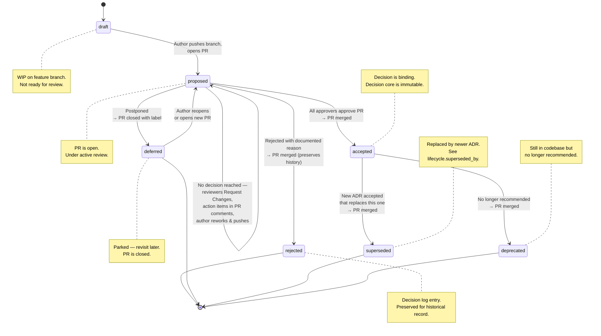

# ADR Governance Process

> **Status:** Normative
> **Last updated:** 2026-03-07

This document defines the process for proposing, reviewing, approving, and maintaining Architecture Decision Records (ADRs) in this repository. The process is **GitOps-based**: all state transitions happen through Git commits and pull requests.

### Quick Reference

| I want to... | Do this |
|--------------|---------|
| Start a new decision | Branch → create YAML in `architecture-decision-log/` with `status: draft` → iterate |
| Submit for review | Set `status: proposed` → open PR → assign reviewers |
| Approve a decision | Approve the PR → author sets `status: accepted` → merge |
| Reject a decision | Comment reason → author sets `status: rejected` → merge (preserve history) |
| Defer a decision | Comment reason → author sets `status: deferred` → close PR with label |
| Supersede a decision | Create new ADR referencing old one → accept new → update old to `superseded` |
| Deprecate a decision | Set `status: deprecated` + audit event → merge |
| Archive a decision | Set `lifecycle.archival` fields + `archived` audit event → merge |
| Confirm implementation | Add `confirmation.description` + `confirmation.artifact_ids` in follow-up PR |
| Periodic review | Check `lifecycle.next_review_date` → verify or supersede |

> See the full sections below for detailed workflows.

---

## 1. Roles

| Role | Responsibility |
|------|---------------|
| **Author** | Drafts the ADR. Populates all required fields. |
| **Decision Owner** | Single accountable person for the decision (named in `decision_owner`). Drives the review. May or may not be the author. |
| **Reviewer** | Reviews the ADR for technical correctness, completeness, and alignment with existing decisions. Named in `reviewers`. |
| **Approver** | Provides formal approval. Named in `approvals`. Typically: Tech Lead, Architect, CISO, or DPO depending on `decision_type`. |

---

## 2. Status Lifecycle




**Valid transitions:**

| ADR Status (from) | ADR Status (to) | PR State | Trigger |
|:------------------:|:----------------:|:--------:|---------|
| `draft` | `proposed` | **opened** | Author pushes branch and opens PR |
| `proposed` | `proposed` | **open** (changes requested) | Reviewed but no decision — reviewers request changes, author reworks |
| `proposed` | `accepted` | **merged** | All required approvers approve the PR |
| `proposed` | `rejected` | **merged** | Approvers reject — ADR is merged to preserve the historical record |
| `proposed` | `deferred` | **closed** | Decision postponed; PR closed with `deferred` label |
| `deferred` | `proposed` | **opened** (new or reopened) | Author reopens or opens new PR |
| `accepted` | `superseded` | **merged** (via superseding ADR's PR) | New ADR accepted that replaces this one |
| `accepted` | `deprecated` | **merged** (standalone PR) | Decision no longer recommended |

> **Why are rejected ADRs merged?** Rejected ADRs are part of the decision log — they document *why* an option was evaluated and not pursued. Closing the PR without merging would lose this history from `main`.

> **Where is `archived` in this diagram?** Archival is **not a status value** — it is a metadata overlay tracked via `lifecycle.archival` fields. Archived ADRs retain their pre-archival status (`superseded`, `deprecated`, or `rejected`). See §8 for the archival workflow.

---

## 3. Workflow: Proposing a New ADR

### 3.0 Should You Write an ADR? — Architectural Significance Test

Not every technical decision needs a full ADR. Before starting, verify that **at least one** of the following applies:

| # | Significance Criterion |
|---|------------------------|
| 1 | The decision affects **multiple components, teams, or services** |
| 2 | The decision is **difficult or expensive to reverse** |
| 3 | The decision has **security, compliance, or regulatory** implications |
| 4 | The decision **establishes a pattern** that others will follow |
| 5 | The decision involves a **tradeoff between quality attributes** (e.g., security vs. usability, latency vs. consistency) |
| 6 | Someone will ask **"why did we do this?"** in 6 months |

If **none** of these apply, the decision is likely not architecturally significant — just make it, document it inline (code comment, wiki, commit message), and move on.

> **Source:** Adapted from Zimmermann's [Architectural Significance Test](https://ozimmer.ch/practices/2020/09/24/ASRTestECSADecisions.html). See also: *"An AD log with more than 100 entries will probably put your readers (and you) to sleep."*

### 3.1 Draft Phase

1. **Create a branch** from `main`:
   ```bash
   git checkout -b adr/ADR-NNNN-short-title
   ```

2. **Create the ADR file** from the template:
   ```bash
   cp .skills/adr-author/assets/adr-template.yaml architecture-decision-log/ADR-NNNN-short-title.yaml
   ```

3. **Set status to `draft`** while authoring:
   ```yaml
   adr:
     id: "ADR-NNNN-short-title"
     status: "draft"
   ```

4. **Iterate locally.** Validate against the schema:
   ```bash
   python3 scripts/validate-adr.py architecture-decision-log/ADR-NNNN-short-title.yaml
   ```

> **Pre-drafting exploration:** Complex or high-impact decisions may benefit from informal exploration before the ADR is drafted — design docs, RFCs, technical spikes, PoCs, or whiteboard sessions. These are not part of the ADR governance process, but their outputs should be referenced:
> - Link exploration documents in `references` (title + URL)
> - Link PoC results or benchmarks in `confirmation.artifact_ids` (see §7)
>
> The ADR captures the *decision and its justification*. Exploration artifacts provide supporting evidence.

### 3.2 Proposal Phase

5. **Set status to `proposed`** when the ADR is complete and ready for review:
   ```yaml
   adr:
     status: "proposed"
   ```

6. **Open a Pull Request.** The PR title should match the ADR title:
   ```
   ADR-NNNN: Short decision title
   ```

7. **Assign reviewers.** Add all stakeholders listed in the ADR's `reviewers` and `approvals` sections as PR reviewers.

8. **CI validates** the ADR automatically (schema validation runs on PR).

### 3.3 Review Phase

9. **Reviewers read the ADR** in the PR. They have **5 business days** to review (configurable per team).

10. **Review checklist** — reviewers should verify:
    - [ ] Context is clear and complete
    - [ ] At least 2 alternatives are genuinely considered (not strawmen)
    - [ ] Pros/cons are balanced and honest
    - [ ] Rationale explains *why* the chosen option is preferred
    - [ ] Tradeoffs are explicitly acknowledged
    - [ ] Risks are addressed (per-alternative `risk` level, cons, and `consequences.negative`)
    - [ ] No conflict with existing `accepted` ADRs (search `architecture-decision-log/` for related decisions)
    - [ ] `approvals[].identity` is populated with the platform handle for each required approver (§3.4.1)

11. **Reviewers comment on the PR.** Discussions happen in PR comments.

12. **Author addresses feedback** by pushing new commits to the branch.

#### When to Escalate to a Synchronous Meeting

Async PR review is the default. However, some decisions benefit from real-time discussion where participants can debate trade-offs, read body language, and reach consensus faster. The decision owner should escalate to a synchronous session (in-person or virtual) when **any** of the following apply:

| Trigger | Why synchronous helps |
|---------|----------------------|
| **Async comments aren't converging** — >2 rounds of back-and-forth on the same point | Real-time discussion resolves misunderstandings that compound in text |
| **Multiple quality attributes in tension** — e.g., security vs. usability, latency vs. consistency | Trade-off debates need rapid back-and-forth to surface the real priorities |
| **Cross-team impact** — the decision affects multiple teams who need to align | Getting all stakeholders in one room prevents sequential negotiation |
| **High irreversibility** — expensive or impossible to reverse (API contracts, data model, infrastructure) | The cost of getting it wrong justifies the cost of a meeting |
| **Establishing a new pattern** — the decision sets a precedent for future ADRs | Patterns deserve extra scrutiny because they'll be replicated |
| **Low confidence** — `decision.confidence: low` | The decision maker is uncertain and needs broader input to increase confidence |

> **Format tip:** A 30-minute session works well: 5 min context recap → 15 min trade-off discussion → 10 min decision + action items. For lengthy ADRs, start with a silent reading slot (10–15 min) so everyone engages with the full document before discussion. Record the outcome in PR comments for traceability.

> **Note on `reviewed` audit events:** The initial proposal review happens through the PR process. Do **not** add a `reviewed` event to `audit_trail` during the initial review — the `approved` or `rejected` event records the outcome. The `reviewed` event is reserved for **periodic reviews** (§9) of already-accepted ADRs.

### 3.4 Approval Phase

13. **All required approvers must approve the PR** before merge. This is enforced via GitHub branch protection rules:
    - Require approvals from designated CODEOWNERS
    - Require passing CI (schema validation + approval identity verification)
    - No self-approval (author cannot be sole approver)

14. **Once approved:**
    - Author (or decision owner) sets status to `accepted`
    - Author populates `decision.decision_date`
    - Author adds entries to `approvals` with names, roles, **platform identities**, and timestamps
    - Author adds an `approved` event to `audit_trail`

    > **Who sets the status?** The author or decision owner updates the YAML. The branch protection rules prevent self-approval — the author cannot be the *sole* approver. Setting the status to `accepted` is a clerical action that happens *after* PR approval, not a governance action.

    > **Bootstrap exception:** ADR-0000 (the meta-ADR adopting this governance process) was self-approved by the initial author. The no-self-approval rule applies to all subsequent ADRs.

15. **Merge the PR** to `main`. The ADR is now binding and its decision core is frozen in place.

### 3.4.1 Approval Identity Rule

> **Principle:** The ADR's `approvals[]` list and the pull request's actual approvers **must match**. Every person listed in `approvals` must have actually approved the pull request, and their `identity` field must resolve to their platform account.

The `identity` field on each approval entry is the **platform-resolvable handle** that CI uses to verify the approval:

| Platform | Identity format | Example | API used for verification |
|----------|----------------|---------|--------------------------|
| GitHub | `@username` | `@janedoe` | `GET /repos/{owner}/{repo}/pulls/{number}/reviews` |
| Azure DevOps | Email or UPN | `jane.doe@org.com` | `GET /_apis/git/pullRequests/{id}/reviewers` |
| GitLab | `@username` | `@janedoe` | `GET /projects/:id/merge_requests/:iid/approval_state` |
| AWS CodeBuild | *(uses GitHub/CodeCommit API)* | Depends on source | Depends on source provider |
| GCP Cloud Build | *(uses GitHub API)* | Depends on source | Depends on source provider |

**How CI enforcement works:**

1. The CI pipeline detects which ADR files were changed in the PR
2. For each changed ADR with `status: proposed` or `status: accepted`:
   - Extracts all `approvals[].identity` values
   - Queries the platform API for the list of users who **actually approved** the PR
   - Compares the two sets
3. **If any listed approver has not approved the PR**, the check fails and merge is blocked
4. **`status: proposed` and `status: accepted` ADRs must include `approvals[]` with `identity` on every entry**. This is enforced by schema validation before the approval-identity check runs.
5. **`status: accepted` ADRs must also include at least one non-null `approved_at` timestamp and an `approved` event in `audit_trail`**. This is enforced by semantic validation.

> **Why this matters:** Without this rule, anyone can write arbitrary names in `approvals[]` and merge with a different set of PR approvers. The identity binding ensures that the ADR's formal approval record matches the Git platform's cryptographic approval record.

> **When to populate `identity`:** Add the `identity` field when the ADR enters `proposed` status and approvers are known. The field uses whatever format your Git platform identifies reviewers by — typically a username prefixed with `@`.

**Example:**

```yaml
approvals:
  - name: "Jane Doe"
    role: "Lead Architect"
    identity: "@janedoe"          # ← CI verifies this account approved the PR
    approved_at: "2026-03-15T10:00:00Z"
    signature_id: sig-example-001
```

### 3.4.2 Single ADR per PR

> **Rule:** A pull request may modify **at most one ADR file**.

This ensures each merge commit maps to exactly one architectural decision, keeping the git history clean and making individual decisions easy to revert.

**Exception — supersession pairs:** When a new ADR supersedes an existing one, the PR must touch exactly **two** ADR files:
- The **new ADR** (with `lifecycle.supersedes: ADR-NNNN`)
- The **old ADR** (with `status: superseded` and `lifecycle.superseded_by: ADR-MMMM`)

The CI script validates this automatically — if a PR modifies two ADRs that form a valid supersession chain (the symmetry is verified), the check passes. Any other multi-ADR PR is rejected.

This rule is configured in [`.adr-governance/config.yaml`](../.adr-governance/config.yaml):

```yaml
governance:
  single_adr_per_pr: true
```

### 3.4.3 Change Classification

Not all changes to an ADR are equal. The governance framework distinguishes between **substantive** and **maintenance** changes.

This change classification governs:
- `draft` and `proposed` ADRs
- maintenance updates to non-frozen metadata on already `accepted` ADRs

Once an ADR is already `accepted`, an additional rule applies: the **decision core is immutable in place**. If you need to change the actual decision, rationale, alternatives, consequences, or governing context of an accepted ADR, create a **new superseding ADR** instead of editing the old one.

#### Tier 1 — Substantive Changes (full approval required)

Changes to fields that affect the *decision itself*. For ADRs that are still mutable, these require the original ADR approvers (listed in `approvals[].identity`) to re-approve via the PR:

| Field | Why it's substantive |
|-------|---------------------|
| `adr.status` | Changes the governance state of the decision |
| `adr.title` | Reframes what the decision is about |
| `decision.*` | Alters the chosen alternative, rationale, tradeoffs, or confidence |
| `alternatives.*` | Changes the options that were evaluated |
| `consequences.*` | Modifies the expected outcomes |
| `approvals.*` | Adds, removes, or changes approver records |
| `context.summary` | Reframes the problem statement |

#### Tier 2 — Maintenance Changes (no ADR re-approval required)

Changes to non-decision fields. These are clerical or additive updates that don't alter the architectural decision:

- `adr.schema_version` — schema migration
- `adr.last_modified`, `adr.tags`, `adr.component` — metadata updates
- `authors[].email` — contact info correction
- `reviewers` — adding reviewers
- `context.business_drivers`, `context.technical_drivers`, `context.constraints`, `context.assumptions` — clarification, not reframing
- `architecturally_significant_requirements`, `dependencies`, `references` — adding supporting information
- `lifecycle.next_review_date`, `lifecycle.review_cycle_months` — review cadence
- `audit_trail` — appending new events only. Existing entries may not be edited, deleted, or reordered; CI enforces append-only semantics on PRs.
- `confirmation.artifact_ids` — backfilling verification evidence

Maintenance changes still require a standard PR approval via branch protection, but the `verify-approvals.py` identity check is **skipped**. The `audit_trail` remains append-only: if you need to correct or clarify history, append a new event rather than editing an existing one. An `updated` event should be added to `audit_trail`:

```yaml
audit_trail:
  - event: updated
    by: Ivan Stambuk
    at: "2026-03-10T14:00:00Z"
    details: "Administrative: corrected reviewer email address"
```

The substantive fields list is configured in [`.adr-governance/config.yaml`](../.adr-governance/config.yaml) and can be customized per organisation.

#### Accepted ADRs — immutable decision core

If the ADR on the base branch is already `accepted`, CI enforces a stronger rule than ordinary Tier 1/Tier 2 classification:

- The ADR may stay `accepted`
- The ADR may transition to `superseded`
- The ADR may transition to `deprecated`
- The decision core may **not** be edited in place

The frozen decision core includes:
- `adr.title`, `adr.summary`, `adr.project`, `adr.component`, `adr.priority`, `adr.decision_type`
- `authors`, `decision_owner`, `reviewers`, `approvals`
- `context`
- `architecturally_significant_requirements`
- `alternatives`
- `decision`
- `consequences`
- `dependencies`

Allowed post-acceptance updates include:
- `confirmation`
- `lifecycle` metadata such as periodic review cadence and supersession/deprecation overlays
- `references`
- `adr.last_modified`, `adr.version`, `adr.tags`, `adr.schema_version`
- `audit_trail` (append-only only)

If you discover that the accepted decision itself is wrong or incomplete, do **not** rewrite the accepted ADR. Create a new ADR, document the revised decision there, and supersede the old one.

### 3.4.4 ADR Administrator

An **ADR Administrator** is a person authorised to make Tier 2 (maintenance) changes to any ADR without obtaining the original ADR approvers' re-approval. This is useful for:

- Typo fixes and formatting corrections
- Schema version bumps during migrations
- Updating contact information (emails, names)
- Adding references or clarifying context
- Updating review cadence dates

Administrators are listed in [`.adr-governance/config.yaml`](../.adr-governance/config.yaml):

```yaml
governance:
  admins:
    - identity: "ivanstambuk"
      name: "Ivan Stambuk"
    - identity: "elenavasquez"
      name: "Elena Vasquez"
```

**How it works in CI:**

1. The CI script detects the **PR author** from platform environment variables
2. If the PR author is listed as an admin in the governance config:
   - **Substantive changes** → full approval identity verification (same as non-admins)
   - **Maintenance changes** → approval identity check is skipped; only standard branch protection applies
3. If the PR author is **not** an admin:
   - **Substantive changes** → full approval identity verification
   - **Maintenance changes** → approval identity check is still skipped (maintenance changes never require ADR re-approval), but standard branch protection applies

> **Key point:** The admin role doesn't grant the ability to make substantive changes without approval. It only provides an explicit governance signal in CI output. Maintenance changes skip the identity check for *everyone* — the admin designation is primarily for auditability and clarity.

> **Accepted ADR exception:** Admins are still bound by the immutable decision core rule. They can maintain accepted ADR metadata, but they cannot rewrite the approved decision in place.

> **Governance of the config itself:** Changes to [`.adr-governance/config.yaml`](../.adr-governance/config.yaml) should be subject to the same review process as any governance artefact. Add it to `CODEOWNERS` so that admin roster changes require approval from the architecture team.


### 3.5 Rejection

16. If the PR is rejected:
    - Author sets status to `rejected`
    - Rejection reason is documented in the PR and in the ADR's `audit_trail`
    - PR is **merged** (not closed) — rejected ADRs are preserved for historical record

> **What does `chosen_alternative` mean for rejected ADRs?** When the *proposal* is rejected but the team selects a different approach (e.g., ADR-0007: Vault was proposed but native cloud stores were chosen), `chosen_alternative` records the alternative the team will actually pursue. The `status: rejected` signals that the *proposed approach* was rejected, not the ADR itself. The ADR serves as a record of both the rejection and the actual path forward.

---

## 4. Workflow: Re-proposing a Deferred ADR

A deferred ADR can be re-proposed when the blocking condition is resolved.

1. **Determine what changed.** The author or decision owner identifies why the ADR is now ready — new information, resolved dependency, changed priority, or elapsed time.
2. **Open a new PR** (preferred) or reopen the original PR:
   - Update `adr.status` to `proposed`
   - Update `context.summary` if the landscape has changed
   - Add an `updated` event to `audit_trail` explaining why the ADR is being re-proposed
3. Follow the standard review process (§3.3–3.4).

---

## 5. Workflow: Superseding an Existing ADR

1. **Create a new ADR** (ADR-MMMM) following the standard proposal workflow
2. In the new ADR, set the supersession field:
   ```yaml
   lifecycle:
     supersedes: "ADR-NNNN"
   ```
3. When the new ADR is accepted, **update the old ADR** in the same PR:
   - Set `adr.status: "superseded"`
   - Set `lifecycle.superseded_by: "ADR-MMMM"`
   - Add a `superseded` event to `audit_trail`

> **Symmetry rule:** Both fields must be set — the new ADR's `lifecycle.supersedes` and the old ADR's `lifecycle.superseded_by`. The validator checks this.

---

## 6. Workflow: Deprecating an ADR

Deprecation marks a decision as no longer recommended, but not yet replaced.

1. **Open a PR** that updates the existing ADR:
   - Set `adr.status: "deprecated"`
   - Add a `deprecated` event to `audit_trail` with reason
2. **When to deprecate** (vs. supersede):
   - **Deprecate** when the decision is outdated but no replacement has been decided yet
   - **Supersede** when a new ADR has been accepted that replaces this one
3. A deprecated ADR should eventually be either superseded by a new ADR or left as a historical record.

> **Timestamp convention:** Unlike archival (which has a dedicated `lifecycle.archival.archived_at` field), deprecation has no dedicated timestamp field. The deprecation time is recorded in the `audit_trail` via the `deprecated` event's `at` field. This is intentional — deprecation is a transitional state, not a terminal one.

---

## 7. Workflow: Confirming Implementation

After an ADR is accepted, the team must verify it was actually implemented.

1. **Populate the `confirmation` field** as implementation progresses:
   ```yaml
   confirmation:
     description: "Verified via integration test suite and code review of PR #142"
     artifact_ids:
       - "JIRA-1234"
       - "https://github.com/org/repo/pull/142"
       - "TEST-SUITE-auth-dpop-e2e"
   ```

2. Confirmation can be added in a follow-up PR after the ADR is accepted. This is an explicitly allowed post-acceptance update because it records implementation evidence rather than changing the decision itself.

3. **Recommended artifact types** for `confirmation.artifact_ids`:

   | Prefix / Format | Example | Use When |
   |-----------------|---------|----------|
   | Jira / GitHub issue | `JIRA-1234`, `https://github.com/org/repo/issues/42` | Implementation tracked in an issue |
   | Pull request | `https://github.com/org/repo/pull/142` | Code change that implements the decision |
   | Test suite | `TEST-SUITE-auth-dpop-e2e` | Automated tests that verify the decision |
   | Fitness function | `archunit:no-direct-db-access` | ArchUnit / architectural lint rule |
   | PoC / Experiment | `POC-2026-03-dpop-latency-benchmark` | Proof-of-concept that validated the decision |
   | Benchmark | `BENCH-jwt-signing-ed25519-vs-rsa` | Performance data supporting the choice |
   | Sprint review | `SPRINT-42-review-notes` | Review meeting where implementation was demonstrated |

   > The strongest decision confirmations are **empirical** — PoC results, benchmarks, and passing fitness functions carry more weight than tickets alone.

   > **Schema note:** The `confirmation.artifact_ids` field in the schema accepts arbitrary strings. Use the prefixes above for consistency. See [`adr.schema.json`](../schemas/adr.schema.json) → `confirmation` definition.

4. **During code reviews**, reviewers should check if a proposed change **violates any accepted ADR**. If it does:
   - Link the relevant ADR in the review comment
   - Request the author to either update the code or propose a new superseding ADR

---

## 8. Archival

Archival is for decisions that are no longer active and should be removed from regular consideration. Archival is distinct from supersession (replaced by a newer ADR) and deprecation (no longer recommended).

**When to archive:**
- A `superseded` ADR whose successor has been accepted **and** confirmed
- A `deprecated` ADR whose replacement is fully operational
- A `rejected` ADR that is no longer relevant to revisit

**How to archive:**

1. Update the ADR YAML:
   ```yaml
   lifecycle:
     archival:
       archived_at: "2026-06-15T10:00:00Z"
       archive_reason: "Superseded by ADR-0008; original decision fully replaced and confirmed."
   ```
2. Add an `archived` event to `audit_trail`:
   ```yaml
   audit_trail:
     - event: archived
       by: Elena Vasquez
       at: "2026-06-15T10:00:00Z"
       details: "Superseded by ADR-0008. Successor confirmed in production."
   ```
3. Submit as a PR and merge.

> **Never delete an ADR.** Archival preserves the decision record for historical reference and audit compliance. Archived ADRs remain in the `architecture-decision-log/` directory.

> **Archival is not a status.** The ADR retains its pre-archival `adr.status` (`superseded`, `deprecated`, or `rejected`). Archival is signalled by the presence of `lifecycle.archival.archived_at` and the `archived` event in `audit_trail`. This is intentional — archival is a metadata annotation, not a state transition, and archived ADRs remain queryable by their logical status.

---

## 9. Periodic Review

ADRs with `lifecycle.review_cycle_months` set will be flagged for periodic review.

1. When the `lifecycle.next_review_date` arrives, the decision owner should:
   - Verify the decision is still valid and the context hasn't changed
   - If still valid: update `next_review_date` and add a `reviewed` event to `audit_trail`
   - If no longer valid: propose a superseding ADR or deprecate

2. **Retrospective questions** — use these to guide the periodic review:

   | # | Question |
   |---|----------|
   | 1 | Did the **consequences we predicted** actually occur? |
   | 2 | Were there **unforeseen consequences** we should document? |
   | 3 | Has the **context changed** since this decision was made? |
   | 4 | Was the **confidence level** of this decision appropriate? |
   | 5 | Have we accumulated **technical debt** from this decision? |
   | 6 | Is this decision **still the right choice** given what we now know? |
   | 7 | Should we trigger a **superseding ADR**? |

   > These questions focus on improving the *decision-making process*, not just the architecture. Adapted from [Cervantes & Woods, "Architectural Retrospectives"](https://www.infoq.com/articles/architectural-retrospectives/).

3. **Confidence-driven review frequency.** Use `decision.confidence` to set default review cadence:

   | Confidence | Recommended `review_cycle_months` | Rationale |
   |------------|----------------------------------|----------|
   | `low` | 6 | Decision made under pressure or with incomplete data — re-evaluate early |
   | `medium` | 12 | Standard review cycle |
   | `high` | 24 | Strong empirical evidence — extended cycle acceptable |


---


## 10. Schema Versioning Policy

Each ADR records the schema version it was authored against in `adr.schema_version`.

| Rule | Detail |
|------|--------|
| **Schema version is pinned at creation time** | When an ADR is created, set `schema_version` to the current version of `adr.schema.json`. |
| **Existing ADRs are NOT updated** when the schema evolves | If the schema adds new optional fields, old ADRs remain valid without modification. |
| **Backward compatibility is required** | New schema versions MUST validate all existing ADRs without errors. Only add optional fields; never make previously-optional fields required. |
| **Breaking changes require migration** | If a required field is added or renamed, provide a migration script and bump the major version. Update `schema_version` in affected ADRs. |
| **Current version** | `1.0.0` (see [`schemas/adr.schema.json`](../schemas/adr.schema.json)) |

### ADR document versioning (`adr.version`)

Each ADR also tracks its own document version in `adr.version` (format: `MAJOR.MINOR`). This is separate from `schema_version`:

| Change Type | Version Bump | Example |
|-------------|:------------:|---------|
| **Draft / proposal iteration** | MINOR | `0.1` → `0.2` |
| **Maintenance-only post-acceptance update** (confirmation, references, lifecycle metadata, clerical corrections) | MINOR | `1.0` → `1.1` |
| **Initial draft** | — | Start at `0.1` |
| **First accepted version** | — | Set to `1.0` on acceptance |

Once an ADR is accepted, do **not** bump it to `2.0` for a rewritten decision. A material change to an accepted decision requires a new ADR and supersession; the original accepted ADR remains at its historical version lineage.

---

## 11. Branch Protection Rules (Recommended)

Configure in GitHub repository settings → Branches → `main`:

```
✅ Require a pull request before merging
✅ Require approvals: 1 (minimum; increase per decision_type)
✅ Require review from Code Owners
✅ Require status checks to pass (CI: schema validation)
✅ Require conversation resolution before merging
❌ Allow force pushes (never)
❌ Allow deletions (never)
```

### CODEOWNERS (recommended)

Create a `CODEOWNERS` file to enforce that the right people review ADRs:

```
# All ADRs require architect approval
architecture-decision-log/    @org/architecture-team

# Security decisions additionally require CISO
architecture-decision-log/ADR-*security*    @org/security-team

# Compliance decisions additionally require DPO
architecture-decision-log/ADR-*compliance*  @org/compliance-team
```

> **Note:** CODEOWNERS wildcard patterns match on *filename*, not on `decision_type` inside the YAML. To ensure correct reviewer assignment, include the decision domain in the ADR filename (e.g., `ADR-0007-security-adopt-passkeys.yaml`). For more sophisticated routing, use a CI-based reviewer assignment step that reads `decision_type` from the YAML and requests the appropriate team via the GitHub API.
