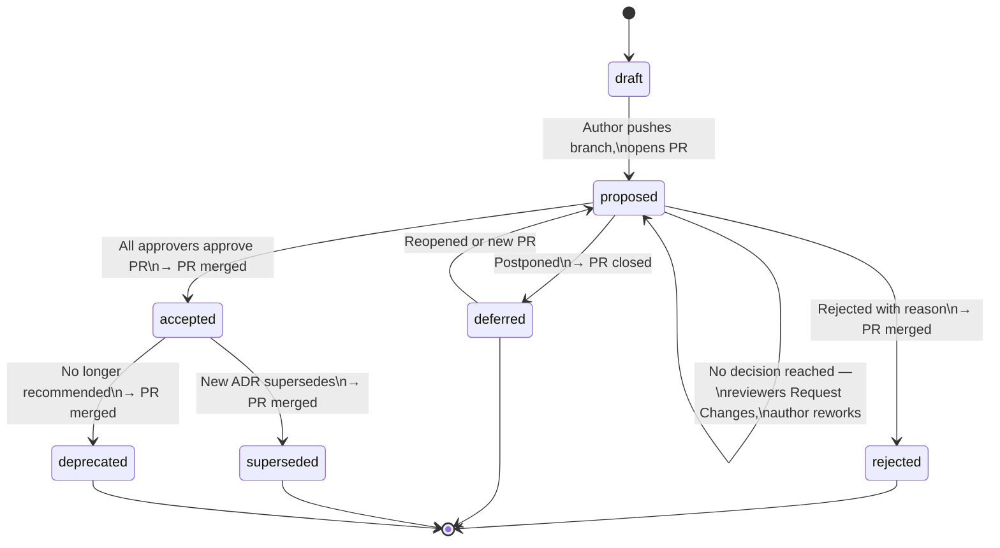

# ADR Governance Process

> **Status:** Normative
> **Last updated:** 2026-03-05

This document defines the process for proposing, reviewing, approving, and maintaining Architecture Decision Records (ADRs) in this repository. The process is **GitOps-based**: all state transitions happen through Git commits and pull requests.

---

## 1. Roles

| Role | Responsibility |
|------|---------------|
| **Author** | Drafts the ADR. Populates all required fields. |
| **Decision Owner** | Single accountable person for the decision (named in `decision_owner`). Drives the review. May or may not be the author. |
| **Reviewer** | Reviews the ADR for technical correctness, completeness, and alignment with existing decisions. Named in `reviewers`. |
| **Approver** | Provides formal approval. Named in `approvals`. Typically: Tech Lead, Architect, CISO, or DPO depending on `decision_type`. |

---

## 2. Status Lifecycle

### ASCII

```
   ┌────────┐
   │  draft │  (WIP — on feature branch, not ready for review)
   └───┬────┘
       │ author pushes branch, opens PR, sets status: proposed
       ▼
   ┌──────────┐◄─────────────────────────────────────────────┐
   │ proposed │  (PR open — under review)                    │
   └──┬───┬───┘                                              │
      │   │                                                  │
      │   ├─────────────────┐                                │
      │   │                 │ not enough info / bad timing   │
      │   │                 ▼                                │
      │   │          ┌──────────┐                            │
      │   │          │ deferred │  (parked — PR closed)      │
      │   │          └──────────┘                            │
      │   │                                                  │
      │   └─────────────────────────────────────────────┐    │
      │              discussed but no decision reached  │    │
      │              → reviewers "Request Changes"      │    │
      │              → action items in PR comments      │    │
      │              → author reworks & pushes ─────────┼────┘
      │                                                 │
      ├──────────────────┐                              │
      │                  │                              │
      ▼                  ▼                              │
   ┌──────────┐   ┌──────────┐                          │
   │ accepted │   │ rejected │  (with reason in PR)     │
   └──┬───────┘   └──────────┘                          │
      │
      ├─────────────────────┐
      │                     │
      ▼                     ▼
   ┌─────────────┐   ┌─────────────┐
   │ superseded  │   │ deprecated  │
   └─────────────┘   └─────────────┘
```

### Mermaid



**Valid transitions:**

| ADR Status (from) | ADR Status (to) | PR State | Trigger |
|:------------------:|:----------------:|:--------:|---------|
| `draft` | `proposed` | **opened** | Author pushes branch and opens PR |
| `proposed` | `proposed` | **open** (changes requested) | Reviewed but no decision — reviewers request changes, author reworks |
| `proposed` | `accepted` | **merged** | All required approvers approve the PR |
| `proposed` | `rejected` | **merged** | Approvers reject — ADR is merged to preserve the historical record |
| `proposed` | `deferred` | **closed** | Decision postponed; PR closed with `deferred` label |
| `deferred` | `proposed` | **opened** (new or reopened) | Author reopens or opens new PR |
| `accepted` | `superseded` | **merged** (via superseding ADR's PR) | New ADR accepted that replaces this one |
| `accepted` | `deprecated` | **merged** (standalone PR) | Decision no longer recommended |

> **Why are rejected ADRs merged?** Rejected ADRs are part of the decision log — they document *why* an option was evaluated and not pursued. Closing the PR without merging would lose this history from `main`.

---

## 3. Workflow: Proposing a New ADR

### 3.1 Draft Phase

1. **Create a branch** from `main`:
   ```bash
   git checkout -b adr/ADR-NNNN-short-title
   ```

2. **Create the ADR file** in `decisions/` using the schema:
   ```bash
   cp examples/ADR-0001-*.yaml decisions/ADR-NNNN-short-title.yaml
   ```

3. **Set status to `draft`** while authoring:
   ```yaml
   adr:
     id: "ADR-NNNN"
     status: "draft"
   ```

4. **Iterate locally.** Validate against the schema:
   ```bash
   python3 scripts/validate-adr.py decisions/ADR-NNNN-short-title.yaml
   ```

### 3.2 Proposal Phase

5. **Set status to `proposed`** when the ADR is complete and ready for review:
   ```yaml
   adr:
     status: "proposed"
   ```

6. **Open a Pull Request.** The PR title should match the ADR title:
   ```
   ADR-NNNN: Short decision title
   ```

7. **Assign reviewers.** Add all stakeholders listed in the ADR's `reviewers` and `approvals` sections as PR reviewers.

8. **CI validates** the ADR automatically (schema validation runs on PR).

### 3.3 Review Phase

9. **Reviewers read the ADR** in the PR. They have **5 business days** to review (configurable per team).

10. **Review checklist** — reviewers should verify:
    - [ ] Context is clear and complete
    - [ ] At least 2 alternatives are genuinely considered (not strawmen)
    - [ ] Pros/cons are balanced and honest
    - [ ] Rationale explains *why* the chosen option is preferred
    - [ ] Tradeoffs are explicitly acknowledged
    - [ ] Risk assessment covers realistic failure modes
    - [ ] No conflict with existing `accepted` ADRs (check `related_adrs`)

11. **Reviewers comment on the PR.** Discussions happen in PR comments.

12. **Author addresses feedback** by pushing new commits to the branch.

### 3.4 Approval Phase

13. **All required approvers must approve the PR** before merge. This is enforced via GitHub branch protection rules:
    - Require approvals from designated CODEOWNERS
    - Require passing CI (schema validation)
    - No self-approval (author cannot be sole approver)

14. **Once approved:**
    - Author sets status to `accepted`
    - Author populates `decision.decision_date`
    - Author adds entries to `approvals` with names, roles, and timestamps
    - Author adds a `created` event to `audit_trail`

15. **Merge the PR** to `main`. The ADR is now binding.

### 3.5 Rejection

16. If the PR is rejected:
    - Author sets status to `rejected`
    - Rejection reason is documented in the PR and in the ADR's `audit_trail`
    - PR is **merged** (not closed) — rejected ADRs are preserved for historical record

---

## 4. Workflow: Superseding an Existing ADR

1. **Create a new ADR** (ADR-MMMM) following the standard proposal workflow
2. In the new ADR, reference the old one:
   ```yaml
   related_adrs:
     - id: "ADR-NNNN"
       title: "Original decision title"
       relationship: supersedes
   ```
3. When the new ADR is accepted, **update the old ADR** in the same PR:
   - Set `adr.status: "superseded"`
   - Set `lifecycle.superseded_by: "ADR-MMMM"`
   - Add a `superseded` event to `audit_trail`

---

## 5. Workflow: Confirming Implementation

After an ADR is accepted, the team must verify it was actually implemented.

1. **Populate the `confirmation` field** as implementation progresses:
   ```yaml
   confirmation:
     description: "Verified via integration test suite and code review of PR #142"
     artifact_ids:
       - "JIRA-1234"
       - "https://github.com/org/repo/pull/142"
       - "TEST-SUITE-auth-dpop-e2e"
   ```

2. Confirmation can be added in a follow-up PR after the ADR is accepted.

3. **During code reviews**, reviewers should check if a proposed change **violates any accepted ADR**. If it does:
   - Link the relevant ADR in the review comment
   - Request the author to either update the code or propose a new superseding ADR

---

## 6. Periodic Review

ADRs with `lifecycle.review_cycle_months` set will be flagged for periodic review.

1. When the `lifecycle.next_review_date` arrives, the decision owner should:
   - Verify the decision is still valid and the context hasn't changed
   - If still valid: update `next_review_date` and add a `reviewed` event to `audit_trail`
   - If no longer valid: propose a superseding ADR or deprecate

---

## 7. Branch Protection Rules (Recommended)

Configure in GitHub repository settings → Branches → `main`:

```
✅ Require a pull request before merging
✅ Require approvals: 1 (minimum; increase per decision_type)
✅ Require review from Code Owners
✅ Require status checks to pass (CI: schema validation)
✅ Require conversation resolution before merging
❌ Allow force pushes (never)
❌ Allow deletions (never)
```

### CODEOWNERS (recommended)

Create a `CODEOWNERS` file to enforce that the right people review ADRs:

```
# All ADRs require architect approval
decisions/    @org/architecture-team

# Security decisions additionally require CISO
decisions/ADR-*security*    @org/security-team

# Compliance decisions additionally require DPO
decisions/ADR-*compliance*  @org/compliance-team
```

---

## 8. Quick Reference

| I want to... | Do this |
|--------------|---------|
| Start a new decision | Branch → create YAML in `decisions/` with `status: draft` → iterate |
| Submit for review | Set `status: proposed` → open PR → assign reviewers |
| Approve a decision | Approve the PR → author sets `status: accepted` → merge |
| Reject a decision | Comment reason → author sets `status: rejected` → merge (preserve history) |
| Defer a decision | Comment reason → author sets `status: deferred` → close PR with label |
| Supersede a decision | Create new ADR referencing old one → accept new → update old to `superseded` |
| Confirm implementation | Add `confirmation.description` + `confirmation.artifact_ids` in follow-up PR |
| Periodic review | Check `lifecycle.next_review_date` → verify or supersede |
