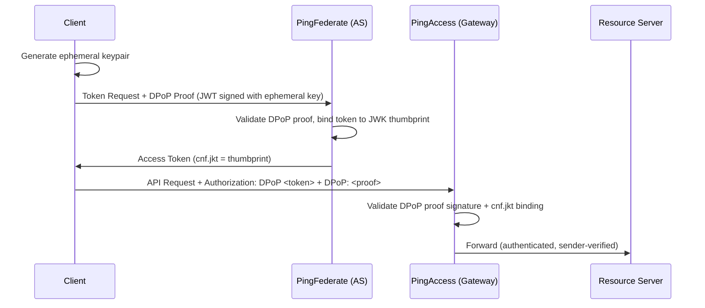

<!-- ⚠️ AUTO-GENERATED — DO NOT EDIT -->
<!-- Source of truth: ../ADR-0001-dpop-over-mtls-for-sender-constrained-tokens.yaml -->

> [!CAUTION]
> **This file is auto-generated** from [`ADR-0001-dpop-over-mtls-for-sender-constrained-tokens.yaml`](../ADR-0001-dpop-over-mtls-for-sender-constrained-tokens.yaml).
> Do not edit this file directly — all changes must be made in the YAML source.

# ADR-0001: Use DPoP over mTLS as the sender-constraining mechanism for OAuth 2.1 access tokens

> **Status:** `accepted` · **Priority:** `high` · **Type:** `technology` · **Confidence:** `high`
> **Decision Owner:** Marcus Chen (Head of Identity and Access Management) · **Decision Date:** 2026-01-24

*Adopt DPoP (RFC 9449) as the sole sender-constraining mechanism for all OAuth 2.1 client types, avoiding mTLS certificate provisioning and CDN passthrough costs.*

---

**Authors:** Elena Vasquez (IAM Architect), Kai Lindström (Mobile Platform Lead)
**Reviewers:** Priya Sharma (API Platform Lead), Jonas Eriksen (CISO), Raj Patel (CDN / Edge Infrastructure Lead)
**Approvals:** Marcus Chen (2026-01-24T10:00:00Z), Jonas Eriksen (2026-01-25T09:00:00Z)

---

## Context

NovaTrust has adopted OAuth 2.1 (RFC 9700) as its API authorization framework. The specification
mandates sender-constrained tokens to prevent token theft and replay. Two mechanisms are
standardized: mTLS certificate-bound tokens (RFC 8705) and DPoP proof-of-possession (RFC 9449).

Both bind a token to the client that requested it, but differ in *where* binding happens: mTLS
at the TLS layer, DPoP at the application layer via signed JWTs.

We must choose one mechanism as the primary sender-constraining method for all client types —
public mobile apps, confidential backend services, and partner API consumers.

### Business Drivers

- PSD2 SCA compliance requires sender-constrained tokens for payment APIs
- Mobile banking app (3M+ users) cannot manage X.509 client certificates
- CDN provider (Cloudflare) terminates TLS before traffic reaches our infrastructure
- Partner banks need a mechanism that works through their corporate proxies

### Technical Drivers

- mTLS requires client certificate provisioning and lifecycle management per device
- CDN TLS termination strips client certificates — requires costly mTLS passthrough or re-origination
- DPoP proofs are application-layer and survive any TLS termination or proxy chain
- PingFederate 12.x supports both DPoP (RFC 9449) and mTLS (RFC 8705) natively
- Existing API gateway (PingAccess) can validate DPoP proofs without TLS configuration changes

### Constraints

- Must work for public clients (mobile app) that cannot hold X.509 certificates securely
- Must survive CDN TLS termination (Cloudflare) without requiring mTLS passthrough configuration
- Must not require changes to partner bank network egress proxies
- PingFederate 12.x is the authorization server — mechanism must be natively supported

### Assumptions

- Mobile app can generate and store an ephemeral asymmetric keypair in the device secure enclave
- All resource servers can parse and validate the DPoP HTTP header
- DPoP nonce support in PingFederate is available for replay protection

## Requirements

### Functional

| ID | Description |
|----|-------------|
| `F-001` | Every access token issued by PingFederate must be bound to the requesting client's proof key |
| `F-002` | Resource servers must validate the DPoP proof JWT on every request and reject tokens without valid proof |
| `F-003` | Token binding must work for public clients (mobile), confidential clients (backend), and partner clients |

### Non-Functional

| ID | Description |
|----|-------------|
| `NF-001` | DPoP proof generation on mobile must complete in < 50ms (including secure enclave signature) |
| `NF-002` | DPoP proof validation at the resource server must add < 5ms latency per request at p99 |
| `NF-003` | No changes to existing TLS termination or CDN configuration required |

## Alternatives Considered

### 1. DPoP (RFC 9449) ✅

Application-layer proof of possession using signed JWTs. The client generates an ephemeral asymmetric keypair, includes the public key in token requests, and presents a signed DPoP proof JWT with every API call. The access token's `cnf` claim contains a `jkt` thumbprint of the DPoP key.

**Pros:**
- Works for public clients — no certificate provisioning needed; keypair generated locally
- Application-layer mechanism survives any TLS termination, CDN, or proxy chain
- Ephemeral keys reduce blast radius — compromise of one key affects only that session
- Built-in replay protection via server-issued nonces (RFC 9449 §8)
- No infrastructure changes to CDN, load balancers, or API gateways
- Supported natively by PingFederate 12.x and PingAccess 8.x

**Cons:**
- Every API request must include an additional DPoP header (bandwidth overhead ~500 bytes)
- Client-side implementation complexity — must generate proof JWT per request with correct `ath`, `htm`, `htu` claims
- Clock skew between client and server can cause proof rejection — requires nonce-based mitigation
- Newer standard (2023) — less battle-tested than mTLS in production at scale
- No hardware-level key protection guarantee unless explicitly using device secure enclave APIs

*Estimated cost: `medium` · Risk: `low`*

### 2. mTLS Certificate-Bound Tokens (RFC 8705)

TLS-layer proof of possession using X.509 client certificates. The client presents a certificate during the TLS handshake, and the access token's `cnf` claim contains an `x5t#S256` thumbprint of the certificate. Resource servers verify the certificate thumbprint matches.

**Pros:**
- Mature, well-understood mechanism — widely deployed in financial services
- TLS-layer binding is transparent to application code
- Stronger hardware binding when using smart cards or TPM-backed certificates
- No per-request proof generation — certificate is presented once during TLS handshake

**Cons:**
- Not viable for public clients (mobile app) — X.509 certificate provisioning at scale is impractical
- CDN TLS termination strips client certificates — requires expensive mTLS passthrough ($50K/year Cloudflare Enterprise add-on)
- Partner corporate proxies frequently strip or re-originate client certificates
- Certificate lifecycle management (issuance, renewal, revocation) adds operational burden per client
- Requires PKI infrastructure and CA trust chain management
- Self-signed client certificates complicate trust validation at resource servers

*Estimated cost: `high` · Risk: `medium`*

> **Rejection rationale:** Not viable for public clients (mobile) due to X.509 certificate provisioning at scale. CDN TLS termination strips client certificates, requiring a $50K/year mTLS passthrough add-on. Partner corporate proxies also strip certificates.

### 3. Hybrid: DPoP for public clients, mTLS for confidential clients

Use DPoP for mobile/SPA public clients and mTLS for server-to-server confidential clients, choosing the mechanism per client type.

**Pros:**
- Each client type uses its optimal mechanism
- Confidential servers benefit from TLS-layer binding without per-request overhead

**Cons:**
- Dual validation logic at every resource server — must support both `jkt` and `x5t#S256` in `cnf` claims
- Testing matrix doubles — every API flow must be validated with both mechanisms
- CDN mTLS passthrough problem still exists for the confidential client path
- Operational complexity: two key management systems, two debugging procedures
- PingFederate token policies must branch on client type, increasing configuration surface

*Estimated cost: `high` · Risk: `medium`*

> **Rejection rationale:** Dual validation logic at every resource server doubles the testing matrix. CDN mTLS passthrough problem persists for the confidential client path. Operational complexity of maintaining two key management systems outweighs the marginal benefit.

## Decision

**Chosen alternative:** DPoP (RFC 9449)

### Rationale

- Only mechanism that works for all three client types without infrastructure modifications
- Survives CDN TLS termination — eliminates the $50K/year Cloudflare mTLS passthrough cost
- Mobile app (3M+ users) cannot manage X.509 certificates — DPoP ephemeral keys are generated locally
- Partner bank proxies frequently strip client certificates — DPoP is an HTTP header, not a TLS artifact
- Single validation path at resource servers reduces testing surface and operational complexity
- PingFederate 12.x DPoP nonce support provides replay protection equivalent to mTLS session binding

### Tradeoffs

- ~500 bytes additional overhead per API request for the DPoP proof header
- Client SDKs must implement DPoP proof generation (`ath`, `htm`, `htu` claims) — added integration effort
- Clock skew tolerance window (±60 seconds) may need tuning per client population
- Foregoing mTLS's hardware-level binding for software-level ephemeral keys — accepted risk for mobile

## Consequences

### Positive

- Unified sender-constraining across mobile, backend, and partner clients
- No CDN or proxy configuration changes required — tokens are bound at the application layer
- Ephemeral keypairs limit blast radius — compromised key affects only one session
- PSD2 sender-constraining requirement satisfied for all payment API flows

### Negative

- Per-request DPoP proof generation adds latency on mobile (20-40ms in secure enclave)
- Client SDK complexity increases — DPoP proof must be correctly constructed for every request
- Resource server validation adds ~2ms per request for JWK thumbprint comparison and signature verification

## Confirmation

Verified via integration test suite covering all three client types (mobile, backend, partner). PingFederate DPoP nonce enforcement confirmed in staging. CDN passthrough not required — validated with Cloudflare production configuration.

**Artifacts:**
- [https://github.com/novatrust/iam-platform/pull/142](https://github.com/novatrust/iam-platform/pull/142)
- `TEST-SUITE-dpop-e2e-all-clients`
- `POC-2026-01-dpop-cloudflare-passthrough`
- `BENCH-dpop-proof-gen-mobile-p99`

## Dependencies

**Internal:**
- PingFederate 12.x (authorization server with DPoP support)
- PingAccess 8.x (API gateway with DPoP proof validation)
- Mobile SDK team (iOS/Android DPoP proof generation)
- HSM infrastructure for server-side token signing keys

**External:**
- Cloudflare CDN (no changes required — DPoP is application-layer)
- Partner API consumers (must implement DPoP proof generation)

## References

- [Demonstrating Proof of Possession (DPoP) — RFC 9449](https://datatracker.ietf.org/doc/html/rfc9449)
- [OAuth 2.0 Mutual-TLS Client Authentication — RFC 8705](https://datatracker.ietf.org/doc/html/rfc8705)
- [OAuth 2.1 Authorization Framework — RFC 9700](https://datatracker.ietf.org/doc/html/rfc9700)
- [PingFederate DPoP Configuration Guide](https://docs.pingidentity.com/pingfederate/latest/dpop.html)

## Lifecycle

- **Review cycle:** 12 months
- **Next review:** 2027-01-24

## Audit Trail

| Event | By | Date | Details |
|-------|----|------|---------|
| `created` | Elena Vasquez | 2026-01-10 |  |
| `updated` | Kai Lindström | 2026-01-18 | Added mobile secure enclave benchmarks and CDN cost analysis |
| `approved` | Marcus Chen | 2026-01-24 |  |
| `approved` | Jonas Eriksen | 2026-01-25 | CISO approval with condition: DPoP nonce must be mandatory, not optional |
