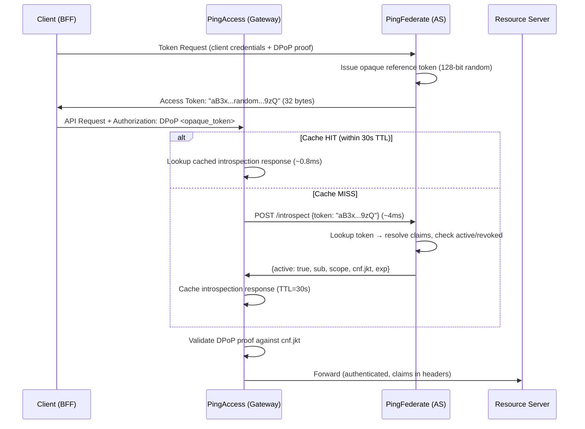
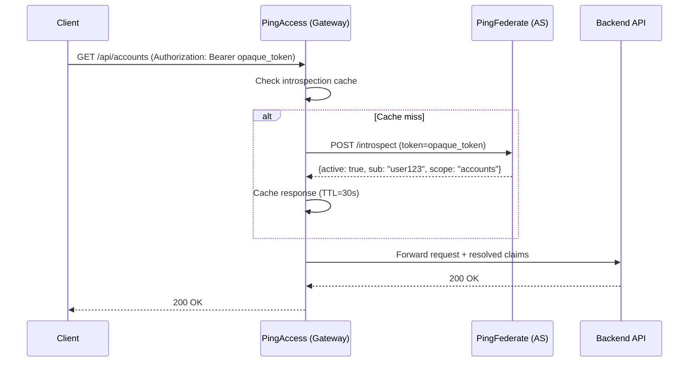
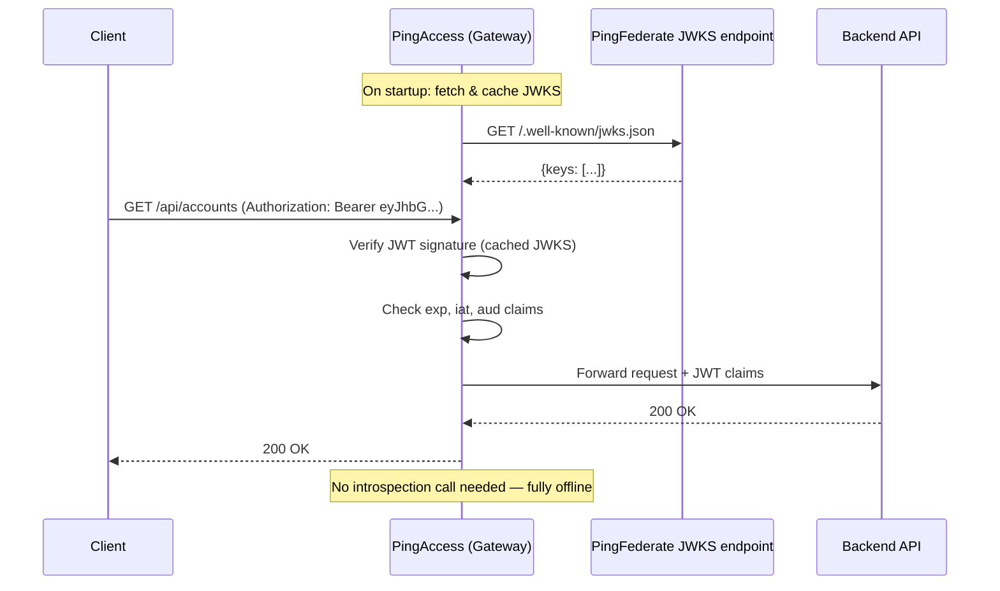
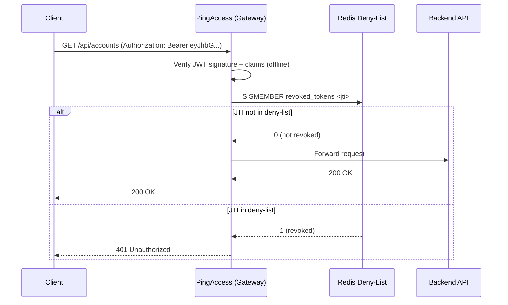

<!-- ⚠️ AUTO-GENERATED — DO NOT EDIT -->
<!-- Source of truth: ../ADR-0002-reference-tokens-over-jwt-for-gateway-introspection.yaml -->

> [!CAUTION]
> **This file is auto-generated** from [`ADR-0002-reference-tokens-over-jwt-for-gateway-introspection.yaml`](../ADR-0002-reference-tokens-over-jwt-for-gateway-introspection.yaml).
> Do not edit this file directly — all changes must be made in the YAML source.

# ADR-0002-reference-tokens-over-jwt-for-gateway-introspection: Use opaque reference tokens with introspection over self-contained JWTs for API gateway authorization

> **Status:** `accepted`  
> **Priority:** `high`  
> **Type:** `technology`  
> **Confidence:** `high`  
> **Decision Owner:** Marcus Chen (Head of Identity and Access Management)  
> **Decision Date:** 2026-01-30

*Issue opaque reference tokens instead of self-contained JWTs, enabling instant revocation via introspection while keeping PII out of access logs.*

---

**Authors:** Priya Sharma (API Platform Lead), Elena Vasquez (IAM Architect)  
**Reviewers:** Tomasz Kowalski (Network Security Architect), Jonas Eriksen (CISO)  
**Approvals:** Marcus Chen (Head of IAM) [@marcuschen] — approved 2026-01-30T11:00:00Z; Jonas Eriksen (CISO) [@jonaseriksen] — approved 2026-02-01T09:00:00Z

---

## Context

With OAuth 2.1 adopted, NovaTrust must decide the format of access tokens issued by PingFederate. Self-contained JWTs encode all claims (scopes, subject, cnf, expiry) directly in the token, allowing offline validation by resource servers. Opaque reference tokens are short random strings that resource servers resolve via the Token Introspection endpoint (RFC 7662). This is a classic tradeoff: JWTs give low-latency validation but cannot be instantly revoked, while reference tokens give instant revocation but require an introspection call per request. Our API gateway (PingAccess) sits in front of all 200+ APIs and is the primary enforcement point. The choice affects latency, revocation capability, token size in logs, and regulatory auditability.

We must choose the token format that best balances revocation speed, latency, auditability, and PII safety.

### Business Drivers

- PSD2 requires instant consent revocation — customer must be able to revoke bank access immediately
- GDPR right to erasure implies immediate token invalidation upon account deletion
- Fraud detection team needs ability to kill sessions within seconds, not minutes
- Compliance audit requires centralized proof of token validity at time of access

### Technical Drivers

- Self-contained JWTs cannot be revoked before expiry without a distributed deny-list
- JWT deny-lists require propagation to all resource servers — eventual consistency problem
- PingAccess already has a high-performance introspection client with caching support
- Token introspection response is a single audit record of active/inactive status
- JWTs in access logs leak PII (subject, email, scopes) — requires log scrubbing

### Constraints

- API gateway (PingAccess) is the single enforcement point — all traffic is proxied
- PingFederate introspection endpoint must handle 5000 QPS sustained
- Token validation latency budget: < 10ms at p99 (including introspection + cache)
- Must work with DPoP sender-constraining (ADR-0001)

### Assumptions

- PingAccess introspection cache with 30-second TTL provides acceptable revocation latency
- PingFederate introspection endpoint can sustain 5000 QPS with current cluster sizing
- Reference tokens do not leak claims in client-side storage or network logs

## Architecturally Significant Requirements

### Functional

| ID | Description |
|----|-------------|
| `F-001` | Access tokens must be revocable within 30 seconds of revocation request |
| `F-002` | API gateway must resolve token to full claim set via introspection before forwarding request |
| `F-003` | Introspection response must include DPoP confirmation (`cnf.jkt`) for sender validation |

### Non-Functional

| ID | Description |
|----|-------------|
| `NF-001` | Token introspection latency < 5ms at p99 with caching enabled |
| `NF-002` | PingFederate introspection endpoint availability 99.99% |
| `NF-003` | Token value must not contain PII when stored in access logs |

## Alternatives Considered

### 1. Opaque reference tokens with introspection ✅

PingFederate issues short opaque strings (128-bit random) as access tokens. These tokens carry no claims and contain no PII — they are simply lookup keys into PingFederate's token store. When a client presents an opaque token to a resource server (via PingAccess), PingAccess calls PingFederate's introspection endpoint (RFC 7662) to resolve the token into its associated claims (subject, scopes, expiry, client_id).

PingAccess caches introspection responses for a configurable TTL (default 30 seconds) to minimize latency. When a token is revoked at PingFederate, it is immediately marked as `active: false` — any subsequent introspection call returns inactive, and cached entries expire within the TTL window.

The opaque token is a reference (pointer) into the authorization server's state — hence "reference token." The authorization server is the single source of truth for token validity, enabling instant revocation with at most a 30-second cache lag.

**Pros:**
- Instant revocation — token marked inactive immediately at PingFederate
- No PII in the token itself — safe to log, store, and transmit
- Smaller token size (~32 bytes vs ~800 bytes for JWT) — less bandwidth and storage
- Centralized audit: introspection logs prove token was active at time of access
- Token format changes (new claims) do not require client or resource server updates

**Cons:**
- Every request requires an introspection call (mitigated by caching)
- Introspection endpoint is a runtime dependency — outage blocks all API access
- Cache TTL creates a revocation latency window (default 30 seconds)
- No offline validation — disconnected resource servers cannot validate tokens

*Estimated cost: `medium` · Risk: `medium`*

### 2. Self-contained JWTs with short lifetime

PingFederate issues signed JSON Web Tokens (JWTs) containing all claims inline — subject, scopes, expiry, client_id, and any custom claims. Resource servers validate the JWT locally by verifying the cryptographic signature against PingFederate's published JWKS (JSON Web Key Set) and checking the `exp` claim. No runtime call to the authorization server is needed.

The fundamental tradeoff is **revocation**: once a JWT is issued, it cannot be revoked before its expiry. Short token lifetimes (5 minutes) limit the revocation gap, but a 5-minute window of unrevocable access is unacceptable for PSD2 instant revocation requirements. Additionally, PII (subject identifier, email, scopes) is embedded in the JWT body, which appears in access logs, browser history, and any system that captures the `Authorization` header.

**Pros:**
- No runtime dependency on introspection endpoint — fully offline validation
- Zero additional latency per request — signature verification is ~0.5ms
- Resource servers can extract claims directly from the token
- Well-understood pattern with extensive library support

**Cons:**
- Cannot be revoked before expiry — 5-minute window of unrevocable access
- PII embedded in JWT (sub, email, scopes) appears in logs, browser history, and caches
- 5-minute revocation gap violates PSD2 instant revocation interpretation
- Large token size (~800 bytes) — multiplied by DPoP proof header, total overhead ~1.3KB per request
- Adding or changing claims requires updating all resource server validation logic
- GDPR: token deletion does not remove PII already logged in transit

*Estimated cost: `low` · Risk: `high`*

> **Rejection rationale:** 5-minute revocation gap violates PSD2 instant revocation interpretation. PII embedded in JWT appears in logs, violating GDPR data minimization. Adding or changing claims requires updating all resource server validation logic.

### 3. JWT with distributed deny-list (Redis)

A hybrid approach: PingFederate issues standard signed JWTs, but a centralized Redis cluster maintains a deny-list of revoked token JTIs (JWT IDs). When a token is revoked, its JTI is pushed to Redis with a TTL matching the token's remaining lifetime. Resource servers perform two validation steps: (1) verify the JWT signature and claims locally, then (2) check the Redis deny-list to confirm the JTI has not been revoked.

This approach adds revocation capability to JWTs, but introduces a distributed runtime dependency (Redis) — the same availability concern as introspection, but using a custom, non-standardized protocol instead of RFC 7662. The deny-list has eventual consistency in clustered deployments, and PII remains embedded in the JWT body.

**Pros:**
- Adds revocation capability to JWTs
- Resource servers still validate signature offline for non-revoked tokens

**Cons:**
- Redis deny-list is a distributed runtime dependency — same availability concern as introspection
- Deny-list propagation has eventual consistency — cache invalidation is hard
- PII still embedded in JWT — logging and GDPR concerns remain
- Custom implementation — no standardized protocol (unlike RFC 7662 introspection)
- Two validation steps per request: signature verification + deny-list lookup
- Deny-list grows unbounded unless TTL matches token expiry — memory pressure

*Estimated cost: `medium` · Risk: `high`*

> **Rejection rationale:** Redis deny-list has the same availability concern as introspection but is a custom, non-standard solution. PII remains embedded in JWTs. Deny-list propagation has eventual consistency — same revocation gap problem as plain JWTs.

## Decision

**Chosen alternative:** Opaque reference tokens with introspection

### Rationale

- PSD2 instant revocation: opaque tokens can be revoked in < 1 second at PingFederate; cache TTL provides 30-second worst-case
- No PII in the token: access logs can retain tokens without GDPR scrubbing obligations
- PingAccess introspection caching (30s TTL) measured at 0.8ms p99 cache-hit latency in load test — well within 10ms budget
- Centralized introspection provides auditable proof of token status at exact time of API access
- Simpler operational model: one revocation mechanism (mark inactive) vs. distributed deny-list synchronization
- Token format evolution (new claims, changed scopes) is transparent to resource servers — only introspection response changes

### Tradeoffs

- Runtime dependency on PingFederate introspection endpoint — mitigated by multi-node cluster and PingAccess cache
- 30-second cache TTL means a revoked token may be accepted for up to 30 seconds after revocation
- Introspection calls add ~0.8ms (cache hit) to ~4ms (cache miss) per request vs. ~0.5ms for local JWT validation
- Cannot work in fully disconnected environments — accepted because PingAccess is always network-connected

## Consequences

### Positive

- Instant token revocation for fraud response and customer consent withdrawal
- GDPR-safe token format — no PII leakage in logs, caches, or browser storage
- Auditable introspection trail for every API access decision
- Smaller wire format reduces bandwidth across 200+ APIs at 5000 QPS

### Negative

- PingFederate introspection endpoint becomes Tier-0 dependency
- 30-second revocation latency window due to PingAccess caching
- Slightly higher per-request latency (0.8ms cache-hit vs 0.5ms JWT verification)

## Confirmation

Code review of gateway introspection configuration. Validate token format in staging by inspecting Authorization header at API gateway.

## Dependencies

**Internal:**
- PingFederate 12.x (introspection endpoint)
- PingAccess 8.x (introspection client with caching)
- HSM infrastructure for token store encryption

**External:**
- None — introspection is an internal call between PingAccess and PingFederate

## References

- [OAuth 2.0 Token Introspection — RFC 7662](https://datatracker.ietf.org/doc/html/rfc7662)
- [OAuth 2.1 Authorization Framework — RFC 9700](https://datatracker.ietf.org/doc/html/rfc9700)
- [PingFederate Token Management Documentation](https://docs.pingidentity.com/pingfederate/latest/token-management.html)

## Lifecycle

- **Review cycle:** 12 months
- **Next review:** 2027-01-30

## Audit Trail

| Event | By | Date | Details |
|-------|----|------|---------|
| `created` | Priya Sharma | 2026-01-15 |  |
| `updated` | Elena Vasquez | 2026-01-22 | Added introspection cache latency benchmarks from staging load test |
| `approved` | Marcus Chen | 2026-01-30 |  |
| `approved` | Jonas Eriksen | 2026-02-01 | CISO condition: emergency cache purge API must be implemented before GA |
