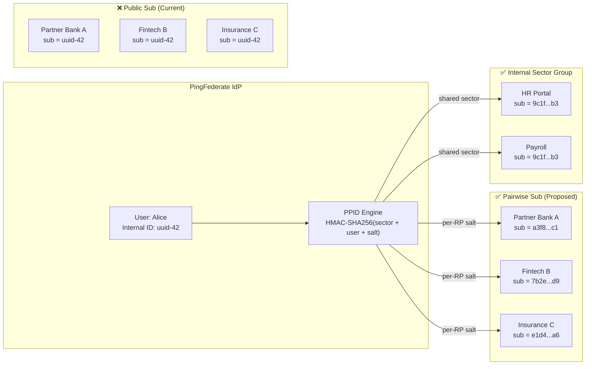
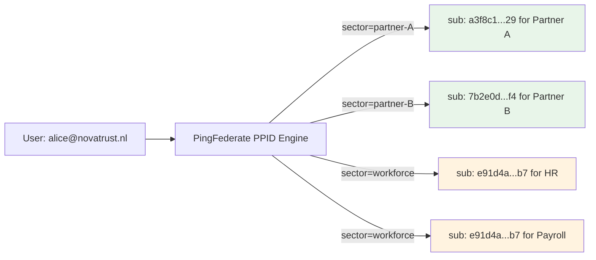
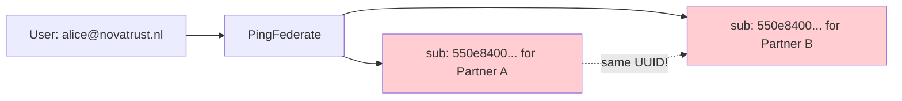
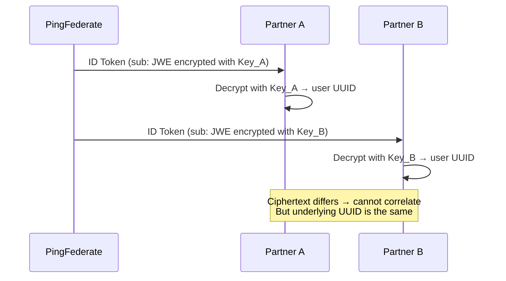

<!-- ⚠️ AUTO-GENERATED — DO NOT EDIT -->
<!-- Source of truth: ../fictional/ADR-0003-pairwise-subject-identifiers-for-oidc-relying-parties.yaml -->

> [!CAUTION]
> **This file is auto-generated** from [`ADR-0003-pairwise-subject-identifiers-for-oidc-relying-parties.yaml`](../fictional/ADR-0003-pairwise-subject-identifiers-for-oidc-relying-parties.yaml).
> Do not edit this file directly — all changes must be made in the YAML source.

# ADR-0003-pairwise-subject-identifiers-for-oidc-relying-parties: Use pairwise pseudonymous subject identifiers over public subject identifiers for OIDC relying parties

> **Status:** `accepted`  
> **Priority:** `high`  
> **Type:** `security`  
> **Level:** `tactical`  
> **Confidence:** `high`  
> **Decision Owner:** Marcus Chen (Head of Identity and Access Management)  
> **Decision Date:** 2025-12-10

> ***In the context of** the multi-tenant OIDC identity platform, **facing** GDPR cross-service tracking prevention requirements and the need to limit blast radius of subject identifier leakage, **we decided for** pairwise pseudonymous subject identifiers (PPID) per OIDC Core §8.1 **and neglected** public subject identifiers with contractual controls and encrypted JWE-wrapped subject claims, **to achieve** unlinkable per-relying-party identifiers that satisfy GDPR data minimization by design, **accepting** increased operational complexity in cross-RP correlation scenarios and the need for a sector identifier registry, **because** PPIDs provide cryptographic unlinkability that contractual controls cannot enforce and JWE-wrapped approaches only obscure rather than prevent correlation.*

---

**Authors:** Elena Vasquez (IAM Architect), Aisha Mbeki (Privacy Engineer)  
**Reviewers:** Jonas Eriksen (CISO), DPO (Data Protection Officer), Priya Sharma (API Platform Lead)  
**Approvals:** Marcus Chen (Head of IAM) [@marcuschen] — approved 2025-12-10T09:00:00Z; DPO (Data Protection Officer) [@dpo-novatrust] — approved 2025-12-14T11:00:00Z

---

## Context

NovaTrust's PingFederate IdP issues OIDC ID tokens with a `sub` claim to all relying parties (RPs). The OIDC Core specification (§8) defines two subject identifier types: `public` (same `sub` value for a user across all RPs) and `pairwise` (unique pseudonymous `sub` per RP). Currently, all RPs receive the same public `sub` — the user's internal UUID. This allows any two colluding RPs to correlate users across services. With 35+ internal RPs, 15 partner bank RPs, and upcoming EUDI Wallet relying party integrations, the GDPR data minimization principle and eIDAS 2.0 unlinkability requirements demand that we prevent cross-RP user correlation unless explicitly authorized.

We must choose the subject identifier strategy that balances privacy, regulatory compliance, and operational feasibility.

### Business Drivers

- GDPR Article 5(1)(c) data minimization — relying parties receive more identifying data than necessary
- eIDAS 2.0 / EUDI Wallet unlinkability requirement — wallet RPs must not correlate users across verifiers
- Dutch DPA (Autoriteit Persoonsgegevens) audit finding: cross-RP correlation risk rated 'high'
- Partner bank RPs have contractual data silo obligations — public sub violates data partitioning agreements

### Technical Drivers

- Public sub (internal UUID) leaks user identity to all RPs regardless of consent
- Cross-RP correlation is trivially possible when all RPs share the same sub value
- PingFederate supports pairwise sub natively via sector identifier and salt-based PPID generation
- OIDC Core §8 pairwise algorithm is deterministic — same user always gets same sub for same RP

### Constraints

- Internal workforce SSO RPs may need public sub for identity correlation (HR, payroll, helpdesk)
- PingFederate must support both public and pairwise simultaneously per RP registration
- Migration must not break existing RP user databases that key on the current public sub
- Pairwise sub must be deterministic — user gets same sub for same RP across sessions

### Assumptions

- PingFederate's PPID implementation uses HMAC-SHA256(sector_id + user_id + salt) — collision-resistant
- RPs can re-key their user databases from public sub to pairwise sub with a one-time migration
- Internal workforce RPs can be grouped in a shared sector identifier to maintain correlation within the sector

## Architecturally Significant Requirements

### Functional

| ID | Description |
|----|-------------|
| `F‑001` | All external and partner RPs must receive pairwise pseudonymous sub values |
| `F‑002` | Internal workforce RPs grouped by sector identifier may receive shared sub within their sector |
| `F‑003` | The same user must receive the same pairwise sub for the same RP across all sessions (deterministic) |

### Non-Functional

| ID | Description |
|----|-------------|
| `NF‑001` | PPID generation must add < 1ms to token issuance latency |
| `NF‑002` | Pairwise sub must be a 128-bit hex string (32 characters) — no PII derivable from the value |
| `NF‑003` | PPID salt must be stored in HSM and never exposed to application layer |

## Alternatives Considered

### 1. Pairwise pseudonymous subject identifiers (PPID) ✅

PingFederate generates a unique `sub` claim per relying party (RP) using a keyed hash: `HMAC-SHA256(sector_id + user_id, salt)`. The salt is a 256-bit secret stored in the HSM, never exposed to the application layer. Each external or partner RP receives a distinct, unlinkable pseudonymous identifier — knowing one user's `sub` at RP-A reveals nothing about their `sub` at RP-B.

Internal workforce RPs (HR, payroll, helpdesk) share a common **sector identifier**, which means they derive the same `sub` for a given user. This controlled correlation enables legitimate cross-application user lookup within the workforce sector, while preventing external partners from correlating users.

The PPID is **deterministic** — the same user always receives the same `sub` for the same RP, ensuring session-to-session stability. The function is one-way: given a PPID, the user cannot be reverse-engineered without the HSM-stored salt. This satisfies both GDPR data minimization (pseudonymous, non-PII identifier) and eIDAS 2.0 unlinkability requirements for EUDI Wallet credential presentations.

**Pros:**
- Prevents cross-RP user correlation — two partner RPs cannot link the same user
- GDPR data minimization: sub value is pseudonymous — no PII derivable
- eIDAS 2.0 unlinkability: satisfies wallet RP requirements for credential presentation
- Deterministic: same user always gets same sub for same RP — no session-to-session drift
- Sector grouping allows controlled correlation for legitimate business needs (workforce apps)
- PingFederate native support — no custom code required

**Cons:**
- Migration effort: existing RPs must re-key user databases from public sub to pairwise sub
- Account linking across RPs becomes impossible without explicit user consent and IdP mediation
- Debugging and support: 'which user is sub abc123?' requires IdP lookup — not human-readable
- PPID salt is a critical secret — compromise allows pre-computation of all pairwise values
- Sector identifier assignment requires governance — incorrect grouping defeats purpose

*Estimated cost: `medium` · Risk: `low`*

### 2. Public subject identifiers with contractual controls

Continue using the user's internal UUID (e.g., `550e8400-e29b-41d4-a716-446655440000`) as the `sub` claim in all ID tokens and UserInfo responses, regardless of the relying party. Cross-RP correlation restrictions are enforced through **contractual agreements** (partner data processing agreements) and **API usage auditing** (post-hoc detection of correlation behavior).

The fundamental weakness is that **contracts are not technically enforced**. Partner A and Partner B both receive the same UUID, making cross-RP user correlation trivially possible by comparing `sub` values. Even if contracts prohibit correlation, detection is after-the-fact via API audit logs — a colluding partner can correlate silently without generating detectable API patterns. The Dutch DPA explicitly flagged this architecture as high-risk in their 2025 audit, and eIDAS 2.0 unlinkability requirements cannot be met with public identifiers.

**Pros:**
- No migration effort — RPs continue using existing sub values
- Simple debugging — sub is the user's UUID, directly queryable
- Account linking across RPs is straightforward

**Cons:**
- Cross-RP correlation is trivially possible despite contractual prohibitions
- Contracts are not enforced technically — a colluding partner can correlate silently
- GDPR data minimization violation: providing full UUID when a pseudonym suffices
- Dutch DPA explicitly flagged this as high-risk in their 2025 audit
- eIDAS 2.0 unlinkability requirement cannot be met with public identifiers
- API auditing detects correlation after the fact, not preventing it

*Estimated cost: `low` · Risk: `high`*

> **Rejection rationale:** Cross-RP correlation is trivially possible despite contractual controls. Dutch DPA explicitly flagged this as high-risk. eIDAS 2.0 unlinkability cannot be met with public identifiers. Contracts are not technically enforceable.

### 3. Encrypted subject identifiers (JWE-wrapped sub)

Issue the `sub` claim as a JWE-encrypted blob, where each RP receives a `sub` encrypted with an RP-specific encryption key. Only the target RP can decrypt its own `sub` value. Different encryption keys per RP prevent cross-RP correlation because each RP sees only ciphertext for other RPs' `sub` values.

This approach is **non-standard** — OIDC Core does not define an encrypted `sub` format, which breaks specification compliance. The JWE overhead inflates the `sub` value from 32 bytes (PPID) to approximately 200 bytes. Each RP must manage a decryption key, and key rotation requires coordinated rollover across all RPs simultaneously. PingFederate does not support this natively, requiring custom plugin development.

**Pros:**
- Prevents cross-RP correlation via encryption rather than pseudonymization
- RP-specific decryption keys provide cryptographic isolation

**Cons:**
- Non-standard: OIDC Core does not define encrypted sub — breaks spec compliance
- RP must manage decryption keys and decrypt sub on every token receipt
- Significantly larger sub values (JWE overhead: ~200 bytes vs 32-byte PPID)
- Key rotation for JWE-encrypted subs requires coordinated rollover with every RP
- PingFederate does not support this natively — requires custom plugin development
- Debugging is harder than PPID — sub is opaque even to the IdP without RP key

*Estimated cost: `high` · Risk: `high`*

> **Rejection rationale:** Non-standard — OIDC Core does not define encrypted sub, breaking spec compliance. JWE overhead makes sub ~200 bytes vs 32-byte PPID. PingFederate does not support this natively, requiring custom plugin development and per-RP key management.

## Decision

**Chosen alternative:** Pairwise pseudonymous subject identifiers (PPID)

### Rationale

- Standards-compliant: OIDC Core §8 defines pairwise as a first-class subject identifier type
- Dutch DPA audit finding directly addressed — cross-RP correlation eliminated by design
- eIDAS 2.0 unlinkability requirement met for upcoming EUDI Wallet RP integrations
- PingFederate native support eliminates custom development — configuration-only change
- Sector grouping provides pragmatic exception for internal workforce RPs that legitimately need correlation
- HMAC-SHA256 PPID generation is deterministic and collision-resistant — no session-to-session drift

### Tradeoffs

- One-time migration: 35+ internal RPs and 15 partner RPs must re-key user databases
- Support team loses ability to look up user by sub without IdP reverse-lookup tool
- Cross-RP account linking requires explicit consent flow — cannot be done silently
- PPID salt in HSM adds dependency on HSM availability for token issuance

## Consequences

### Positive

- Cross-RP user correlation eliminated for all external and partner RPs
- GDPR data minimization: sub values are pseudonymous with no derivable PII
- eIDAS 2.0 readiness: pairwise sub satisfies unlinkability for wallet credential presentation
- Dutch DPA audit finding resolved — risk downgraded from 'high' to 'low'

### Negative

- 3-month migration project for RP user database re-keying
- Support team requires new tooling for user-to-sub reverse lookup
- PPID salt in HSM creates an additional HSM dependency for token issuance

## Confirmation

Verify pairwise subject identifiers in token responses across relying parties. Confirm no cross-RP correlation is possible via automated test suite.

## Dependencies

**Internal:**
- PingFederate 12.x (pairwise sub support)
- HSM infrastructure (PPID salt storage)
- IAM Architecture Board (sector identifier governance)

**External:**
- Partner bank RPs (must accept new sub values during migration)

## References

- [OpenID Connect Core 1.0 — §8 Subject Identifier Types](https://openid.net/specs/openid-connect-core-1_0.html#SubjectIDTypes)
- [GDPR Article 5(1)(c) — Data Minimization](https://gdpr-info.eu/art-5-gdpr/)
- [eIDAS 2.0 Regulation — Unlinkability Requirements](https://eur-lex.europa.eu/eli/reg/2024/1183/oj)

## Lifecycle

- **Review cycle:** 24 months
- **Next review:** 2027-12-10

## Audit Trail

| Event | By | Date | Details |
|-------|----|------|---------|
| `created` | Elena Vasquez | 2025-11-01 |  |
| `updated` | Aisha Mbeki | 2025-11-20 | Added Dutch DPA audit finding reference and eIDAS 2.0 unlinkability analysis |
| `approved` | Marcus Chen | 2025-12-10 |  |
| `approved` | DPO | 2025-12-14 | DPO approval with condition: PPID salt must be in HSM, and reverse-lookup must be audit-logged |
