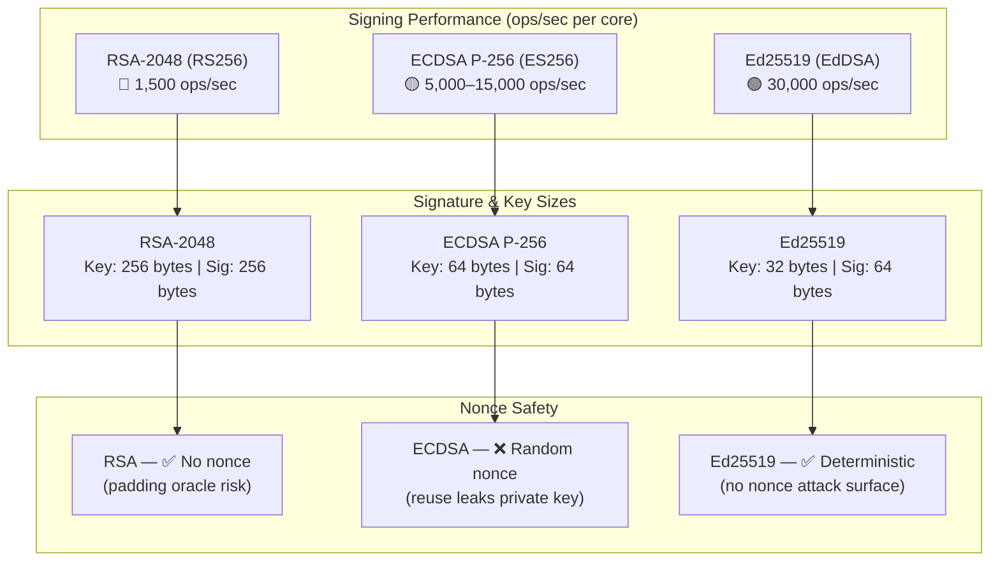
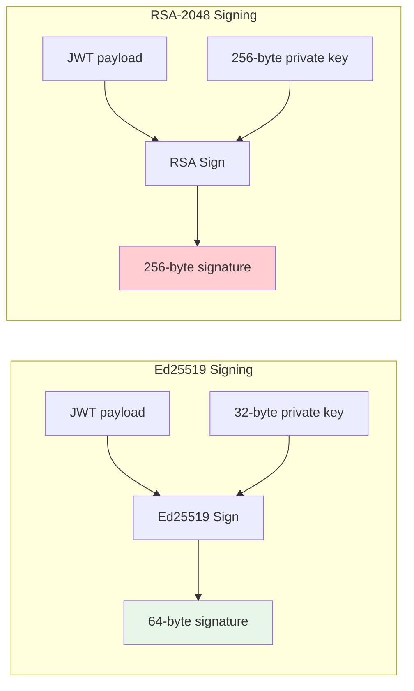
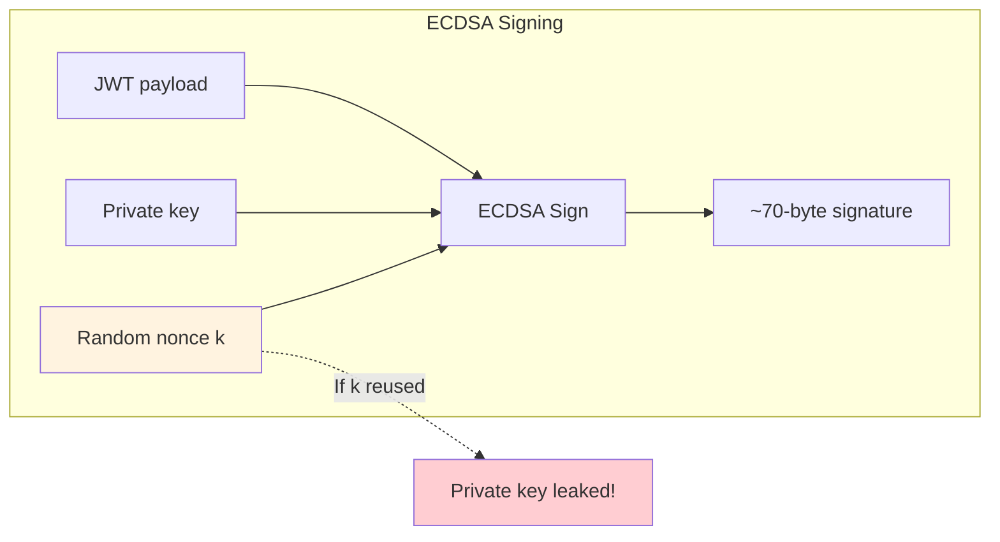
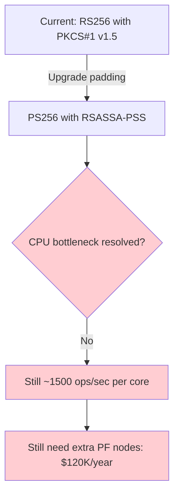

<!-- ⚠️ AUTO-GENERATED — DO NOT EDIT -->
<!-- Source of truth: ../ADR-0004-ed25519-over-rsa-for-jwt-signing.yaml -->

> [!CAUTION]
> **This file is auto-generated** from [`ADR-0004-ed25519-over-rsa-for-jwt-signing.yaml`](../ADR-0004-ed25519-over-rsa-for-jwt-signing.yaml).
> Do not edit this file directly — all changes must be made in the YAML source.

# ADR-0004-ed25519-over-rsa-for-jwt-signing: Use Ed25519 (EdDSA) over RSA-2048 for JWT and assertion signing keys

> **Status:** `accepted`  
> **Priority:** `high`  
> **Type:** `technology`  
> **Confidence:** `medium`  
> **Decision Owner:** Jonas Eriksen (CISO)  
> **Decision Date:** 2025-12-18

*Migrate from RSA-2048 (RS256) to Ed25519 (EdDSA) for all JWT/JWS signing to achieve 20x throughput improvement, eliminating the PingFederate CPU bottleneck.*

---

**Authors:** Tomasz Kowalski (Network Security Architect), Elena Vasquez (IAM Architect)  
**Reviewers:** Marcus Chen (Head of IAM), Kai Lindström (Mobile Platform Lead)  
**Approvals:** Jonas Eriksen (CISO) [@jonaseriksen] — approved 2025-12-18T14:00:00Z; Marcus Chen (Head of IAM) [@marcuschen] — approved 2025-12-19T10:00:00Z

---

## Context

NovaTrust's PingFederate IdP and all JWT-producing services currently use RS256 (RSA-2048 with PKCS#1 v1.5 padding) for signing ID tokens, access tokens (when issued as JWTs), SAML assertions, and DPoP proofs. With 5000+ token issuances per second at peak, RSA-2048 signing is the primary CPU bottleneck on the PingFederate cluster. EdDSA with Ed25519 (RFC 8037, JWS algorithm "EdDSA") offers vastly superior signing performance, smaller key sizes, and resistance to implementation pitfalls (no padding oracle attacks, no nonce reuse vulnerabilities as in ECDSA). However, Ed25519 is newer and has less universal library support than RSA. We must choose the signing algorithm for all new JWT/JWS production.

At 78% CPU during peak, PingFederate will exceed capacity within 6 months unless we address the signing bottleneck.

### Business Drivers

- PingFederate cluster CPU at 78% during peak — projected to exceed capacity in 6 months
- Avoiding $120K/year in additional PingFederate cluster nodes by reducing signing CPU
- Mobile app token validation latency impacts UX — faster verification is a competitive advantage

### Technical Drivers

- RSA-2048 signing: ~1500 ops/sec per core; Ed25519 signing: ~30,000 ops/sec per core (20x faster)
- RSA-2048 verification: ~40,000 ops/sec per core; Ed25519 verification: ~15,000 ops/sec per core
- Ed25519 key: 32 bytes; RSA-2048 key: 256 bytes — JWK set transmission is 8x smaller
- Ed25519 is deterministic (no random nonce) — eliminates ECDSA-style nonce reuse attacks
- JWS compact serialization with Ed25519 signature: 64 bytes vs RSA-2048: 256 bytes
- PingFederate 12.x added EdDSA support in Q3 2025

### Constraints

- Cloud HSM must support Ed25519 key generation and signing (PKCS#11 with CKM_EDDSA)
- All resource servers and relying parties must support Ed25519 verification
- SAML assertion signing must use a supported XML signature algorithm
- Must maintain RSA-2048 for legacy partner integrations that cannot upgrade

### Assumptions

- Cloud HSM supports Ed25519 via CKM_EDDSA mechanism (verified in vendor documentation)
- All modern JWT libraries (jose4j, nimbus-jose, PyJWT, jsonwebtoken) support EdDSA verification
- SAML XML Signature for Ed25519 is supported via http://www.w3.org/2021/04/xmldsig-more#eddsa-ed25519
- Legacy partners (3 of 15) will migrate to Ed25519 within 18 months

## Architecturally Significant Requirements

### Functional

| ID | Description |
|----|-------------|
| `F-001` | All new JWT/JWS tokens signed with EdDSA (Ed25519) algorithm |
| `F-002` | JWKS endpoint publishes both Ed25519 and RSA-2048 keys during transition period |
| `F-003` | Legacy partners continue receiving RS256-signed tokens until they support EdDSA |

### Non-Functional

| ID | Description |
|----|-------------|
| `NF-001` | Token signing throughput must increase by at least 10x per core |
| `NF-002` | Token signing latency p99 < 1ms (including HSM round-trip) |
| `NF-003` | JWS compact serialization total size reduced by at least 30% compared to RS256 |

## Alternatives Considered

### 1. EdDSA with Ed25519 (RFC 8037) ✅

Use the EdDSA (Edwards-curve Digital Signature Algorithm) with the Ed25519 curve (RFC 8037, JWS algorithm `EdDSA`) for all JWT and JWS signing operations. Ed25519 provides 128-bit security with 32-byte private keys, 32-byte public keys, and 64-byte signatures — dramatically smaller than RSA at equivalent security levels.

Signing is **deterministic**: the signature is a pure function of the message and the private key, with no random nonce involved. This eliminates an entire class of vulnerabilities where nonce reuse leaks the private key (as happened with Sony PS3's ECDSA implementation and early Bitcoin wallets).

At the infrastructure level, Ed25519 signing runs at approximately **30,000 operations/second per core** compared to RSA-2048's ~1,500 operations/second — a 20x throughput improvement. For PingFederate issuing 5,000 tokens/second across 200+ APIs, this eliminates the CPU bottleneck without adding additional cluster nodes ($120K/year savings).

**Pros:**
- 20x faster signing than RSA-2048 — directly addresses PingFederate CPU bottleneck
- Deterministic signatures — no nonce reuse vulnerability (unlike ECDSA with P-256)
- 64-byte signatures vs 256-byte RSA — 75% reduction in JWS signature size
- 32-byte keys vs 256-byte RSA public keys — smaller JWKS responses
- No padding oracle attacks — Ed25519 has no padding scheme
- 128-bit security level — equivalent to RSA-3072 or ECDSA P-256
- Growing industry adoption: Signal, SSH, TLS 1.3, FIDO2 all use Ed25519

**Cons:**
- Not universally supported: 3 legacy partner integrations require RS256
- Cloud HSM EdDSA support is newer — less operational track record
- Verification is 2.5x slower than RSA-2048 verification (matters for resource servers)
- SAML XML Signature Ed25519 support requires relying parties to upgrade XML libraries
- Ed25519 is Curve25519-based — not NIST-approved (may matter for US government partners)

*Estimated cost: `medium` · Risk: `low`*

### 2. ECDSA with P-256 (ES256)

Use ECDSA (Elliptic Curve Digital Signature Algorithm) with the NIST P-256 curve (JWS algorithm `ES256`). ECDSA P-256 provides the same 128-bit security level as Ed25519 but uses the NIST-standardized curve, which has broader library and HSM support.

The critical difference from Ed25519 is that ECDSA is **non-deterministic by default**: each signature requires a fresh random nonce `k`. If `k` is ever reused or predictable, the private key can be algebraically derived from two signatures — a catastrophic key compromise.

RFC 6979 defines a deterministic ECDSA variant that derives `k` from the message and private key, eliminating the nonce reuse risk. However, not all HSM implementations use RFC 6979 by default — each HSM vendor must be individually verified. ECDSA P-256 signing is 5-10x faster than RSA-2048 but still approximately 3x slower than Ed25519.

**Pros:**
- Widely supported — NIST P-256 is the most common elliptic curve
- Smaller signatures than RSA (64 bytes DER-encoded, typically 70-72 bytes)
- 5-10x faster signing than RSA-2048
- NIST-approved curve — satisfies US government compliance requirements

**Cons:**
- Non-deterministic: requires a secure random nonce per signature — nonce reuse leaks the private key
- Sony PS3 and Bitcoin ECDSA nonce-reuse incidents demonstrate real-world risk
- Requires RFC 6979 deterministic ECDSA for safety — not all libraries implement it by default
- Signing is 3x slower than Ed25519
- P-256 curve has concerns about NIST backdoor potential (Dual_EC_DRBG precedent)
- HSM implementations may not use RFC 6979 — must verify per HSM vendor

*Estimated cost: `medium` · Risk: `medium`*

> **Rejection rationale:** Non-deterministic signatures require secure random nonce per signature — nonce reuse leaks the private key (real-world incidents with Sony PS3 and Bitcoin). 3x slower signing than Ed25519. P-256 backdoor concerns from NIST Dual_EC_DRBG precedent.

### 3. RSA-2048 with PS256 (RSASSA-PSS)

Upgrade the RSA padding scheme from PKCS#1 v1.5 (`RS256`) to RSASSA-PSS (`PS256`) while keeping the existing RSA-2048 key infrastructure. This addresses the known padding oracle vulnerabilities in PKCS#1 v1.5 without changing key types, key sizes, or cryptographic libraries.

While RSASSA-PSS eliminates the padding oracle attack class, it does **not address the CPU bottleneck** — RSA-2048 signing throughput remains at approximately 1,500 operations/second per core regardless of padding scheme. The 256-byte signature size also remains unchanged, providing no wire efficiency improvement. Additionally, NIST recommends migrating away from RSA-2048 to RSA-3072 after 2030, meaning this upgrade would be a temporary measure requiring another migration within 4 years.

**Pros:**
- No key type change — all libraries already support RSA
- PSS padding eliminates PKCS#1 v1.5 padding oracle attacks
- Universal partner compatibility

**Cons:**
- Does not address the CPU bottleneck — signing throughput remains ~1500 ops/sec per core
- PingFederate cluster still needs $120K/year in additional capacity
- 256-byte signatures — no size reduction
- RSA-2048 approaching end of recommended lifetime (NIST recommends RSA-3072 after 2030)

*Estimated cost: `low` · Risk: `low`*

> **Rejection rationale:** Does not address the CPU bottleneck — signing throughput remains ~1500 ops/sec. PingFederate cluster would still require $120K/year in additional nodes. RSA-2048 approaching NIST end-of-life recommendation (RSA-3072 after 2030).

## Decision

**Chosen alternative:** EdDSA with Ed25519 (RFC 8037)

### Rationale

- 20x signing throughput improvement directly solves PingFederate CPU bottleneck — avoids $120K/year in additional nodes
- Deterministic signatures eliminate the nonce-reuse risk class entirely — superior to ECDSA P-256
- 75% signature size reduction improves wire efficiency across 200+ APIs at 5000 QPS
- 128-bit security equivalent to ECDSA P-256 without the nonce-related attack surface
- Industry momentum: Ed25519 is the default in SSH, Signal, TLS 1.3, and FIDO2
- Legacy partner compatibility maintained via dual-key JWKS (Ed25519 primary, RSA-2048 fallback)

### Tradeoffs

- Verification is 2.5x slower than RSA-2048 — accepted because resource servers are not CPU-bound on verification
- 3 legacy partners require RS256 fallback — dual-key JWKS maintained for 18-month transition
- Not NIST-approved — accepted because NovaTrust has no US government compliance requirement
- Cloud HSM Ed25519 support is newer — mitigated by vendor SLA and pre-production validation

## Consequences

### Positive

- PingFederate signing capacity increased 20x — cluster can handle 100K tokens/sec on current hardware
- Estimated $120K/year savings by avoiding additional PingFederate nodes
- JWS token size reduced by ~192 bytes per token (signature + key reference)
- Nonce-reuse vulnerability class eliminated by design

### Negative

- Dual-key JWKS management during 18-month RSA transition
- Resource server verification ~0.5ms slower per token (15K vs 40K ops/sec)
- SAML XML libraries at partner sites may need updating for Ed25519 support

## Confirmation

Ed25519 signing validated in pre-production: 72-hour sustained load test at 50K ops/sec on Cloud HSM. All 12 internal resource servers verified EdDSA token consumption. Three legacy partners confirmed RS256 fallback path. PingFederate per-RP algorithm override tested.

**Artifacts:**
- `BENCH-ed25519-hsm-72h-load-test`
- `TEST-SUITE-jwt-signing-ed25519-all-rps`
- [https://github.com/novatrust/iam-platform/pull/198](https://github.com/novatrust/iam-platform/pull/198)

## Dependencies

**Internal:**
- Cloud HSM with CKM_EDDSA support
- PingFederate 12.x (EdDSA signing support)
- All resource servers (JWT verification library updates)

**External:**
- Cloud HSM provider (EdDSA firmware support)
- Partner relying parties (EdDSA verification capability)

## References

- [CFRG Edwards-Curve Digital Signature Algorithm (EdDSA) — RFC 8032](https://datatracker.ietf.org/doc/html/rfc8032)
- [CFRG Elliptic Curves for JOSE — RFC 8037](https://datatracker.ietf.org/doc/html/rfc8037)
- [JSON Web Algorithms (JWA) — RFC 7518](https://datatracker.ietf.org/doc/html/rfc7518)
- [Ed25519 Performance Benchmarks — libsodium](https://doc.libsodium.org/public-key_cryptography/public-key_signatures)

## Lifecycle

- **Review cycle:** 12 months
- **Next review:** 2026-12-18

## Audit Trail

| Event | By | Date | Details |
|-------|----|------|---------|
| `created` | Tomasz Kowalski | 2025-11-20 |  |
| `updated` | Elena Vasquez | 2025-12-05 | Added ECDSA P-256 nonce-reuse risk analysis and HSM CKM_EDDSA verification |
| `approved` | Jonas Eriksen | 2025-12-18 | CISO approval with condition: algorithm downgrade protection must be enforced at all resource servers |
| `approved` | Marcus Chen | 2025-12-19 |  |
