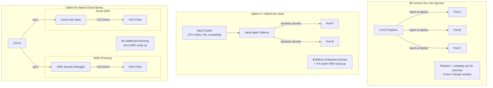
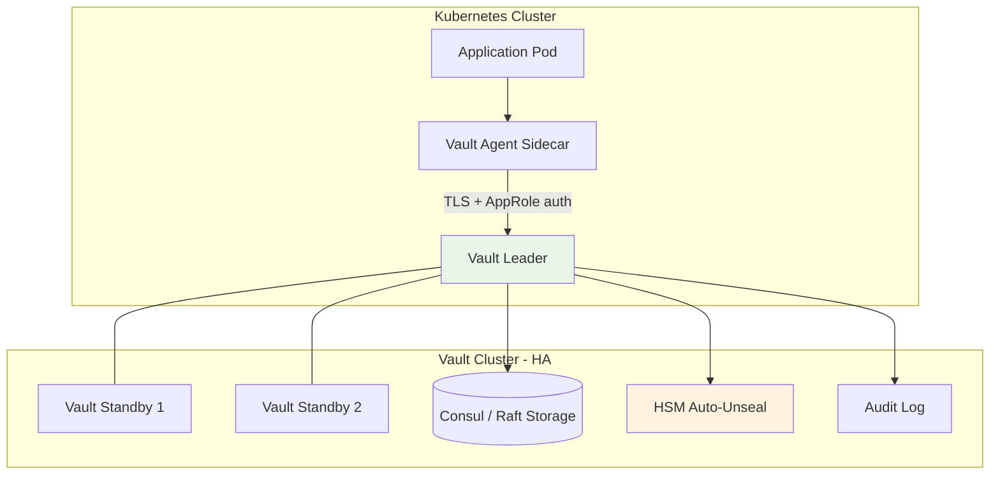
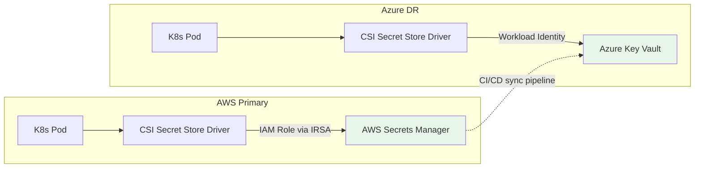
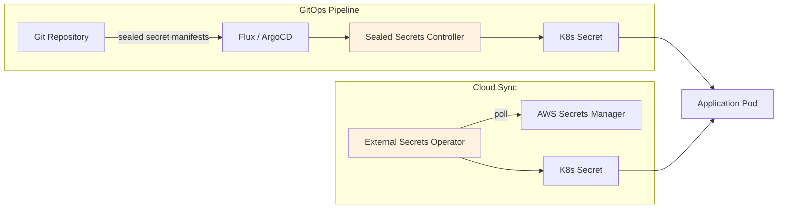

<!-- ⚠️ AUTO-GENERATED — DO NOT EDIT -->
<!-- Source of truth: ../fictional/ADR-0007-centralized-secret-store-for-api-keys.yaml -->

> [!CAUTION]
> **This file is auto-generated** from [`ADR-0007-centralized-secret-store-for-api-keys.yaml`](../fictional/ADR-0007-centralized-secret-store-for-api-keys.yaml).
> Do not edit this file directly — all changes must be made in the YAML source.

# ADR-0007-centralized-secret-store-for-api-keys: Reject centralized HashiCorp Vault for API runtime secrets in favor of native cloud provider secret stores

> **Status:** `rejected`  
> **Priority:** `high`  
> **Type:** `technology`  
> **Level:** `tactical`  
> **Confidence:** `high`  
> **Decision Owner:** Marcus Chen (Head of IAM)  
> **Decision Date:** 2026-03-05

> ***In the context of** API runtime secret management across multi-cloud (AWS + Azure) Kubernetes workloads, **facing** the need for consistent secret rotation and access auditing without introducing a single point of failure, **we decided for** native cloud provider secret stores (AWS Secrets Manager + Azure Key Vault) with External Secrets Operator synchronization **and neglected** HashiCorp Vault as a centralized secrets engine and Sealed Secrets with External Secrets Operator, **to achieve** native IAM-based access control, managed automatic rotation, and elimination of a self-hosted Vault cluster as a critical dependency, **accepting** the need to maintain two provider-specific configurations and reduced portability across cloud providers, **because** native stores provide equivalent security guarantees with lower operational burden and better integration with each cloud platform's IAM and audit infrastructure.*

---

**Authors:** Priya Sharma (API Platform Lead)  
**Reviewers:** Jonas Eriksen (CISO), Tomasz Kowalski (Network Security Architect), Elena Vasquez (IAM Architect)

---

## Context

NovaTrust's 50+ microservices currently retrieve runtime secrets (database credentials, third-party API keys, JWT signing keys) from environment variables injected at deployment time. This approach has scaling and rotation pain points: rotating a database password requires redeploying all dependent services. Two approaches were considered — centralizing on HashiCorp Vault as a universal secrets engine, or adopting native cloud provider secret stores (AWS Secrets Manager, Azure Key Vault) with CSI driver integration for Kubernetes.

The decision comes down to whether the operational overhead of a self-managed Vault cluster is justified when native cloud services provide the core capabilities we need.

### Business Drivers

- Credential rotation currently requires coordinated redeployment of 15+ services — 4-hour change window
- Audit compliance requires proving secrets are encrypted at rest and access-logged
- Multi-cloud strategy (AWS primary, Azure DR) requires secrets accessible from both environments

### Technical Drivers

- Environment variable injection does not support automatic rotation
- No centralized audit trail for secret access (who accessed which secret, when)
- HSM-backed signing keys (ADR-0004) need a secure key store with PKCS#11 or KMIP interface
- Kubernetes CSI Secret Store Driver can mount secrets as volumes without application changes

### Constraints

- Must support AWS and Azure simultaneously (multi-cloud DR requirement)
- Maximum 5ms latency for secret retrieval at application startup
- Must integrate with existing Kubernetes RBAC for access control
- Team of 3 SREs must be able to operate the solution without dedicated Vault expertise

### Assumptions

- Both AWS Secrets Manager and Azure Key Vault support automatic rotation for database credentials
- Kubernetes CSI Secret Store Driver is production-ready for both cloud providers
- Secret access logging satisfies SOC 2 Type II audit requirements

## Architecturally Significant Requirements

### Functional

| ID | Description |
|----|-------------|
| `F-001` | All API runtime secrets retrievable without application code changes (volume mount or sidecar) |
| `F-002` | Database credential rotation without service redeployment |
| `F-003` | Centralized audit log of all secret access events with caller identity |

### Non-Functional

| ID | Description |
|----|-------------|
| `NF-001` | Secret retrieval latency < 5ms at application startup |
| `NF-002` | 99.99% availability of secret store (must not be a single point of failure) |

## Alternatives Considered

### 1. HashiCorp Vault (centralized secrets engine)

Deploy a self-managed HashiCorp Vault cluster (3-5 nodes, HA mode) as the universal secrets engine for all environments. All services retrieve secrets via Vault Agent sidecar (injected into each pod) or the CSI Secret Store Driver (mounting secrets as volume files). Vault manages the full secret lifecycle: encryption at rest, automatic rotation, dynamic credential generation, and centralized audit logging.

Vault's strongest differentiator is **dynamic secrets**: rather than storing long-lived database passwords, Vault generates short-lived credentials on demand (e.g., a PostgreSQL user with a 1-hour TTL). However, our use case involves long-lived API keys with periodic rotation, which does not require dynamic credential generation — Vault's primary value proposition is not a fit. The $150K/year Enterprise license (required for HSM auto-unseal and multi-tenant namespaces) and the 4-6 week SRE ramp-up represent significant cost without proportional benefit.

**Pros:**
- Single unified secrets API across all cloud providers and on-premises
- Dynamic secrets — generates short-lived database credentials on demand
- Rich policy engine (Vault policies + Sentinel) for fine-grained access control
- Transit secrets engine provides encryption-as-a-service without exposing keys
- Large ecosystem and community support

**Cons:**
- Significant operational burden — requires dedicated Vault cluster management (3-5 node HA, unsealing, upgrades)
- Team lacks Vault expertise — estimated 4-6 weeks ramp-up for 3 SREs
- Vault becomes a critical infrastructure dependency — outage blocks all service startups
- Cost: $150K/year for Vault Enterprise (required for HSM auto-unseal and namespaces) + infrastructure
- Complex disaster recovery — Vault replication across cloud providers requires careful design
- Seal/unseal ceremony adds operational risk — automated unseal requires HSM or cloud KMS integration

*Estimated cost: `high` · Risk: `high`*

> **Rejection rationale:** Operational burden exceeds team capacity. 3-person SRE team cannot absorb Vault cluster management (HA, unsealing, upgrades, DR replication) alongside existing responsibilities. $150K/year Enterprise license cost is not justified when native cloud secret stores provide equivalent functionality for secrets retrieval and rotation. Dynamic secrets — Vault's strongest differentiator — are not required for our use case (long-lived service accounts with periodic rotation are sufficient).

### 2. Native cloud provider secret stores (AWS Secrets Manager + Azure Key Vault) ✅

Use each cloud provider's native managed secret store — **AWS Secrets Manager** in the primary region and **Azure Key Vault** in the disaster recovery region. Kubernetes workloads access secrets via the **CSI Secret Store Driver**, which mounts secrets as filesystem volumes in the pod without modifying application code.

Native IAM integration is a key advantage: Kubernetes service accounts are mapped directly to cloud IAM roles (AWS IRSA or Azure Workload Identity), eliminating the need for a separate identity layer. Both providers offer built-in automatic rotation for database credentials (AWS RDS/Aurora, Azure SQL Database). Cross-cloud secret synchronization is handled by an encrypted CI/CD pipeline that mirrors secrets between AWS Secrets Manager and Azure Key Vault on each deployment.

Per-secret access audit logging is provided by AWS CloudTrail and Azure Monitor at no additional cost, satisfying the SOX compliance requirement for access attribution.

**Pros:**
- Zero operational overhead — fully managed services with provider SLAs
- Native IAM integration — Kubernetes service accounts map directly to cloud IAM roles
- Built-in automatic rotation for RDS/Aurora credentials (AWS) and SQL Database (Azure)
- Per-secret audit logging via CloudTrail (AWS) and Azure Monitor
- No additional licensing cost — included in cloud contract
- SRE team already has AWS/Azure expertise — no ramp-up needed

**Cons:**
- Two separate APIs and configurations for multi-cloud
- Cross-cloud secret sync requires custom CI/CD pipeline
- No dynamic secrets — rotation is periodic, not on-demand
- Policy engine is less granular than Vault policies
- Vendor lock-in per cloud provider for secret store API

*Estimated cost: `low` · Risk: `low`*

### 3. Sealed Secrets + External Secrets Operator (GitOps-native)

A GitOps-native approach using two complementary tools: **Bitnami Sealed Secrets** for encrypting secrets in Git (so they can be committed alongside application manifests), and **External Secrets Operator (ESO)** for syncing secrets from cloud provider stores into Kubernetes `Secret` objects at runtime.

The two layers of abstraction create debugging complexity: when a secret fails to appear in a pod, the operator must determine whether the issue is in the Sealed Secrets decryption, the External Secrets Operator sync, or the CSI driver mount. The Sealed Secrets controller is also a **single point of failure** per cluster — if it goes down, new sealed secrets cannot be decrypted. Native cloud provider secret stores provide the same Kubernetes integration via CSI driver with fewer moving parts.

**Pros:**
- GitOps-native — secrets defined alongside application manifests
- No additional infrastructure to manage beyond Kubernetes
- External Secrets Operator supports both AWS and Azure backends

**Cons:**
- Sealed Secrets controller is a single point of failure in each cluster
- Encryption key management for sealed secrets adds complexity
- No built-in rotation — depends on external provider rotation
- Two layers of abstraction (Sealed Secrets + External Secrets Operator) increases debugging complexity
- Less mature than Vault or native cloud stores

*Estimated cost: `low` · Risk: `medium`*

> **Rejection rationale:** Two layers of abstraction (Sealed Secrets + External Secrets Operator) are unnecessarily complex for our use case. The Sealed Secrets controller is a single point of failure per cluster. Native cloud provider secret stores provide the same Kubernetes integration via CSI driver with fewer moving parts.

## Decision

**Chosen alternative:** Native cloud provider secret stores (AWS Secrets Manager + Azure Key Vault)

### Rationale

- Zero operational overhead aligns with 3-person SRE team capacity constraint
- Native IAM integration eliminates an additional identity and access management layer
- Built-in rotation for database credentials satisfies F-002 without custom automation
- CloudTrail and Azure Monitor satisfy audit logging requirement (F-003) with no additional tooling
- No additional licensing cost vs. $150K/year for Vault Enterprise
- Team already has cloud provider expertise — zero ramp-up time

### Tradeoffs

- Two separate configurations for multi-cloud — accepted because each environment is independently operated
- No dynamic secrets — accepted because periodic rotation (every 30 days) is sufficient for our threat model
- Cross-cloud sync via CI/CD pipeline adds deployment complexity — accepted as lower risk than Vault HA replication
- Vendor lock-in per provider — mitigated by CSI Secret Store Driver abstraction at the Kubernetes layer

## Consequences

### Positive

- SRE team capacity preserved — no new infrastructure to learn or operate
- $150K/year cost avoidance from Vault Enterprise licensing
- Database credential rotation automated via native provider mechanisms
- Audit logging available via existing cloud monitoring tools the team already uses

### Negative

- Cross-cloud secret sync requires maintaining a custom CI/CD pipeline step
- Two sets of IaC (Terraform) modules for AWS Secrets Manager and Azure Key Vault
- Dynamic secrets not available — must use periodic rotation with 30-day cycle

## Confirmation

Verify all API keys migrated to centralized vault. Scan codebase for hardcoded secrets. Audit vault access policies.

## Dependencies

**Internal:**
- Kubernetes clusters (AWS EKS, Azure AKS) with CSI Secret Store Driver
- CI/CD pipeline (GitHub Actions) for cross-cloud secret synchronization
- Terraform modules for AWS Secrets Manager and Azure Key Vault

**External:**
- AWS Secrets Manager service availability
- Azure Key Vault service availability

## References

- [AWS Secrets Manager Documentation](https://docs.aws.amazon.com/secretsmanager/latest/userguide/intro.html)
- [Azure Key Vault Documentation](https://learn.microsoft.com/en-us/azure/key-vault/general/overview)
- [Kubernetes Secrets Store CSI Driver](https://secrets-store-csi-driver.sigs.k8s.io/)
- [HashiCorp Vault Enterprise Pricing](https://www.hashicorp.com/products/vault/pricing)

## Lifecycle

- **Review cycle:** 24 months
- **Next review:** 2028-03-05

## Audit Trail

| Event | By | Date | Details |
|-------|----|------|---------|
| `created` | Priya Sharma | 2026-03-01 |  |
| `updated` | Priya Sharma | 2026-03-03 | Added Sealed Secrets alternative after SRE team suggestion, expanded Vault cost analysis |
| `rejected` | Marcus Chen | 2026-03-05 | Vault proposal rejected due to operational burden exceeding SRE capacity. Native cloud stores selected. Re-evaluate if dynamic secrets become a hard requirement. |
