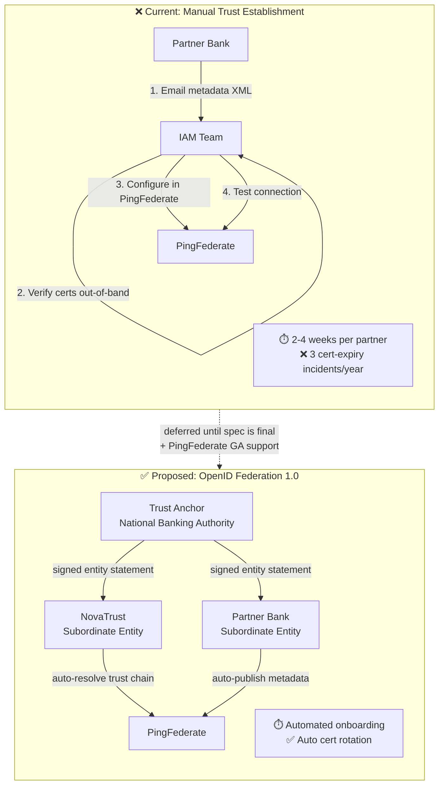
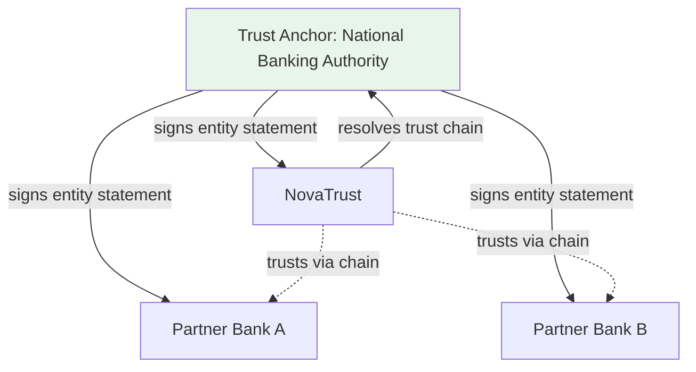
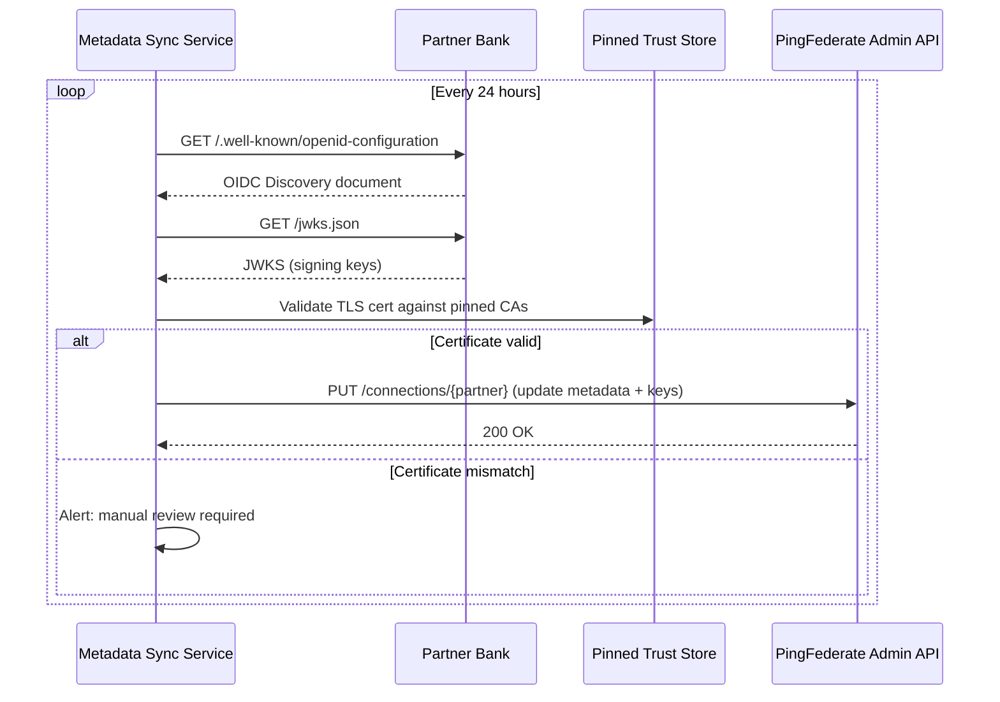

<!-- ⚠️ AUTO-GENERATED — DO NOT EDIT -->
<!-- Source of truth: ../fictional/ADR-0008-defer-openid-federation-for-trust-establishment.yaml -->

> [!CAUTION]
> **This file is auto-generated** from [`ADR-0008-defer-openid-federation-for-trust-establishment.yaml`](../fictional/ADR-0008-defer-openid-federation-for-trust-establishment.yaml).
> Do not edit this file directly — all changes must be made in the YAML source.

# ADR-0008-defer-openid-federation-for-trust-establishment: Defer adoption of OpenID Federation 1.0 for automated trust establishment

> **Status:** `deferred`  
> **Priority:** `medium`  
> **Type:** `technology`  
> **Level:** `strategic`  
> **Confidence:** `low`  
> **Decision Owner:** Marcus Chen (Head of IAM)  
> **Decision Date:** 2026-02-15

> *In the context of multi-organization OIDC trust establishment for the federated identity platform, facing the need for automated and scalable relying party onboarding, we decided for deferring OpenID Federation 1.0 adoption and neglected immediate automated metadata exchange via well-known endpoints, to achieve a stable trust foundation using proven bilateral metadata exchange while the OpenID Federation specification matures toward final standardization, accepting continued manual trust anchor configuration and slower partner onboarding velocity, because the specification is still in draft status with insufficient production deployments and library support to justify the integration risk.*

---

**Authors:** Elena Vasquez (IAM Architect)  
**Reviewers:** Jonas Eriksen (CISO), Priya Sharma (API Platform Lead)

---

## Context

NovaTrust currently establishes trust with partner identity providers (banks, fintechs, insurance
companies) through manual metadata exchange — downloading SAML/OIDC metadata XML, verifying
certificates out-of-band, and configuring each partner connection in PingFederate manually.

With 40+ partner connections and 5–10 new partners onboarding per quarter, the manual process
creates operational bottlenecks and human error risks (expired certificates, stale metadata).

OpenID Federation 1.0 promises automated trust establishment via trust chains — federating entities
publish signed entity statements, and trust anchors (e.g., national banking authorities) vouch
for subordinate entities. This would eliminate manual metadata exchange.

### Business Drivers

- Partner onboarding takes 2–4 weeks due to manual metadata exchange and certificate verification
- 3 incidents in the past year caused by expired partner certificates that were not rotated in time
- Regulatory push toward automated trust frameworks in PSD2 and eIDAS 2.0 ecosystems

### Technical Drivers

- Manual metadata exchange does not scale beyond 50 partner connections without dedicated staff
- OpenID Federation 1.0 trust chains enable automated certificate rotation and metadata refresh
- PingFederate has OpenID Federation support on its product roadmap (expected H2 2026)

### Constraints

- Must not break existing partner connections during any transition
- PingFederate is the authorization server — mechanism must be natively supported or plugin-compatible
- Partners must also support the chosen mechanism — unilateral adoption is not possible

### Assumptions

- OpenID Federation 1.0 specification will reach final status in 2026
- PingFederate will ship GA support for OpenID Federation by end of 2026
- At least 5 key partners are willing to pilot the new trust establishment mechanism

## Architecturally Significant Requirements

### Functional

| ID | Description |
|----|-------------|
| `F-001` | Automated discovery, validation, and key rotation of partner identity provider metadata via cryptographic trust chains — eliminating manual metadata exchange and out-of-band certificate verification
 |
| `F-002` | Fallback to manual metadata exchange for partners that do not support federation |

### Non-Functional

| ID | Description |
|----|-------------|
| `NF-001` | Trust chain resolution must complete in < 2 seconds |
| `NF-002` | Must not introduce a single point of failure in the trust resolution chain |

## Alternatives Considered

### 1. OpenID Federation 1.0 trust chains ✅

Adopt OpenID Federation 1.0 for fully automated, cryptographically verified trust establishment between NovaTrust and its partner banks. NovaTrust registers as a **subordinate entity** under a trust anchor (e.g., the national banking authority or a PSD2 competent authority). Partner banks do the same under their respective trust anchors. Trust is established automatically via **signed entity statements** and **trust chain resolution** — no manual metadata exchange or bilateral key agreement required.

When NovaTrust needs to establish trust with a new partner, it resolves the partner's trust chain by fetching signed entity statements from the partner up through the trust anchor hierarchy. Each entity statement is cryptographically signed by its superior, creating a verifiable chain of trust. Certificate rotation is automated — when a partner updates its keys, it publishes a new entity statement signed by its superior, and NovaTrust picks up the change on the next metadata refresh.

The **strategic risk** is adoption timing: the specification is still in draft stage (February 2026), PingFederate support is roadmapped but not GA, trust anchor infrastructure does not yet exist for the Dutch banking sector, and partner adoption is uncertain. Unilateral adoption provides no benefit — both sides must participate.

**Pros:**
- Eliminates manual metadata exchange — trust established automatically via trust chains
- Automated certificate rotation via entity statement refresh
- Standards-based — aligns with eIDAS 2.0 and PSD2 regulatory direction
- Scales to hundreds of partners without additional operational overhead

**Cons:**
- Specification is not yet final (draft stage as of February 2026)
- PingFederate support is roadmapped but not GA — requires waiting for vendor
- Requires trust anchor infrastructure (national banking authority or equivalent)
- Partner adoption is uncertain — unilateral adoption provides no benefit
- Limited production deployments to learn from — early adopter risk

*Estimated cost: `medium` · Risk: `high`*

### 2. Automated metadata exchange via well-known endpoints

Build a custom metadata synchronization service that periodically polls partners' OIDC Discovery endpoints (`/.well-known/openid-configuration`) and JWKS endpoints, validates certificates against a **pinned trust store**, and updates PingFederate's connection configuration via its Admin REST API. This automates the metadata retrieval and key rotation detection steps of the current manual process.

This approach can be built today using existing OIDC Discovery infrastructure that all partners already support. However, it is a **tactical improvement, not a strategic solution**: certificate pinning still requires manual trust store updates when partners rotate their CA certificates. The trust model is based on TLS validation and manual CA pinning, not cryptographic attestation chains — it does not fundamentally solve the trust establishment problem at scale.

**Pros:**
- Can be built today — no dependency on unfinished specifications
- Leverages existing OIDC Discovery that all partners already support
- Incremental improvement over manual exchange

**Cons:**
- Custom automation code to build and maintain
- Certificate pinning requires manual trust store updates when partners rotate CAs
- No formal trust chain — trust is based on TLS and manual CA pinning, not cryptographic attestation
- Does not address the fundamental scaling problem — just automates parts of it

*Estimated cost: `low` · Risk: `low`*

> **Rejection rationale:** This is a tactical improvement, not a strategic solution. It automates metadata fetching but does not solve the trust establishment problem — certificate pinning still requires manual trust store management. However, it could serve as a bridge while waiting for OpenID Federation.

## Decision

**Chosen alternative:** OpenID Federation 1.0 trust chains

### Rationale

- Standards-based approach aligns with regulatory direction (eIDAS 2.0, PSD2)
- Eliminates the root cause of operational bottlenecks — manual trust establishment
- Automated certificate rotation addresses the recurring incident pattern
- Scales to hundreds of partners, supporting NovaTrust's growth trajectory

However, the decision is **deferred** because:
- The specification is not yet final — adopting a draft standard carries specification change risk
- PingFederate GA support is not available — building on pre-release features is not production-ready
- Partner readiness is unknown — unilateral adoption provides zero value

### Tradeoffs

- Deferring means continued manual metadata exchange for 6–12 months
- Risk of 2–3 more certificate expiry incidents during the deferral period
- May need to implement the tactical alternative (Option 2) as a bridge if deferral extends beyond 12 months

## Consequences

### Positive

- No investment in an immature specification that may change before finalization
- No dependency on pre-release vendor features
- Time to build partner consensus and pilot readiness

### Negative

- Continued manual metadata exchange — operational bottleneck persists
- Ongoing certificate expiry risk for existing partner connections
- Potential competitive disadvantage if peers adopt federation earlier

## Confirmation

Periodic review of OpenID Federation specification maturity. Track industry adoption via references and revisit when specification reaches stable status.

## Dependencies

**Internal:**
- PingFederate 12.x (authorization server — pending OpenID Federation support)

**External:**
- OpenID Federation 1.0 specification finalization
- PingFederate product roadmap (OpenID Federation GA)
- Partner bank readiness for federation

## References

- [OpenID Federation 1.0 — Draft Specification](https://openid.net/specs/openid-federation-1_0.html)
- [eIDAS 2.0 Technical Architecture Reference Framework](https://eu-digital-identity-wallet.github.io/eudi-doc-architecture-and-reference-framework/latest/arf/)
- [PingFederate Product Roadmap (internal)](https://docs.pingidentity.com/pingfederate/latest/release-notes.html)

## Lifecycle

- **Review cycle:** 24 months
- **Next review:** 2028-02-15

## Audit Trail

| Event | By | Date | Details |
|-------|----|------|---------|
| `created` | Elena Vasquez | 2026-02-01 | Initial proposal for OpenID Federation adoption |
| `updated` | Elena Vasquez | 2026-02-10 | Added tactical alternative (automated metadata exchange) after discussion with API platform team |
| `deferred` | Marcus Chen | 2026-02-15 | Deferred until OpenID Federation 1.0 reaches final specification status and PingFederate ships GA support. Re-evaluate in August 2026. PR closed with 'deferred' label. |
