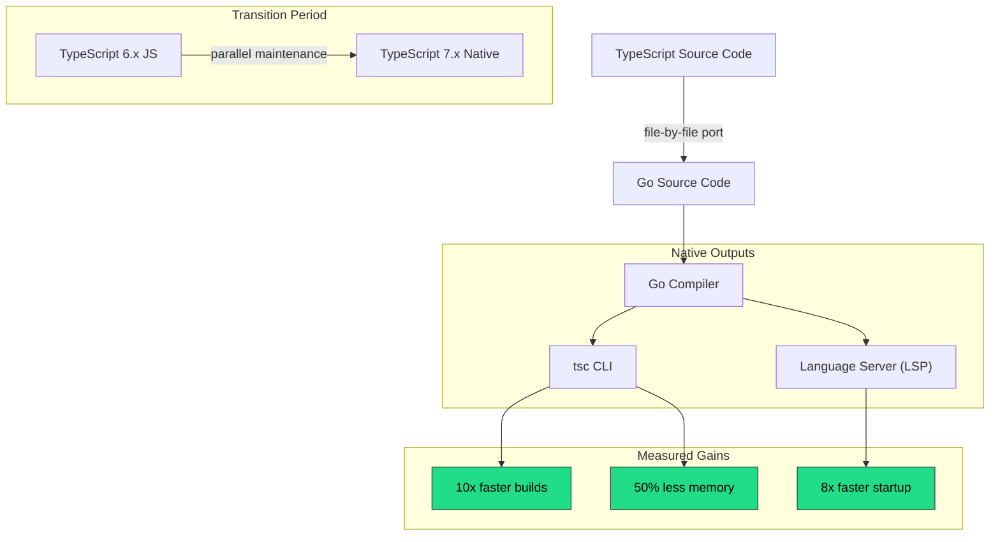
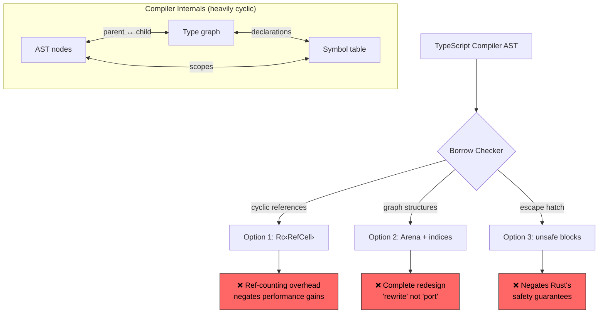
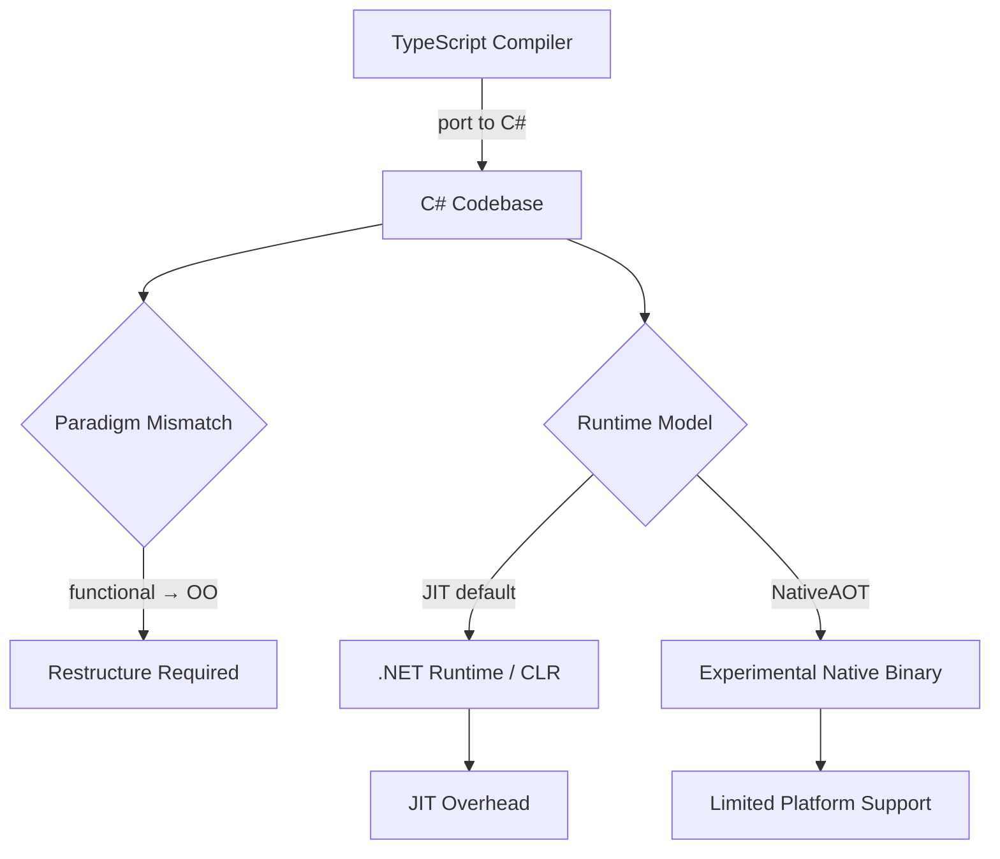
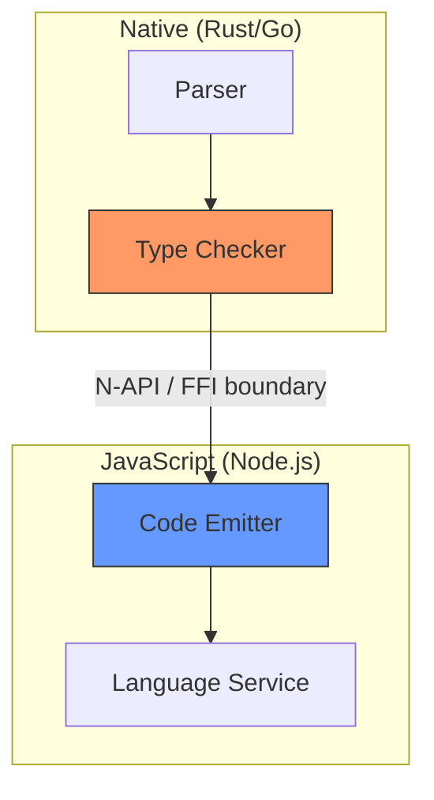
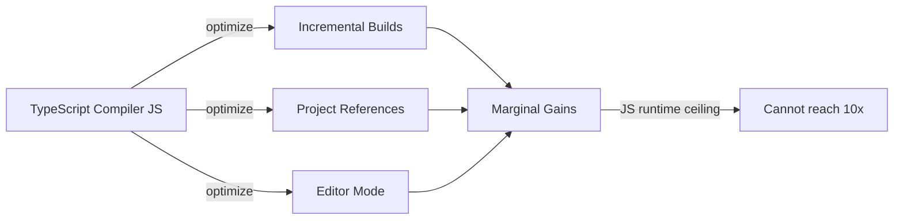

<!-- ⚠️ AUTO-GENERATED — DO NOT EDIT -->
<!-- Source of truth: ../real-world/ADR-0100-typescript-compiler-go-rewrite.yaml -->

> [!CAUTION]
> **This file is auto-generated** from [`ADR-0100-typescript-compiler-go-rewrite.yaml`](../real-world/ADR-0100-typescript-compiler-go-rewrite.yaml).
> Do not edit this file directly — all changes must be made in the YAML source.

# ADR-0100-typescript-compiler-go-rewrite: Port TypeScript compiler and language services from TypeScript to Go

> **Status:** `accepted`  
> **Priority:** `critical`  
> **Type:** `technology`  
> **Level:** `strategic`  
> **Confidence:** `high`  
> **Decision Owner:** Anders Hejlsberg (Microsoft Technical Fellow, Lead Architect of TypeScript)  
> **Decision Date:** 2025-03-11

> *In the context of the TypeScript compiler and language services, facing severe performance and scalability limitations in large codebases (77-second type-check times on VS Code's 1.5M-line codebase, 9.6-second editor startup), we decided for a native port of the compiler from TypeScript to Go using a file-by-file porting strategy and neglected a Rust rewrite, a C# port, and a hybrid incremental approach, to achieve a 10x build-time speedup, 8x editor startup improvement, and 50% memory reduction across all project sizes, accepting the loss of compiler self-hosting ("dogfooding"), reduced community contributor pool, and a multi-year transition period with parallel TypeScript 6 (JS) and TypeScript 7 (native) codebases, because Go's garbage collector, structural similarity to the functional-style compiler codebase, and first-class cyclic data structure support enabled a faithful port rather than a costly rewrite, while Rust's borrow checker would have required fundamental architectural changes incompatible with the compiler's graph-heavy internals.*

---

**Authors:** Anders Hejlsberg (Technical Fellow & Lead Architect), TypeScript Team (Core Team)  
**Approvals:** Anders Hejlsberg (Technical Fellow) [@AHejlsberg] — approved 2025-03-11T00:00:00Z

---

## Context

The TypeScript compiler and language services are written in TypeScript, running on Node.js. While this self-hosted architecture served the project well for over a decade, it has reached fundamental performance ceilings. Large codebases experience multi-minute type-check times, slow editor startup, and high memory usage. The JavaScript runtime imposes an irreducible overhead that no amount of algorithmic optimization can eliminate. AI-powered developer tools require tighter latency constraints for semantic information, further exacerbating the problem. TypeScript is the most widely used programming language on GitHub, making this a decision with global developer impact.

### Business Drivers

- TypeScript is the most widely used language on GitHub — performance directly affects millions of developers worldwide
- Large enterprise codebases (1M+ lines) experience unacceptable compile times, reducing developer productivity
- AI-powered development tools (Copilot, IntelliCode) require low-latency access to semantic information that current performance cannot deliver
- Competitive pressure from faster native tools (SWC, esbuild, Biome) that handle subsets of TypeScript functionality with superior performance

### Technical Drivers

- VS Code codebase (1.5M lines) takes 77.8 seconds to type-check — developers routinely disable project-wide error checking
- Editor startup for large projects takes 9.6 seconds — unacceptable for interactive development workflows
- JavaScript runtime imposes irreducible overhead for compute-intensive compiler operations (parsing, binding, type-checking, code generation)
- Memory usage scales poorly — large projects consume gigabytes of RAM for the language service
- The compiler's internal data structures (ASTs, type graphs) are inherently cyclic and graph-heavy, demanding efficient memory layout

### Constraints

- Must maintain 99.999% semantic compatibility with the existing TypeScript compiler — this is a port, not a rewrite
- Must support all existing TypeScript language features and configurations
- File-by-file porting strategy to maintain behavioral equivalence and enable incremental validation
- Must produce native binaries for all major platforms (Windows, macOS, Linux)
- The existing TypeScript 6.x (JS) codebase must be maintained in parallel during the transition period
- Must adopt Language Server Protocol (LSP) for editor integration, replacing the custom tsserver protocol

### Assumptions

- Go's garbage collector provides sufficient performance for compiler workloads without requiring manual memory management
- The functional-style TypeScript compiler codebase (few classes, heavy use of functions and data structures) maps naturally to Go's programming model
- The TypeScript team can ramp up on Go quickly enough to maintain development velocity
- The npm ecosystem tools that depend on TypeScript's compiler API will be able to adapt during the transition period
- A multi-year parallel maintenance period (TS 6 and TS 7) is sustainable

## Alternatives Considered

### 1. Native port to Go ✅

Port the existing TypeScript compiler file-by-file from TypeScript to Go,
maintaining structural equivalence. Go was selected as what Anders Hejlsberg
called "the lowest-level language we can get to that gives us full, optimized,
native-code support on all platforms." The port preserves the compiler's
functional architecture (few classes, function-centric design) because Go's
programming model naturally accommodates this style. Go's garbage collector
handles the compiler's extensive use of cyclic data structures (ASTs, type
graphs, symbol tables) without requiring architectural changes. The porting
strategy is file-by-file to achieve near-identical behavior, validated by
running the existing TypeScript test suite against the Go implementation.

**Benchmark results (tsc --noCheck):**

| Codebase | Lines | TS 5.x (JS) | TS 7.x (Go) | Speedup |
|----------|------:|------------:|------------:|--------:|
| VS Code | 1.5M | 77.8 s | 7.5 s | 10.4x |
| Playwright | 356k | 11.1 s | 1.1 s | 10.1x |
| date-fns | 104k | 6.5 s | 0.7 s | 9.5x |

**Pros:**
- 10x build-time speedup measured on real codebases (VS Code 77.8s → 7.5s)
- 8x editor startup improvement (VS Code 9.6s → 1.2s)
- ~50% memory usage reduction with further optimization potential
- Go's GC handles cyclic data structures natively — no architectural changes needed
- Functional-style codebase maps naturally to Go's functions-and-structs model
- File-by-file porting strategy minimizes behavioral divergence risk
- Go produces single static binaries for all platforms — simpler distribution
- Go's concurrency primitives (goroutines) enable future parallelization of type-checking passes
- Go has 15+ years of hardened native compilation across all platforms

**Cons:**
- Loss of compiler self-hosting ("dogfooding") — TypeScript team no longer uses their own language for its most important product
- Reduced community contributor pool — most TypeScript contributors are JS/TS developers, not Go developers
- npm ecosystem tools that depend on TypeScript's JavaScript compiler API (ts-loader, AST transformers, custom language service plugins) must adapt
- Go's type system is less expressive than TypeScript's, potentially limiting future compiler implementation patterns
- WebAssembly performance of Go is suboptimal — impacts in-browser IDE scenarios and playground
- Multi-year parallel maintenance period (TS 6 + TS 7) doubles maintenance burden

*Estimated cost: `high` · Risk: `medium`*

### 2. Rewrite in Rust

Rewrite the TypeScript compiler in Rust, leveraging Rust's memory safety
guarantees and zero-cost abstractions. Rust has proven successful for
JavaScript tooling (SWC achieved 20x speedup for transpilation, Biome
provides fast linting). A Rust-based compiler would eliminate garbage
collection pauses and provide maximum control over memory layout.

However, the TypeScript compiler's internals are fundamentally incompatible
with Rust's ownership model. The compiler's AST, type graph, and symbol
tables form deeply cyclic data structures where nodes freely reference
each other. Rust's borrow checker would require either pervasive use of
`Rc<RefCell<>>` (negating performance benefits), arena allocation with
indices (requiring a complete architectural redesign), or unsafe blocks
throughout the codebase. Anders Hejlsberg stated this would effectively
be a "rewrite" rather than a "port," fundamentally changing the compiler's
architecture and introducing high risk of behavioral divergence.

**Pros:**
- Zero-cost abstractions — potentially even faster than Go for CPU-bound work
- Memory safety without garbage collection — no GC pauses
- Proven in JS tooling ecosystem (SWC, Biome, Oxc, Rolldown)
- Excellent WebAssembly target — good in-browser performance
- Strong type system aligns philosophically with TypeScript's goals
- Growing developer community with systems programming expertise

**Cons:**
- Borrow checker fundamentally incompatible with compiler's cyclic data structures
- Would require complete architectural redesign — "rewrite" not "port"
- High risk of behavioral divergence from the existing compiler
- Steep learning curve for the TypeScript team (primarily JS/TS developers)
- No garbage collector means manual lifetime management for graph-heavy structures
- File-by-file porting strategy impossible — must redesign from scratch
- Estimated development time significantly longer than a Go port

*Estimated cost: `high` · Risk: `high`*

> **Rejection rationale:** The TypeScript compiler's architecture is fundamentally built on cyclic data structures (AST nodes reference parent nodes, type nodes reference declaration nodes, etc.). Rust's ownership model requires either pervasive reference counting (negating performance benefits) or a complete architectural redesign using arena allocation with indices. Anders Hejlsberg confirmed this would be a "rewrite" rather than a "port," introducing unacceptable risk of behavioral divergence from the existing compiler. The TypeScript team's expertise is in JavaScript/TypeScript, not systems programming.

### 3. Port to C#

Port the compiler to C#, Microsoft's premier managed language. Anders
Hejlsberg, who originally designed C#, considered this option carefully.
C# offers garbage collection, strong typing, and Microsoft ecosystem
alignment. A prototype was attempted.

However, C# is heavily object-oriented, while the TypeScript compiler uses
a functional style with very few classes. Porting to C# would require
restructuring the codebase to fit an OO paradigm, creating friction. C# is
also "bytecode-first" — while NativeAOT compilation exists, it lacks the
decade-plus of hardening seen in Go's native compilation and is not universally
available across all platforms. Go offers better expressiveness for data
structure layout and inline structs.

**Pros:**
- Microsoft-owned language — organizational alignment
- Garbage collection handles cyclic data structures
- Rich standard library and tooling ecosystem
- Anders Hejlsberg designed both C# and TypeScript — deep familiarity
- Strong IDE support (Visual Studio, Rider)

**Cons:**
- Object-oriented paradigm mismatch — compiler is functional-style with few classes
- Bytecode-first architecture — NativeAOT is immature and not cross-platform ready
- Less expressive for data structure layout compared to Go (no inline structs)
- Porting friction due to paradigm shift from functional to OO
- Smaller performance gains compared to Go due to JIT overhead in non-AOT scenarios

*Estimated cost: `high` · Risk: `medium`*

> **Rejection rationale:** C#'s object-oriented paradigm creates porting friction with the functional-style TypeScript compiler codebase. C# is "bytecode-first" — NativeAOT compilation lacks the decades of hardening available in Go and is not universally available across platforms. A prototype was attempted but Go emerged as the optimal choice due to better alignment with the existing codebase structure and superior native compilation maturity.

### 4. Hybrid incremental approach

Incrementally rewrite performance-critical compiler passes in a native
language while keeping the overall architecture in TypeScript. For example,
the parser and type-checker could be rewritten in Rust/Go and called via
native bindings (N-API/FFI), while the code emitter and language service
remain in TypeScript.

This approach offers incremental performance gains without a full rewrite,
but introduces FFI overhead at module boundaries, complicates the build
system, and provides only partial speedup since the non-native portions
remain bounded by JavaScript runtime performance.

**Pros:**
- Incremental adoption — lower upfront risk
- Preserves self-hosting for non-critical paths
- Does not require the entire team to learn a new language
- Community contributors can still work on JS/TS portions

**Cons:**
- FFI overhead at native/JS boundaries limits achievable speedup
- Incomplete performance gains — non-native portions remain slow
- Complex build system with mixed language compilation
- Testing matrix explodes — must validate native + JS interactions
- Worst of both worlds — maintains two codebases without the full benefit of either
- Cannot achieve the 10x speedup target without porting the entire pipeline

*Estimated cost: `medium` · Risk: `medium`*

> **Rejection rationale:** The hybrid approach provides only partial performance gains because non-native portions remain bounded by JavaScript runtime performance. FFI overhead at module boundaries further limits achievable speedup. The testing complexity of mixed-language compilation and the "worst of both worlds" maintenance burden make this approach unsustainable. The team determined that only a full native port can deliver the target 10x performance improvement.

### 5. Status quo — continue optimizing the TypeScript/JavaScript compiler

Continue investing in algorithmic and architectural optimizations within
the existing TypeScript/JavaScript codebase. The team has already made
significant performance improvements over TypeScript's 12-year history,
including faster incremental builds, project references, and editor-mode
optimizations.

**Pros:**
- Zero migration cost — no new language to learn
- Preserves self-hosting and community contributor access
- No transition period required
- All existing tooling and plugins continue to work unchanged

**Cons:**
- Fundamental performance ceiling — JavaScript runtime imposes irreducible overhead
- Leaving 10x on the table (Anders Hejlsberg's characterization)
- Cannot meet latency requirements for AI-powered development tools
- Large codebase developers continue to experience unacceptable compile times
- Competitive disadvantage against native tools (SWC, esbuild, Biome)

*Estimated cost: `low` · Risk: `low`*

> **Rejection rationale:** The existing JavaScript-based compiler has reached its performance ceiling. Despite 12 years of optimization, large codebases still experience unacceptable compile times and memory usage. Anders Hejlsberg characterized continuing with the status quo as "leaving 10x on the table." The JavaScript runtime imposes an irreducible overhead that no amount of algorithmic optimization can overcome, and AI-powered tools demand tighter latency constraints that the current architecture fundamentally cannot meet.

## Decision

**Chosen alternative:** Native port to Go

### Rationale

- Go's garbage collector natively handles the compiler's pervasive cyclic data structures
  (ASTs, type graphs, symbol tables) without requiring architectural changes
- The compiler's functional style (few classes, function-centric) maps directly to Go's
  programming model — enabling a file-by-file port rather than a rewrite
- 10x build speedup verified on real codebases: VS Code 77.8s→7.5s, Playwright 11.1s→1.1s,
  date-fns 6.5s→0.7s
- Go produces hardened native binaries for all platforms with 15+ years of maturity —
  C#'s NativeAOT cannot match this cross-platform reliability
- Go is "the lowest-level language we can get to that gives us full, optimized, native
  code support on all platforms" (Anders Hejlsberg)
- File-by-file porting strategy enables incremental validation against the existing
  TypeScript test suite, achieving 99.999% semantic compatibility
- Memory usage approximately halved without active optimization — further gains expected
- Adoption of Language Server Protocol (LSP) replaces the custom tsserver protocol,
  improving editor integration standards

### Tradeoffs

- Loss of self-hosting accepted because performance gains are worth the trade — "leaving
  10x on the table" is the greater cost
- Reduced community contributor pool accepted — the core compiler team (not community)
  drives most compiler development
- npm ecosystem disruption accepted — transition period with TypeScript 6 (JS) and
  TypeScript 7 (native) provides migration path, maintained in parallel "a couple of years"
- Go's less expressive type system accepted — the compiler implementation does not need
  TypeScript-level type expressiveness
- Suboptimal WebAssembly performance accepted — in-browser IDE is a niche use case
  compared to the billions of CLI and editor invocations daily

## Consequences

### Positive

- 10x faster command-line type-checking for all TypeScript projects
- 8x faster editor startup time for large codebases
- ~50% memory reduction with further optimization potential
- Enables previously infeasible features — instant project-wide error listings, advanced refactorings, deeper semantic analysis
- Enables next-generation AI tools with tighter latency requirements
- LSP adoption improves editor integration and standardization
- Single static binary distribution simplifies installation and deployment
- Go's goroutines enable future parallelization of type-checking passes

### Negative

- TypeScript is no longer self-hosted — the most important TypeScript tool is written in Go
- Community contributors must learn Go to contribute to the compiler
- npm ecosystem tools depending on TypeScript's JavaScript API must migrate
- Multi-year transition period with parallel TypeScript 6/7 maintenance
- In-browser TypeScript tooling (playgrounds, online IDEs) may see degraded performance due to Go's WebAssembly characteristics

## Confirmation

The TypeScript Go port is published at github.com/microsoft/typescript-go under the same license as the existing TypeScript codebase. Benchmarks verified 10x speedup on VS Code (77.8s→7.5s), Playwright (11.1s→1.1s), TypeORM, date-fns (6.5s→0.7s), tRPC, and rxjs. Editor startup verified at 8x improvement (9.6s→1.2s) on VS Code codebase. TypeScript 7.0 release planned as the native Go-based version, with TypeScript 6.x maintained in parallel.

**Artifacts:**
- [https://github.com/microsoft/typescript-go](https://github.com/microsoft/typescript-go)
- [https://devblogs.microsoft.com/typescript/typescript-native-port/](https://devblogs.microsoft.com/typescript/typescript-native-port/)
- `VS Code benchmark: 77.8s → 7.5s (10.4x)`
- `Playwright benchmark: 11.1s → 1.1s (10.1x)`
- `date-fns benchmark: 6.5s → 0.7s (9.5x)`

## Dependencies

**Internal:**
- TypeScript 6.x (JS) codebase — maintained in parallel during transition
- TypeScript test suite — used to validate semantic compatibility of Go port
- Visual Studio Code language service integration

**External:**
- Go compiler toolchain (for building the native TypeScript compiler)
- Language Server Protocol (LSP) specification
- Node.js runtime (for TypeScript 6.x during transition)

## Lifecycle

- **Review cycle:** 12 months
- **Next review:** 2026-03-11

## Audit Trail

| Event | By | Date | Details |
|-------|----|------|---------|
| `created` | Anders Hejlsberg | 2025-03-11 | Announced native Go port of TypeScript compiler (Project Corsa/Strada). Published github.com/microsoft/typescript-go repository. Benchmarks show 10x build-time speedup and 50% memory reduction on large codebases.
 |
| `approved` | Anders Hejlsberg | 2025-03-11 | Decision approved by TypeScript Technical Fellow. Roadmap established: TypeScript 5.8/5.9 current releases, TypeScript 6.x (JS) continues development, TypeScript 7.0 (native Go) targets feature-complete language service by end of 2025.
 |
