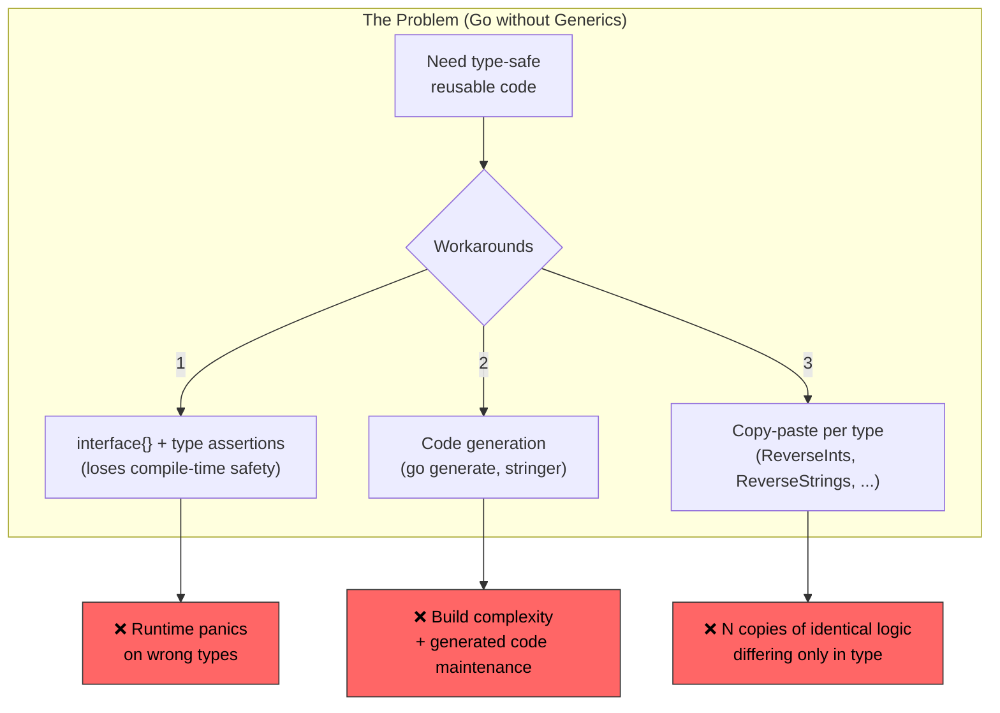
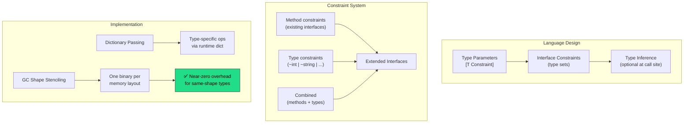
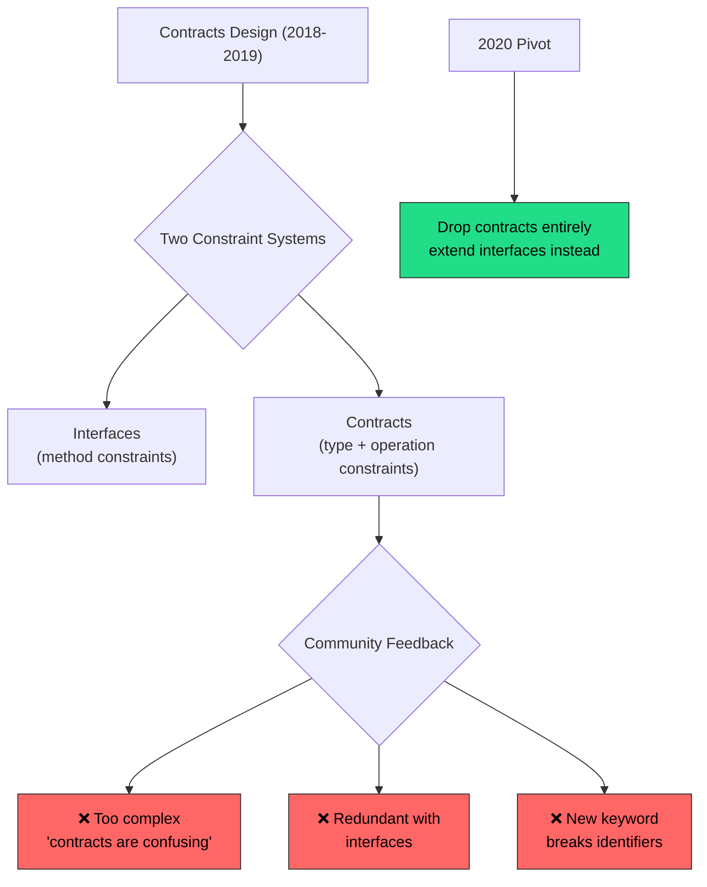
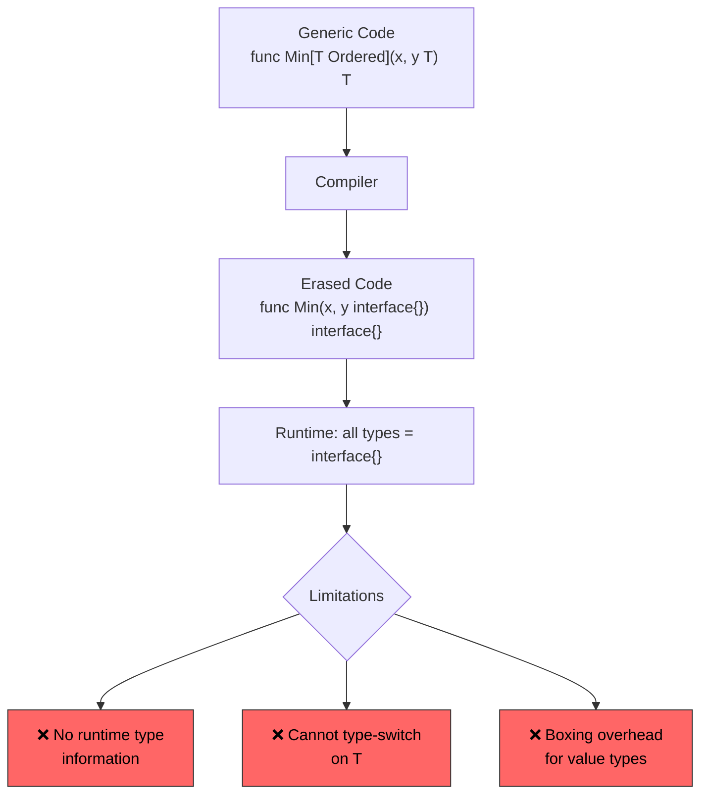
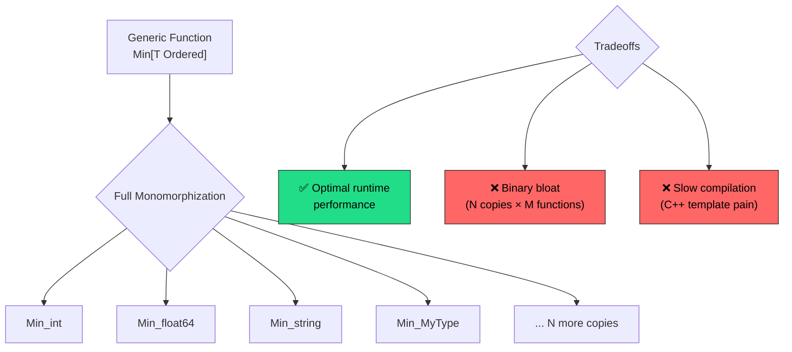
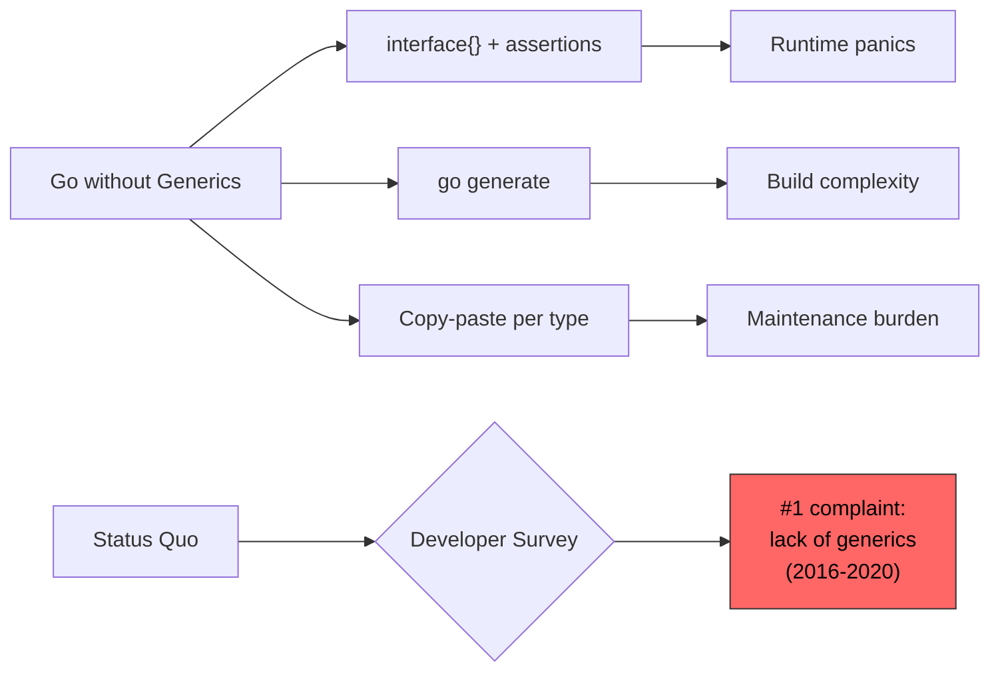

<!-- ⚠️ AUTO-GENERATED — DO NOT EDIT -->
<!-- Source of truth: ../real-world/ADR-0103-go-generics.yaml -->

> [!CAUTION]
> **This file is auto-generated** from [`ADR-0103-go-generics.yaml`](../real-world/ADR-0103-go-generics.yaml).
> Do not edit this file directly — all changes must be made in the YAML source.

# ADR-0103-go-generics: Add generics to Go via type parameters with interface constraints

> **Status:** `accepted`  
> **Priority:** `critical`  
> **Type:** `technology`  
> **Level:** `strategic`  
> **Confidence:** `high`  
> **Decision Owner:** Go Team (Google) (Language Design Team)  
> **Decision Date:** 2022-03-15

> *In the context of the Go programming language's type system, facing over a decade of community demand for parametric polymorphism to eliminate boilerplate code duplication and unsafe interface{}/reflection workarounds, we decided for adding type parameters using square-bracket syntax with interface-based constraints and a hybrid GC-shape-stenciling implementation and neglected the earlier contracts-based constraint design, Java-style type erasure, full C++-style template instantiation, and continuing without generics, to achieve compile-time type-safe generic programming with minimal new concepts, zero runtime overhead for same-shape types, and smooth integration with Go's existing interface system, accepting deliberately limited expressiveness (no generic methods, no variance, no operator overloading, weak constraint expressiveness), ~15% initial compiler slowdown, and the risk of community overuse undermining Go's simplicity culture, because the type-parameter-with-interfaces design was the only approach that satisfied all five design guidelines — minimize new concepts, push complexity to generic authors not users, preserve independent development, maintain fast builds and execution, and keep Go feeling like Go.*

---

**Authors:** Ian Lance Taylor (Go Team, Generics Proposal Lead), Robert Griesemer (Go Team, Generics Co-Designer)  
**Reviewers:** Rob Pike (Go Co-Creator), Russ Cox (Go Tech Lead), Go Community (Community Reviewers via proposal process)  
**Approvals:** Russ Cox (Go Tech Lead) [@rsc] — approved 2021-02-11T00:00:00Z; Go Team (Language Design Team) [@golang] — approved 2021-02-11T00:00:00Z

---

## Context

Go was released on November 10, 2009. Less than 24 hours later, the first
comment about generics appeared in the golang-nuts mailing list. For the
next 12+ years, the lack of generics was consistently listed as one of the
top three problems in every annual Go Developer Survey.

Go's designers — Rob Pike, Robert Griesemer, and Ken Thompson — deliberately
omitted generics from Go 1.0 to keep the language simple. Go's philosophy
prioritized simplicity, fast compilation, and readability over feature
richness. But this choice forced developers into three unsatisfying
workarounds:



1. **`interface{}` with type assertions**: The standard library itself used
   this pattern extensively (`fmt`, `encoding/json`, `sync.Map`). It
   eliminated compile-time type safety and required runtime type assertions
   or reflection, introducing both verbosity and runtime panic risk.

2. **Code generation**: Tools like `go generate` and `stringer` generated
   type-specific code from templates. This added build complexity,
   generated code pollution, and maintenance overhead.

3. **Copy-paste duplication**: Developers wrote identical functions for each
   type (`ReverseInts`, `ReverseStrings`, `ReverseFloat64s`). Any bug fix
   had to be applied to every copy.

The Go team explored generics designs for over a decade — from early
proposals in 2010 through the contracts draft (2018), the updated contracts
design (2019), and finally the type parameters proposal (2020–2021) — each
iteration learning from community feedback and rejected approaches.

### Business Drivers

- Go is a top-10 programming language with 126k+ GitHub stars and millions of developers — the absence of generics was the #1 complaint in annual surveys for over a decade
- Major Go adopters (Google, Uber, Cloudflare, Docker, Kubernetes) wrote extensive internal code generation tooling to work around the lack of generics, increasing engineering overhead
- Competitive pressure from Rust (which has full generics), TypeScript (which has generics), and other modern languages that Go developers compared against
- The Go standard library itself was limited — it could not provide generic data structures (sorted maps, sets, concurrent queues) or generic algorithms (sort, min, max for any ordered type)

### Technical Drivers

- interface{}/any with type assertions and reflection loses compile-time type safety — runtime panics replace compile errors
- Code duplication for type-specific functions (sort.Ints, sort.Float64s, sort.Strings as separate functions in the standard library)
- Code generation tools (go generate) add build complexity and produce code that is difficult to debug and maintain
- The standard library cannot express common abstractions — no generic Map, Filter, Reduce, or type-safe container types
- Third-party libraries resort to reflection (encoding/json) or interface-based designs that sacrifice performance and type safety

### Constraints

- Must preserve Go's fast compilation times — generics cannot significantly slow the compiler
- Must preserve Go's simple mental model — generics should feel like a natural extension, not a new paradigm
- Must be backward compatible — all existing Go code must compile and behave identically
- Must produce efficient machine code — runtime overhead should be minimal or zero compared to hand-written type-specific code
- Must integrate with Go's existing interface system rather than introducing an entirely new constraint mechanism
- Must not require a new keyword that would break existing identifiers (the contracts design required a new `contract` keyword)
- Square brackets must be used for type parameters because angle brackets create parsing ambiguity with comparison operators in Go's grammar

### Assumptions

- The Go community will adopt generics judiciously, following the guideline of using them only where they provide clear benefit over interfaces or concrete types
- The deliberately limited initial feature set (no generic methods, no variance) can be expanded in future Go releases based on experience
- The hybrid GC-shape-stenciling implementation will provide acceptable performance without excessive binary size growth
- Standard library packages (slices, maps) will demonstrate idiomatic generic usage patterns for the community to follow
- The ~15% compiler slowdown introduced in Go 1.18 can be recovered in subsequent releases through compiler optimization

## Architecturally Significant Requirements

### Functional

| ID | Description |
|----|-------------|
| `F-001` | Functions and types must support type parameter declarations using square-bracket syntax, with type arguments inferred by the compiler when possible to minimize verbosity at call sites
 |
| `F-002` | Type constraints must be expressed as interfaces, extended to support type sets (union types using | operator) and approximate type constraints (using ~ for underlying types), unifying constraints with Go's existing interface concept
 |
| `F-003` | Generic functions must work correctly with all of Go's existing features — channels, goroutines, slices, maps, structs, methods — without special cases or restrictions beyond those specified in constraints
 |
| `F-004` | The compiler must perform bidirectional type inference — inferring type arguments from function arguments, return value context, and constraint satisfaction — so that most generic function calls require no explicit type arguments at the call site
 |
| `F-005` | All existing Go 1.x programs must compile and execute identically under the generics-enabled compiler — the Go 1 compatibility promise must not be broken by any aspect of the generics design including the new `any` predeclared identifier
 |

### Non-Functional

| ID | Description |
|----|-------------|
| `NF-001` | Compilation speed must not degrade beyond acceptable limits — the generics implementation must maintain Go's hallmark fast build times (initial target: no more than 15-20% regression in Go 1.18)
 |
| `NF-002` | Runtime performance of generic code must be comparable to hand-written type-specific code — the GC-shape-stenciling implementation must avoid boxing overhead for types with the same memory layout
 |
| `NF-003` | The generics design must introduce the minimum possible number of new concepts — no new keywords, no separate constraint language, and complexity must fall on generic library authors rather than on users calling generic functions
 |
| `NF-004` | Binary size increase from GC-shape stenciling must be controlled — types with identical memory layouts (GC shapes) must share a single compiled instantiation to prevent C++-style code bloat from full monomorphization
 |

## Alternatives Considered

### 1. Type parameters with interface constraints ✅

Add type parameters to Go functions and types using square-bracket
syntax (`[T Constraint]`), with constraints expressed as extended
interfaces. This design — authored by Ian Lance Taylor and Robert
Griesemer — evolved from the earlier contracts design by replacing
the separate `contract` construct with Go's existing interface
mechanism, extended to support type sets.

The key insight was reinterpreting interfaces: instead of defining
only a *method set*, an interface now defines a *type set* — the
set of types that satisfy the constraint. This allows constraints
to specify both method requirements (traditional interfaces) and
permitted types (using `|` union syntax and `~` for underlying
types).

```go
// Type constraint as an interface
type Ordered interface {
    ~int | ~float64 | ~string  // type set
}

// Generic function with type parameter
func Min[T Ordered](x, y T) T {
    if x < y {
        return x
    }
    return y
}

// Type inference: compiler deduces T = int
result := Min(3, 5)
```

The implementation uses a hybrid approach called **GC-shape
stenciling with dictionaries**: the compiler generates one
specialized version of the function for each distinct GC shape
(memory layout), and passes a dictionary for type-specific
operations within the same shape group. All pointer types share
one shape; all int-sized types share another.



**Design evolution timeline:**

| Year | Design | Key Change |
|------|--------|------------|
| 2010 | Initial exploration | Early experiments with generics |
| 2018 | Contracts (draft 1) | New `contract` keyword, complex syntax |
| 2019 | Contracts (draft 2) | Simplified contracts, parenthetical syntax |
| 2020 | Type Parameters | Dropped contracts, used interfaces instead |
| 2021 | Formal proposal (#43651) | Square brackets, type sets, accepted |
| 2022 | Go 1.18 release | Shipped with GC-shape stenciling |

**Pros:**
- Minimal new concepts — reuses and extends Go's existing interface system rather than introducing an entirely new constraint mechanism
- Complexity falls on generic library authors, not on callers — calling a generic function looks identical to calling a non-generic function when type inference applies
- Square-bracket syntax avoids parsing ambiguity with Go's comparison operators (unlike angle brackets in C++/Java/Rust)
- Type inference reduces verbosity — most generic function calls do not need explicit type arguments
- GC-shape stenciling provides near-zero runtime overhead for types with the same memory layout without C++-level code bloat
- Backward compatible — all existing Go code compiles unchanged
- Enables the standard library to provide generic packages (slices, maps, cmp) that eliminate common code duplication patterns
- The `any` type alias for `interface{}` improves readability of unconstrained generic code
- No new keywords — `any` is a predeclared identifier, not a keyword, preserving backward compatibility

**Cons:**
- No generic methods — methods cannot declare their own type parameters, limiting certain API patterns (e.g., fluent builder chains)
- No variance (covariance/contravariance) — generic types have no subtyping relationship even when their type arguments do
- Constraint expressiveness is deliberately limited — cannot express complex type relationships like self-referential bounds or higher-kinded types
- ~15% compiler slowdown in Go 1.18 due to the compiler changes required for generics support
- Risk of community overuse — Go's simplicity culture may be eroded if developers use generics where concrete types or interfaces would suffice
- GC-shape stenciling can increase binary size compared to a pure dictionary approach (one copy per GC shape rather than one total)
- The `comparable` constraint has edge cases with interface types that can cause runtime panics

*Estimated cost: `high` · Risk: `medium`*

### 2. Contracts-based constraint design

The original generics design published by Ian Lance Taylor and Robert
Griesemer at GopherCon 2018. This design introduced a new `contract`
keyword to define type constraints as small function-like bodies that
demonstrated the operations a type must support.

```go
// 2018 contracts syntax
contract Ordered(T) {
    T int, float64, string
}

// 2019 revised contracts syntax (parenthetical type params)
func Min(type T Ordered)(x, y T) T {
    if x < y {
        return x
    }
    return y
}
```

Contracts were separate from interfaces — they formed a parallel
constraint system. The 2018 draft used contracts that looked like
function bodies with dummy operations, while the 2019 revision
simplified them to list permitted types directly. Both versions
used parenthetical syntax `(type T)` for type parameters.



**Pros:**
- Contracts could express operations (indexing, arithmetic) more naturally than interface method sets
- Explicit separation between runtime polymorphism (interfaces) and compile-time polymorphism (contracts)
- The 2018 contract body syntax was self-documenting — the contract body showed exactly what operations were permitted

**Cons:**
- Introduced a parallel constraint system alongside interfaces, doubling the concepts developers must learn
- The `contract` keyword would break any existing code using `contract` as an identifier
- Parenthetical type parameter syntax `(type T)` was confusing — visually similar to regular function parameters
- Community feedback consistently described contracts as too complex and difficult to understand
- The relationship between contracts and interfaces was unclear — when to use which mechanism was not intuitive
- Contract bodies in the 2018 design looked like executable code but were declarative, creating a deceptive familiarity

*Estimated cost: `high` · Risk: `high`*

> **Rejection rationale:** The contracts design was rejected based on extensive community feedback that it was too complex and introduced unnecessary duplication with Go's existing interface system. Maintaining two parallel constraint mechanisms (interfaces for methods, contracts for types) violated Go's design principle of orthogonal, composable features. The 2020 type-sets insight showed that interfaces could be extended to serve both roles, eliminating the need for contracts entirely. The parenthetical syntax also created parsing confusion, leading to the switch to square brackets.

### 3. Java-style type erasure

Implement generics using type erasure, as Java does. Under this
model, type parameters exist only at compile time for type checking.
At runtime, all type parameters are erased to their upper bound
(typically `interface{}` / `any` in Go's case), and the compiler
inserts implicit type casts.

This approach would minimize runtime impact — generic and non-generic
code produce identical machine code — but loses type information at
runtime, preventing type-switch operations on generic values.



**Pros:**
- Zero binary size increase — no code duplication for different type instantiations
- Minimal compiler complexity — type checking at compile time, erasure at code generation
- Familiar model — Java developers (a large potential Go audience) understand type erasure
- No compilation speed impact — no additional code generation passes

**Cons:**
- Runtime boxing overhead for value types — every int, float64, etc. must be wrapped in an interface allocation, defeating Go's performance goals
- No runtime type information for generic parameters — Go's type-switch and reflection would not work with erased types
- Makes Go's `interface{}` workaround the actual implementation rather than eliminating it — generics become syntactic sugar over the very pattern they aim to replace
- Java's own experience shows type erasure causes long-term pain — raw types, unchecked casts, inability to create generic arrays

*Estimated cost: `medium` · Risk: `medium`*

> **Rejection rationale:** Type erasure would reduce Go generics to syntactic sugar over the existing interface{} pattern, providing compile-time type checking but no runtime performance improvement. Go's design goals explicitly required that generic code perform comparably to hand-written type-specific code. Erasing to interface{} introduces boxing overhead for value types that directly contradicts this requirement. Java's two decades of experience with type erasure have demonstrated persistent limitations (raw types, unchecked casts, no primitive generics) that the Go team wanted to avoid.

### 4. Full C++-style template instantiation

Implement generics using full monomorphization, as C++ does with
templates. The compiler generates a completely separate, specialized
version of every generic function and type for each concrete type
combination used in the program.

This approach produces optimal runtime performance — each
instantiation is a fully specialized function that the compiler can
inline, optimize, and layout specifically for the concrete types.
However, it can dramatically increase compilation time and binary
size, especially for heavily generic codebases.



**Pros:**
- Maximum runtime performance — fully specialized code with no indirection, perfect inlining opportunities
- Complete type information available at compile time — enables all optimizations (escape analysis, dead code elimination)
- No runtime dictionaries or vtable-like overhead
- Proven in high-performance systems (C++, Rust)

**Cons:**
- Binary size explosion — one copy of every generic function per type instantiation, mirroring C++'s notorious template bloat
- Compilation time degrades significantly — C++ template instantiation is the primary source of slow C++ builds
- Directly violates Go's design constraint of fast compilation
- Error messages for template-heavy code are notoriously difficult to understand (C++ template error messages are a known pain point)
- Increases pressure on instruction cache due to code duplication

*Estimated cost: `high` · Risk: `high`*

> **Rejection rationale:** Full monomorphization directly violates Go's core design constraint of fast compilation times. C++ template instantiation is the single largest contributor to slow C++ builds, and Go's designers considered fast compilation a non-negotiable property of the language. The GC-shape-stenciling hybrid achieves most of the performance benefit of monomorphization (one instantiation per memory layout) while avoiding the binary bloat and compilation cost of full specialization. Ian Lance Taylor explicitly listed "short build times, fast execution times" as one of the five essential guidelines for Go generics.

### 5. Status quo — no generics, continue with interfaces and code generation

Continue without generics indefinitely. Address the pain points
through improvements to Go's existing mechanisms: better standard
library coverage, improved code generation tooling, enhanced
`go generate` integration, and community education about idiomatic
interface-based design patterns.

Go's co-creator Rob Pike expressed skepticism about generics,
suggesting that "reusability" could be a "counterproductive notion"
and advocating for composition over complex type systems. This
alternative represents the philosophical position that Go's
simplicity is its most valuable feature, and that adding generics
risks making Go feel like every other language.



| Survey Year | Generics Rank | % Respondents |
|:-----------:|:-------------:|:-------------:|
| 2016 | #1 | ~25% |
| 2017 | #2 | ~22% |
| 2018 | #1 | ~26% |
| 2019 | #1 | ~25% |
| 2020 | #1 | ~22% |

**Pros:**
- Zero language complexity increase — Go remains the simple language it was designed to be
- No compiler changes required — no risk of regression
- No binary size or compilation speed impact
- Preserves Go's distinctive minimalist philosophy
- Avoids the risk of "Java-ifying" Go with complex generic types

**Cons:**
- Developers continue to use unsafe interface{}/any patterns that lose compile-time type safety
- Standard library cannot provide generic data structures or algorithms — sort.Ints, sort.Float64s, sort.Strings remain separate functions
- Code duplication grows proportionally with the number of types requiring the same algorithm
- #1 community complaint for 5+ consecutive years — developer frustration actively drives adoption away from Go
- Competitive disadvantage against Rust, TypeScript, Kotlin, and other languages with mature generics
- Code generation tooling adds build complexity without solving the underlying type-safety problem

*Estimated cost: `low` · Risk: `low`*

> **Rejection rationale:** The Go Developer Survey consistently ranked the lack of generics as the #1 problem for five consecutive years (2016-2020). The workarounds — interface{} with type assertions, code generation, and copy-paste duplication — were known to be unsatisfying and error-prone. While Go's simplicity philosophy is central to its identity, the Go team concluded that the benefit of generics outweighed the complexity cost, provided the design satisfied all five guidelines: minimize new concepts, push complexity to authors, enable independent development, maintain fast builds, and preserve Go's character. Ian Lance Taylor summarized: "generics can bring a significant benefit to the language, but they are only worth doing if Go still feels like Go."

## Decision

**Chosen alternative:** Type parameters with interface constraints

### Rationale

- The interface-based constraint system reuses Go's most distinctive
  abstraction rather than introducing a parallel mechanism — the "type
  sets" insight unified compile-time constraints with runtime
  polymorphism in a single concept

- Square-bracket syntax `[T Constraint]` avoids the parsing ambiguity
  that angle brackets would create with Go's comparison operators,
  maintaining Go's simple, fast parser

- Type inference eliminates verbosity at call sites — `Min(3, 5)`
  works without writing `Min[int](3, 5)`, making generic code feel
  like ordinary Go code to the caller

- The GC-shape-stenciling implementation achieves near-optimal runtime
  performance (one specialization per memory layout) without C++-level
  binary bloat or compilation slowdown

- All five design guidelines were satisfied:
  1. **Minimize new concepts**: No new keywords; interfaces extended,
     not replaced; `any` is a predeclared identifier
  2. **Complexity on the writer, not the user**: Calling generic
     functions is syntactically identical to calling non-generic ones
  3. **Independent development**: Constraint interfaces define a clear
     contract between generic library author and user
  4. **Fast builds**: Hybrid stenciling avoids full monomorphization's
     compilation cost
  5. **Go still feels like Go**: The feature is additive and optional —
     existing code is unaffected

- The deliberately limited initial scope (no generic methods, no
  variance) follows Go's tradition of starting conservative and
  expanding based on real-world experience — the same approach used
  for goroutines, channels, and modules

### Tradeoffs

- Deliberately limited expressiveness accepted because Go's philosophy
  has always been "simple and limited" — the team explicitly chose to
  ship a useful subset rather than a complete generics system, with room
  to expand in future releases (generic methods were added in Go 1.24+)

- ~15% compiler slowdown in Go 1.18 accepted as temporary — the Go team
  committed to recovering compilation speed in subsequent releases,
  and the GC-shape-stenciling approach was chosen specifically to
  minimize long-term compilation cost

- Risk of Go community overuse accepted and mitigated through clear
  guidance: "Don't use type parameters prematurely; use them when you
  find yourself writing the exact same code multiple times with the
  only difference being the type"

- Binary size increase from GC-shape stenciling accepted as a
  reasonable tradeoff for runtime performance — fewer instantiations
  than full monomorphization, more than type erasure, but with far
  better performance than erasure

- No generic methods accepted because allowing methods to declare
  their own type parameters would require either runtime code
  generation or restrictions on interface implementation — both
  deemed unacceptable for Go 1.18 (this restriction was later
  relaxed)

## Consequences

### Positive

- Compile-time type-safe generic programming eliminates the need for unsafe interface{}/any patterns with runtime type assertions
- Standard library enhanced with generic packages — slices, maps, cmp — replacing duplicated type-specific functions (sort.Ints/ sort.Float64s/sort.Strings unified into slices.Sort)
- The constraints package and predeclared types (any, comparable) provide a vocabulary for expressing type requirements
- Code duplication for algorithms operating on multiple types eliminated — one generic function replaces N type-specific copies
- Third-party ecosystem can now provide type-safe generic data structures (ordered maps, sets, concurrent containers) without reflection or code generation
- Type inference at call sites makes generic function usage as natural as non-generic function calls
- The "type sets" insight enriched Go's interface concept, making interfaces more powerful even outside generic contexts
- Go's competitive position strengthened against Rust, TypeScript, and Kotlin — the

### Negative

- Community debate about appropriate usage — tension between developers eager to use generics everywhere and those who view generics as threatening Go's simplicity culture
- ~15% compiler slowdown in Go 1.18 (subsequently improved in Go 1.19 and later)
- Increased cognitive load for reading Go code — developers must now understand type parameters, constraints, and type inference in addition to interfaces and concrete types
- Deliberately limited feature set frustrated developers expecting full Rust/C++-level generics — no generic methods, no variance, no operator overloading
- Some performance edge cases where GC-shape stenciling with dictionaries is slower than hand-written type-specific code due to dictionary indirection preventing inlining
- The `comparable` constraint has subtle edge cases with interface types that can cause runtime panics, creating a gap in the compile-time safety promise

## Confirmation

Go 1.18 was released on March 15, 2022, with generics as the headline
feature — the largest language change since Go's initial open-source
release. The type parameters proposal was accepted as issue #43651.

Key milestones confirming implementation and adoption:
- **Go 1.18 (March 2022)**: Type parameters, interface type sets, and
  type inference shipped. The `any` and `comparable` predeclared types
  were added. Compiler ~15% slower than Go 1.17.
- **Go 1.20 (February 2023)**: Experimental generic packages
  `golang.org/x/exp/slices` and `golang.org/x/exp/maps` published
  for community feedback.
- **Go 1.21 (August 2023)**: `slices`, `maps`, and `cmp` packages
  moved to the standard library, providing canonical generic APIs.
  Compiler performance recovered to near Go 1.17 levels.
- **Go 1.22-1.23 (2024)**: Iterators and range-over-func features
  leveraged generics for ergonomic iteration patterns.
- **Go 1.24+ (2026)**: Generic methods proposal accepted (by Robert
  Griesemer), relaxing the initial restriction on method type
  parameters.

The 2022 and 2023 Go Developer Surveys showed generics dropping from
the #1 complaint to a minor concern, confirming that the decision
addressed the core community need.

**Artifacts:**
- [https://go.googlesource.com/proposal/+/refs/heads/master/design/43651-type-parameters.md](https://go.googlesource.com/proposal/+/refs/heads/master/design/43651-type-parameters.md)
- [https://github.com/golang/go/issues/43651](https://github.com/golang/go/issues/43651)
- [https://go.dev/blog/intro-generics](https://go.dev/blog/intro-generics)
- [https://go.dev/blog/why-generics](https://go.dev/blog/why-generics)
- [https://go.dev/doc/go1.18](https://go.dev/doc/go1.18)
- [https://pkg.go.dev/slices](https://pkg.go.dev/slices)
- [https://pkg.go.dev/maps](https://pkg.go.dev/maps)

## Dependencies

**Internal:**
- Go compiler (gc) — required GC-shape stenciling and dictionary-passing implementation in the compiler backend
- Go specification — formal language spec updated to define type parameter syntax and semantics
- Go standard library — slices, maps, cmp packages demonstrate canonical generic usage patterns
- Go type checker (go/types) — extended to handle type parameter resolution and constraint satisfaction

**External:**
- golang.org/x/exp — experimental generic packages for community feedback before standard library inclusion
- constraints package — predefined constraint interfaces (Ordered, Integer, Float, Complex, Signed, Unsigned)
- Go playground — updated to support generic code for experimentation

## References

- [Type Parameters Proposal (Design Document #43651)](https://go.googlesource.com/proposal/+/refs/heads/master/design/43651-type-parameters.md)
- [Go Issue #43651: Type Parameters Proposal](https://github.com/golang/go/issues/43651)
- [Go Blog: Why Generics? (Ian Lance Taylor, GopherCon 2019)](https://go.dev/blog/why-generics)
- [Go Blog: An Introduction To Generics (Robert Griesemer & Ian Lance Taylor)](https://go.dev/blog/intro-generics)
- [Go 1.18 Release Notes](https://go.dev/doc/go1.18)
- [Contracts — Draft Design (2018, superseded)](https://github.com/golang/proposal/blob/master/design/go2draft-contracts.md)
- [Go Blog: The Next Step for Generics (2020 — type parameters draft)](https://go.dev/blog/generics-next-step)

## Lifecycle

- **Review cycle:** 60 months
- **Next review:** 2027-03-15

## Audit Trail

| Event | By | Date | Details |
|-------|----|------|---------|
| `created` | Ian Lance Taylor | 2021-01-12 | Formal type parameters proposal filed as Go issue #43651. Design document by Ian Lance Taylor and Robert Griesemer published, representing the culmination of 12+ years of generics exploration including the rejected contracts designs (2018, 2019).
 |
| `approved` | Russ Cox | 2021-02-11 | Type parameters proposal accepted by the Go team after extensive community review. The design met the acceptance criteria of being "good enough, and simple enough" for inclusion in Go. Implementation targeted for Go 1.18.
 |
| `updated` | Go Team | 2022-03-15 | Go 1.18 released with generics as the headline feature. Type parameters, interface type sets, type inference, and the `any` and `comparable` predeclared types shipped. GC-shape stenciling with dictionaries used as the implementation strategy. Compiler approximately 15% slower than Go 1.17.
 |
| `updated` | Go Team | 2023-08-08 | Go 1.21 released with generic slices, maps, and cmp packages promoted to the standard library. Compiler performance recovered to near Go 1.17 levels. Community adoption of generics growing but measured — consistent with the team's guidance to use generics judiciously.
 |
