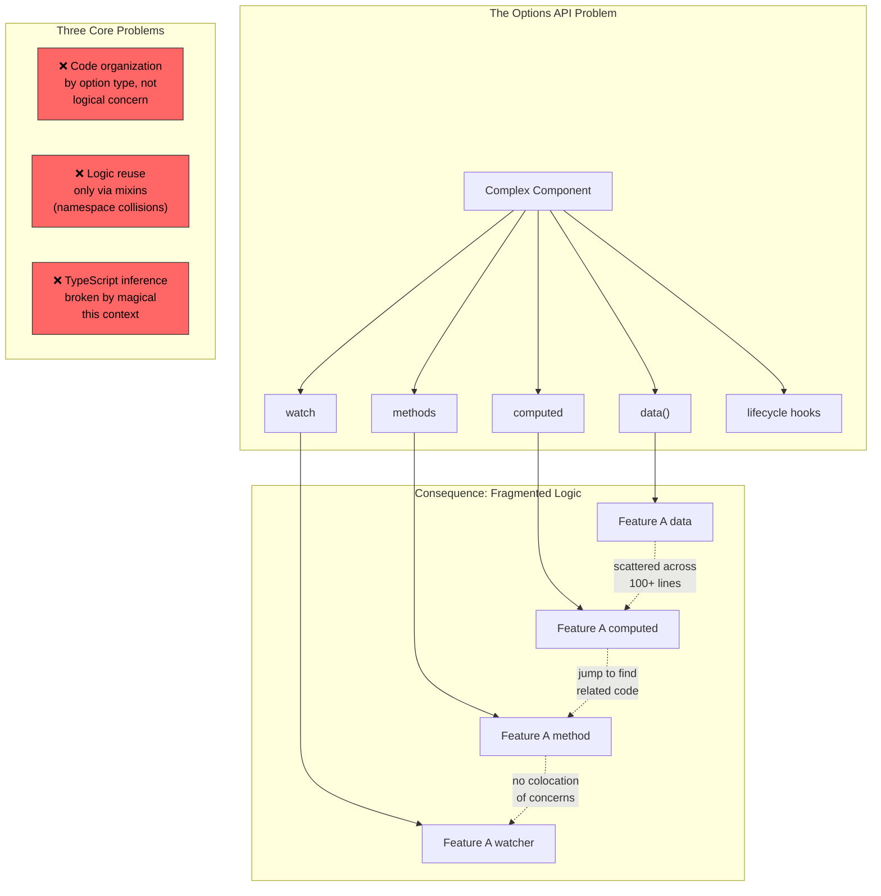
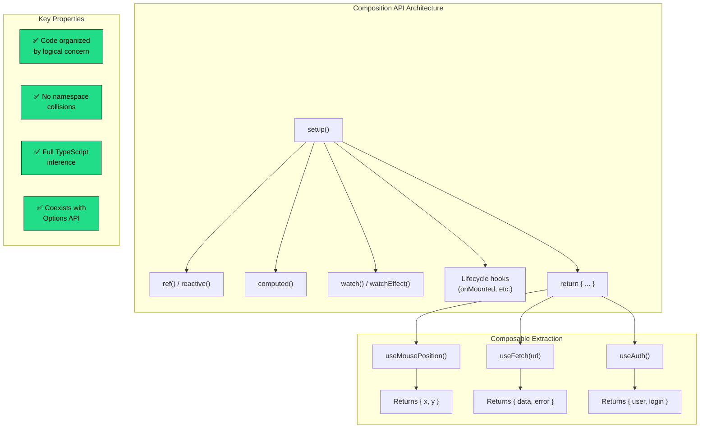
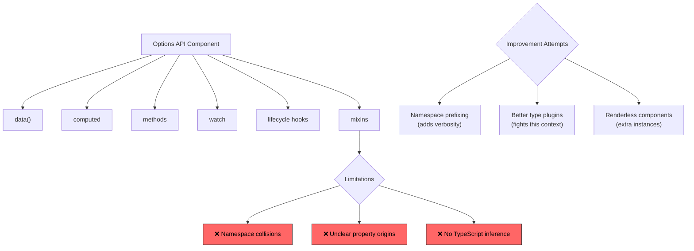
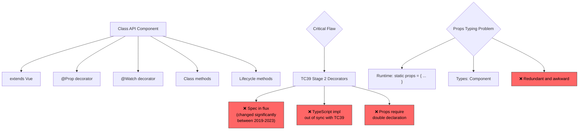
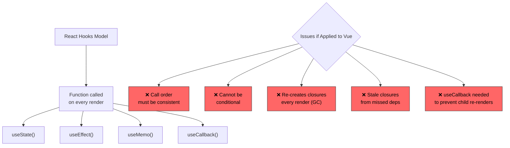
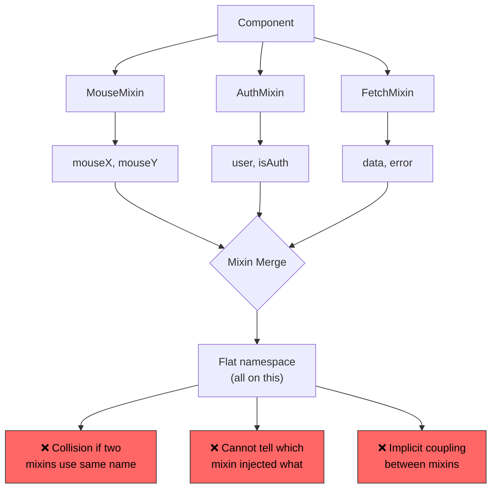

<!-- ⚠️ AUTO-GENERATED — DO NOT EDIT -->
<!-- Source of truth: ../real-world/ADR-0105-vue-composition-api.yaml -->

> [!CAUTION]
> **This file is auto-generated** from [`ADR-0105-vue-composition-api.yaml`](../real-world/ADR-0105-vue-composition-api.yaml).
> Do not edit this file directly — all changes must be made in the YAML source.

# ADR-0105-vue-composition-api: Introduce Composition API as an additive API for function-based component logic organization in Vue.js 3

> **Status:** `accepted`  
> **Priority:** `critical`  
> **Type:** `technology`  
> **Level:** `tactical`  
> **Confidence:** `high`  
> **Decision Owner:** Evan You (Vue.js BDFL (Benevolent Dictator For Life))  
> **Decision Date:** 2020-09-18

> *In the context of Vue.js 3 API design, facing code organization fragmentation in complex components where related logic is scattered across multiple options blocks, lack of a clean mechanism for extracting and reusing stateful logic between components, and poor TypeScript inference caused by the magical this context, we decided for introducing the Composition API — a function-based setup() entry point with reactive primitives (ref, reactive, computed, watch) — as an additive API that coexists with the existing Options API, and neglected maintaining the Options API as the sole API with incremental fixes, adopting a Class-based component API with decorators (which had a working prototype that was discarded), adopting the React Hooks model directly, and continuing with mixins as the primary logic reuse mechanism, to achieve function-based code organization by logical concern rather than option type, clean composable logic extraction and reuse without namespace collisions, and full TypeScript type inference with plain variables and functions, accepting the mental overhead of ref vs. reactive and the .value unwrapping ceremony, the risk of spaghetti code from increased flexibility without discipline, and significant community backlash from developers who perceived the change as abandoning Vue's simplicity, because function composition with explicit reactive primitives was the only approach that solved all three problems — code organization, logic reuse, and type inference — simultaneously, without relying on unstable TC39 proposals (decorators), magic compilation transforms, or the limitations of the existing mixin system.*

---

**Authors:** Evan You (Vue.js Creator, RFC Author), Vue.js Core Team (Framework Design Team)  
**Reviewers:** Vue.js Community (RFC-0013 Reviewers), Rahul Kadyan (znck) (Vue.js Core Team), Eduardo San Martin Morote (posva) (Vue.js Core Team, Vue Router Author)  
**Approvals:** Evan You (Vue.js BDFL) [@yyx990803] — approved 2020-09-18T00:00:00Z

---

## Context

Vue.js is one of the three dominant frontend JavaScript frameworks,
with over 208,000 GitHub stars on the Vue 2 repository and adoption
across millions of applications worldwide. Vue's core appeal has
always been its gentle learning curve and the Options API — a
declarative, object-based approach to defining components using named
sections (data, computed, methods, watch, lifecycle hooks).

By 2019, as Vue adoption grew into large-scale enterprise applications,
three compounding limitations of the Options API had become critical:



**1. Code organization by option type, not logical concern:**

The Options API forces code related to a single feature to be scattered
across multiple sections. In the Vue CLI UI file explorer component
(a real-world 200+ line component), the "create new folder" feature
requires two data properties, one computed property, and one method —
with the method defined over 100 lines away from its data. When
developers read a component, they care about "what does this component
do?" but the Options API answers "what options does this component use?"

**2. No clean mechanism for logic reuse:**

Vue 2's mechanisms for sharing stateful logic between components —
mixins, higher-order components (HOCs), and renderless components via
scoped slots — all had significant limitations. Mixins suffered from
namespace collisions and unclear property origins. HOCs and renderless
components incurred runtime performance overhead from extra component
instances.

**3. Poor TypeScript type inference:**

Vue's reliance on a single `this` context that merges properties from
data, computed, methods, props, and injections created fundamental
challenges for TypeScript inference. The `this` inside methods points to
the component instance rather than the methods object — this "magical"
behavior makes type inference almost impossible without complex type
gymnastics. The Vue team attempted a Class-based API (decorators +
`vue-class-component`) to solve this, but discovered that decorators
rely on an unstable Stage 2 TC39 proposal whose implementation details
were uncertain.

The RFC was published on July 10, 2019 and generated one of the most
intense community reactions in Vue's history, with significant backlash
on GitHub, Hacker News, and Reddit from developers who feared Vue was
abandoning its simplicity and becoming "React-like."

### Business Drivers

- Vue.js has 208k+ GitHub stars and is one of the "big three" frontend frameworks — API design decisions affect millions of developers and applications worldwide
- Large-scale enterprise users (Alibaba, GitLab, Adobe, BMW) reported code organization problems in complex components that the Options API could not address
- TypeScript adoption in the Vue ecosystem was growing rapidly, but Vue's Options API was the #1 barrier to good TypeScript support — vue-class-component was a fragile workaround
- Competitive pressure from React Hooks (released February 2019), which demonstrated function-based composition and drove community interest in similar capabilities for Vue
- The existing logic reuse mechanism (mixins) was widely acknowledged as flawed — "mixins are dead, long live composables" became a community sentiment

### Technical Drivers

- The Options API forces code organization by option type (data, computed, methods) rather than logical concern, making complex components difficult to read and maintain
- Mixins cause namespace collisions — two mixins defining the same property name silently overwrite each other with no warning
- Mixin property origins are untraceable in templates — when reading a template using multiple mixins, it is impossible to tell which mixin injected a specific property
- Higher-order components and renderless components (scoped slots) require extra component instances that add runtime performance overhead
- Vue's magical this context makes TypeScript inference fundamentally difficult — this inside methods points to the component instance, not the methods object, requiring complex augmentation
- The Class API prototype relied on TC39 Stage 2 decorators whose specification was still in flux — TypeScript's current decorator implementation was completely out of sync with the TC39 proposal
- Props typing in the Class API required redundant double-declaration — runtime props declaration for proxy behavior plus generic type parameter for type checking

### Constraints

- Must be backward compatible — the Options API must continue to work in Vue 3 without modification (additive, not replacement)
- Must coexist with the Options API in the same component — setup() resolved before data/computed/methods, properties returned from setup() accessible via this in Options
- Must align with standard JavaScript semantics — code extracted from a Vue component's setup() function must work as a standard ES module
- Must not require a build step — Vue is a progressive framework used without compilation tools in many contexts
- Must work with Vue 2 via a compatibility plugin (@vue/composition-api) for incremental adoption
- Must preserve Vue's reactivity model — reactive primitives (ref, reactive, computed, watch) are extensions of Vue's existing reactivity system, not a replacement

### Assumptions

- Developers working on large-scale Vue applications will adopt the Composition API for complex components while continuing to use the Options API for simple components
- The community will develop patterns and best practices ("composables") that make the Composition API's flexibility manageable
- The mental overhead of ref vs. reactive and .value unwrapping is acceptable because values are explicit and type-safe
- TC39 decorators will remain unstable long enough that the Class API would have been built on a shifting foundation — this assumption proved correct as the decorators specification continued to evolve through 2023
- The initial community backlash will subside as developers experience the benefits in practice — this assumption proved correct by Vue 3.2+ adoption

## Architecturally Significant Requirements

### Functional

| ID | Description |
|----|-------------|
| `F-001` | The setup() function must be called once per component instance before options resolution, receiving props and context as arguments, and must return an object whose properties are exposed to the component's template and Options API via this.
 |
| `F-002` | Composition functions (composables) must be plain JavaScript functions that use reactive primitives (ref, reactive, computed, watch) and can be freely imported, composed, and shared between components without namespace collision or unclear property origins.
 |
| `F-003` | The Composition API must coexist with the Options API within the same component — properties returned from setup() must be accessible alongside data, computed, and methods defined via the Options API.
 |
| `F-004` | Lifecycle hooks must be available as importable functions (onMounted, onUnmounted, onUpdated, etc.) that can be called within setup() or composables, enabling lifecycle logic to be colocated with the feature code that needs it.
 |

### Non-Functional

| ID | Description |
|----|-------------|
| `NF-001` | TypeScript inference must work with plain variables and functions returned from setup() without manual type annotations — code written in TypeScript and plain JavaScript should look nearly identical.
 |
| `NF-002` | Composition functions must incur no runtime overhead beyond the reactive primitives they use — no extra component instances, no wrapper objects, no proxy layers beyond Vue's reactivity system.
 |
| `NF-003` | The Composition API must work without a build step — all APIs must be importable from the Vue package and usable in plain script tags, preserving Vue's progressive adoption model.
 |

## Alternatives Considered

### 1. Composition API with function-based setup() and reactive primitives ✅

Introduce a new `setup()` component option that serves as the entry
point for composition-based logic. Inside `setup()`, developers use
imported reactive primitives — `ref()` for reactive references to
primitive values, `reactive()` for reactive objects, `computed()`
for derived values, and `watch()`/`watchEffect()` for side effects.
Logic can be extracted into standalone "composable" functions that
are plain JavaScript functions returning reactive state.

The key insight is that `setup()` is called **only once** per
component instance (unlike React Hooks, which run on every render),
making the API more aligned with standard JavaScript intuitions:

```javascript
// Composable function — plain JavaScript, fully type-safe
import { ref, onMounted, onUnmounted } from 'vue'

export function useMousePosition() {
  const x = ref(0)
  const y = ref(0)

  function update(e) {
    x.value = e.pageX
    y.value = e.pageY
  }

  onMounted(() => window.addEventListener('mousemove', update))
  onUnmounted(() => window.removeEventListener('mousemove', update))

  return { x, y }
}
```

```javascript
// Component using composables — logic organized by concern
import { useMousePosition } from './composables/mouse'
import { useFetch } from './composables/fetch'

export default {
  setup() {
    const { x, y } = useMousePosition()
    const { data, error } = useFetch('/api/data')

    return { x, y, data, error }
  }
}
```

The API is **additive** — it coexists with the Options API in the
same component. Properties returned from `setup()` are available
via `this` in options, and `setup()` itself is resolved before
`data()`, `computed`, and `methods`.



**Comparison with React Hooks:**

| Aspect | Vue Composition API | React Hooks |
|--------|:------------------:|:-----------:|
| Execution | Once per instance | Every render |
| Call order | Not sensitive | Must be consistent |
| Conditional calls | Allowed | Forbidden |
| GC pressure | Minimal | Re-creates closures |
| Dependency tracking | Automatic | Manual arrays |
| Stale closures | Not possible | Common bug |

**Evolution timeline:**

| Date | Milestone | Significance |
|------|-----------|--------------|
| Jun 2019 | Function-based API RFC | Initial proposal; intense backlash |
| Jul 2019 | RFC-0013 published | Renamed to "Composition API"; community response |
| Sep 2019 | @vue/composition-api plugin | Vue 2 backport for experimentation |
| Sep 2020 | Vue 3.0 "One Piece" release | Composition API ships as built-in |
| Aug 2021 | Vue 3.2 with `<script setup>` | Compile-time sugar reduces boilerplate |
| Feb 2022 | Vue 3 becomes default version | vue-next becomes main branch |
| Dec 2023 | Vue 3.4 Reactivity improvements | Refined computed behavior |

**Pros:**
- Code organized by logical concern — related data, computed properties, watchers, and methods for a single feature are colocated in a composable function
- Clean logic reuse without namespace collisions — composables are explicitly imported and destructured, making property origins traceable
- Full TypeScript inference with plain variables and functions — no magical this context, no decorator dependencies
- Coexists with Options API — existing components work unchanged, developers adopt incrementally
- setup() called only once per instance — more predictable than React Hooks, no call-order restrictions, no stale closure bugs
- Automatic dependency tracking — watchers and computed values are always correctly invalidated, unlike React's manual dependency arrays
- No extra component instances — unlike HOCs and renderless components, composables incur zero runtime overhead
- Works as standard JavaScript — code extracted from setup() works as a normal ES module outside Vue components
- Vue 2 backport available — @vue/composition-api plugin enables incremental adoption before Vue 3 migration

**Cons:**
- Mental overhead of ref vs. reactive — developers must understand both primitives and when to use each
- The .value unwrapping ceremony — accessing reactive references requires .value in JavaScript (auto-unwrapped in templates), adding verbosity
- Risk of spaghetti code — increased flexibility without the Options API's structural guardrails means undisciplined developers may create less organized code
- Verbose return statement — setup() requires explicitly returning all template-exposed properties (addressed later by `<script setup>` in Vue 3.2)
- Two mental models in one framework — the community now has two ways to write components, creating potential confusion and divergent practices
- Community backlash — the initial RFC generated intense negative reaction from developers who perceived the change as abandoning Vue's simplicity

*Estimated cost: `high` · Risk: `medium`*

### 2. Options API only — incremental improvements to existing API

Continue with the Options API as Vue's sole component authoring
paradigm. Address the code organization and logic reuse problems
through incremental improvements rather than a new API surface:

- **Improved mixins**: Add mixin namespace prefixing or property
  origin tracking to address collision and traceability issues
- **Better TypeScript support**: Improve type inference for the
  Options API through compiler plugins or augmented type declarations
- **Component composition patterns**: Promote renderless components,
  scoped slots, and provide/inject as the standard patterns for
  logic reuse

This is the "status quo with polish" approach — keeping Vue's
signature simplicity intact while addressing specific pain points.

```javascript
// Options API — Vue's traditional component model
export default {
  data() {
    return { x: 0, y: 0, data: null }
  },
  computed: {
    position() { return `${this.x}, ${this.y}` }
  },
  methods: {
    updatePosition(e) {
      this.x = e.pageX
      this.y = e.pageY
    }
  },
  mounted() {
    window.addEventListener('mousemove', this.updatePosition)
    this.fetchData()
  },
  unmounted() {
    window.removeEventListener('mousemove', this.updatePosition)
  }
}
```



**Pros:**
- Zero learning curve for existing Vue developers — no new concepts to learn
- Structured by design — the Options API's prescriptive sections prevent unstructured code and serve as guardrails
- Battle-tested — years of production use have proven the Options API works well for small to medium components
- Single mental model — no community fragmentation between two different approaches to component authoring
- Simplicity is Vue's competitive advantage — the gentle learning curve attracted many developers migrating from jQuery or Angular

**Cons:**
- Code organization problem is structural — no amount of documentation can fix the fundamental issue that related logic is scattered across options blocks in complex components
- Mixin limitations are inherent to the design — namespace collisions and unclear origins cannot be fully eliminated without fundamentally changing how mixins merge with components
- TypeScript inference problem is rooted in the this context — Vue's magical this merging of data, computed, methods, and props cannot be made fully type-safe without type gymnastics or abandoning the this-based API
- Competitive disadvantage — React Hooks demonstrated function-based composition in February 2019, and Vue risked appearing stagnant
- Enterprise users would remain blocked on large-scale Vue adoption due to code organization and TypeScript limitations

*Estimated cost: `low` · Risk: `medium`*

> **Rejection rationale:** The three core problems — code organization, logic reuse, and TypeScript inference — are structural limitations of the Options API that cannot be incrementally fixed. Code organization by option type is inherent to the API's design, not a documentation problem. Mixin namespace collisions are inherent to the implicit merge strategy. TypeScript inference is fundamentally limited by Vue's magical this context. The Vue team concluded that incremental improvements would bring diminishing returns while leaving the root causes unaddressed, particularly for large-scale applications.

### 3. Class-based component API with decorators (vue-class-component)

Adopt a Class-based API as the official component authoring model
for Vue 3, using TypeScript classes with decorators for props,
watches, and lifecycle hooks. This approach was **actually prototyped**
— the Vue team had a working implementation and published a
previous RFC (later dropped) exploring this design.

The `vue-class-component` library had already demonstrated this
pattern in Vue 2, using `extends Component` with decorator syntax:

```typescript
// Class-based component — working prototype existed
import { Component, Prop, Watch } from 'vue-class-component'

@Component
export default class MouseTracker extends Vue {
  @Prop({ default: 'Mouse position' }) readonly title!: string

  x: number = 0
  y: number = 0

  get position(): string {
    return `${this.x}, ${this.y}`
  }

  @Watch('position')
  onPositionChange(val: string) {
    console.log('Position changed:', val)
  }

  updatePosition(e: MouseEvent): void {
    this.x = e.pageX
    this.y = e.pageY
  }

  mounted(): void {
    window.addEventListener('mousemove', this.updatePosition)
  }

  unmounted(): void {
    window.removeEventListener('mousemove', this.updatePosition)
  }
}
```



The props typing problem was particularly acute. To type props on
`this`, the API required either a generic type argument (redundant
double-declaration) or a @Prop decorator (relies on unstable spec):

```typescript
// Problem 1: Double declaration — types and runtime out of sync
interface Props { message: string }
class App extends Component<Props> {
  static props = { message: String }  // runtime (redundant!)
}

// Problem 2: Decorator reliance — spec keeps changing
class App extends Component {
  @prop message: string  // Stage 2, out of sync with TC39
}
```

**Pros:**
- Familiar to developers coming from Angular, Java, or C# — class syntax is well-known in the enterprise development community
- Methods are naturally scoped to the class instance — improved over Options API's this merging
- Inheritance-based code reuse via extends — traditional OOP pattern
- Existing vue-class-component ecosystem with thousands of users

**Cons:**
- Relies on TC39 Stage 2 decorators — the specification was in active flux during 2019-2023, and TypeScript's decorator implementation was completely out of sync with the TC39 proposal
- Props require redundant double declaration — runtime props object plus generic type parameter, creating maintenance burden
- Decorator-based @Prop does not support TSX — types of decorated props cannot be exposed on this.$props
- Class-based code reuse (extends) is less flexible than function composition — single inheritance limits, diamond problem
- Default values via @prop message: string = 'foo' cannot work as expected due to class field semantics — the mental model is misleading
- Still relies on this context for reactivity — does not fully escape the type inference challenges of the Options API

*Estimated cost: `medium` · Risk: `high`*

> **Rejection rationale:** The Class API was actually prototyped and explored in a previous RFC that was ultimately dropped. The fundamental problem was its dependence on TC39 Stage 2 decorators — a proposal with significant uncertainty about implementation details. TypeScript's decorator implementation was already out of sync with TC39, making it a risky foundation. Additionally, the props typing problem required either redundant double-declaration (runtime + types) or reliance on the unstable decorator specification, neither of which was acceptable. The Composition API achieved the same TypeScript inference benefits using plain variables and functions — naturally type-friendly constructs that require no experimental specifications.

### 4. React Hooks model — function components with hook primitives

Adopt the React Hooks model directly — replace Vue's class/object
component model with function components where state and lifecycle
behavior are managed through hook primitives called on every render.
This would align Vue more closely with React's approach introduced
in February 2019.

```javascript
// React Hooks pattern (for comparison)
function MouseTracker() {
  const [x, setX] = useState(0)
  const [y, setY] = useState(0)

  useEffect(() => {
    const update = (e) => { setX(e.pageX); setY(e.pageY) }
    window.addEventListener('mousemove', update)
    return () => window.removeEventListener('mousemove', update)
  }, [])

  return <div>Position: {x}, {y}</div>
}
```



The RFC-0013 explicitly acknowledges React Hooks as a "major
source of inspiration" but identifies specific design issues that
Vue's reactivity model can avoid.

**Pros:**
- Proven model — React Hooks demonstrated that function-based composition works at massive scale
- Large ecosystem of prior art — hundreds of custom hooks and patterns already exist in the React community
- Simple mental model for simple cases — state is just function calls
- Function-based composition enables the same logic extraction benefits as Vue's Composition API

**Cons:**
- Hooks run on every render — creating closures and objects on each render cycle, increasing garbage collection pressure
- Strict call-order rules — hooks cannot be called conditionally or inside loops, requiring a linter rule (eslint-plugin-react-hooks) to enforce
- Stale closure bugs — if developers forget to include a variable in the useEffect dependency array, the effect captures a stale value from a previous render
- useCallback/useMemo required for performance — inline handlers cause unnecessary child re-renders without memoization wrappers
- Manual dependency arrays — useEffect and useMemo require developers to manually list dependencies, a common source of subtle bugs
- Would require abandoning Vue's reactivity model — Vue's reactive system with automatic dependency tracking is fundamentally different from React's re-render-based model

*Estimated cost: `high` · Risk: `high`*

> **Rejection rationale:** While React Hooks were the primary inspiration for the Composition API, the RFC explicitly identifies design issues that Vue's reactivity model can avoid. Vue's setup() function is called only once per instance (not on every render), eliminating call-order sensitivity, stale closure bugs, and GC pressure from re-created closures. Vue's automatic dependency tracking (via its reactivity system) eliminates the need for manual dependency arrays, which are a common source of subtle bugs in React. Adopting the Hooks model directly would mean abandoning Vue's reactive system — the foundation of Vue's identity — for a re-render-based model that has known ergonomic issues.

### 5. Mixins and scoped slots — enhance existing logic reuse mechanisms

Continue with Vue's existing logic reuse mechanisms — mixins for
shared state and behavior, higher-order components for wrapping,
and renderless components via scoped slots for template composition.
Invest in documentation, linting tools, and naming conventions to
mitigate mixin pain points rather than introducing a new API.

```javascript
// Mixin — Vue 2's primary logic reuse mechanism
const MouseMixin = {
  data() {
    return { mouseX: 0, mouseY: 0 }
  },
  methods: {
    updateMousePosition(e) {
      this.mouseX = e.pageX
      this.mouseY = e.pageY
    }
  },
  mounted() {
    window.addEventListener('mousemove', this.updateMousePosition)
  },
  unmounted() {
    window.removeEventListener('mousemove', this.updateMousePosition)
  }
}

// Consuming component — which properties came from where?
export default {
  mixins: [MouseMixin, AuthMixin, FetchMixin],
  data() {
    return { localData: 'hello' }
  }
  // Where does this.mouseX come from?
  // What if AuthMixin also defines mouseX?
}
```



The RFC acknowledges that mixins, HOCs, and renderless components
are "plenty of information on the internet" patterns, but each
has inherent drawbacks compared to composition functions.

**Pros:**
- No new API to learn — developers continue using familiar patterns
- Mixins are battle-tested in Vue 2 production applications
- Renderless components with scoped slots provide explicit data flow (props down, events up)
- No risk of community backlash from API changes

**Cons:**
- Namespace collisions are inherent — two mixins can silently override each other's properties and methods
- Unclear property origins — reading a template using multiple mixins makes it impossible to determine which mixin injected each property
- Implicit coupling — mixins may depend on each other's properties or component-level state, creating hidden dependencies
- HOCs and renderless components create extra component instances that add runtime performance overhead
- No TypeScript improvement — mixins suffer from the same this context type inference problems as the Options API itself
- The community already acknowledged mixins as flawed — they were not a defensible long-term solution

*Estimated cost: `low` · Risk: `low`*

> **Rejection rationale:** Mixin limitations are structural, not incidental. Namespace collisions arise from the flat merge strategy into this — two mixins defining the same property name will silently overwrite each other. Property origins are untraceable by design — templates see a flat namespace with no indication of which mixin contributed each property. HOCs and renderless components solve the traceability issue but at the cost of extra component instances (runtime overhead). None of these mechanisms improve TypeScript inference. The Composition API solves all three problems — explicit imports eliminate collisions, return values provide traceability, and plain variables enable type inference — with zero runtime overhead.

## Decision

**Chosen alternative:** Composition API with function-based setup() and reactive primitives

### Rationale

The Composition API was chosen because it is the **only** alternative
that addresses all three core problems simultaneously:

1. **Code organization by logical concern**: Instead of scattering
   a feature's state, computed values, watchers, and methods across
   separate options blocks, all related code can be colocated in a
   composable function. This directly addresses the "color-coded
   component" problem demonstrated in the RFC using the Vue CLI UI
   file explorer — where a single logical concern spans data,
   computed, and methods separated by 100+ lines.

2. **Clean logic reuse without collisions**: Composables are plain
   functions with explicit return values. Properties exposed to
   templates are explicitly destructured from the composable's return
   object — `const { x, y } = useMousePosition()` — making their
   origin immediately traceable. Namespace collisions are impossible
   because the consuming component controls all variable names.

3. **Full TypeScript inference**: Because composables use plain
   variables (`ref`, `reactive`) and standard function signatures,
   TypeScript can infer types without manual annotations. The
   magical `this` context that defeated inference in the Options
   API is eliminated. Code written in TypeScript and plain JavaScript
   looks nearly identical.

**The coexistence decision is itself architecturally significant:**

The choice to make the Composition API **additive** rather than
replacing the Options API was a deliberate strategy to address
community concerns. Both APIs remain first-class citizens — the
Options API for simplicity and gentle onboarding, the Composition
API for complex components and logic reuse. This "both, not either"
approach preserved Vue's accessibility while adding power for
advanced use cases.

**setup() called once vs. React Hooks on every render:**

Vue's Composition API avoids several React Hooks pitfalls specifically
because of Vue's reactivity model. `setup()` is called once per
instance, so there are no call-order restrictions, no stale closure
bugs, and no need for `useCallback`/`useMemo` wrappers. Automatic
dependency tracking eliminates manual dependency arrays.

### Tradeoffs

- **ref/reactive complexity accepted** because the alternative
  (implicit reactivity via compiler magic, as in Svelte) would break
  Vue's alignment with standard JavaScript. The RFC explicitly
  considered and rejected Svelte-style compilation transforms because
  code extracted from a component would not work as a standard ES
  module. The `ref` / `.value` ceremony is the explicit cost of
  standard JavaScript compatibility.

- **Community fragmentation risk accepted** because the alternative
  (a single API) would either abandon simplicity (replacing Options
  with Composition) or abandon power (keeping only Options). The
  "additive" strategy means both APIs coexist, which creates two
  mental models but preserves Vue's progressive learning curve.

- **Spaghetti code risk accepted** because the RFC acknowledges that
  "the Composition API raises the upper bound of code quality but
  also lowers the lower bound." The team judged that the gain in the
  upper bound (well-organized complex components) far outweighs the
  loss in the lower bound (poorly organized code by undisciplined
  developers), and that community patterns and documentation would
  establish best practices.

- **Initial community backlash accepted** as an unavoidable cost of
  evolving the framework. Evan You published a direct response
  clarifying that the Options API would not be deprecated and that
  the Composition API was additive. The backlash subsided as
  developers experienced the benefits in practice.

- **Verbose return statement accepted** as the explicit cost of
  maintainability — requiring developers to explicitly declare which
  variables are template-exposed provides a clear contract. This was
  later mitigated by `<script setup>` in Vue 3.2, which eliminates
  the return statement via compile-time sugar.

## Consequences

### Positive

- Complex components can organize code by logical concern — related state, computed values, and methods colocated in composable functions
- Composable functions ("use*" convention) became the standard logic reuse pattern, replacing mixins — VueUse library (10k+ GitHub stars) provides 200+ production-ready composables
- Full TypeScript inference without manual annotations — TypeScript adoption in the Vue ecosystem accelerated significantly after Vue 3
- The `<script setup>` syntax (Vue 3.2) eliminated the verbose return statement, making Composition API components more concise than Options API equivalents
- Backward compatibility preserved — existing Vue 2 Options API code continues to work in Vue 3 without modification, enabling gradual migration
- Vue 2 backport (@vue/composition-api) enabled early adoption and validation before Vue 3 release
- The API inspired other frameworks — SolidJS and Qwik adopted similar reactive primitive patterns

### Negative

- Significant community backlash during the RFC phase — the initial reaction was so negative that Evan You had to publish a direct response clarifying the API would not replace the Options API
- Two mental models coexist in the ecosystem — tutorials, blog posts, and libraries may use either API, creating confusion for newcomers
- ref vs. reactive confusion — developers must understand both primitives, their differences, and when to use which (the RFC explicitly acknowledged this as "too early to mandate a best practice")
- The .value unwrapping adds verbosity — accessing ref values requires .value in JavaScript (auto-unwrapped in templates), which feels ceremonious compared to Options API's direct property access
- Vue's Reactivity Transform (an experimental attempt to eliminate .value) was introduced in 3.2 and deprecated in 3.3 — proving that compiler magic to hide reactivity costs has its own problems
- The Options API documentation and tutorials became "legacy" in perception even though the API remains fully supported, creating anxiety among existing Vue 2 developers

## Confirmation

The Composition API was released as part of Vue 3.0 "One Piece" on
September 18, 2020.

Key milestones confirming implementation and adoption:
- **July 2019**: RFC-0013 published with full API specification
- **September 2019**: @vue/composition-api plugin released for Vue 2
  experimentation
- **September 2020**: Vue 3.0 released with Composition API as
  built-in feature
- **August 2021**: Vue 3.2 released with `<script setup>` compile-time
  sugar, dramatically reducing Composition API boilerplate
- **February 2022**: Vue 3 becomes the default version on vuejs.org
- **December 2023**: Vue 3.4 with refined reactivity and improved
  computed behavior

Community adoption validation:
- **VueUse**: Community composables library with 10k+ GitHub stars
  and 200+ production-ready composables
- **Nuxt 3**: Major meta-framework rebuilt entirely around
  Composition API and composables
- **Pinia**: Official state management library designed around
  Composition API patterns, replacing Vuex
- **Documentation**: vuejs.org was rewritten with Composition API as
  the primary recommended approach (with Options API toggle)

**Artifacts:**
- [https://github.com/vuejs/rfcs/blob/master/active-rfcs/0013-composition-api.md](https://github.com/vuejs/rfcs/blob/master/active-rfcs/0013-composition-api.md)
- [https://github.com/vuejs/core/releases/tag/v3.0.0](https://github.com/vuejs/core/releases/tag/v3.0.0)
- [https://blog.vuejs.org/posts/vue-3-one-piece](https://blog.vuejs.org/posts/vue-3-one-piece)
- [https://vuejs.org/guide/extras/composition-api-faq.html](https://vuejs.org/guide/extras/composition-api-faq.html)
- [https://github.com/vueuse/vueuse](https://github.com/vueuse/vueuse)
- [https://pinia.vuejs.org/](https://pinia.vuejs.org/)

## Dependencies

**Internal:**
- Vue Reactivity System (@vue/reactivity) — the foundation providing ref, reactive, computed, watch, and automatic dependency tracking
- Vue Runtime Core — component lifecycle, template rendering, and virtual DOM integration with setup() return values
- Single-File Component (SFC) compiler — support for `<script setup>` compile-time sugar introduced in Vue 3.2
- provide/inject API — dependency injection mechanism used by composables for cross-component communication

**External:**
- @vue/composition-api — backport plugin enabling Composition API in Vue 2 applications for incremental adoption
- VueUse — community composables library providing 200+ production- ready composition functions
- Pinia — official state management library designed around Composition API patterns
- Nuxt 3 — meta-framework rebuilt entirely around Composition API and auto-imported composables
- Vue Router 4 — navigation guards and route access redesigned with composition functions (useRouter, useRoute)

## References

- [RFC-0013: Composition API](https://github.com/vuejs/rfcs/blob/master/active-rfcs/0013-composition-api.md)
- [Vue 3.0 One Piece Release Announcement](https://blog.vuejs.org/posts/vue-3-one-piece)
- [Vue.js Composition API FAQ](https://vuejs.org/guide/extras/composition-api-faq.html)
- [Vue.js Composables Guide](https://vuejs.org/guide/reusability/composables.html)
- [Vue.js TypeScript with Composition API](https://vuejs.org/guide/typescript/composition-api.html)
- [Dropped Class API RFC (vuejs/rfcs pull request #17)](https://github.com/vuejs/rfcs/pull/17)
- [VueUse — Collection of Vue Composition Utilities](https://vueuse.org/)

## Lifecycle

- **Review cycle:** 24 months
- **Next review:** 2022-09-18

## Audit Trail

| Event | By | Date | Details |
|-------|----|------|---------|
| `created` | Evan You | 2019-07-10 | RFC-0013 (Composition API) published to vuejs/rfcs repository. Originally called "Function-based Component API" in the initial June 2019 proposal. Intense community backlash followed on GitHub, Hacker News, and Reddit.
 |
| `updated` | Evan You | 2019-09-01 | @vue/composition-api plugin released, providing a Vue 2 backport for experimentation and feedback collection. Evan You published a public response to community backlash, clarifying the Composition API is additive and the Options API will not be deprecated.
 |
| `approved` | Vue.js Core Team | 2020-09-18 | Vue 3.0 "One Piece" released with Composition API as a built-in feature. The Options API remains fully supported. Composition API positioned as an advanced feature for complex components and logic reuse.
 |
| `updated` | Vue.js Core Team | 2021-08-10 | Vue 3.2 released with the `<script setup>` compile-time syntactic sugar for Single-File Components, eliminating the verbose return statement and making Composition API the more concise option.
 |
| `updated` | Vue.js Core Team | 2022-02-07 | Vue 3 becomes the default version on vuejs.org. Documentation rewritten with Composition API as the primary recommended approach (with an Options API toggle for each example). Pinia replaces Vuex as the recommended state management library.
 |
