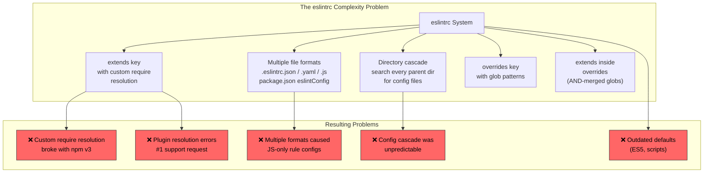
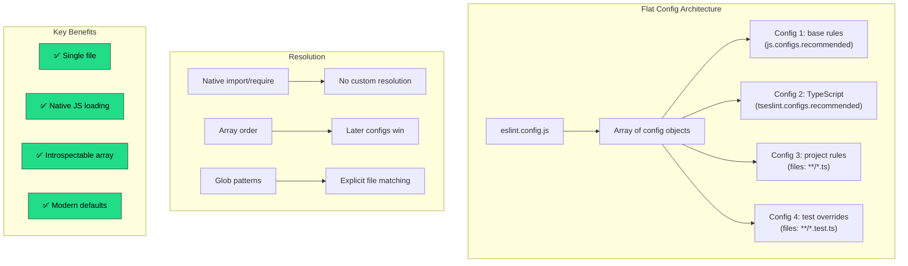
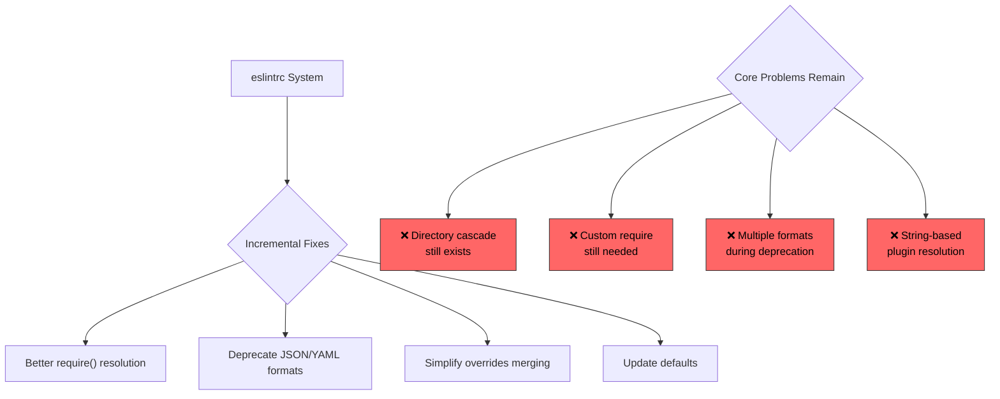
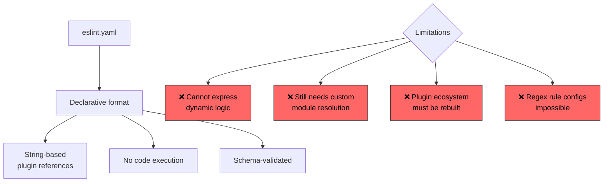
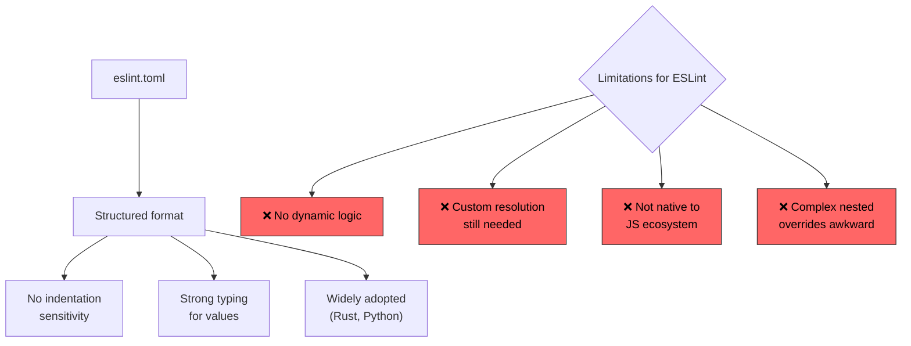
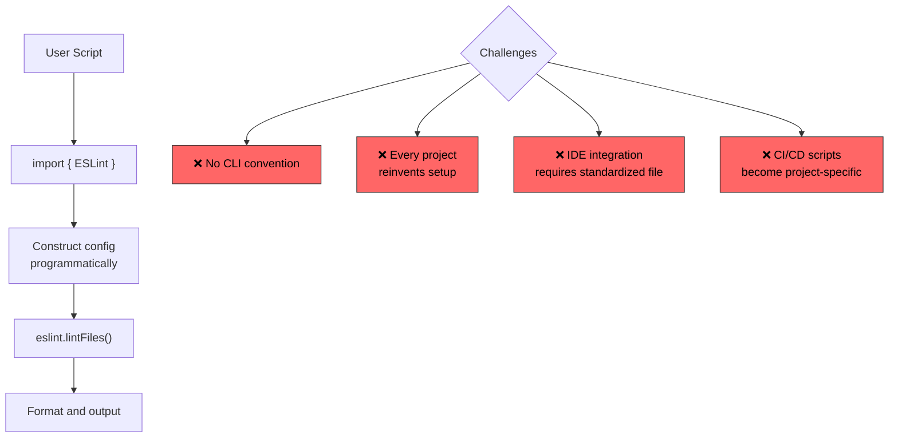
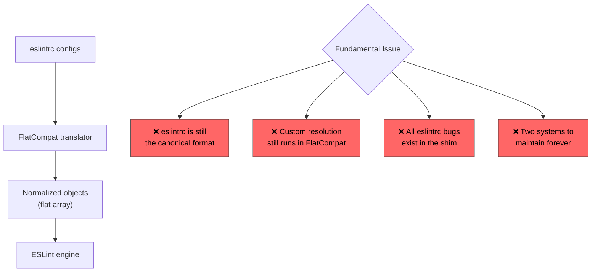

<!-- ⚠️ AUTO-GENERATED — DO NOT EDIT -->
<!-- Source of truth: ../real-world/ADR-0106-eslint-flat-config.yaml -->

> [!CAUTION]
> **This file is auto-generated** from [`ADR-0106-eslint-flat-config.yaml`](../real-world/ADR-0106-eslint-flat-config.yaml).
> Do not edit this file directly — all changes must be made in the YAML source.

# ADR-0106-eslint-flat-config: Replace the eslintrc configuration system with flat config (eslint.config.js) using native JavaScript module loading

> **Status:** `accepted`  
> **Priority:** `critical`  
> **Type:** `technology`  
> **Level:** `tactical`  
> **Confidence:** `high`  
> **Decision Owner:** Nicholas C. Zakas (ESLint Creator and TSC Chair)  
> **Decision Date:** 2022-08-01

> *In the context of ESLint's configuration architecture, facing a 9-year accumulation of complexity in the eslintrc system — cascading directory configs, multiple file formats, and custom require resolution that became ESLint's biggest source of support requests — we decided for flat config (eslint.config.js), a single JavaScript file exporting an array of config objects with glob-based file matching and native module loading, and neglected keeping eslintrc with incremental fixes, a YAML-only declarative format, TOML-based configuration, and a purely programmatic API without file convention, to achieve a single predictable config file per project, native ES module loading that eliminates custom require resolution, and explicit plugin imports as JavaScript objects, accepting that every existing eslintrc configuration must be migrated and the 18-month RFC debate nearly split the core team, because the eslintrc system's architectural problems — cascading configs, custom require, and multiple formats — were interdependent and could not be fixed incrementally.*

---

**Authors:** Nicholas C. Zakas (ESLint Creator, RFC Author), ESLint Core Team (Framework Maintainers)  
**Reviewers:** ESLint Technical Steering Committee (RFC Reviewers), Milos Djermanovic (ESLint TSC Member), Brandon Mills (ESLint TSC Member)  
**Approvals:** Nicholas C. Zakas (ESLint Creator and TSC Chair) [@nzakas] — approved 2022-08-01T00:00:00Z

---

## Context

ESLint is the dominant JavaScript linting tool, used by millions of
developers and virtually every major JavaScript project. Since its
release in 2013, ESLint's configuration system — known as "eslintrc" —
evolved through a series of incremental additions that each made logical
sense individually but accumulated into a system of extraordinary
complexity.

By 2019, Nicholas Zakas (ESLint's creator) described the situation:
"the team was collectively becoming afraid of touching anything to do
with the config system. No one really understood all of the different
permutations around calculating the final config for any given file."



The eslintrc system suffered from six compounding problems:

**1. Multiple config file formats and locations:**

ESLint supported `.eslintrc` (no extension), `.eslintrc.json`,
`.eslintrc.yaml`, `.eslintrc.yml`, `.eslintrc.js`, `.eslintrc.cjs`,
and `eslintConfig` in `package.json`. This was originally added
because "it would be trivial to allow different config file formats,"
but it created an incompatibility: JavaScript config files could pass
arbitrary objects (like RegExp instances) to rules, which was
impossible in JSON/YAML formats. Some plugin rules came to depend on
this JS-only capability, making the formats non-equivalent.

**2. Configuration cascade:**

ESLint searched every directory from the linted file's location up to
the root for config files, merging them all together. This caused
unpredictable behavior when config files existed in ancestor
directories. The `root: true` property was added as a workaround to
stop the cascade, but users frequently forgot to include it.

**3. Custom `require()` resolution — the biggest regret:**

The `extends` key loaded configs using a custom reimplementation of
Node.js `require()` resolution. When npm v3 stopped installing peer
dependencies by default in 2015, this broke shareable configs that
relied on peer dependency resolution for plugins. The resulting
"Cannot find module" errors became the single most common ESLint
support request on Discord, GitHub, and Stack Overflow. Despite
adding `--resolve-plugins-relative-to` as a workaround, the
fundamental architecture could not be fixed without rebuilding the
config system.

**4. Confusing `extends` inside `overrides`:**

When `extends` was added inside `overrides` configurations, the glob
patterns from both layers were merged using an AND operator. Zakas
acknowledged: "If you're not sure what exactly that means, you're not
alone. It's confusing even to us."

**5. Environment-based globals conflicting with `ecmaVersion`:**

Users had to set both `ecmaVersion` (for syntax) and an `env` like
`es6` (for globals) separately, which was confusing and error-prone.
The default `ecmaVersion` was still ES5 in 2022 — nearly a decade
after ES2015 became standard.

**6. The `eslint:recommended` config was a black box:**

Users could not easily introspect which rules `eslint:recommended`
enabled without consulting the documentation. The string-based
`extends` mechanism made all inherited configuration opaque.

The RFC process began in January 2019 and took 18 months of revisions
and debate. Zakas described it as "the most contentious RFC proposal
in the history of ESLint" — the team was nearly evenly split between
those who wanted to start fresh and those who believed eslintrc could
be incrementally saved.

### Business Drivers

- ESLint is the dominant JavaScript linter used in virtually every major JavaScript project — configuration complexity directly impacts millions of developers' productivity
- The #1 source of support requests (Discord, GitHub, Stack Overflow) was plugin resolution failures caused by eslintrc's custom require resolution — this consumed significant maintainer time
- ESLint's configuration system had not been fundamentally redesigned in 9 years — the incremental additions had created "almost unmaintainable" code that the core team was afraid to modify
- The JavaScript ecosystem had evolved dramatically (ES modules, TypeScript adoption, modern defaults) but eslintrc's defaults still reflected 2013-era JavaScript (ES5, CommonJS scripts)
- Competing linting tools (Rome/Biome, deno lint) were gaining attention partly due to ESLint's configuration complexity reputation

### Technical Drivers

- Custom require() reimplementation was a "significant source of complexity" and the ESLint team's "biggest regret" — it could not resolve shareable config dependencies correctly after npm v3
- The directory cascade forced ESLint to search every parent directory for config files on every lint run, increasing disk I/O and causing unpredictable behavior
- Multiple config file formats (.json, .yaml, .js, .cjs, package.json) created format incompatibilities — some rules required JavaScript objects that could not be expressed in JSON or YAML
- The extends-inside-overrides merging logic used an AND operator for glob patterns that was "confusing even to us" according to the ESLint creator
- ecmaVersion defaulted to ES5 and required separate env declarations for globals — developers had to configure both ecmaVersion and env es6 to use modern JavaScript, which was a constant source of confusion
- Plugins were referenced by string names with eslint-plugin- prefix convention, making resolution dependent on the custom require implementation rather than native module loading

### Constraints

- Existing plugins must continue to work without modification — the ESLint plugin ecosystem contains hundreds of actively maintained plugins
- Rule configuration syntax (the rules key) must remain unchanged to minimize migration friction
- A backwards compatibility utility (FlatCompat) must be provided to allow existing shareable configs to work in the new system during the migration period
- The old eslintrc system must remain available during a transition period — immediate removal would break the entire ecosystem
- The new system must use native JavaScript module loading (import / require) instead of custom resolution — this is a core design principle, not optional
- Configuration must remain file-based — a purely programmatic API without a config file convention was rejected as too un-opinionated

### Assumptions

- The JavaScript ecosystem's shift to ES modules (ESM) will continue, making a JS-based config file the natural choice
- Plugin authors will update their packages to export flat config compatible configurations — the ESLint team can provide migration tooling and documentation to accelerate this
- The FlatCompat utility will bridge the gap during migration, but eventually (in v10) eslintrc support will be fully removed and FlatCompat will handle legacy shareable configs only
- The 18-month RFC debate produced a design robust enough to last another decade — the flat config system should not need another fundamental redesign
- Community feedback will drive iterative improvements (such as defineConfig and re-introduced extends) without changing the core architecture

## Architecturally Significant Requirements

### Functional

| ID | Description |
|----|-------------|
| `F-001` | The flat config system must use a single eslint.config.js file (supporting .js, .mjs, .cjs, .ts, .mts, .cts extensions) at the project root that exports an array of configuration objects, each with optional files and ignores glob patterns for file matching.
 |
| `F-002` | Plugins must be imported as JavaScript objects using native import or require statements, with user-defined namespace keys in the plugins object, eliminating string-based plugin resolution and the eslint-plugin- prefix convention.
 |
| `F-003` | The FlatCompat utility class must translate existing eslintrc configurations (extends, environments, plugins referenced by string) into flat config arrays, enabling incremental migration without rewriting all configs at once.
 |

### Non-Functional

| ID | Description |
|----|-------------|
| `NF-001` | Configuration resolution must require only a single upward directory search for the eslint.config.js file, dramatically reducing disk I/O compared to eslintrc's per-directory cascade search.
 |
| `NF-002` | The flat config array must be fully introspectable at runtime — because configs are plain JavaScript objects in an array, tools can inspect exactly which rules apply to any file without opaque string-based extends resolution.
 |
| `NF-003` | The defineConfig() helper function must provide full TypeScript type definitions for configuration objects, enabling auto-completion, type checking, and deprecation warnings in TypeScript-aware editors.
 |
| `NF-004` | The migration path from eslintrc to flat config must span at least two major ESLint versions — eslintrc support must remain available during the transition period to avoid forcing immediate migration of the plugin ecosystem.
 |

## Alternatives Considered

### 1. Flat config — single JS file with native module loading and glob-based config array ✅

Replace the entire eslintrc system with a new "flat config"
architecture centered on a single `eslint.config.js` file that
exports an array of configuration objects. Each object specifies
`files` and `ignores` glob patterns for file matching, and all
configuration properties (rules, plugins, language options) are
defined within these objects. Plugins and shareable configs are
imported using native JavaScript `import`/`require` statements
instead of string-based resolution.

The key architectural shift is from implicit cascading to explicit
array ordering. The eslintrc system searched directories, merged
files, resolved `extends` strings, and applied `overrides` with
glob merging — all implicitly. Flat config makes everything
explicit: configs earlier in the array are overridden by later
entries, and all resolution uses native JavaScript imports.

**Old eslintrc configuration (before):**

```javascript
// .eslintrc.js — the old way
module.exports = {
  root: true,
  env: { es6: true, node: true },
  extends: [
    "eslint:recommended",
    "plugin:@typescript-eslint/recommended"
  ],
  parser: "@typescript-eslint/parser",
  parserOptions: {
    ecmaVersion: 2020,
    sourceType: "module"
  },
  plugins: ["@typescript-eslint"],   // string-based!
  rules: {
    "semi": "error",
    "no-unused-vars": "off",
    "@typescript-eslint/no-unused-vars": "error"
  },
  overrides: [{
    files: ["*.test.ts"],
    env: { jest: true },
    rules: { "no-console": "off" }
  }]
};
```

**New flat config (after):**

```javascript
// eslint.config.js — the new way
import js from "@eslint/js";
import tseslint from "typescript-eslint";
import globals from "globals";

export default [
  js.configs.recommended,                  // plain object, not string
  ...tseslint.configs.recommended,
  {
    files: ["**/*.ts"],
    languageOptions: {
      ecmaVersion: "latest",               // modern default
      sourceType: "module",
      globals: { ...globals.node }          // explicit, not env string
    },
    rules: {
      "semi": "error",
      "@typescript-eslint/no-unused-vars": "error"
    }
  },
  {
    files: ["**/*.test.ts"],
    languageOptions: {
      globals: { ...globals.jest }
    },
    rules: { "no-console": "off" }
  }
];
```



**Property mapping (eslintrc → flat config):**

| eslintrc Property | Flat Config Equivalent | Key Change |
|-------------------|----------------------|------------|
| `extends` | Array spread / `extends` in `defineConfig` | Import objects, not strings |
| `plugins` (strings) | `plugins` (imported objects) | Native module loading |
| `env` | `languageOptions.globals` | Explicit globals objects |
| `parserOptions.ecmaVersion` | `languageOptions.ecmaVersion` | Defaults to `"latest"` |
| `parserOptions.sourceType` | `languageOptions.sourceType` | Defaults to `"module"` |
| `parser` (string) | `languageOptions.parser` (object) | Imported directly |
| `overrides` | Additional array entries | Glob-based config objects |
| `root: true` | Not needed | Single file, no cascade |
| `.eslintignore` | `ignores` in config object | Part of config file |
| `rules` | `rules` | Unchanged |

**Evolution timeline:**

| Date | Milestone | Significance |
|------|-----------|--------------|
| Jan 2019 | RFC proposal opened | Most contentious RFC in ESLint history; team nearly split |
| Jul 2020 | RFC approved after 18 months | Design finalized after extensive debate |
| Aug 2022 | v8.21.0 experimental release | Flat config available via API only (not CLI) |
| Oct 2023 | v8.x CLI support | Flat config usable via CLI with opt-in flag |
| Apr 2024 | v9.0.0 — flat config default | eslintrc deprecated but still available via env var |
| Feb 2025 | defineConfig + extends | Community feedback drove TypeScript DX improvements |
| Feb 2026 | v10.0.0 — eslintrc removed | Complete removal of eslintrc; flat config is sole system |

**Pros:**
- Single configuration file eliminates the confusion of multiple formats, cascade searching, and ancestor directory configs
- Native JavaScript/ES module loading eliminates custom require resolution — the single biggest source of support requests
- Plugins imported as objects are immediately introspectable — tools can inspect exactly which rules and configs are available
- Modern defaults (ecmaVersion "latest", sourceType "module") reflect how JavaScript is actually written today, eliminating the confusing ecmaVersion + env dance
- Glob-based file matching replaces both the directory cascade and the overrides key with a single consistent mechanism
- Configuration array is fully explicit — no hidden merging, no implicit extends resolution, no opaque string lookups
- TypeScript config files (eslint.config.ts) supported natively, with defineConfig() providing full type safety and auto-completion
- Ignores are part of the config file — no separate .eslintignore file needed
- Reduced disk I/O — only one upward directory search instead of per-directory cascade searching

**Cons:**
- Every existing eslintrc configuration must be migrated — this affects millions of projects worldwide
- Plugin ecosystem needed time to adopt — many popular plugins lagged behind v9 support
- Initial flat config lacked TypeScript support and a simple extends mechanism — these were added later based on community feedback
- The 18-month RFC debate "nearly evenly split" the core team — significant internal disagreement about whether eslintrc could be incrementally saved
- Loss of declarative formats — JSON and YAML configs were simpler for basic use cases; flat config requires JavaScript knowledge
- The FlatCompat compatibility layer adds an extra dependency and cognitive overhead during migration
- Global ignores behavior in flat config was initially confusing — an ignores-only config object without files behaves differently than ignores within a files config

*Estimated cost: `high` · Risk: `medium`*

### 2. Keep eslintrc — incremental fixes to the existing system

Continue with the eslintrc configuration system and address its
problems through targeted, backward-compatible improvements:

- **Fix plugin resolution**: Improve the custom `require()`
  implementation to handle npm v3+ peer dependency changes
- **Deprecate multiple formats**: Standardize on `.eslintrc.js`
  and deprecate JSON/YAML formats over time
- **Improve overrides**: Simplify the extends-inside-overrides
  glob merging logic
- **Update defaults**: Change `ecmaVersion` default to `"latest"`
  and unify `env` with `parserOptions`
- **Better error messages**: Improve "Cannot find module" errors
  with actionable guidance

This is the "save what we have" approach — preserving backward
compatibility completely while fixing the worst pain points.

```javascript
// Improved eslintrc — hypothetical incremental fixes
module.exports = {
  root: true,
  extends: ["eslint:recommended"],
  // Improved: ecmaVersion defaults to "latest"
  // Improved: env merged with parserOptions
  parserOptions: {
    sourceType: "module"
  },
  plugins: ["@typescript-eslint"],  // still string-based
  rules: {
    "semi": "error"
  }
};
```



**Pros:**
- Zero migration cost — every existing config continues to work unchanged
- No ecosystem disruption — plugins, shareable configs, and tutorials remain valid
- Incremental improvements can be shipped in minor versions without breaking changes
- The existing system is familiar to millions of developers
- No internal team conflict — avoids the contentious RFC debate

**Cons:**
- The directory cascade is architectural — it cannot be fixed without fundamentally changing how eslintrc works
- Custom require() resolution is "a significant source of complexity and, in hindsight, unnecessary" — patching it would add more complexity to an already unmaintainable codebase
- Multiple config formats created a fatal incompatibility (JS objects in rules) that cannot be retroactively fixed without breaking plugin rules
- The core team was "afraid to touch anything to do with the config system" — incremental changes to unmaintainable code risk introducing new bugs
- Deprecating formats and changing defaults are themselves breaking changes that deliver less value than a clean redesign
- The codebase would continue to accumulate complexity with each incremental fix

*Estimated cost: `low` · Risk: `high`*

> **Rejection rationale:** The eslintrc system's problems were architectural, not incidental. The directory cascade, custom require resolution, and multiple file formats were interdependent design decisions that could not be fixed in isolation. Zakas explicitly addressed this: "The team was collectively becoming afraid of touching anything to do with the config system. No one really understood all of the different permutations." The 18-month RFC debate concluded that incremental fixes would add more complexity to an already unmaintainable system while leaving the root causes unaddressed. The custom require reimplementation — ESLint's "biggest regret" — could not be removed without breaking the string-based extends and plugins mechanism, which was the foundation of the entire eslintrc architecture.

### 3. YAML-only declarative configuration

Standardize ESLint configuration on a single YAML format, removing
JavaScript and JSON alternatives. YAML would serve as the sole
declarative configuration language, with all plugins and shareable
configs referenced by string identifiers resolved through a
well-defined module resolution algorithm.

```yaml
# eslint.yaml — hypothetical YAML-only config
version: "1.0"
extends:
  - "eslint:recommended"
  - "@typescript-eslint:recommended"
parser: "@typescript-eslint/parser"
language:
  ecma_version: latest
  source_type: module
  globals:
    - node
rules:
  semi: error
  no-unused-vars: off
overrides:
  - files: ["*.test.ts"]
    globals: [jest]
    rules:
      no-console: off
```



This approach eliminates the multi-format problem but retains the
core architectural issue of string-based module resolution. The
key advantage of declarative YAML is tooling support — schema
validation, IDE auto-completion, and machine-readable configuration.
However, ESLint's rule configuration sometimes requires JavaScript
objects (like RegExp instances), making a purely declarative format
insufficient for the existing plugin ecosystem.

**Pros:**
- Eliminates multi-format incompatibility by standardizing on one format
- YAML is human-readable and supports comments — more accessible than JSON for configuration
- Schema validation and IDE auto-completion are trivial to implement for YAML
- No code execution during configuration — the config file is pure data, reducing security concerns
- Declarative configs are easier for tools to analyze and transform

**Cons:**
- Cannot express dynamic configuration logic — conditional rules based on environment, shared utility functions, or computed patterns are impossible in YAML
- Still requires custom module resolution for plugin and shareable config strings — the biggest pain point of eslintrc remains
- Existing plugin rules that require JavaScript objects (RegExp, functions) in rule configurations would break — this is a known ecosystem incompatibility
- The entire plugin ecosystem and all tutorials would need to be rewritten for a new format
- YAML parsing introduces external dependencies and has its own complexity (indentation sensitivity, multiline strings)
- Moves against the industry trend toward JavaScript/TypeScript config files (Vite, Next.js, Rollup, etc.)

*Estimated cost: `high` · Risk: `high`*

> **Rejection rationale:** A YAML-only format would solve the multi-format problem but would retain the fundamental architectural issue that caused the most pain: string-based module resolution requiring a custom require() implementation. ESLint's flat config design principle was specifically to eliminate custom resolution by using native JavaScript imports. Additionally, some ESLint plugin rules depend on passing JavaScript objects (such as RegExp instances) in rule configurations — this functionality is impossible in a declarative format. The broader JavaScript tooling ecosystem was also moving toward JS/TS config files (Vite, Next.js, Rollup), making a YAML-only approach misaligned with industry direction.

### 4. TOML-based structured configuration

Adopt TOML (Tom's Obvious Minimal Language) as ESLint's configuration
format. TOML provides a structured, readable format that avoids
YAML's indentation pitfalls while remaining purely declarative.

```toml
# eslint.toml — hypothetical TOML config
[language]
ecma_version = "latest"
source_type = "module"

[extends]
configs = ["eslint:recommended", "@typescript-eslint:recommended"]

[rules]
semi = "error"
no-unused-vars = "off"

[[overrides]]
files = ["*.test.ts"]
[overrides.rules]
no-console = "off"
```



TOML's explicit typing and readability make it attractive for
configuration, and it has seen wide adoption in Rust (Cargo.toml)
and Python (pyproject.toml). However, it shares the same
fundamental limitation as YAML for ESLint: it cannot express
JavaScript objects in rule configurations, and it still requires
custom module resolution for plugin references.

**Pros:**
- Eliminates YAML's indentation sensitivity — TOML uses explicit section headers and inline tables
- Explicit value types — strings, integers, booleans, arrays, and tables are unambiguous
- Growing adoption in developer tooling (Rust, Python, Hugo)
- No code execution — purely declarative, easy to validate and analyze
- Comments supported natively

**Cons:**
- Not native to the JavaScript ecosystem — adds a dependency on a TOML parser with no clear ecosystem benefit
- Still requires custom module resolution for string-based plugin references — does not solve the core architectural problem
- Complex nested structures (like overrides with multiple rules) are verbose in TOML's table syntax
- Cannot express JavaScript objects in rule configs — same limitation as YAML
- Would require the entire ecosystem to learn a new format with no precedent in JavaScript tooling
- TOML has no significant adoption in the JavaScript/Node.js ecosystem

*Estimated cost: `high` · Risk: `high`*

> **Rejection rationale:** TOML shares the same fundamental limitations as YAML for ESLint's use case: it cannot express JavaScript objects in rule configurations, and it still requires custom module resolution for plugin strings. The JavaScript tooling ecosystem has no significant TOML adoption — config files in the JS world are overwhelmingly JS/TS (Vite, Next.js, Rollup, ESBuild) or JSON (package.json, tsconfig.json). TOML would introduce an unfamiliar format with additional parsing dependencies while failing to address the core architectural problem of custom require resolution.

### 5. Full programmatic API — no config file convention

Instead of defining a new config file format, expose ESLint's
configuration entirely through a programmatic JavaScript API.
Users would write a JavaScript entry point that imports the
ESLint API, constructs configuration imperatively, and invokes
linting directly.

```javascript
// lint.mjs — hypothetical fully programmatic approach
import { ESLint } from "eslint";
import tsPlugin from "@typescript-eslint/eslint-plugin";
import tsParser from "@typescript-eslint/parser";

const eslint = new ESLint({
  baseConfig: {
    plugins: { "@typescript-eslint": tsPlugin },
    languageOptions: {
      parser: tsParser,
      ecmaVersion: "latest"
    },
    rules: {
      "semi": "error",
      "@typescript-eslint/no-unused-vars": "error"
    }
  },
  overrideConfig: [{
    files: ["**/*.test.ts"],
    rules: { "no-console": "off" }
  }]
});

const results = await eslint.lintFiles(["src/**/*.ts"]);
const formatter = await eslint.loadFormatter("stylish");
console.log(formatter.format(results));
```



This approach provides maximum flexibility — users can construct
any configuration using arbitrary JavaScript logic, conditional
rules, environment detection, and dynamic plugin loading. However,
it sacrifices the convention that makes ESLint discoverable and
integrable: IDE extensions, CI/CD pipelines, and build tools all
rely on finding a known config file to determine ESLint settings.

**Pros:**
- Maximum flexibility — any JavaScript logic can construct the configuration
- Native module loading — plugins imported as objects, no custom resolution
- No format constraints — configuration can be computed dynamically from any source
- The ESLint API already exists — this approach requires no new code, only documentation

**Cons:**
- No standard config file for IDE extensions to discover — VS Code, WebStorm, and other editors rely on finding eslint config files to provide inline linting
- Every project would reinvent its own setup script — no shared convention reduces portability
- CI/CD integration becomes project-specific — there is no standard command to run
- Cannot participate in the shareable config ecosystem — configs are code, not data, making composition harder
- The ESLint CLI (which most developers use) requires a config file convention to function
- Extremely high barrier to entry for new users — requiring API knowledge to configure a linter

*Estimated cost: `low` · Risk: `critical`*

> **Rejection rationale:** ESLint's value proposition depends on convention: a known config file that IDEs, CI/CD pipelines, build tools, and the CLI can discover automatically. A purely programmatic API eliminates this convention, making ESLint unconfigurable by tools that rely on config file discovery. IDE extensions (VS Code ESLint, WebStorm) would not know how to find or apply linting rules. Additionally, most developers interact with ESLint through the CLI, not the API — removing the config file convention would force every user to write a custom lint script, dramatically increasing the barrier to entry. Flat config achieves the same native module loading benefits while preserving the file convention that makes ESLint discoverable.

### 6. FlatCompat-only migration — compatibility shim without full system redesign

Instead of designing an entirely new configuration system, invest
solely in the `FlatCompat` compatibility layer. This approach
would keep the eslintrc system as the canonical format but provide
a translation utility that converts eslintrc configs into a
normalized internal representation, fixing resolution issues along
the way.

```javascript
// eslint.config.js — FlatCompat-only approach
import { FlatCompat } from "@eslint/eslintrc";
import path from "path";

const compat = new FlatCompat({
  baseDirectory: path.dirname(new URL(import.meta.url).pathname)
});

// Everything goes through FlatCompat — no native flat config
export default [
  ...compat.extends("eslint:recommended"),
  ...compat.extends("plugin:@typescript-eslint/recommended"),
  ...compat.env({ node: true, es6: true }),
  ...compat.config({
    rules: { "semi": "error" },
    overrides: [{
      files: ["*.test.ts"],
      env: { jest: true },
      rules: { "no-console": "off" }
    }]
  })
];
```



This approach was partially implemented — `FlatCompat` exists as
a migration tool. The question is whether it should be the
permanent solution rather than a transitional bridge.

**Pros:**
- Minimum disruption — existing eslintrc configs work through the compatibility layer without rewriting
- Plugin ecosystem requires no changes — FlatCompat handles the translation
- Lower development cost — the compatibility layer is simpler to build than a full config system redesign
- Gradual — teams can migrate incrementally from FlatCompat to native flat config at their own pace

**Cons:**
- The eslintrc system remains as the canonical format — all its architectural problems persist inside the FlatCompat implementation
- Custom require() resolution still runs inside FlatCompat — the biggest pain point is deferred, not solved
- Two configuration systems must be maintained indefinitely — doubling the maintenance burden
- Performance overhead from translation — every lint run pays the cost of converting eslintrc semantics to flat config objects
- No incentive for plugin authors to adopt native flat config — the ecosystem remains on eslintrc, perpetuating the legacy system
- The compatibility layer cannot fix semantic differences — eslintrc features like the config cascade and env-based globals have no clean equivalent in a flat representation

*Estimated cost: `medium` · Risk: `high`*

> **Rejection rationale:** FlatCompat was always designed as a transitional bridge, not a permanent solution. If eslintrc remained the canonical format behind a compatibility shim, all of its architectural problems would persist inside the shim — including the custom require resolution that was the single biggest source of user issues. The ESLint team would need to maintain two configuration systems indefinitely, doubling the maintenance burden without eliminating any complexity. Additionally, plugin authors would have no incentive to adopt native flat config, keeping the ecosystem locked into the legacy system. The flat config redesign was specifically intended to create a clean break that would eventually allow full removal of eslintrc (achieved in v10.0.0).

## Decision

**Chosen alternative:** Flat config — single JS file with native module loading and glob-based config array

### Rationale

The flat config system was chosen because it addresses all of the
eslintrc system's architectural problems simultaneously through a
coherent design rather than incremental patches:

1. **Single file eliminates the cascade**: Instead of searching
   every parent directory for config files (the cascade), flat config
   uses one `eslint.config.js` file at the project root. The entire
   configuration for a project is defined in one place, making it
   immediately clear what rules apply. This eliminates the need for
   `root: true` and removes unpredictable ancestor directory configs.

2. **Native module loading eliminates custom resolution**: By using
   JavaScript `import`/`require` instead of string-based plugin
   references, flat config leverages the JavaScript runtime's own
   module resolution. This eliminates the custom `require()`
   reimplementation that Zakas called ESLint's "biggest regret" and
   that was the single largest source of user support issues.

3. **Explicit plugins as objects enable introspection**: Plugins are
   imported as JavaScript objects and assigned to user-defined
   namespace keys. This makes every plugin immediately inspectable
   at runtime — tools can enumerate available rules, configs, and
   processors without relying on opaque string-based lookups.

4. **Modern defaults reflect today's JavaScript**: Setting
   `ecmaVersion` to `"latest"` and `sourceType` to `"module"` by
   default means most projects need no language configuration at all.
   The confusing `ecmaVersion` + `env` dance is eliminated.

5. **Array-based merging is predictable**: The flat config array
   replaces both `extends` and `overrides` with a single mechanism.
   Later entries in the array override earlier ones — no implicit
   cascade, no AND-merged globs, no hidden extends resolution.

**The RFC debate itself validated the decision:**

The 18-month RFC debate (January 2019 – July 2020) was "the most
contentious RFC proposal in the history of ESLint," with the team
"almost evenly split" between incremental fixes and a clean redesign.
This level of internal disagreement was itself evidence that the
eslintrc system's complexity was severe enough to warrant a
fundamental redesign — if even the maintainers could not agree on
how to incrementally fix it, the incremental path was not viable.

### Tradeoffs

- **Ecosystem-wide migration accepted** because the alternative —
  maintaining eslintrc forever — would mean the core team continuing
  to maintain code they were "afraid to touch." Migration tooling
  (FlatCompat, `@eslint/migrate-config`) was provided to reduce
  friction, and a multi-year transition (v8 experimental → v9 default
  → v10 removal) gave the ecosystem time to adapt.

- **Plugin compatibility lag accepted** because the ESLint team
  could not force plugin authors to update. The FlatCompat utility
  bridged the gap during migration, and popular plugins (TypeScript
  ESLint, ESLint Plugin React, ESLint Plugin Import) eventually
  shipped native flat config support.

- **Initial TypeScript and DX gaps accepted** because the core
  architecture was sound — the flat config array model allowed
  iterative improvements (defineConfig, TypeScript config files,
  re-introduced extends) without changing the fundamental design.
  Community feedback drove these enhancements in 2024-2025.

- **Loss of declarative formats accepted** because the JavaScript-
  only format was the key enabler for native module loading. The
  tradeoff was explicit: declarative simplicity was sacrificed for
  resolution correctness and ecosystem alignment with the broader
  JavaScript tooling trend toward JS/TS config files.

- **Internal team conflict accepted** as an unavoidable cost of
  addressing a fundamental architectural problem. The 18-month
  RFC process ensured all perspectives were heard and the final
  design was robust.

## Consequences

### Positive

- Plugin resolution errors — the #1 ESLint support request — were eliminated by using native JavaScript module loading instead of custom require reimplementation
- Configuration is fully introspectable — because flat config is an array of plain JavaScript objects, tools can programmatically inspect exactly which rules apply to any file
- Modern defaults (ecmaVersion "latest", sourceType "module") mean most projects need zero language configuration, eliminating the confusing ecmaVersion + env dance
- Single config file per project eliminates the cascade problem — no more unexpected rules from ancestor directory configs
- TypeScript config files (eslint.config.ts) with defineConfig() provide full type safety and auto-completion
- The broader JavaScript ecosystem aligned — Vite, Next.js, Rollup, and other tools all use JS/TS config files, making ESLint's flat config feel consistent with the toolchain
- The eslintrc codebase — which the team was "afraid to touch" — was fully removed in v10, dramatically reducing ESLint's maintenance burden
- Community-driven improvements (defineConfig, extends, TypeScript configs) demonstrated that the flat config architecture was extensible without fundamental changes

### Negative

- Millions of existing projects had to migrate their eslintrc configs — despite migration tooling, this was a significant ecosystem-wide effort
- The 18-month RFC debate was "the most contentious RFC in ESLint history" — the internal team conflict consumed significant maintainer energy
- Plugin ecosystem compatibility lagged behind ESLint v9 — popular plugins like eslint-plugin-import took months to ship native flat config support
- Initial flat config DX was rough — TypeScript support, a simple extends mechanism, and global ignores clarification were all added based on community feedback after the initial release
- The transition period (v8 experimental → v9 default → v10 removal) spanned 4 years, during which both config systems coexisted and documentation had to cover both
- FlatCompat became a long-lived dependency for projects using legacy shareable configs — the "transitional" bridge lasted longer than anticipated

## Confirmation

The flat config system was introduced experimentally in ESLint
v8.21.0 (August 2022), became the default in v9.0.0 (April 2024),
and became the sole config system when eslintrc was fully removed
in v10.0.0 (February 2026).

Key milestones confirming implementation and adoption:
- **August 2022**: Flat config available via API in v8.21.0
- **October 2023**: Flat config usable via CLI with opt-in flag
- **April 2024**: v9.0.0 makes flat config the default; eslintrc
  deprecated but available via `ESLINT_USE_FLAT_CONFIG=false`
- **February 2025**: `defineConfig()` and re-introduced `extends`
  shipped based on community TypeScript feedback
- **February 2026**: v10.0.0 completely removes eslintrc, `.eslintignore`,
  eslintrc CLI flags, and `eslint-env` comments

Migration ecosystem:
- **@eslint/migrate-config**: CLI tool to automatically convert
  eslintrc files to flat config format
- **FlatCompat**: Compatibility utility for legacy shareable configs
- **typescript-eslint v8+**: Full native flat config support
- **eslint-plugin-react v7.37+**: Native flat config support
- **@eslint/config-helpers**: defineConfig for older ESLint versions

**Artifacts:**
- [https://github.com/eslint/rfcs/pull/9](https://github.com/eslint/rfcs/pull/9)
- [https://eslint.org/blog/2022/08/new-config-system-part-1/](https://eslint.org/blog/2022/08/new-config-system-part-1/)
- [https://eslint.org/blog/2022/08/new-config-system-part-2/](https://eslint.org/blog/2022/08/new-config-system-part-2/)
- [https://eslint.org/blog/2022/08/new-config-system-part-3/](https://eslint.org/blog/2022/08/new-config-system-part-3/)
- [https://eslint.org/docs/latest/use/configure/configuration-files](https://eslint.org/docs/latest/use/configure/configuration-files)
- [https://eslint.org/docs/latest/use/configure/migration-guide](https://eslint.org/docs/latest/use/configure/migration-guide)

## Dependencies

**Internal:**
- ESLint Core CLI — the command-line interface that searches for eslint.config.js and passes the config array to the linting engine
- ESLint Linter class — the internal class that accepts flat config arrays and applies rules to source files
- @eslint/js — the official package providing eslint:recommended and eslint:all as importable flat config objects
- @eslint/eslintrc — provides the FlatCompat utility for backward compatibility with legacy eslintrc shareable configs

**External:**
- typescript-eslint — the TypeScript linting integration that provides parser, plugin, and recommended flat config presets
- globals — npm package providing predefined global variable sets (node, browser, jest) as importable objects, replacing the env key
- eslint-plugin-react — popular plugin for React-specific linting rules, updated for native flat config support
- eslint-plugin-import — plugin for import/export linting rules; migration to flat config was notably delayed
- @eslint/config-helpers — utility package providing defineConfig() for ESLint versions before native TypeScript config support

## References

- [ESLint RFC #9: Config File Simplification](https://github.com/eslint/rfcs/pull/9)
- [ESLint Blog: New Config System, Part 1 — Background](https://eslint.org/blog/2022/08/new-config-system-part-1/)
- [ESLint Blog: New Config System, Part 2 — Introduction to Flat Config](https://eslint.org/blog/2022/08/new-config-system-part-2/)
- [ESLint Blog: New Config System, Part 3 — Developer Preview](https://eslint.org/blog/2022/08/new-config-system-part-3/)
- [ESLint Flat Config Documentation](https://eslint.org/docs/latest/use/configure/configuration-files)
- [ESLint Migration Guide: eslintrc to Flat Config](https://eslint.org/docs/latest/use/configure/migration-guide)
- [ESLint v9.0.0 Release Notes](https://eslint.org/blog/2024/04/eslint-v9.0.0-released/)
- [ESLint Blog: Introducing ESLint Config Inspector](https://eslint.org/blog/2024/04/eslint-config-inspector/)

## Lifecycle

- **Review cycle:** 24 months
- **Next review:** 2024-08-01

## Audit Trail

| Event | By | Date | Details |
|-------|----|------|---------|
| `created` | Nicholas C. Zakas | 2019-01-01 | RFC #9 (Config File Simplification) opened in the eslint/rfcs repository. Described by Zakas as "the most contentious RFC proposal in the history of ESLint" — the team was nearly evenly split between those who wanted to start from scratch and those who believed eslintrc could be saved with more iterations.
 |
| `updated` | ESLint TSC | 2020-07-01 | RFC approved after 18 months of revisions and debate. The final design established the core principles: single config file, native module loading, array-based flat cascade, glob-based file matching, and plugins as imported objects.
 |
| `updated` | Nicholas C. Zakas | 2022-08-01 | Flat config shipped as experimental feature in ESLint v8.21.0. Available through the API only (Linter and ESLint classes), not yet through the CLI. Zakas published a three-part blog series explaining the background, design, and developer preview.
 |
| `approved` | ESLint TSC | 2024-04-05 | ESLint v9.0.0 released with flat config as the default configuration system. The eslintrc system deprecated but still available via ESLINT_USE_FLAT_CONFIG=false environment variable. Node.js 18.18.0+ required. Multiple deprecated APIs removed.
 |
| `updated` | ESLint Core Team | 2025-02-01 | Community-driven improvements shipped: defineConfig() helper for TypeScript type safety, re-introduced extends key for simpler config composition, and native TypeScript config file support (eslint.config.ts). These addressed the most common community feedback about flat config's initial developer experience.
 |
| `updated` | ESLint Core Team | 2026-02-01 | ESLint v10.0.0 released with complete removal of the eslintrc configuration system. The .eslintrc files, .eslintignore files, eslintrc-specific CLI flags (--no-eslintrc, --env), and ESLINT_USE_FLAT_CONFIG environment variable are no longer recognized. eslint-env comments in source code are reported as errors. Flat config is now the sole configuration system.
 |
