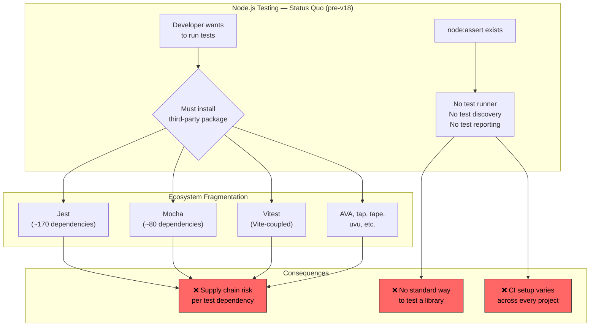
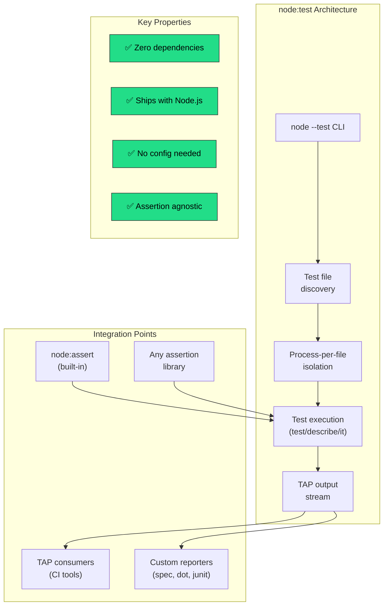
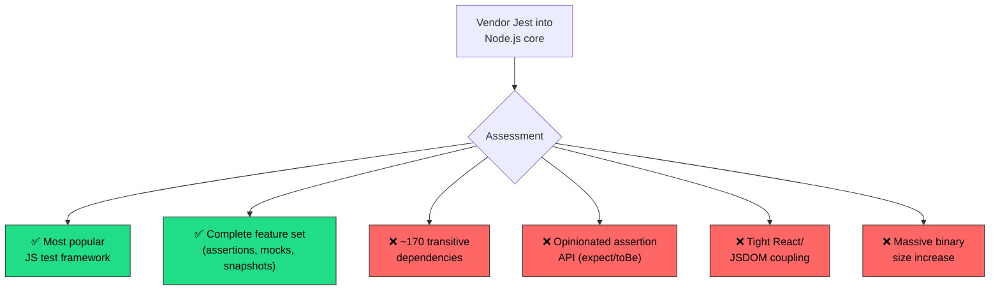
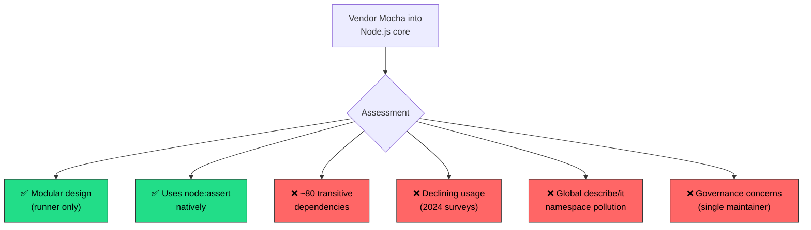
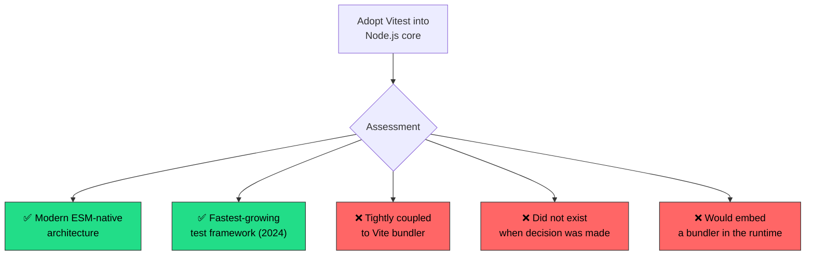
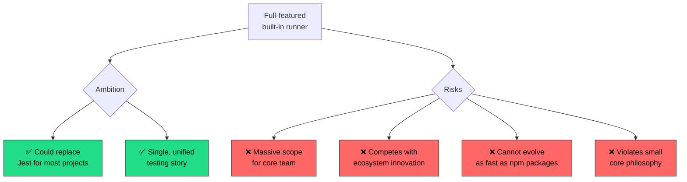
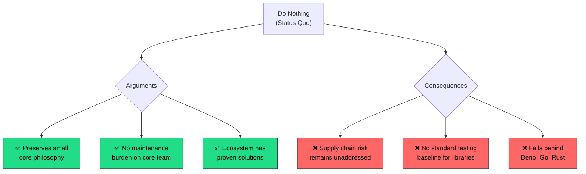

<!-- ⚠️ AUTO-GENERATED — DO NOT EDIT -->
<!-- Source of truth: ../real-world/ADR-0110-nodejs-built-in-test-runner.yaml -->

> [!CAUTION]
> **This file is auto-generated** from [`ADR-0110-nodejs-built-in-test-runner.yaml`](../real-world/ADR-0110-nodejs-built-in-test-runner.yaml).
> Do not edit this file directly — all changes must be made in the YAML source.

# ADR-0110-nodejs-built-in-test-runner: Add a built-in, minimal test runner to Node.js core, reducing dependency on third-party testing frameworks for basic test workflows

> **Status:** `accepted`  
> **Priority:** `medium`  
> **Type:** `technology`  
> **Level:** `operational`  
> **Confidence:** `high`  
> **Decision Owner:** Node.js Technical Steering Committee (Runtime Governance Body)  
> **Decision Date:** 2022-04-19

> ***In the context of** the Node.js runtime platform, **facing** growing supply chain security risks from third-party testing dependencies and the absence of any built-in testing capability in a runtime used by millions, **we decided for** a deliberately minimal built-in test runner (`node:test`) with TAP-compatible output, assertion-library agnosticism, and zero external dependencies — **and neglected** vendoring Jest, vendoring Mocha, adopting Vitest, and building a full-featured test runner — **to achieve** zero-dependency test execution for libraries and simple projects, reduced supply chain attack surface, and a standard testing baseline shipped with every Node.js installation, **accepting** limited feature set compared to mature frameworks, potential feature creep pressure, and continued need for third-party runners in complex projects, **because** the Node.js runtime should provide a minimal, secure testing foundation without prescribing a specific testing philosophy or competing with the rich ecosystem of specialized frameworks.*

---

**Authors:** Colin Ihrig (Node.js Core Contributor / Test Runner Author), Moshe Atlow (Node.js Core Contributor / Test Runner Co-maintainer)  
**Reviewers:** Node.js Core Collaborators (Runtime Maintainers), Node.js Community (GitHub Issue Participants)  
**Approvals:** Node.js TSC (Technical Steering Committee) [@nodejs/tsc] — approved 2022-03-01T00:00:00Z

---

## Context

Node.js is the most widely used server-side JavaScript runtime, with
110,000+ GitHub stars and deployment across millions of production
applications. Despite providing built-in modules for HTTP servers,
file systems, cryptography, and assertions (`node:assert`), Node.js
had no built-in way to run tests. Every Node.js developer who wanted
to write tests — a fundamental software engineering practice — had
to install third-party packages.



This situation created several interconnected problems:

**1. Supply chain security exposure through test dependencies:**

The npm ecosystem had experienced multiple high-profile supply chain
incidents — the `left-pad` deletion (March 2016) broke thousands of
builds including Babel and React, the `event-stream` compromise
(November 2018) injected cryptocurrency-stealing malware into a
package with 2 million weekly downloads, and the `ua-parser-js`
compromise (October 2021) affected a package used by AWS, Google,
and Facebook. Every third-party testing framework added dozens to
hundreds of transitive dependencies, each representing a potential
attack vector. Jest alone pulls in approximately 170 packages — a
substantial attack surface for a tool that runs in development and
CI environments with access to source code and credentials.

**2. No standard testing baseline for the ecosystem:**

Unlike Deno (which shipped a built-in test runner from day one) and
Go (which has `go test` as part of the standard toolchain), Node.js
had no opinionated path for testing. This meant every library author
made a different choice: some used Jest, some Mocha, some tap, some
AVA, some wrote raw `node:assert` scripts with no runner. Contributing
to open-source Node.js projects required learning whichever test
framework the maintainer happened to prefer.

**3. CI/CD setup fragmentation:**

Without a built-in test command, GitHub Actions workflows, Docker
CI images, and deployment scripts all needed to install and configure
testing dependencies before running tests. A simple `node --test`
command would eliminate this setup overhead for basic test suites.

**4. Tension with Node.js's "small core" philosophy:**

Historically, Node.js followed a "small core" philosophy — keeping
the runtime minimal and delegating functionality to npm packages.
This philosophy was already being re-evaluated as Node.js matured:
the addition of `node:assert`, `node:crypto`, `node:http2`, and
other modules showed that the core was growing when the benefit
justified the maintenance cost. The test runner proposal directly
challenged this philosophy, requiring explicit justification for
why testing belonged in core rather than userland.

Colin Ihrig (cjihrig), a long-time Node.js core contributor, opened
GitHub Issue #40954 in November 2021 proposing a built-in test
runner. His framing was deliberately constrained: "extremely small
and intentionally lite on features" — not a Jest replacement, but
a minimal foundation.

### Business Drivers

- Supply chain security incidents (left-pad, event-stream, ua-parser-js) demonstrated that every third-party dependency is a potential attack vector — test frameworks with hundreds of transitive dependencies represented unnecessary risk
- Node.js lacked parity with competing runtimes (Deno, Go, Rust) that ship built-in test runners, making the platform appear incomplete for modern development workflows
- Library authors needed a zero-dependency way to add tests without forcing downstream users to install a specific test framework's dependency tree

### Technical Drivers

- Third-party test frameworks pull dozens to hundreds of transitive dependencies — Jest installs approximately 170 packages, each representing a potential supply chain attack surface in CI/CD environments with access to source code and credentials
- Node.js already provided node:assert for assertions but had no mechanism for test discovery, execution, reporting, or lifecycle management — the assertion library existed without a runner
- The existing node:assert module provided a natural foundation — a built-in test runner could leverage it without introducing new assertion dependencies, keeping the addition minimal

### Constraints

- Must not bloat the Node.js binary — the test runner must have zero external dependencies and minimal impact on the runtime's size for environments like IoT and serverless
- Must not prescribe a testing philosophy — the runner must be assertion-library agnostic, allowing developers to use node:assert, Chai, or any other assertion library
- Must coexist with existing test frameworks — adoption must be voluntary, not forced; projects using Jest, Mocha, or Vitest must continue working without any changes
- Must follow Node.js's stability contract — introduced as experimental in an even-numbered LTS release, with a clear path to stable based on community feedback

### Assumptions

- A minimal test runner with basic functionality (test declaration, subtests, skip/only, lifecycle hooks) covers the majority of simple library and utility testing needs without requiring a full framework
- The npm ecosystem's supply chain security concerns will continue growing, making zero-dependency tools increasingly valuable to security-conscious organizations
- Developers working on complex applications will continue using specialized frameworks (Jest, Vitest) — the built-in runner targets the "simple test suite" use case, not full application testing

## Architecturally Significant Requirements

### Functional

| ID | Description |
|----|-------------|
| `F‑001` | The test runner must provide test declaration (`test()`, `describe()`, `it()`), subtests, and lifecycle hooks (`before`, `after`, `beforeEach`, `afterEach`) as a programmatic API accessible via `import 'node:test'`. |
| `F‑002` | The test runner must support test discovery and execution via a CLI flag (`node --test`) that automatically finds and runs test files matching configurable glob patterns. |
| `F‑003` | The test runner must produce machine-readable TAP (Test Anything Protocol) output by default, enabling integration with existing TAP-consuming tools and CI systems. |

### Non-Functional

| ID | Description |
|----|-------------|
| `NF‑001` | The test runner must have zero external dependencies — the entire implementation must be self-contained within the Node.js core, adding no new entries to the runtime's dependency tree. |
| `NF‑002` | The test runner must not measurably increase the Node.js binary size for applications that do not use it — the module must be lazily loaded only when explicitly imported or invoked via the --test flag. |

## Alternatives Considered

### 1. Built-in minimal test runner — zero-dependency node:test module with deliberate feature constraints ✅

Add a new core module (`node:test`) providing a minimal,
zero-dependency test runner built directly into the Node.js
runtime. The design philosophy is "intentionally light on features"
— providing just enough functionality to write and run tests
without any external packages, while remaining assertion-library
agnostic and framework-neutral.

The core API surface is deliberately small:

```javascript
// test.mjs — Using the built-in test runner
import { test, describe, it, before, after } from 'node:test';
import assert from 'node:assert/strict';

// Simple test
test('addition works', () => {
  assert.strictEqual(1 + 1, 2);
});

// Nested describe/it (familiar BDD-style)
describe('Array', () => {
  describe('#indexOf()', () => {
    it('should return -1 when not present', () => {
      assert.strictEqual([1, 2, 3].indexOf(4), -1);
    });
  });
});

// Subtests
test('parent test', async (t) => {
  await t.test('child test 1', () => {
    assert.ok(true);
  });
  await t.test('child test 2', () => {
    assert.ok(true);
  });
});

// Lifecycle hooks
describe('Database tests', () => {
  let db;
  before(() => { db = createConnection(); });
  after(() => { db.close(); });

  it('should connect', () => {
    assert.ok(db.isConnected());
  });
});
```

**Running tests requires no configuration:**

```bash
# Run all test files matching default glob pattern
node --test

# Run specific test files
node --test test/unit/*.mjs

# With watch mode (re-runs on file changes)
node --test --watch

# With code coverage
node --test --experimental-test-coverage
```

**Key architectural decisions:**

1. **`node:`-only import** — The module is available only via
   the `node:test` protocol prefix, preventing name collisions
   with npm packages named "test" and clearly signaling that
   this is a core module.

2. **TAP-compatible output** — Default output follows the
   Test Anything Protocol, a well-established standard with
   decades of tooling support. Custom reporters can be
   attached for different output formats (spec, dot, junit).

3. **Assertion-library agnostic** — The runner declares and
   executes tests but does not provide its own assertions.
   Developers use `node:assert`, Chai, or any library that
   throws on failure. This preserves choice.

4. **Process isolation** — Each test file runs in its own
   child process by default, preventing shared state leaks
   between test files and enabling true parallelization.



**Evolution timeline:**

| Date | Milestone | Significance |
|------|-----------|--------------|
| Nov 2021 | GitHub Issue #40954 opened | Colin Ihrig proposes built-in test runner |
| Mar 2022 | Initial `node:test` implementation merged | Experimental module added to Node.js core |
| Apr 2022 | Node.js v18.0.0 released | Test runner ships as experimental feature |
| Oct 2022 | Node.js v19 improvements | Mocking, watch mode (experimental) added |
| Apr 2023 | Node.js v20.0.0 released | Test runner marked stable (no longer experimental) |
| Oct 2023 | Node.js v21 enhancements | Glob patterns, coverage improvements, timer mocking |
| Apr 2024 | Node.js v22.0.0 released | Test runner continues expanding (module mocking) |

**Pros:**
- Zero external dependencies — the entire test runner ships with Node.js, eliminating supply chain risk for basic testing workflows
- Works immediately on any Node.js installation — no npm install, no configuration files, no setup required to write and run tests
- Assertion-library agnostic design preserves developer choice — works with node:assert, Chai, or any library that throws on failure
- Process-per-file isolation prevents shared state leaks between test files and enables true parallel execution across CPU cores
- TAP output integrates with decades of existing tooling — CI systems, reporters, and analysis tools already support TAP
- Minimal maintenance burden on Node.js core — the deliberately constrained scope limits the surface area requiring long-term support

**Cons:**
- Feature set is deliberately limited compared to Jest, Vitest, or Mocha — no built-in DOM testing, snapshot testing, or module mocking (initially), or rich assertion matchers
- Challenges Node.js's "small core" philosophy — adding a test runner to core increases the maintenance surface and sets a precedent for including developer tooling
- Risk of feature creep — community pressure to add features may push the runner beyond its minimal design intent, as acknowledged by the primary author Colin Ihrig
- Adoption remains low relative to established frameworks — as of 2025, most projects still use Jest or Vitest, limiting the practical impact of the supply chain security benefit

*Estimated cost: `low` · Risk: `low`*

### 2. Vendor Jest — adopt the most popular JavaScript testing framework as Node.js's built-in runner

Integrate Jest, the most widely used JavaScript testing framework,
directly into the Node.js core. Jest is maintained by Meta (Facebook)
and provides a comprehensive "batteries-included" testing experience
with built-in assertions, mocking, snapshot testing, code coverage,
and parallel execution.

Jest's popularity is unmatched in the JavaScript ecosystem — it is
the default testing framework for React projects and has the highest
usage numbers in annual State of JS surveys. Vendoring Jest would
give Node.js a complete testing solution immediately.

```javascript
// Jest example — batteries-included experience
describe('Calculator', () => {
  test('adds numbers', () => {
    expect(1 + 1).toBe(2);  // Built-in assertion library
  });

  test('mocks functions', () => {
    const fn = jest.fn();    // Built-in mocking
    fn(42);
    expect(fn).toHaveBeenCalledWith(42);
  });

  test('snapshot testing', () => {
    const ui = render(<Button />);
    expect(ui).toMatchSnapshot();  // Built-in snapshots
  });
});
```



**Dependency comparison:**

| Framework | Approx. Dependencies | Install Size |
|-----------|--------------------:|-------------:|
| Jest | ~170 | ~30 MB |
| Mocha | ~80 | ~10 MB |
| Vitest | ~50+ (via Vite) | ~15 MB |
| node:test | 0 | 0 MB (built-in) |

**Pros:**
- Most popular JavaScript testing framework — massive community knowledge base, documentation, and ecosystem of plugins
- Complete feature set out of the box — assertions, mocking, snapshot testing, code coverage, parallel execution, and DOM testing via JSDOM
- Default for React projects — tight integration with the most popular frontend framework

**Cons:**
- Approximately 170 transitive dependencies — vendoring Jest would directly contradict the supply chain security motivation for adding a built-in test runner
- Opinionated assertion API (expect/toBe) conflicts with Node.js's existing node:assert module — the runtime would ship two incompatible assertion systems
- Tight coupling to React and JSDOM creates maintenance obligations irrelevant to Node.js's core server-side mission — DOM testing infrastructure does not belong in a runtime
- Massive binary size increase — Jest's full dependency tree would significantly bloat the Node.js distribution, violating the constraint for IoT and serverless environments
- Meta-controlled governance — Node.js would depend on another company's project priorities for a core runtime feature

*Estimated cost: `medium` · Risk: `high`*

> **Rejection rationale:** Vendoring Jest directly contradicts the primary motivation for adding a built-in test runner: reducing supply chain risk. Jest pulls approximately 170 transitive dependencies, representing a massive attack surface. Its opinionated assertion API (expect/toBe) conflicts with Node.js's existing node:assert module, meaning the runtime would ship two incompatible assertion systems. Jest's tight coupling to React and JSDOM creates ongoing maintenance obligations for browser-oriented testing infrastructure that has no place in a server-side runtime. As Colin Ihrig noted in the original proposal, vendoring any existing framework would be a "favourite-picking exercise that's going to be fraught with pain" — the community could never agree on which framework deserved the privileged position.

### 3. Vendor Mocha — adopt the flexible, modular test framework as Node.js's built-in runner

Integrate Mocha, the longest-established JavaScript test framework,
into Node.js core. Mocha's modular design — providing only the
test runner and leaving assertion/mocking to separate libraries —
is philosophically closer to Node.js's approach than Jest's
batteries-included model.

Mocha has been a backbone of the Node.js testing ecosystem since
2011, predating Jest by several years. Its BDD/TDD interface
(`describe`/`it`/`before`/`after`) established the patterns that
most JavaScript developers recognize.

```javascript
// Mocha example — modular approach
const assert = require('assert');  // Uses node:assert

describe('Calculator', () => {
  it('adds numbers', () => {
    assert.strictEqual(1 + 1, 2);
  });
});

// But requires separate packages for mocking, coverage:
// npm install mocha chai sinon nyc
```



**Pros:**
- Modular design aligns with Node.js philosophy — Mocha provides only the runner, working naturally with node:assert for assertions
- Established BDD/TDD interface (describe/it) is the de facto standard pattern recognized by virtually all JavaScript developers
- Long history of Node.js-first development — Mocha was built primarily for Node.js, unlike Jest which was built for React

**Cons:**
- Approximately 80 transitive dependencies — smaller than Jest but still a significant supply chain surface that undermines the security motivation
- Declining usage in annual surveys — Vitest and Jest have steadily overtaken Mocha, making it an increasingly legacy choice for the runtime to embed
- Global namespace pollution — Mocha injects describe, it, before, and after into the global scope by default, which conflicts with Node.js's preference for explicit module imports
- Governance concerns — Mocha has historically depended on a small number of maintainers, creating sustainability risk for a feature embedded in the runtime

*Estimated cost: `medium` · Risk: `high`*

> **Rejection rationale:** While Mocha's modular philosophy aligns better with Node.js than Jest's batteries-included approach, it still carries approximately 80 transitive dependencies — undermining the supply chain security motivation. Mocha's declining usage in State of JS surveys makes it an increasingly questionable choice to embed permanently in the runtime. Its global namespace injection (describe/it without explicit imports) conflicts with Node.js's module-first design philosophy. Most critically, the same "favourite-picking" argument applies: choosing Mocha over Jest would alienate the largest segment of the JavaScript testing community, while choosing it over building something minimal would miss the opportunity to create a purpose-built, zero-dependency solution.

### 4. Adopt Vitest — modern, Vite-integrated test framework with native ESM support

Integrate Vitest, the modern test framework built on Vite, into
Node.js core. Vitest emerged in 2022 as a fast, ESM-native
alternative to Jest, leveraging Vite's transformation pipeline
for near-instant test startup. By 2024-2025, Vitest had become
the fastest-growing test framework in the JavaScript ecosystem.

```javascript
// Vitest example — modern ESM-native testing
import { describe, it, expect, vi } from 'vitest';

describe('Calculator', () => {
  it('adds numbers', () => {
    expect(1 + 1).toBe(2);
  });

  it('mocks modules', () => {
    const spy = vi.fn();
    spy(42);
    expect(spy).toHaveBeenCalledWith(42);
  });
});
```



**Pros:**
- Modern ESM-native architecture — built for ES modules from the ground up, aligning with Node.js's module modernization direction
- Fastest-growing test framework in the JavaScript ecosystem — rapidly gaining adoption across major frameworks (Nuxt, SvelteKit, Astro, Angular)
- Jest-compatible API surface — provides a familiar migration path for the largest segment of JavaScript testers

**Cons:**
- Tightly coupled to Vite's transformation pipeline — vendoring Vitest would require embedding a bundler (Vite) in the Node.js runtime, a massive scope expansion inappropriate for a runtime
- Did not exist when the test runner proposal was made (Nov 2021) — Vitest 0.1 was released in December 2021, making it unavailable as a candidate during the initial decision period
- Controlled by VoidZero (Evan You's company) — Node.js would depend on a single commercial entity's priorities for a core runtime feature
- Opinionated assertion API (expect/toBe) conflicts with node:assert — the same assertion duplication problem as Jest

*Estimated cost: `high` · Risk: `high`*

> **Rejection rationale:** Vitest's tight coupling to Vite makes it architecturally unsuitable for embedding in a runtime — vendoring it would effectively embed a bundler in Node.js. Vitest did not exist when the test runner proposal was made (November 2021), making it a non-option during the actual decision period. Even if it had existed, its opinionated assertion API and commercial single-company governance (VoidZero) would conflict with Node.js's goals of minimalism and community neutrality. The node:test approach deliberately avoids the philosophy of any specific framework, instead providing a neutral foundation that works with any assertion library.

### 5. Build a full-featured test runner — comprehensive built-in testing framework with assertions, mocking, and coverage

Build a complete, Jest-level testing framework directly in
Node.js core — including a custom assertion library (replacing
or supplementing node:assert), built-in mocking, snapshot testing,
code coverage, DOM testing capabilities, and a rich CLI with
interactive mode.

This approach would aim to make third-party test frameworks
entirely unnecessary for most projects, providing a "batteries-
included" experience comparable to Go's `testing` package or
Rust's built-in test framework, but with the full feature set
that JavaScript developers expect from Jest.



**Pros:**
- Could replace third-party frameworks for most projects — reducing ecosystem fragmentation and dependency exposure
- Provides a single, unified testing story for the Node.js platform — similar to Go's testing package or Rust's built-in test framework
- Would demonstrate that Node.js takes developer experience seriously as a platform-level concern

**Cons:**
- Massive maintenance burden for the Node.js core team — a full-featured test framework requires continuous innovation to keep pace with the rapidly evolving JavaScript testing landscape
- Competes directly with ecosystem innovation — embedding a full framework in core discourages third-party experimentation and locks the platform to a specific testing philosophy
- Cannot evolve as fast as npm packages — Node.js releases on a 6-month cadence with strict semver commitments, while npm packages can ship breaking improvements weekly
- Fundamentally violates Node.js's small core philosophy — adding a complete test framework sets a precedent for embedding other developer tools (linters, formatters, bundlers) in the runtime

*Estimated cost: `high` · Risk: `high`*

> **Rejection rationale:** Building a full-featured test runner would create an enormous maintenance burden for the Node.js core team, who would need to compete with the innovation pace of dedicated testing frameworks that ship updates weekly. Core modules operate under strict semver commitments with a 6-month release cycle — far too slow to keep up with the rapidly evolving JavaScript testing landscape. More fundamentally, embedding a complete framework would compete with ecosystem innovation rather than complement it — the exact opposite of Node.js's platform philosophy. As Colin Ihrig noted, the test runner was "intentionally light on features" precisely to avoid this trap, even though he acknowledged that "developers are never happy with simple and/or minimal."

### 6. Do nothing — maintain the status quo of npm-based testing

Continue Node.js's historical approach: provide no built-in
test runner and let the npm ecosystem fill the gap. This is the
"small core" orthodoxy — testing is a developer tool concern,
not a runtime concern. The npm ecosystem had successfully
provided testing solutions for over a decade.



**Pros:**
- Preserves Node.js's small core philosophy — no additional maintenance burden on the core team
- npm ecosystem has proven testing solutions — Jest, Mocha, Vitest cover every testing need
- No risk of picking a "winner" — the ecosystem remains neutral and innovation-driven

**Cons:**
- Supply chain security risk remains completely unaddressed — every test suite continues to require dozens to hundreds of third-party dependencies with potential vulnerabilities
- Node.js falls further behind competing runtimes — Deno, Go, Rust, Python, and Java all provide built-in testing, making Node.js appear incomplete
- No standard testing baseline for the ecosystem — library authors cannot add tests without forcing a framework choice on contributors, and CI setup varies across every project

*Estimated cost: `low` · Risk: `medium`*

> **Rejection rationale:** The "do nothing" approach perpetuates the supply chain security exposure that motivated the proposal. With Deno shipping a built-in test runner from day one and Go, Rust, and Python all providing standard test commands, Node.js's lack of any testing capability was increasingly seen as a gap rather than a principled stance. The "small core" philosophy had already been relaxed with the addition of modules like node:assert, node:crypto, and node:http2 — the question was no longer whether to add capabilities to core, but which capabilities justified the maintenance cost. Testing, as a fundamental software engineering practice, cleared that bar.

## Decision

**Chosen alternative:** Built-in minimal test runner — zero-dependency node:test module with deliberate feature constraints

### Rationale

The minimal built-in test runner was chosen because it uniquely
satisfies the supply chain security motivation while respecting
Node.js's platform philosophy:

1. **Zero dependencies eliminates the core problem**: The entire
   motivation was reducing third-party testing dependencies.
   Vendoring Jest (~170 deps) or Mocha (~80 deps) would
   contradict this goal. Writing a new minimal runner from
   scratch is the only approach that achieves true zero-dependency
   testing.

2. **Assertion agnosticism preserves ecosystem neutrality**:
   By using `node:assert` (already in core) rather than
   introducing a new assertion API, the test runner avoids
   prescribing a testing philosophy. Developers who prefer
   Chai or other assertion libraries can use them. This is the
   inverse of Jest's opinionated approach.

3. **Minimal scope limits maintenance burden**: Colin Ihrig
   explicitly designed the runner to be "intentionally light on
   features" because core modules operate under strict semver
   commitments that make rapid iteration impossible. A minimal
   runner can be maintained by the existing core team; a full
   framework would require a dedicated testing team.

4. **TAP output leverages existing infrastructure**: The
   Test Anything Protocol has existed since 1987 and has
   decades of tooling support. Choosing TAP as the default
   output format means `node:test` integrates with existing
   CI pipelines without custom reporter development.

5. **`node:`-prefix prevents ecosystem conflicts**: The module
   is only importable as `node:test`, a convention introduced
   specifically for core modules that might collide with npm
   package names. This ensures no backward compatibility issues.

6. **Experimental-to-stable path follows Node.js conventions**:
   Shipping as experimental in v18 and stabilizing in v20
   allowed real-world feedback to shape the API before
   committing to semver stability guarantees.

### Tradeoffs

- **Deliberate feature gap accepted** because a minimal runner
  that ships everywhere is more valuable than a full framework
  that competes with the ecosystem. Complex projects will
  continue using Jest or Vitest — and that's the intended
  outcome, not a failure.

- **"Small core" philosophy tension accepted** because the
  security and developer experience benefits of a built-in
  test runner outweigh the philosophical cost. Precedents
  like `node:assert`, `node:crypto`, and `node:http2` showed
  the community was comfortable with pragmatic core additions.

- **Feature creep risk accepted** because the modular design
  allows features to be added incrementally (mocking in v19,
  coverage in v20, timer mocking in v21) without the runner
  becoming a monolith. However, Colin Ihrig himself
  acknowledged this is an "uphill battle."

## Consequences

### Positive

- Any Node.js installation can now run tests with zero dependencies — `node --test` works without npm install on every platform
- Library authors can include tests without forcing a framework choice — contributors need only Node.js itself to run the test suite
- Supply chain attack surface for basic testing reduced to zero — no third-party packages required for simple test workflows
- CI/CD pipelines simplified for small projects — no test framework installation step needed in GitHub Actions or Docker builds

### Negative

- Feature gap drives continued third-party dependency for complex projects — most teams still need Jest or Vitest, limiting the practical supply chain benefit
- Ongoing feature creep pressure as community demands parity with established frameworks — mocking, coverage, and watch mode were added incrementally, expanding the maintenance surface
- Perception of "too little, too late" compared to Deno's built-in runner — Node.js shipped its test runner years after competitors

## Confirmation

The built-in test runner has been implemented and progressively
stabilized across multiple Node.js releases:

**Experimental phase:**
- **November 2021:** GitHub Issue #40954 opened by Colin Ihrig
- **March 2022:** Initial `node:test` implementation merged
- **April 2022:** Node.js v18.0.0 released with experimental
  `node:test` module and `node --test` CLI

**Feature expansion:**
- **October 2022:** Node.js v19 added experimental mocking
  (`t.mock`) and watch mode (`--watch`)
- **January 2023:** Node.js v18.13.0 backported watch mode

**Stabilization:**
- **April 2023:** Node.js v20.0.0 released with `node:test`
  marked as stable (no longer experimental)
- **Coverage, reporters, and timer mocking added incrementally**

**Continued evolution:**
- **April 2024:** Node.js v22 added module mocking
- **2025:** Ongoing additions while maintaining backward
  compatibility

**Artifacts:**
- [https://github.com/nodejs/node/issues/40954](https://github.com/nodejs/node/issues/40954)
- [https://nodejs.org/api/test.html](https://nodejs.org/api/test.html)
- [https://nodejs.org/en/blog/announcements/v18-release-announce](https://nodejs.org/en/blog/announcements/v18-release-announce)
- [https://nodejs.org/en/blog/announcements/v20-release-announce](https://nodejs.org/en/blog/announcements/v20-release-announce)

## Dependencies

**Internal:**
- node:assert — The existing assertion module provides the default assertion capabilities used alongside the test runner, eliminating the need for a built-in assertion library
- node:child_process — Test file isolation relies on spawning separate child processes for each test file, using the existing child process infrastructure

**External:**
- TAP specification — The Test Anything Protocol defines the default output format, ensuring compatibility with decades of existing CI tooling and TAP consumers

## References

- [GitHub Issue #40954 — Proposal: Adding a built-in test runner](https://github.com/nodejs/node/issues/40954)
- [Node.js Test Runner API Documentation](https://nodejs.org/api/test.html)
- [Colin Ihrig — Node.js Test Runner Blog Posts](https://cjihrig.com)
- [Node.js v18.0.0 Release Announcement](https://nodejs.org/en/blog/announcements/v18-release-announce)
- [Node.js v20.0.0 Release Announcement](https://nodejs.org/en/blog/announcements/v20-release-announce)

## Lifecycle

- **Review cycle:** 18 months
- **Next review:** 2023-10-19

## Audit Trail

| Event | By | Date | Details |
|-------|----|------|---------|
| `created` | Colin Ihrig | 2021-11-01 | GitHub Issue #40954 opened proposing a built-in test runner. Design described as "extremely small and intentionally lite on features." |
| `updated` | Node.js Core Team | 2022-04-19 | Node.js v18.0.0 released with experimental node:test module and node --test CLI flag. First official release as experimental. |
| `updated` | Colin Ihrig | 2022-10-18 | Node.js v19.0.0 added experimental mocking and watch mode to the test runner. Feature expansion beyond initial minimal scope. |
| `approved` | Node.js TSC | 2023-04-18 | Node.js v20.0.0 marked node:test as stable. The API committed to semver stability guarantees after one year of experimental feedback. |
| `updated` | Node.js Core Team | 2023-10-01 | Node.js v21 added glob pattern test discovery, coverage improvements, and timer mocking. Incremental feature growth continued. |
