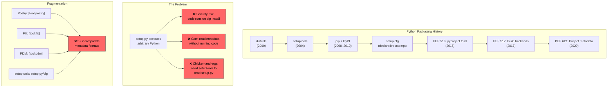
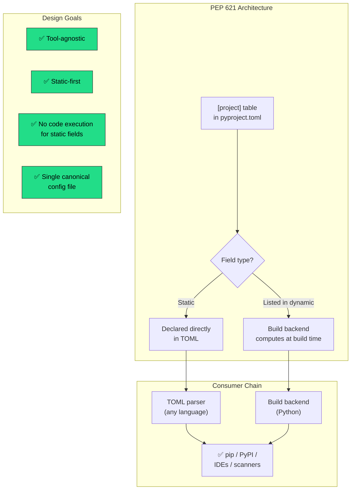
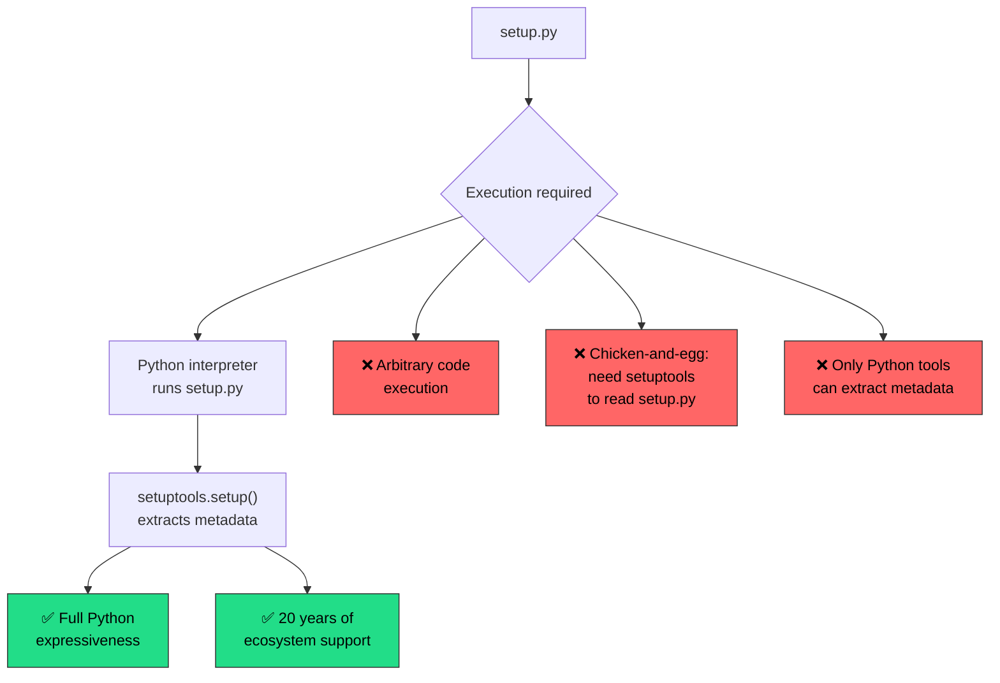
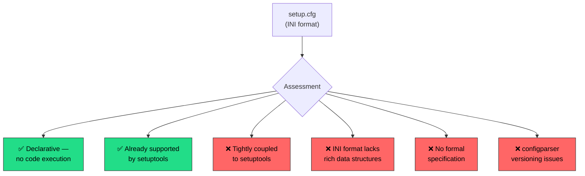
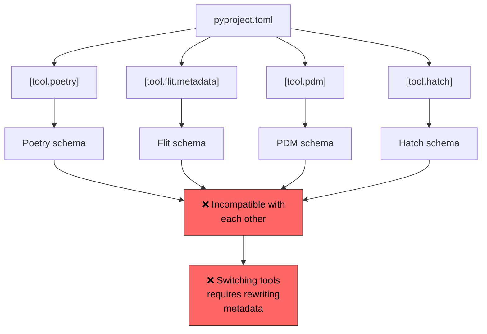
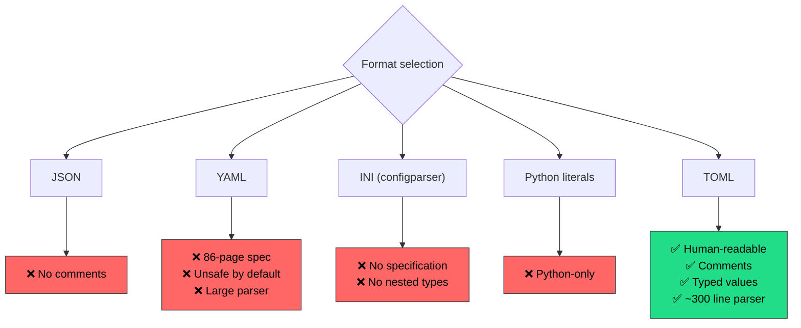

<!-- ⚠️ AUTO-GENERATED — DO NOT EDIT -->
<!-- Source of truth: ../real-world/ADR-0111-python-pyproject-toml.yaml -->

> [!CAUTION]
> **This file is auto-generated** from [`ADR-0111-python-pyproject-toml.yaml`](../real-world/ADR-0111-python-pyproject-toml.yaml).
> Do not edit this file directly — all changes must be made in the YAML source.

# ADR-0111-python-pyproject-toml: Standardize Python project metadata in pyproject.toml (PEP 621), replacing setup.py and setup.cfg with a declarative, tool-agnostic configuration format

> **Status:** `accepted`  
> **Priority:** `high`  
> **Type:** `technology`  
> **Level:** `operational`  
> **Confidence:** `high`  
> **Decision Owner:** Python Packaging Authority (PyPA) (Packaging Standards Body)  
> **Decision Date:** 2020-11-15

> ***In the context of** the Python packaging ecosystem, **facing** ecosystem fragmentation where every build tool defined project metadata differently and setup.py required executing arbitrary Python code to extract basic package information, **we decided for** a standardized `[project]` table in pyproject.toml (PEP 621) with static-first declarative metadata and an explicit `dynamic` escape hatch — **and neglected** keeping setup.py, setup.cfg-only declarative metadata, tool-specific pyproject.toml sections, and alternative file formats (YAML, JSON, INI) — **to achieve** tool-agnostic metadata portability, elimination of arbitrary code execution for metadata extraction, and a single canonical configuration file for all Python projects, **accepting** the `dynamic` field's all-or-nothing rigidity and a multi-year migration from 20 years of setup.py inertia, **because** static, declarative metadata enables faster builds, deterministic consumption, and decouples project identity from any single build tool.*

---

**Authors:** Brett Cannon (PEP 621 Author / CPython Core Developer), Dustin Ingram (PEP 621 Author / PyPI Maintainer), Paul Ganssle (PEP 621 Author / CPython Core Developer), Pradyun Gedam (PEP 621 Author / pip Maintainer)  
**Reviewers:** Python Packaging Community (Discourse Participants), PEP Delegate (PEP Review Authority)  
**Approvals:** Paul Moore (PEP Delegate) [@pfmoore] — approved 2020-11-15T00:00:00Z

---

## Context

Python's packaging ecosystem evolved over two decades from simple
script-based configuration to a fragmented landscape of competing
tools, each with their own metadata formats. At the center of this
evolution was `setup.py` — an executable Python script that served
simultaneously as build configuration, metadata declaration, and
installation logic since the introduction of `distutils` in Python
1.6 (2000).



**1. The setup.py problem — 20 years of arbitrary code execution:**

`setup.py` was a full Python script. To extract even basic metadata
like a package's name and version, tools had to *execute* the file.
This created a fundamental security problem: running `pip install`
or even `pip download` on a source distribution would execute
arbitrary code with the user's privileges. Attackers exploited this
through typosquatting (malicious packages with names similar to
popular ones), compromised maintainer accounts, and malicious
transitive dependencies. The security implication went beyond
theoretical — real-world attacks stole SSH keys, AWS credentials,
and installed cryptocurrency miners.

Beyond security, `setup.py` created a "chicken-and-egg" problem:
to determine what build dependencies a project needed, you had to
execute `setup.py`, but executing `setup.py` required those build
dependencies to be installed first. Setuptools tried to solve this
with `setup_requires`, but as Brett Cannon documented, this had
numerous issues — tools other than setuptools couldn't access the
information, and the dependencies wouldn't be installed until
*during* `setup()` execution, leading to "increasingly complex
machinations."

**2. Ecosystem fragmentation — every tool invented its own format:**

By 2020, multiple packaging tools had emerged, each with its own
metadata format:

| Tool | Config Location | Format |
|------|----------------|--------|
| setuptools | `setup.py` + `setup.cfg` | Python code + INI |
| Poetry | `[tool.poetry]` in pyproject.toml | TOML (custom schema) |
| Flit | `[tool.flit.metadata]` in pyproject.toml | TOML (custom schema) |
| PDM | `[tool.pdm]` in pyproject.toml | TOML (custom schema) |
| Hatch | `[tool.hatch]` in pyproject.toml | TOML (custom schema) |

This fragmentation meant that switching build tools required
rewriting metadata configuration entirely. A project using Poetry
couldn't migrate to Flit without manually translating its
`[tool.poetry]` section. There was no standard, tool-agnostic way
to declare "this project is named X, version Y, with these
dependencies."

**3. The pyproject.toml foundation — PEP 518 (2016) and PEP 517 (2017):**

PEP 518 (Brett Cannon, 2016) introduced `pyproject.toml` as a
standard file for declaring build system requirements, solving the
chicken-and-egg problem. PEP 517 (2017) then standardized the
build backend interface, allowing pip to work with any compliant
build tool — not just setuptools. Together, these PEPs established
`pyproject.toml` as the canonical configuration file for Python
projects. But they only covered *build system* configuration, not
*project metadata*. Each tool still defined project name, version,
dependencies, and other metadata in its own proprietary section.

PEP 621, authored by Brett Cannon, Dustin Ingram, Paul Ganssle,
Pradyun Gedam, Sébastien Eustace, Thomas Kluyver, and Tzu-ping
Chung, was created in June 2020 to fill this gap — providing a
single, standardized `[project]` table where all build tools
would read and write project metadata.

### Business Drivers

- Ecosystem fragmentation forced developers to learn tool-specific metadata formats — switching between Poetry, Flit, setuptools, or PDM required rewriting project configuration entirely
- Security incidents from setup.py code execution (typosquatting, credential theft, cryptomining malware) created reputational and operational risk for the Python ecosystem
- Package index (PyPI) and installer tools (pip) needed a way to extract metadata without executing arbitrary code, enabling faster, safer dependency resolution

### Technical Drivers

- setup.py required executing arbitrary Python code to extract metadata — a fundamental security flaw that enabled supply chain attacks through malicious packages on PyPI
- The chicken-and-egg problem of setup.py meant build dependencies could not be determined without first installing the build tool, creating circular dependency chains that pip resolved by hardcoding setuptools as the default
- PEP 518 and PEP 517 had already established pyproject.toml as the canonical build configuration file, but project metadata remained fragmented across tool-specific sections, preventing interoperability between build backends

### Constraints

- Must not break existing projects — adoption of PEP 621 metadata must be opt-in, with setup.py and setup.cfg continuing to work for projects that have not migrated
- Must be tool-agnostic — the metadata format must not privilege any single build backend (setuptools, Poetry, Flit, PDM, Hatch) over others
- Must support both static and dynamic metadata — some fields like version may need to be computed at build time (e.g., from VCS tags via setuptools-scm), requiring an escape hatch from pure static declaration
- Must use the existing pyproject.toml file and TOML format as established by PEP 518 — introducing a new file or format would fragment the ecosystem further

### Assumptions

- The majority of project metadata is inherently static (name, description, license, authors, URLs) and benefits from being declared rather than computed, making a static-first design appropriate for most projects
- Build tools will adopt the standard [project] table rather than continuing to maintain proprietary metadata sections, driven by user demand for portability and reduced vendor lock-in
- Projects with genuinely dynamic metadata (version from VCS, platform-conditional dependencies) represent a minority that can use the dynamic escape hatch without undermining the static-first design goal

## Architecturally Significant Requirements

### Functional

| ID | Description |
|----|-------------|
| `F-001` | The [project] table must support all core metadata fields defined in the Python packaging core metadata specification, including name, version, description, authors, license, dependencies, optional-dependencies, URLs, entry-points, and classifiers. |
| `F-002` | A dynamic field must allow projects to explicitly list which metadata fields will be provided by the build backend at build time, clearly distinguishing intentionally unspecified metadata from accidentally omitted metadata. |
| `F-003` | Build backends must raise an error if a field is both statically specified and listed in dynamic, enforcing the all-or-nothing constraint that prevents ambiguous metadata provenance. |

### Non-Functional

| ID | Description |
|----|-------------|
| `NF-001` | Metadata extraction must be possible without executing arbitrary Python code — tools must be able to parse the [project] table using a standard TOML parser without invoking a build backend for statically specified fields. |
| `NF-002` | The metadata format must be consumable by tools written in any programming language — not just Python — enabling cross-ecosystem tooling for dependency analysis, security scanning, and IDE integration. |
| `NF-003` | Adoption must be non-disruptive — projects using setup.py, setup.cfg, or tool-specific pyproject.toml sections must continue to work without modification until they choose to migrate. |

## Alternatives Considered

### 1. Standardized [project] table in pyproject.toml — PEP 621 with static-first metadata and dynamic escape hatch ✅

Define a new `[project]` table in `pyproject.toml` where all
build tools read and write project metadata using a standardized
schema. The design follows a "static-first" philosophy: metadata
should be declared directly in the TOML file wherever possible,
with an explicit `dynamic` field serving as an escape hatch for
fields that genuinely need to be computed at build time.

The `[project]` table maps directly to the Python core metadata
specification, using familiar field names while embracing more
modern terminology where appropriate (e.g., `dependencies`
instead of `install_requires`).

```toml
# pyproject.toml — PEP 621 metadata example
[project]
name = "my-package"
version = "1.0.0"
description = "A well-configured Python package"
readme = "README.md"
requires-python = ">=3.8"
license = {file = "LICENSE"}
authors = [
    {name = "Jane Developer", email = "jane@example.com"},
]
dependencies = [
    "httpx>=0.24",
    "pydantic>=2.0",
]

[project.optional-dependencies]
test = ["pytest>=7.0", "pytest-cov"]
docs = ["sphinx>=6.0"]

[project.urls]
Homepage = "https://example.com"
Repository = "https://github.com/example/my-package"

[project.scripts]
my-cli = "my_package:cli.main"

[build-system]
requires = ["hatchling"]
build-backend = "hatchling.build"
```

**The `dynamic` field — the critical design tension:**

For fields that cannot be determined statically (e.g., version
derived from Git tags via `setuptools-scm`), the `dynamic` field
explicitly lists which fields the build backend will compute:

```toml
[project]
name = "my-package"
dynamic = ["version"]  # version provided by build backend

[tool.setuptools.dynamic]
version = {attr = "my_package.__version__"}
```

The design enforces an "all-or-nothing" rule: a field is either
fully static or fully dynamic. A build backend must raise an
error if a field is both specified statically and listed in
`dynamic`. This strictness was deliberate — it disambiguates
intent when metadata is absent and allows static analysis tools
to know exactly which fields are trustworthy without invoking
the build process.



**Tool adoption timeline:**

| Date | Milestone | Significance |
|------|-----------|--------------|
| May 2016 | PEP 518 accepted | pyproject.toml introduced for build requirements |
| 2017 | PEP 517 accepted | Build backend interface standardized |
| Jun 2020 | PEP 621 created | Project metadata specification drafted |
| Nov 2020 | PEP 621 accepted (provisional) | Paul Moore approves as PEP delegate |
| Mar 2021 | PEP 621 finalized | Specification declared final |
| Mar 2022 | setuptools 61.0.0 | setuptools supports pyproject.toml metadata |
| Jan 2023 | pip implements PEP 621 support | Package installer reads [project] table |
| Jan 2025 | Poetry 2.0 | Poetry adopts PEP 621 [project] table |

**Pros:**
- Tool-agnostic metadata portability — projects can switch between setuptools, Flit, Hatch, PDM, or Poetry without rewriting metadata configuration
- Static metadata extraction without code execution — tools in any language can parse the [project] table using a TOML parser, enabling faster and safer dependency resolution
- Single canonical configuration file — pyproject.toml serves as the one file for build system, project metadata, and tool configuration, eliminating the setup.py + setup.cfg + MANIFEST.in proliferation
- Explicit dynamic/static distinction clarifies intent — tools know which fields are trustworthy without invoking the build backend, unlike setup.py where everything was potentially dynamic
- Familiar field names with modern ergonomics — uses dependencies instead of install_requires, aligning with how developers think about their projects rather than setuptools internals
- Ecosystem convergence — Flit, Hatch, PDM adopted immediately; setuptools added support in v61; Poetry aligned in v2.0

**Cons:**
- The dynamic field's all-or-nothing rule creates friction for projects needing partially dynamic metadata — a field cannot have a static base with dynamic extension
- Multi-year migration burden — 20 years of setup.py inertia means millions of existing packages must eventually migrate, creating a long tail of legacy configuration files
- Poetry's delayed alignment (not until v2.0 in January 2025) left a significant fraction of the ecosystem on proprietary [tool.poetry] metadata for years after PEP 621 was finalized
- TOML's limited expressiveness compared to Python code means complex build logic (conditional dependencies, platform-specific configuration) requires the dynamic escape hatch or tool-specific [tool.*] sections

*Estimated cost: `medium` · Risk: `low`*

### 2. Keep setup.py — maintain the status quo of executable configuration scripts

Continue using `setup.py` as the primary configuration file for
Python packages. `setup.py` is a full Python script that invokes
`setuptools.setup()` with keyword arguments defining all project
metadata, build configuration, and installation logic in a single
executable file.

This approach had been the de facto standard since `distutils`
was added to the Python standard library in 2000, with
`setuptools` extending it from 2004 onward. By 2020, virtually
every Python package on PyPI was distributed with a `setup.py`.

```python
# setup.py — the 20-year-old approach
from setuptools import setup, find_packages

setup(
    name="my-package",
    version="1.0.0",
    description="A Python package",
    author="Jane Developer",
    author_email="jane@example.com",
    packages=find_packages(),
    install_requires=[
        "requests>=2.25",
        "click>=8.0",
    ],
    extras_require={
        "test": ["pytest>=7.0"],
    },
    entry_points={
        "console_scripts": [
            "my-cli=my_package.cli:main",
        ],
    },
    classifiers=[
        "Programming Language :: Python :: 3",
        "License :: OSI Approved :: MIT License",
    ],
)
```



**Evolution timeline of setup.py:**

| Date | Milestone | Significance |
|------|-----------|--------------|
| 1998 | distutils created | Greg Ward creates the first Python build system |
| 2000 | Python 1.6 | distutils added to the standard library |
| 2004 | setuptools released | Phillip Eby extends distutils with dependency management |
| 2008 | pip created | Modern installer replaces easy_install |
| 2012 | Wheel format (PEP 427) | Binary distribution format reduces need for setup.py execution |
| 2016 | PEP 518 | pyproject.toml introduced — the beginning of the end for setup.py |
| 2020 | PEP 632 | distutils deprecated in Python 3.10 |
| 2023 | Python 3.12 | distutils removed from standard library |

**Pros:**
- Maximum flexibility — full Python expressiveness allows computed metadata, conditional logic, platform detection, and complex build orchestration in a single file
- Universal ecosystem support — every Python packaging tool, tutorial, and CI/CD pipeline has supported setup.py for 20 years
- Zero migration cost — the entire existing ecosystem already uses this approach

**Cons:**
- Requires executing arbitrary Python code to extract metadata — a fundamental supply chain security vulnerability exploited through typosquatting and malicious packages on PyPI
- Chicken-and-egg dependency problem — setup.py cannot be read without installing its build dependencies, but the dependencies are declared inside the file that requires them to run
- Tightly coupled to setuptools — pip hardcodes setuptools as the default build tool, preventing alternative build backends from gaining traction without friction
- Non-portable metadata — only Python tools can parse setup.py, preventing cross-language tooling for dependency analysis, security scanning, and IDE integration

*Estimated cost: `low` · Risk: `high`*

> **Rejection rationale:** setup.py's fundamental design flaw — requiring arbitrary code execution to extract basic metadata — made it a persistent supply chain security risk. The chicken-and-egg problem where build dependencies could not be determined without first executing the file led pip to hardcode setuptools as the default, creating an anticompetitive bottleneck that prevented alternative build tools from emerging. As Brett Cannon documented in PEP 518, setuptools' setup_requires mechanism had "numerous issues" and led to "increasingly complex machinations." The packaging community's 20 years of experience with setup.py demonstrated that executable configuration files are fundamentally the wrong abstraction for declaring project identity — metadata should be data, not code.

### 3. Declarative setup.cfg only — extend the existing INI-based configuration system

Expand `setup.cfg` to serve as the sole declarative metadata
file, completely replacing the need for `setup.py` code. By
2020, setuptools already supported reading most metadata from
`setup.cfg` in an INI-like format, reducing the amount of
Python code needed in `setup.py`.

```ini
# setup.cfg — declarative metadata in INI format
[metadata]
name = my-package
version = 1.0.0
description = A Python package
author = Jane Developer
author_email = jane@example.com
license = MIT

[options]
packages = find:
install_requires =
    requests>=2.25
    click>=8.0

[options.extras_require]
test =
    pytest>=7.0

[options.entry_points]
console_scripts =
    my-cli = my_package.cli:main
```



**Pros:**
- Declarative format — metadata can be read without executing Python code, solving the security concern
- Already supported by setuptools — no new tooling needed for existing projects, minimizing migration effort
- Familiar to Python developers — many projects already used partial setup.cfg declarations alongside setup.py

**Cons:**
- Tightly coupled to setuptools — setup.cfg's schema is defined by setuptools, not by a cross-tool standard, making it impossible for alternative build backends to reliably consume
- INI format limitations — no native support for nested data structures, arrays, or typed values; configparser treats everything as strings, making dependency specifications error-prone
- No formal specification — the schema for setup.cfg was never rigorously defined, leading to differences between Python 2 and Python 3 configparser implementations and version skew across tools
- Still required a minimal setup.py — even with setup.cfg handling metadata, a setup.py stub was often needed to invoke the build, perpetuating the chicken-and-egg problem

*Estimated cost: `low` · Risk: `medium`*

> **Rejection rationale:** setup.cfg solved the "code execution for metadata" problem but remained fundamentally coupled to setuptools. As PEP 518 noted, "the schema for that file has never been rigorously defined and thus it's unknown which format would be safe to use going forward." The INI format's inability to express rich data structures (nested tables, typed arrays) made it awkward for complex metadata like optional-dependencies. Most critically, setup.cfg was a setuptools-specific format — standardizing on it would have enshrined setuptools' monopoly rather than enabling tool-agnostic metadata that any build backend could consume. The goal of PEP 621 was exactly this decoupling: separating project identity from build tool choice.

### 4. Tool-specific pyproject.toml sections — each tool defines its own [tool.*] metadata schema

Continue the pattern where each build tool defines its own
metadata section under `[tool.*]` in `pyproject.toml`. By 2020,
this was already the *de facto* approach: Poetry used
`[tool.poetry]`, Flit used `[tool.flit.metadata]`, and other
tools had their own schemas.

PEP 518 explicitly reserved the `[tool]` namespace for build
tools, making this a sanctioned approach. Under this alternative,
there would be no standardized `[project]` table — each tool
would continue to innovate independently.

```toml
# Poetry's proprietary format
[tool.poetry]
name = "my-package"
version = "1.0.0"
description = "A Python package"
authors = ["Jane Developer <jane@example.com>"]

[tool.poetry.dependencies]
python = "^3.8"
requests = "^2.25"
click = "^8.0"
```

```toml
# Flit's proprietary format — different structure
[tool.flit.metadata]
module = "my_package"
author = "Jane Developer"
author-email = "jane@example.com"

[tool.flit.metadata.requires]
requests = ">=2.25"
```



**Pros:**
- Maximum tool innovation — each build tool can design the most ergonomic metadata schema for its specific workflow without compromise
- No standards process overhead — tools can iterate on their metadata format independently, shipping improvements without waiting for PEP approval
- Already implemented and working — Poetry, Flit, PDM, and Hatch already had functioning tool-specific metadata sections by 2020

**Cons:**
- Complete vendor lock-in — a project's metadata is written in a tool-specific format, making migration to a different build backend require full metadata rewriting
- No cross-tool interoperability — pip, PyPI, IDEs, and security scanners cannot extract metadata without understanding every tool's proprietary schema
- Ecosystem fragmentation worsens over time — as new tools emerge, each adds another incompatible metadata format, increasing the learning burden for developers
- Duplicated innovation — every tool independently solves the same metadata representation problems (dependency specification, version constraints, entry points) with slightly different syntax

*Estimated cost: `low` · Risk: `high`*

> **Rejection rationale:** Tool-specific metadata sections perpetuated the fragmentation that motivated PEP 621 in the first place. While PEP 518 reserved the [tool] namespace for build-tool-specific configuration, using it for *project metadata* — the identity of the project itself — created vendor lock-in. The PEP 621 authors' design rationale explicitly stated the goal of providing "a tool-agnostic way of specifying metadata for ease of learning and transitioning between build back-ends." Without a standard [project] table, every tool would continue inventing slightly different ways to express the same information, and switching tools would remain needlessly painful. The standard [project] table complements tool-specific [tool.*] sections: common metadata goes in [project], tool-specific build config goes in [tool.*].

### 5. Alternative file formats — use YAML, JSON, or INI instead of TOML for project configuration

Choose a different serialization format instead of TOML for
`pyproject.toml`. PEP 518 extensively evaluated multiple file
formats before selecting TOML, considering JSON, YAML,
configparser (INI), and Python literals.

Each format had distinct tradeoffs:

**JSON** was rejected because, while universally understood,
it does not support comments — a critical shortcoming for a
configuration file that developers need to annotate. The syntax
is also more verbose than necessary for human editing.

**YAML** was rejected for three reasons: (1) the specification
is 86 pages long, creating the risk that parsers implement
different subsets; (2) YAML is "not safe by default" — the
specification allows arbitrary code execution, ironic given
the security motivation for moving away from setup.py; and
(3) the most popular Python YAML library (PyYAML) is thousands
of lines of code, making it difficult to vendor into pip.

**configparser (INI)** was rejected because there is no formal
specification — what Python 2's ConfigParser accepts differs
from Python 3's configparser, and there is no guarantee of
cross-version consistency.

**Python literals** (parsed via `ast.literal_eval()`) were
considered but rejected as a Python-specific format that
non-Python tools could not consume.



| Format | Comments | Typed Values | Spec Size | Python Parser Size | Safe by Default |
|--------|:--------:|:------------:|:---------:|:------------------:|:---------------:|
| TOML | ✅ | ✅ | Compact | ~300 lines | ✅ |
| JSON | ❌ | ✅ | Compact | stdlib | ✅ |
| YAML | ✅ | ✅ | 86 pages | ~5000 lines | ❌ |
| INI | ✅ | ❌ | None | stdlib | ✅ |
| Python literals | ✅ | ✅ | N/A | stdlib | ✅ |

**Pros:**
- YAML and JSON are more widely known than TOML — lower learning curve for developers coming from web development ecosystems
- JSON has universal parser support in every programming language with zero extra dependencies
- INI format uses Python's stdlib configparser — no external dependency needed

**Cons:**
- JSON lacks comment support — configuration files require annotations for developer communication, and JSON provides no mechanism for inline documentation
- YAML's specification is 86 pages long with implicit typing rules that cause surprising behavior — a format designed to eliminate security risks from setup.py should not introduce new ones through YAML's unsafe-by-default code execution
- INI via configparser has no formal specification and inconsistent behavior across Python versions — a packaging standard cannot be built on an unspecified foundation
- TOML was already chosen by PEP 518 for pyproject.toml — using a different format for project metadata in the same file is impossible, and creating a separate file would fragment configuration across multiple files

*Estimated cost: `low` · Risk: `medium`*

> **Rejection rationale:** The file format question was settled by PEP 518 in 2016 when TOML was chosen for pyproject.toml after extensive evaluation. PEP 621 did not revisit this decision — it built upon the established TOML foundation. JSON's lack of comments made it unsuitable for human-edited configuration. YAML's unsafe-by-default specification was ironic given that PEP 621's primary motivation was eliminating arbitrary code execution from metadata extraction. TOML's compact specification, support for comments and typed values, and ability to be implemented in approximately 300 lines of pure Python (pytoml) made it the pragmatic choice that balanced human readability with machine parseability.

## Decision

**Chosen alternative:** Standardized [project] table in pyproject.toml — PEP 621 with static-first metadata and dynamic escape hatch

### Rationale

PEP 621 was chosen because it uniquely solved the three
interconnected problems of the Python packaging ecosystem:

1. **Tool-agnostic metadata eliminates vendor lock-in**: By
   defining a standard `[project]` table that all build tools
   read, PEP 621 decoupled project identity from build tool
   choice. A project can declare its name, version, and
   dependencies once in `[project]` and switch between
   setuptools, Flit, Hatch, PDM, or Poetry by only changing
   the `[build-system]` table. This was the explicit design
   goal: "a tool-agnostic way of specifying metadata for ease
   of learning and transitioning between build back-ends."

2. **Static-first design eliminates code execution for metadata
   extraction**: Unlike `setup.py`, which required executing
   arbitrary Python to determine even a package's name, PEP 621
   metadata is pure TOML data that any parser in any language
   can read. This enables pip, PyPI, IDEs, and security scanners
   to extract metadata without running code — a fundamental
   security improvement.

3. **The `dynamic` field provides a principled escape hatch**:
   Rather than requiring everything to be static (which would
   break projects using VCS-based versioning), PEP 621 introduced
   an explicit opt-in mechanism. Projects must list which fields
   are dynamic, making it clear to tools which metadata is
   trustworthy without invoking the build backend. This "static
   by default, dynamic by exception" approach was the key
   design insight.

4. **Building on PEP 518 and PEP 517 foundations**: PEP 621
   completed the pyproject.toml vision by adding the missing
   project metadata layer on top of PEP 518's build requirements
   and PEP 517's backend interface. The final architecture
   gives each file section a clear purpose: `[build-system]`
   for build deps, `[project]` for metadata, `[tool.*]` for
   tool-specific config.

5. **Ecosystem convergence validated the design**: Flit, Hatch,
   PDM, and maturin adopted PEP 621 immediately. Setuptools
   added full support in v61.0.0 (March 2022). Poetry, the
   most prominent holdout, finally adopted PEP 621 in v2.0
   (January 2025). This gradual but comprehensive adoption
   confirmed that the standard served diverse tool philosophies.

### Tradeoffs

- **`dynamic` field's all-or-nothing rigidity accepted** because
  the strict separation between static and dynamic metadata
  enables tooling to know which fields are trustworthy without
  invoking the build backend. The alternative — allowing
  "partially dynamic" fields where a static base could be
  extended dynamically — was considered too complex and
  ambiguous. Community requests for partial-dynamic support
  continue, but the original design prioritized clarity over
  flexibility.

- **Multi-year migration burden accepted** because the adoption
  was designed to be fully opt-in. Existing `setup.py` and
  `setup.cfg` files continued to work unchanged. The migration
  cost was spread across the ecosystem over years, with each
  tool adding PEP 621 support on its own timeline.

- **TOML's limited expressiveness compared to Python accepted**
  because the constraint was the point. Complex build logic
  that required Python code belonged in the build backend,
  not in the metadata declaration. The separation of concerns
  — static metadata in `[project]`, dynamic computation in
  the build backend — was a deliberate architectural boundary.

## Consequences

### Positive

- Projects can switch build backends by changing only [build-system] — metadata in [project] is portable across setuptools, Flit, Hatch, PDM, and Poetry
- Package metadata is extractable without code execution — pip, PyPI, and security scanners parse TOML directly for static fields
- Single pyproject.toml replaces the setup.py + setup.cfg + MANIFEST.in file proliferation that every Python project maintained for decades
- Ecosystem convergence accelerated — all major build tools support PEP 621, reducing the learning curve for new Python developers

### Negative

- The dynamic field's strictness creates friction for projects needing hybrid static-dynamic metadata, spawning ongoing community debate about relaxing the all-or-nothing rule
- Poetry's delayed adoption (v2.0, January 2025) left the largest alternative package manager on proprietary metadata format for four years after PEP 621 was finalized
- Migration from setup.py remains incomplete for legacy packages — many older PyPI packages still use executable configuration, leaving the security benefit partially unrealized

## Confirmation

PEP 621 has been implemented and adopted across the Python
packaging ecosystem:

**Standards acceptance:**
- **November 2020:** PEP 621 accepted (provisional) by PEP
  delegate Paul Moore
- **March 2021:** PEP 621 declared Final — specification locked

**Build tool adoption:**
- **Flit, Hatch, PDM, maturin:** Immediate adoption of [project]
  table upon PEP 621 finalization
- **March 2022:** setuptools 61.0.0 adds full pyproject.toml
  metadata support — the dominant build tool now reads [project]
- **January 2023:** pip implements PEP 621 support for metadata
  extraction
- **January 2025:** Poetry 2.0 adds PEP 621 [project] table
  support — the last major holdout aligns

**Ecosystem metric:**
- By 2023, the majority of new PyPI packages used pyproject.toml
  with [project] metadata rather than setup.py

**Artifacts:**
- [https://peps.python.org/pep-0621/](https://peps.python.org/pep-0621/)
- [https://peps.python.org/pep-0518/](https://peps.python.org/pep-0518/)
- [https://peps.python.org/pep-0517/](https://peps.python.org/pep-0517/)
- [https://packaging.python.org/en/latest/guides/writing-pyproject-toml/](https://packaging.python.org/en/latest/guides/writing-pyproject-toml/)

## Dependencies

**Internal:**
- PEP 518 (pyproject.toml file) — established pyproject.toml as the canonical configuration file for Python projects, providing the foundation that PEP 621 builds upon for project metadata
- PEP 517 (build backend interface) — standardized the build backend API that PEP 621's dynamic field delegates to for computed metadata, decoupling build frontends from backends
- Core metadata specification — PEP 621 maps directly to the existing core metadata fields, ensuring compatibility with PyPI and other packaging infrastructure

**External:**
- TOML specification — the file format chosen by PEP 518 that PEP 621 inherits, providing human-readable configuration with comments, typed values, and a compact parser implementation

## References

- [PEP 621 — Storing project metadata in pyproject.toml](https://peps.python.org/pep-0621/)
- [PEP 518 — Specifying Minimum Build System Requirements for Python Projects](https://peps.python.org/pep-0518/)
- [PEP 517 — A build-system independent format for source trees](https://peps.python.org/pep-0517/)
- [Python Packaging User Guide — Writing pyproject.toml](https://packaging.python.org/en/latest/guides/writing-pyproject-toml/)
- [PEP 632 — Deprecate distutils module](https://peps.python.org/pep-0632/)

## Lifecycle

- **Review cycle:** 18 months
- **Next review:** 2022-05-15

## Audit Trail

| Event | By | Date | Details |
|-------|----|------|---------|
| `created` | Brett Cannon | 2020-06-29 | PEP 621 created by Brett Cannon, Dustin Ingram, Paul Ganssle, and Pradyun Gedam. Specified project metadata in pyproject.toml. |
| `approved` | Paul Moore | 2020-11-15 | PEP 621 accepted as provisional by PEP delegate Paul Moore. Specification open for implementation feedback. |
| `updated` | PEP Authors | 2021-03-01 | PEP 621 declared Final. Specification locked — all core metadata fields standardized in the [project] table. |
| `updated` | setuptools maintainers | 2022-03-15 | setuptools 61.0.0 released with full pyproject.toml metadata support. The dominant build tool now reads [project] natively. |
| `updated` | pip maintainers | 2023-01-15 | pip implements PEP 621 support for metadata extraction. The primary installer can now read [project] table directly. |
