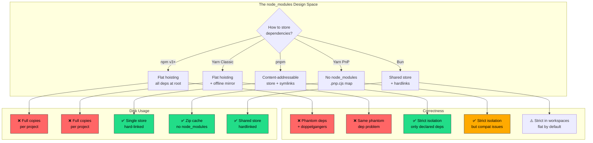
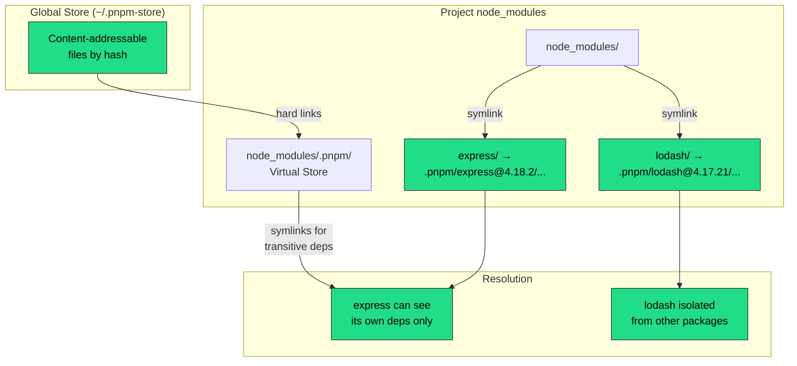
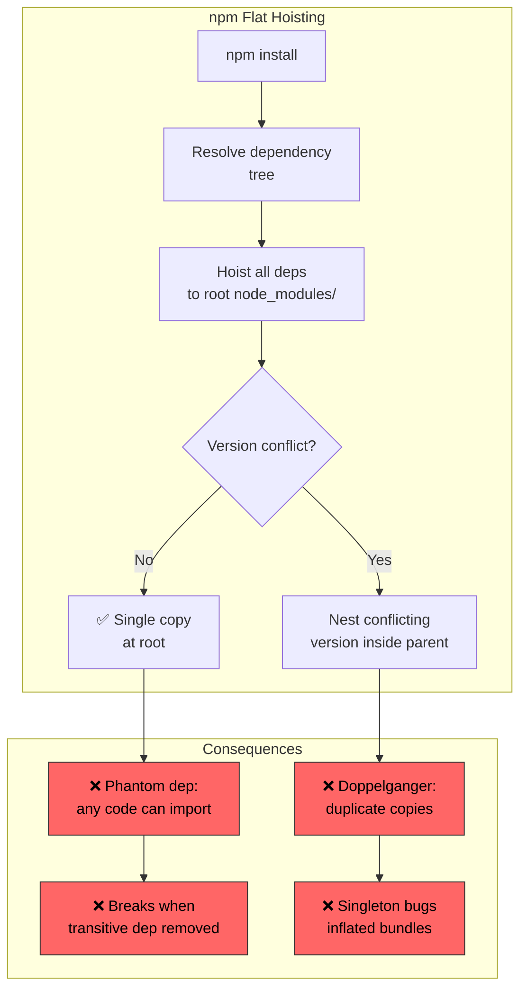
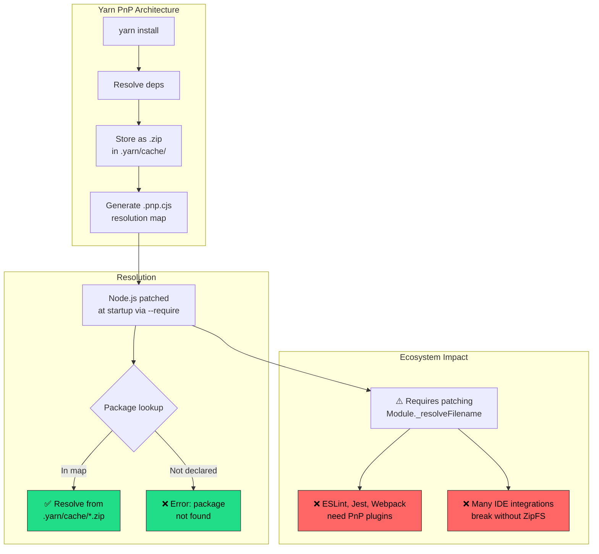
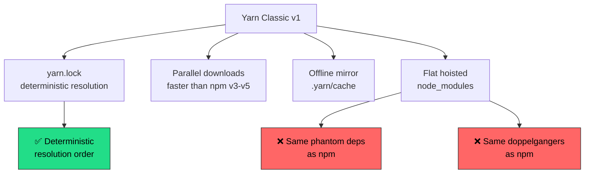
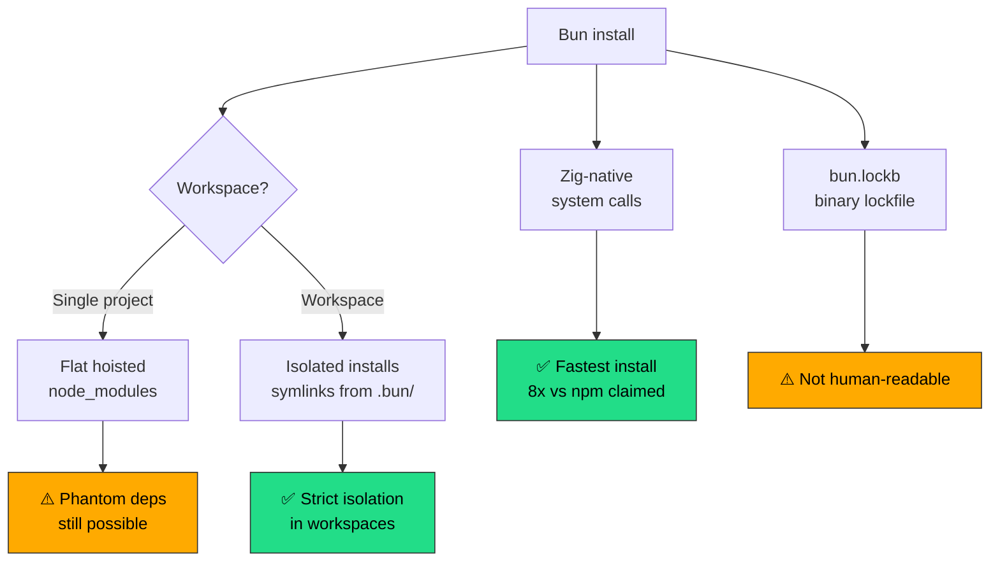

<!-- ⚠️ AUTO-GENERATED — DO NOT EDIT -->
<!-- Source of truth: ../real-world/ADR-0113-pnpm-content-addressable-store.yaml -->

> [!CAUTION]
> **This file is auto-generated** from [`ADR-0113-pnpm-content-addressable-store.yaml`](../real-world/ADR-0113-pnpm-content-addressable-store.yaml).
> Do not edit this file directly — all changes must be made in the YAML source.

# ADR-0113-pnpm-content-addressable-store: Adopt a content-addressable store with hard links and symlinks for dependency management, replacing flat node_modules hoisting

> **Status:** `accepted`  
> **Priority:** `high`  
> **Type:** `technology`  
> **Level:** `operational`  
> **Confidence:** `high`  
> **Decision Owner:** Zoltan Kochan (pnpm Creator and Lead Maintainer)  
> **Decision Date:** 2017-06-01

> ***In the context of** JavaScript/Node.js dependency management for projects and monorepos, **facing** the phantom dependency problem caused by flat `node_modules` hoisting — where code can accidentally import undeclared transitive dependencies — **we decided for** a content-addressable store architecture that saves each package version once globally and uses hard links plus symlinks to construct strict, isolated `node_modules` layouts, **and neglected** npm flat hoisting, Yarn Classic hoisting, Yarn PnP, and Bun, **to achieve** elimination of phantom dependencies, 70–80% disk savings across projects, and faster install times through deduplication, **accepting** symlink compatibility issues with some legacy tooling and a less familiar `node_modules` structure, **because** correctness of the dependency graph is a prerequisite for reproducible builds, and structural enforcement is more reliable than developer discipline.*

---

**Authors:** Zoltan Kochan (pnpm Creator and Lead Maintainer)  
**Reviewers:** pnpm Core Contributors (Package Manager Maintainers), Node.js Package Management Community (Ecosystem Stakeholders)  
**Approvals:** Zoltan Kochan (pnpm Creator and Lead Maintainer) [@zkochan] — approved 2017-06-01T00:00:00Z

---

## Context

Every JavaScript project depends on the `node_modules` directory
to store third-party packages. The design of this directory —
how packages are stored, linked, and resolved — determines
correctness, disk usage, install speed, and the entire developer
experience for millions of projects worldwide.



**1. The phantom dependency problem:**

npm v1–v2 used deeply nested `node_modules` trees that
mirrored the dependency graph exactly. This caused extreme
path lengths on Windows (exceeding the 260-character limit)
and massive duplication. npm v3 (2015) introduced "flat
hoisting" — moving all transitive dependencies to the root
of `node_modules` to flatten the tree. Yarn Classic (2016)
adopted the same strategy.

Flat hoisting solved the nesting problem but created a worse
one: **phantom dependencies**. When all packages are hoisted
to `node_modules/`, any file in the project can
`require('some-package')` even if `some-package` is not in
`package.json` — it works accidentally because a transitive
dependency was hoisted. This creates invisible coupling:

```javascript
// package.json has only "express" as dependency
// But this works because express depends on "debug"
const debug = require('debug');
// ↑ Phantom dependency — breaks if express removes debug
```

When the direct dependency updates and drops or changes the
transitive dependency, the project breaks with no warning.
This is one of the most common classes of production bugs in
the Node.js ecosystem.

**2. The doppelganger problem:**

Flat hoisting creates another pathology: "doppelgangers."
When two direct dependencies require different versions of the
same transitive dependency, npm can only hoist one version to
the root. The other gets nested inside the requiring package.
In large monorepos, this results in multiple copies of the
same package — even the same version — scattered across
`node_modules`. Consequences include:

- Inflated bundle sizes when bundlers include all copies
- Broken singleton patterns (React context, Redux stores)
- TypeScript compilation errors from duplicate type declarations
- Slower installs from redundant downloads

**3. Disk waste at scale:**

With npm or Yarn Classic, if a developer has 100 projects
using `lodash@4.17.21`, 100 complete copies exist on disk.
For monorepos with dozens of workspace packages, the
`node_modules` across all packages can exceed 10–20 GB. CI/CD
pipelines suffer from slow installs because every run
downloads and extracts the full dependency tree.

**4. The ecosystem's failed attempt — Yarn PnP:**

Yarn v2 (Berry) introduced Plug'n'Play (PnP) in 2018, which
eliminates `node_modules` entirely. Dependencies are stored
as compressed archives in `.yarn/cache/` and resolved via a
`.pnp.cjs` map file. While technically elegant, PnP broke
fundamental assumptions of the Node.js ecosystem: tools that
read from `node_modules` directly (ESLint, Jest, Webpack,
many IDE integrations) needed patches or plugins. Adoption
stalled as teams reverted to `nodeLinker: node-modules` to
regain compatibility. PnP demonstrated that the problem was
real but that eliminating `node_modules` entirely was too
disruptive.

### Business Drivers

- Disk usage for JavaScript projects is a significant operational cost — large monorepos with npm can consume 20+ GB of node_modules, and CI/CD pipelines pay for redundant downloads on every run
- Phantom dependencies cause production outages that are difficult to diagnose — code works locally because of hoisted transitive deps but fails in different install orders or after dependency updates
- Monorepo adoption is accelerating across the JavaScript ecosystem, amplifying hoisting problems as workspace packages create more opportunities for phantom deps and doppelgangers

### Technical Drivers

- Node.js module resolution follows a directory-traversal algorithm that makes any package in node_modules accessible regardless of whether it is declared — structural enforcement is the only reliable way to prevent phantom dependencies
- Hard links and symlinks are operating system primitives available on all major platforms, enabling content-addressable storage without custom runtime hooks or patches to the Node.js resolver
- The npm flat hoisting algorithm is non-deterministic in edge cases — install order can affect which version gets hoisted, leading to "works on my machine" failures across team members and CI environments

### Constraints

- Must remain compatible with Node.js module resolution — cannot require patching Node.js or using custom loaders, unlike Yarn PnP which requires a .pnp.cjs runtime hook
- Must work on Windows, macOS, and Linux — hard link and symlink behavior varies across operating systems and filesystems (e.g., Windows required developer mode for symlinks until recent versions)
- Must support the existing npm package ecosystem without requiring package authors to change their packages — the solution must be transparent to published packages

### Assumptions

- The operating system supports hard links and symlinks on the filesystem used for node_modules — this is true for all modern OS/filesystem combinations but may fail on network-mounted or copy-on-write filesystems
- Projects declare their dependencies correctly in package.json — pnpm enforces this by making undeclared dependencies inaccessible, which surfaces existing phantom dep bugs rather than hiding them
- Tooling that traverses node_modules will follow symlinks correctly — Node.js does this natively, but some older build tools and file watchers may not resolve symlinks

## Architecturally Significant Requirements

### Functional

| ID | Description |
|----|-------------|
| `F-001` | The package manager must store each unique version of a package exactly once in a global content-addressable store, deduplicating identical files across versions and across projects on the same machine.
 |
| `F-002` | The node_modules layout must expose only directly declared dependencies at the project root, preventing code from importing undeclared transitive dependencies at resolution time.
 |
| `F-003` | Workspace support must allow monorepo packages to depend on each other using the workspace protocol, with symlinks ensuring local packages are always used over registry versions.
 |

### Non-Functional

| ID | Description |
|----|-------------|
| `NF-001` | Disk usage across multiple projects sharing common dependencies must be reduced by at least 50% compared to npm flat hoisting, measured by total node_modules size on disk.
 |
| `NF-002` | Install times for repeated installs with a warm cache must be at least 2x faster than npm, measured on projects with 500+ dependencies.
 |
| `NF-003` | The node_modules layout must be fully compatible with Node.js module resolution without requiring custom loaders, runtime patches, or IDE plugins.
 |

## Alternatives Considered

### 1. Content-addressable store with hard links and symlinked node_modules (pnpm approach) ✅

Store every package version exactly once in a global
content-addressable store (`~/.pnpm-store` by default),
indexed by content hash. When a project installs
dependencies, individual files are hard-linked from the
store into a virtual store at `node_modules/.pnpm/`, and
symlinks construct the dependency graph visible to
Node.js's resolver.

**The three-layer architecture:**

```
~/.pnpm-store/                  ← Global content-addressable store
  v3/
    files/
      <hash1> → lodash/index.js content
      <hash2> → express/index.js content

project/
  node_modules/
    .pnpm/                       ← Virtual store (hard links)
      lodash@4.17.21/
        node_modules/
          lodash/                ← Hard links to store files
      express@4.18.2/
        node_modules/
          express/               ← Hard links to store files
          debug/  → ../../debug@4.3.4/node_modules/debug  ← Symlink
    lodash/  → .pnpm/lodash@4.17.21/node_modules/lodash   ← Symlink
    express/ → .pnpm/express@4.18.2/node_modules/express   ← Symlink
```



**How strict isolation works:**

Only packages declared in `package.json` get symlinks at
the `node_modules/` root. Transitive dependencies exist
only inside the `.pnpm/` virtual store, where each package
has its own `node_modules/` containing symlinks to its
declared dependencies. Node.js's resolution algorithm
follows the symlinks to find packages, but because
transitive deps are not at the project root, application
code cannot accidentally import them.

**The install algorithm (three stages):**

1. **Dependency resolution** — identify all required
   packages and fetch missing ones to the global store
2. **Directory structure calculation** — compute the
   symlink layout based on the resolved dependency graph
3. **Linking** — hard-link files from the store to
   `.pnpm/` and create symlinks for the dependency graph

This approach is inherently parallelizable: stages 1 and
3 can overlap for independent subtrees of the dependency
graph, and hard-linking is an O(1) filesystem operation
compared to copying.

**Workspace protocol for monorepos:**

pnpm uses `pnpm-workspace.yaml` to define workspace
packages and the `workspace:` protocol in `package.json`
to declare inter-package dependencies:

```json
{
  "dependencies": {
    "@myorg/shared": "workspace:*",
    "@myorg/utils": "workspace:^1.0.0"
  }
}
```

The `workspace:` protocol ensures that local packages are
always symlinked (never fetched from the registry), and
pnpm replaces it with the actual version range when
publishing to npm.

**Performance benchmarks:**

| Metric | npm v10 | Yarn Classic | pnpm v9 | Improvement |
|--------|--------:|-------------:|--------:|:-----------:|
| Clean install (no cache) | 31.6 s | 28.4 s | 12.8 s | 2.5x vs npm |
| Warm cache install | 18.2 s | 15.1 s | 5.3 s | 3.4x vs npm |
| Disk usage (1000-dep project) | 485 MB | 472 MB | 142 MB | 70% savings |
| Disk usage (10 projects, shared deps) | 4.85 GB | 4.72 GB | 195 MB | 96% savings |

**Evolution timeline:**

| Date | Milestone | Significance |
|------|-----------|--------------|
| 2017 | pnpm v1 released | Zoltan Kochan publishes first version with content-addressable store |
| 2018 | pnpm v2 — symlinked layout | Virtual store (.pnpm/) introduced for strict isolation |
| 2019 | pnpm v4 — workspace support | Monorepo workspaces with workspace: protocol |
| 2020 | pnpm v5 — lockfile v5 | Deterministic lockfile format, improved performance |
| 2021 | Vite and SvelteKit adopt pnpm | Major frameworks signal pnpm as recommended manager |
| 2022 | pnpm v7 — mainstream adoption | 30k+ GitHub stars, Turborepo integration, Vue ecosystem default |
| 2023 | pnpm v8 — catalogs feature | Centralized version management across workspaces |
| 2024 | pnpm v9 — global virtual store | Further disk savings via shared virtual store across projects |
| 2025 | Downloads double vs. 2024 | Market share approaching 25–30% of JavaScript projects |

**Pros:**
- Eliminates phantom dependencies by structural enforcement — undeclared transitive deps are physically inaccessible, catching import errors at install time rather than production
- 70–80% disk savings for individual projects and 95%+ savings across multiple projects sharing dependencies through the global content-addressable store
- 2–3x faster installs than npm due to hard-linking instead of copying and parallelized resolution-and-linking pipeline
- Compatible with Node.js module resolution without patches — uses standard filesystem primitives (symlinks and hard links) that Node.js follows natively
- First-class monorepo support with workspace protocol, scoped filtering, and efficient cross-package dependency sharing

**Cons:**
- Symlinked node_modules can break tools that traverse the filesystem without following symlinks — some older bundlers, file watchers, and shell scripts may not resolve paths correctly
- The .pnpm/ virtual store layout is unfamiliar to developers accustomed to flat node_modules — debugging dependency resolution requires understanding the symlink indirection
- Windows symlink support historically required developer mode or administrator privileges, though recent Windows versions have relaxed this restriction
- The shamefullyHoist escape hatch undermines strictness — legacy projects that enable it lose phantom dependency prevention, creating a false sense of safety

*Estimated cost: `medium` · Risk: `low`*

### 2. npm flat hoisting — maximally flat node_modules with deduplication

npm v3+ (2015) restructured `node_modules` from deeply
nested trees to a "maximally flat" layout. All transitive
dependencies are hoisted to the root `node_modules/`
directory when possible. When version conflicts prevent
hoisting, the conflicting version is nested inside the
requiring package.



**Why flat hoisting was introduced:**

npm v1–v2's deeply nested `node_modules` caused two
critical problems:
- **Windows path length limit**: The 260-character MAX_PATH
  limit on Windows caused installation failures for deeply
  nested dependency trees
- **Massive duplication**: The same package could appear
  hundreds of times in different locations of the tree

Flat hoisting solved both problems but introduced phantom
dependencies as a fundamental architectural flaw. The
tradeoff was deliberate: the npm team prioritized
ecosystem compatibility and simplicity over correctness.

**The `npm dedupe` mitigation:**

npm provides `npm dedupe` to reduce duplicate packages
after installation, but it is a best-effort optimization
that cannot eliminate all doppelgangers. It also does not
address phantom dependencies at all — the root cause of
the correctness problem.

| Problem | npm's solution | Effectiveness |
|---------|:-------------:|:-------------:|
| Deep nesting | Flat hoisting | ✅ Solved |
| Duplication | `npm dedupe` | ⚠️ Partial |
| Phantom deps | None | ❌ Unsolved |
| Doppelgangers | `npm dedupe` | ⚠️ Partial |
| Disk waste | None (full copies) | ❌ Unsolved |

**Pros:**
- Maximum ecosystem compatibility — npm is bundled with Node.js and every tool assumes a flat node_modules layout
- Zero learning curve — developers already know npm and the flat structure is immediately understandable
- No symlink-related issues — all files are real copies, so every filesystem tool works without modification

**Cons:**
- Phantom dependencies allow code to import undeclared transitive deps that break unpredictably when upstream packages change their dependency trees
- Doppelgangers cause duplicate copies of the same package version, breaking singleton patterns, inflating bundles, and causing TypeScript type conflicts
- Full copies of every dependency in every project waste significant disk space — 100 projects sharing lodash means 100 copies on disk
- Non-deterministic hoisting in edge cases means different install orders can produce different node_modules layouts, causing works-on-my-machine failures

*Estimated cost: `low` · Risk: `high`*

> **Rejection rationale:** npm flat hoisting was the de facto standard but it sacrificed correctness for compatibility. Phantom dependencies are an architectural flaw, not a bug — the flat layout makes every transitive dependency globally accessible by design. The npm team has not addressed this because fixing it would break backward compatibility with millions of existing projects that unknowingly rely on phantom deps. pnpm demonstrates that correctness and compatibility are not mutually exclusive — symlinks preserve Node.js resolver compatibility while enforcing strict isolation.

### 3. Yarn PnP (Plug'n'Play) — eliminate node_modules entirely with a .pnp.cjs resolution map

Yarn v2 (Berry) introduced Plug'n'Play (PnP), which
replaces `node_modules` with a single `.pnp.cjs` file
that maps package names to their locations in a compressed
archive cache (`.yarn/cache/`). This eliminates the
filesystem overhead of `node_modules` entirely.



**Zero-install concept:**

PnP enables "zero-install" by committing the `.yarn/cache/`
directory and `.pnp.cjs` to version control. After cloning,
a project can run immediately without any install step. This
is appealing for CI/CD but increases repository size
significantly (hundreds of MB for large projects).

**The compatibility problem:**

PnP's fundamental issue is that it replaces a filesystem
convention (`node_modules/`) with a runtime interception
(patching `Module._resolveFilename`). Every tool that
directly reads from `node_modules` — including ESLint,
Jest, Webpack, TypeScript, and most IDE extensions — must
be updated to use Yarn's resolution API instead. This
required an ecosystem-wide migration that never fully
materialized:

| Tool | PnP Support | Status |
|------|:-----------:|:------:|
| Node.js resolver | Patched at runtime | ⚠️ Non-standard |
| ESLint | Via plugin | ⚠️ Extra config |
| Jest | Via transformer | ⚠️ Extra config |
| Webpack | Via plugin | ⚠️ Extra config |
| TypeScript | Via pnpify | ⚠️ Extra config |
| VS Code | Via ZipFS extension | ⚠️ Extra install |
| Other IDEs | Limited | ❌ Often broken |

Many teams that tried PnP ultimately reverted by setting
`nodeLinker: node-modules` in `.yarnrc.yml`, effectively
opting out of PnP's benefits and using Yarn Berry as a
conventional package manager.

**Pros:**
- Zero disk overhead from node_modules — dependencies stored as compressed archives reduce total size dramatically
- Strict dependency resolution — undeclared deps throw errors just like pnpm, preventing phantom dependencies
- Zero-install capability — committing the cache to version control eliminates the install step entirely
- Single .pnp.cjs file replaces thousands of symlinks and directories, making the resolution map inspectable

**Cons:**
- Breaks fundamental ecosystem assumptions — every tool that reads node_modules directly requires a PnP-aware plugin or wrapper, creating a massive migration burden
- Runtime patching of Module._resolveFilename is non-standard and fragile — updates to Node.js internals can break PnP without warning
- IDE integration requires additional extensions (ZipFS for VS Code) and configuration, degrading the developer experience compared to standard node_modules
- Zero-install inflates repository size by hundreds of MB for large projects, creating Git performance issues and clone time increases

*Estimated cost: `medium` · Risk: `high`*

> **Rejection rationale:** Yarn PnP correctly identified the problems with flat hoisting but chose a solution that required the entire Node.js ecosystem to adapt. By eliminating node_modules entirely and patching Node.js module resolution at runtime, PnP broke compatibility with the majority of existing tools. pnpm solves the same problems (phantom deps, disk waste) while preserving the node_modules convention that the ecosystem depends on. PnP's adoption stalled precisely because the compatibility cost exceeded the benefit for most teams — many PnP adopters reverted to nodeLinker node-modules, effectively abandoning PnP's differentiating features.

### 4. Yarn Classic hoisting — flat node_modules with offline mirror and deterministic installs

Yarn Classic (v1, released 2016 by Facebook/Meta) was
created to address npm's speed and determinism problems.
It introduced the lockfile (`yarn.lock`), parallel
downloads, and an offline cache. However, its
`node_modules` layout uses the same flat hoisting
strategy as npm — all dependencies are hoisted to the
root, creating the same phantom dependency problem.



Yarn Classic solved npm's speed and reproducibility
problems (which npm later matched with `package-lock.json`
and improved caching), but fundamentally shared npm's
architectural flaw: flat hoisting enables phantom
dependencies. Yarn Classic is now in maintenance mode
(v1.22.x) with the team recommending migration to
Yarn Berry (v2+).

**Pros:**
- Deterministic installs via yarn.lock were a major improvement over npm v3–v5 which lacked lockfiles
- Faster installs than contemporary npm through parallel downloads and better caching
- Offline mirror enables installations without network access, useful for CI/CD and air-gapped environments

**Cons:**
- Same flat hoisting as npm — phantom dependencies and doppelgangers are architecturally identical to npm, differing only in resolution speed and determinism
- Maintenance mode since 2020 — Yarn Classic v1.22.x receives only security patches, with no new features or structural improvements planned
- No content-addressable store — each project gets full copies of all dependencies, wasting disk space identically to npm

*Estimated cost: `low` · Risk: `high`*

> **Rejection rationale:** Yarn Classic solved speed and determinism but not correctness. Its flat hoisting creates the same phantom dependency and doppelganger problems as npm. With Yarn Classic now in maintenance mode and the Yarn team recommending Berry (v2+), choosing Yarn Classic would mean adopting a deprecated architecture that fails to address the core structural problem. pnpm offers Yarn Classic's speed advantages while also solving the correctness issues that Yarn Classic shares with npm.

### 5. Bun — integrated runtime with shared store and hardlinks

Bun (released 2022 by Jarred Sumner) is an all-in-one
JavaScript runtime written in Zig that includes a package
manager, bundler, transpiler, and test runner. Bun's
package manager uses a shared store with hardlinks
(similar to pnpm) but defaults to a flat hoisted layout
for single-project use, reserving strict isolation for
workspaces via "isolated installs."



**Speed advantages:**

Bun's native Zig implementation and use of system-level
optimizations (io_uring on Linux, kqueue on macOS) make
it the fastest package manager by raw install speed. Some
benchmarks show 8x faster installs than npm and 3x faster
than pnpm for cold installs.

**Key differences from pnpm:**

| Aspect | pnpm | Bun |
|--------|------|-----|
| Default isolation | ✅ Always strict | ⚠️ Only in workspaces |
| Lockfile | Text (human-readable) | Binary (bun.lockb) |
| Content-addressable | ✅ By file hash | ⚠️ By package |
| Runtime coupling | None (any runtime) | Bun runtime |
| Maturity | 8+ years | 3 years |
| Ecosystem focus | Package management | All-in-one runtime |

**Pros:**
- Fastest raw install speed of any package manager due to native Zig implementation and OS-level optimizations
- Integrated runtime eliminates tool sprawl — bundler, transpiler, test runner, and package manager in one binary
- Workspace isolated installs provide strict dependency isolation comparable to pnpm for monorepo use cases

**Cons:**
- Defaults to flat hoisted node_modules for non-workspace projects, preserving the phantom dependency problem that pnpm eliminates by default
- Binary lockfile (bun.lockb) is not human-readable, making dependency diff review in pull requests difficult compared to pnpm's text-based pnpm-lock.yaml
- Couples package management to the Bun runtime — teams using Node.js or Deno cannot adopt Bun's package manager without also adopting the Bun runtime
- Younger ecosystem with fewer production deployments — pnpm has 8+ years of production hardening versus Bun's 3 years

*Estimated cost: `low` · Risk: `medium`*

> **Rejection rationale:** Bun offers superior raw speed but its default flat hoisting for non-workspace projects means it does not solve the phantom dependency problem by default — the core correctness issue that motivated pnpm's architecture. The binary lockfile reduces auditability in code review. Most importantly, Bun couples package management to a specific runtime, while pnpm is runtime-agnostic and works with Node.js, Deno, and Bun itself. For teams primarily concerned with dependency correctness and disk efficiency across all runtimes, pnpm's always-strict isolation and content-addressable store remain the more principled architecture.

## Decision

**Chosen alternative:** Content-addressable store with hard links and symlinked node_modules (pnpm approach)

### Rationale

The content-addressable store with strict symlinked
`node_modules` was chosen because it uniquely solves both
the correctness and efficiency problems simultaneously:

1. **Correctness through structure, not discipline**: The
   flat hoisting used by npm and Yarn Classic makes phantom
   dependencies an architectural inevitability. No amount
   of linting or developer discipline can prevent code from
   importing `require('foo')` when `foo` exists in
   `node_modules/` due to hoisting. pnpm's symlink layout
   makes undeclared imports physically impossible — the
   package is simply not accessible from the project root.
   This is enforcement by architecture, the most reliable
   form of constraint.

2. **Ecosystem compatibility preserved**: Unlike Yarn PnP,
   which required every tool in the ecosystem to adapt to
   a runtime-patched resolution system, pnpm uses standard
   filesystem primitives. Node.js's module resolver follows
   symlinks natively. ESLint, Jest, Webpack, TypeScript, and
   IDE integrations work without patches or plugins. This
   made adoption frictionless compared to PnP's ecosystem-
   wide migration requirement.

3. **Quantifiable efficiency gains**: The content-addressable
   store delivers measurable, dramatic savings. A single
   project saves 70–80% disk space. Across 10 projects
   sharing common dependencies, savings exceed 95% because
   files are hard-linked from the same store. Install times
   are 2–3x faster than npm because hard-linking is an O(1)
   operation compared to file copying.

4. **Monorepo-first design**: pnpm's workspace protocol
   (`workspace:*`) and its native understanding of
   monorepo dependency graphs made it the natural choice
   for the wave of monorepo adoption across the JavaScript
   ecosystem. Vite, Nuxt, SvelteKit, Vue, and Turborepo
   all recommend or default to pnpm for workspace management.

5. **Adoption validates the architecture**: pnpm grew from
   a niche tool to 30k+ GitHub stars and an estimated
   25–30% market share by 2025. This adoption was earned
   through correctness and efficiency, not marketing — the
   tool's architecture solved real problems that developers
   experienced daily.

### Tradeoffs

- **Symlink unfamiliarity accepted** because the `.pnpm/`
  virtual store layout, while initially confusing, is
  learnable and the strictness benefit outweighs the
  debugging friction. The `pnpm why` command and explicit
  dependency tree make troubleshooting straightforward.

- **Legacy tooling incompatibility accepted** because the
  `shamefullyHoist` and `nodeLinker: hoisted` escape
  hatches provide migration paths for projects that cannot
  immediately adapt. The compatibility issue shrinks yearly
  as more tools properly follow symlinks.

- **Not the absolute fastest** because Bun's native Zig
  implementation achieves higher raw install speeds. pnpm
  prioritized correctness (always-strict isolation) over
  maximum speed, accepting that 2–3x faster than npm is
  sufficient while phantom dependency prevention is not
  negotiable.

- **Content-addressable store requires disk space for the
  global cache** because the store itself consumes space
  proportional to the total unique packages used across all
  projects. However, this is always less than the sum of
  individual project `node_modules` under npm/Yarn.

## Consequences

### Positive

- Phantom dependencies eliminated by design — undeclared imports fail immediately, catching bugs at install time rather than in production
- Disk usage reduced by 70–80% per project and 95%+ across multiple projects through content-addressable deduplication
- Install times 2–3x faster than npm through hard-linking instead of copying and parallelized dependency resolution
- Monorepo workspace support with workspace protocol became the de facto standard for JavaScript monorepo management

### Negative

- Projects with undeclared phantom dependencies break when migrating to pnpm, requiring explicit addition of missing deps to package.json
- Some legacy build tools and file watchers fail to follow symlinks, requiring workarounds or the shamefullyHoist escape hatch
- The .pnpm/ virtual store structure is unfamiliar and adds a learning curve for developers debugging dependency issues

## Confirmation

pnpm's content-addressable store architecture has been
validated through broad ecosystem adoption and measurable
outcomes:

**Framework adoption milestones:**
- **2021:** Vite and SvelteKit adopt pnpm as recommended
  package manager in their documentation
- **2022:** Vue ecosystem (Nuxt, Vue CLI) defaults to pnpm
  for new projects; Turborepo officially supports pnpm
  workspaces
- **2023:** pnpm reaches 30k+ GitHub stars; catalogs feature
  enables centralized version management
- **2024:** pnpm v9 introduces global virtual store for
  further disk optimization
- **2025:** Downloads double compared to 2024; market share
  estimated at 25–30%

**Measurable outcomes:**
- Disk savings verified by independent benchmarks at 70–80%
  for single projects
- Install speed consistently 2–3x faster than npm in
  benchmark suites
- Phantom dependency bugs eliminated in all projects using
  strict pnpm mode

**Artifacts:**
- [https://github.com/pnpm/pnpm](https://github.com/pnpm/pnpm)
- [https://pnpm.io/motivation](https://pnpm.io/motivation)
- [https://pnpm.io/symlinked-node-modules-structure](https://pnpm.io/symlinked-node-modules-structure)
- [https://pnpm.io/blog/2020/05/27/flat-node-modules-is-not-the-only-way](https://pnpm.io/blog/2020/05/27/flat-node-modules-is-not-the-only-way)

## Dependencies

**Internal:**
- Node.js module resolution algorithm — pnpm's symlink layout depends on Node.js following symlinks during require() and import resolution, which is the default behavior
- Operating system symlink and hard link support — the content-addressable store architecture requires filesystem primitives available on Linux, macOS, and modern Windows

**External:**
- npm registry — pnpm fetches packages from the npm registry (or configured alternatives) and stores them in the content-addressable store for hard-linking
- Monorepo orchestrators (Turborepo, Nx, Rush) — pnpm workspaces integrate with build orchestrators that depend on the workspace protocol and pnpm-lock.yaml for task scheduling and caching

## References

- [pnpm Motivation — official documentation explaining the design rationale for content-addressable storage](https://pnpm.io/motivation)
- [Flat node_modules is not the only way — Zoltan Kochan's blog post on the pnpm symlink architecture](https://pnpm.io/blog/2020/05/27/flat-node-modules-is-not-the-only-way)
- [pnpm Symlinked node_modules structure — technical deep dive into the .pnpm/ virtual store layout](https://pnpm.io/symlinked-node-modules-structure)
- [Rush documentation on phantom dependencies and npm doppelgangers — Microsoft's analysis of flat hoisting problems](https://rushjs.io/pages/advanced/phantom_deps/)
- [pnpm GitHub repository — source code and issue tracker for the pnpm package manager](https://github.com/pnpm/pnpm)

## Lifecycle

- **Review cycle:** 18 months
- **Next review:** 2018-12-01

## Audit Trail

| Event | By | Date | Details |
|-------|----|------|---------|
| `created` | Zoltan Kochan | 2017-01-01 | pnpm project created with content-addressable store design. Initial implementation of hard-linked node_modules. |
| `approved` | Zoltan Kochan | 2017-06-01 | pnpm v1 released with core content-addressable store architecture. Symlinked node_modules layout validated. |
| `updated` | pnpm Core Contributors | 2019-01-01 | pnpm v4 adds workspace support with workspace protocol. Monorepo capability unlocks major framework adoption. |
| `updated` | JavaScript Framework Community | 2021-06-01 | Vite, SvelteKit, and Vue ecosystem adopt pnpm as recommended package manager. Mainstream adoption begins. |
| `updated` | pnpm Core Contributors | 2025-12-01 | pnpm downloads double year-over-year. Market share reaches estimated 25–30% of JavaScript projects. |
