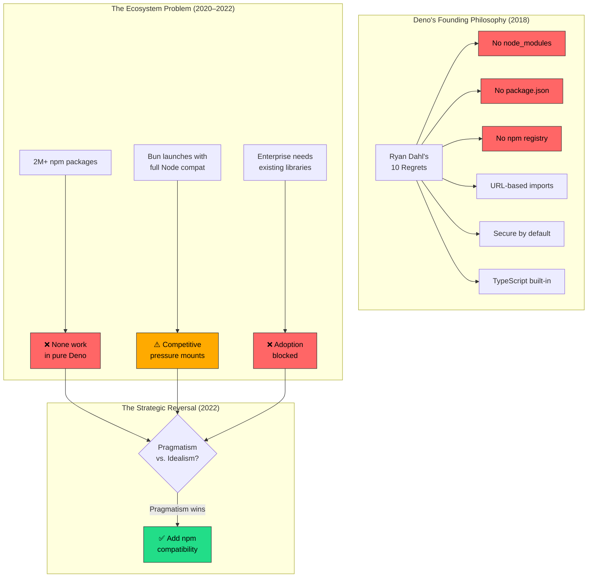
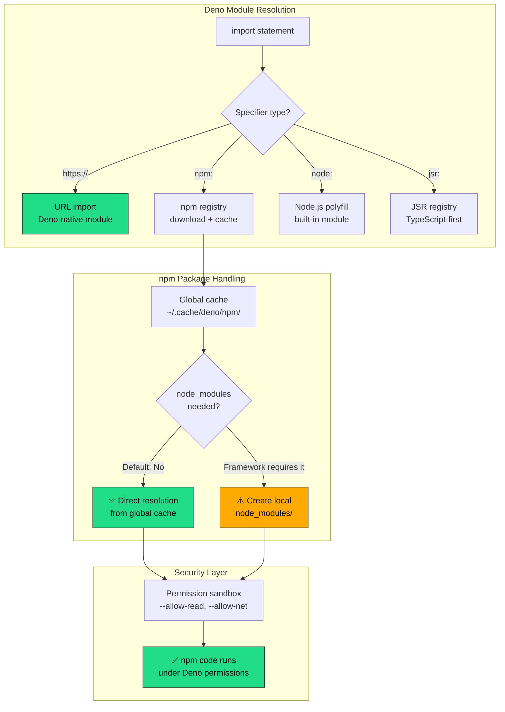
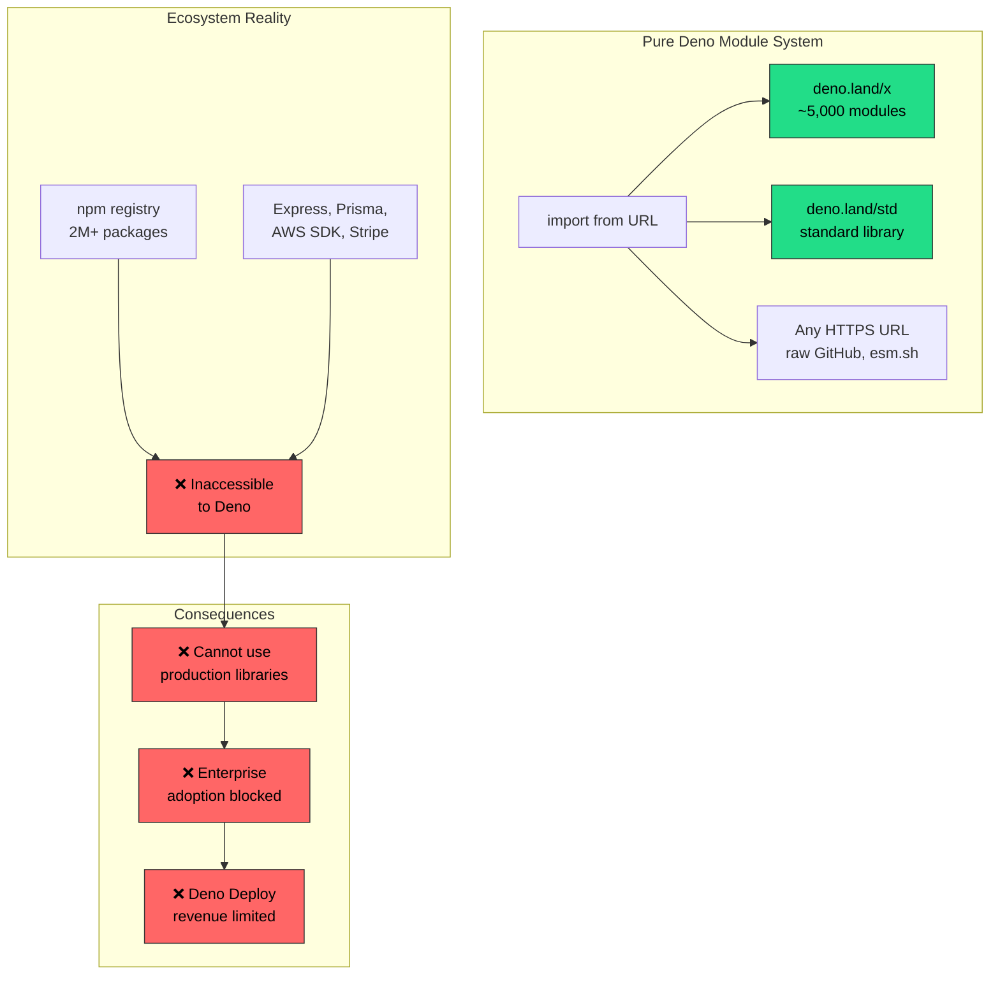
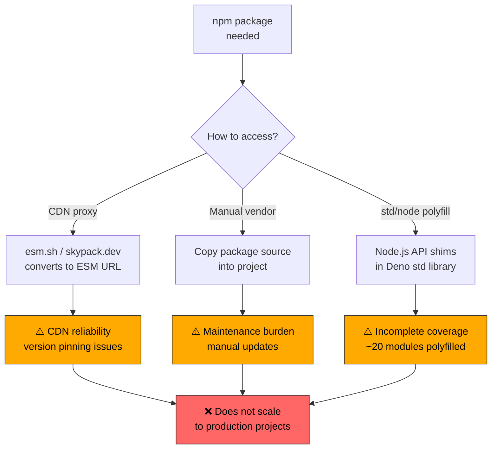
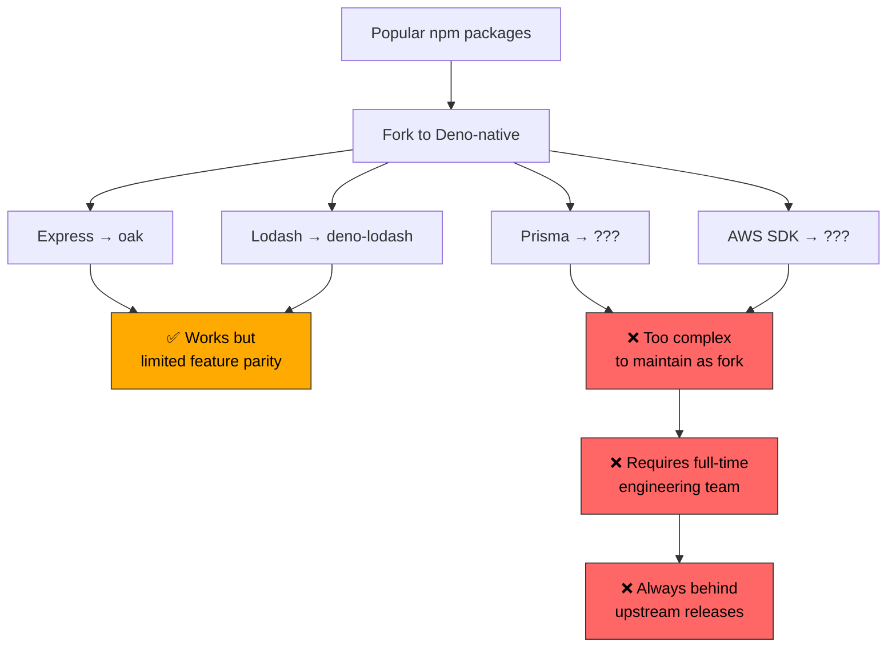
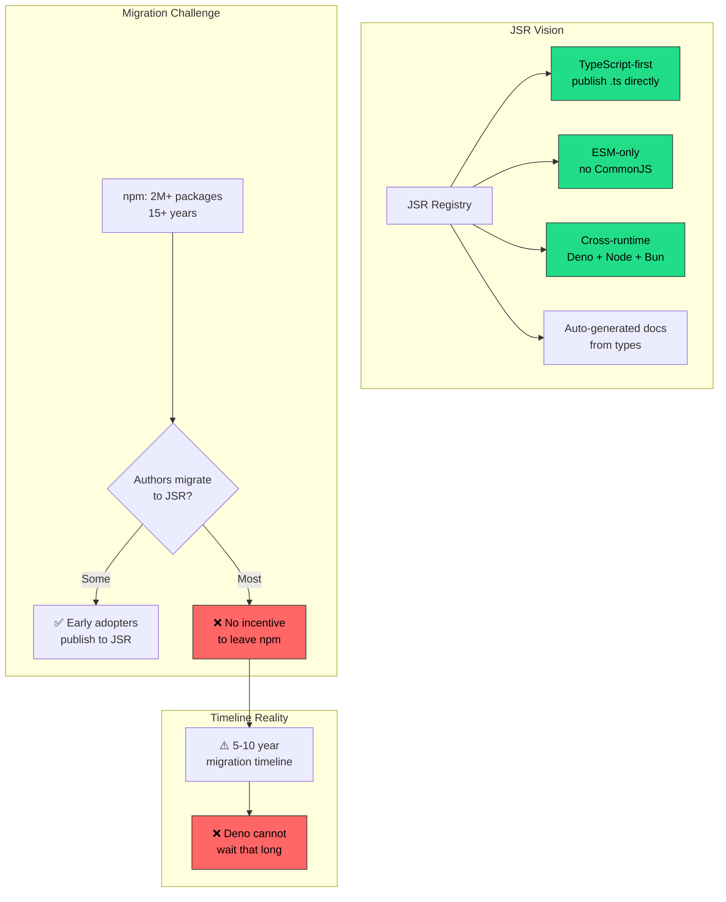

<!-- ⚠️ AUTO-GENERATED — DO NOT EDIT -->
<!-- Source of truth: ../real-world/ADR-0114-deno-npm-compatibility.yaml -->

> [!CAUTION]
> **This file is auto-generated** from [`ADR-0114-deno-npm-compatibility.yaml`](../real-world/ADR-0114-deno-npm-compatibility.yaml).
> Do not edit this file directly — all changes must be made in the YAML source.

# ADR-0114-deno-npm-compatibility: Add Node.js and npm compatibility to Deno via npm specifiers and a Node.js compatibility layer, reversing the original pure-Deno philosophy

> **Status:** `accepted`  
> **Priority:** `high`  
> **Type:** `technology`  
> **Level:** `operational`  
> **Confidence:** `high`  
> **Decision Owner:** Ryan Dahl (Deno Creator and Deno Company CEO)  
> **Decision Date:** 2022-08-15

> ***In the context of** the Deno JavaScript/TypeScript runtime competing for developer adoption against Node.js and Bun, **facing** the ecosystem barrier where two million npm packages were inaccessible to Deno users, **we decided for** native npm compatibility via `npm:` specifiers with a global cache (no `node_modules` by default), a Node.js API polyfill layer, and optional `package.json` support, **and neglected** the pure-Deno ecosystem approach, partial std/node polyfills only, forking popular npm packages, and the JSR-only long-term strategy, **to achieve** access to the full npm ecosystem, reduced migration friction from Node.js, and unlocked enterprise adoption, **accepting** philosophical compromise of Deno's founding anti-Node.js vision and increased runtime complexity from the compatibility layer, **because** ecosystem gravity is the dominant force in runtime adoption and ideological purity cannot overcome a two-million-package deficit.*

---

**Authors:** Ryan Dahl (Deno Creator and Deno Company CEO), Bartek Iwańczuk (Deno Core Engineer), David Sherret (Deno Core Engineer (npm Integration Lead))  
**Reviewers:** Deno Core Team (Runtime Engineers), Deno Community (Open Source Contributors and Users)  
**Approvals:** Ryan Dahl (Deno Creator and Deno Company CEO) [@ry] — approved 2022-08-15T00:00:00Z

---

## Context

Deno was born from regret. In June 2018, at JSConf EU, Ryan Dahl —
the original creator of Node.js — gave a talk titled "10 Things I
Regret About Node.js." He enumerated fundamental design mistakes:
the lack of a security sandbox, the `node_modules` directory, the
centralized npm registry controlled by a private entity, the
`package.json` file with its implicit `index.js` resolution, the
absence of Promises in the core API, and the continued use of the
abandoned GYP build system. He then unveiled Deno as a new
JavaScript/TypeScript runtime that would correct every one of
these mistakes.



**1. The pure-Deno era (2018–2022):**

For its first four years, Deno maintained strict separation from
the Node.js ecosystem. Dependencies were imported via URLs
(`import { serve } from "https://deno.land/std/http/server.ts"`),
managed through import maps, and cached globally. There was no
`package.json`, no `node_modules`, no npm. A standard library
(`deno.land/std`) provided common utilities, and third-party
modules were hosted on `deno.land/x`. This was architecturally
clean but created a chicken-and-egg problem: without access to
npm packages, developers could not migrate real-world projects;
without real-world projects, the Deno-native module ecosystem
grew slowly.

**2. The ecosystem gravity problem:**

By 2022, npm hosted over 2 million packages. No alternative
ecosystem could replicate that breadth. Developers who wanted
to use Deno for production work consistently reported the same
blocker: "I can't use library X because it's only on npm."
The `deno.land/x` registry had ~5,000 modules — less than 0.3%
of npm's catalog. Critical categories (ORMs, payment SDKs,
authentication libraries, cloud provider SDKs) had zero or
inadequate Deno-native alternatives.

**3. Bun's competitive pressure:**

In mid-2022, Bun (created by Jarred Sumner, written in Zig)
emerged as a serious competitor. Bun's foundational design
decision was full Node.js and npm compatibility from day one —
it ran existing Node.js applications, used `package.json`, and
installed npm packages faster than npm itself. Bun demonstrated
that a modern runtime could offer security, speed, and TypeScript
support without sacrificing npm compatibility. This directly
undercut Deno's positioning: if Bun could be modern and
compatible, Deno's insistence on incompatibility looked like
a liability rather than a feature.

| Runtime | npm Compat (2022) | TypeScript | Permissions | package.json |
|---------|:-----------------:|:----------:|:-----------:|:------------:|
| Node.js | ✅ Native | ❌ (needs tsc) | ❌ None | ✅ Native |
| Deno (pre-1.28) | ❌ None | ✅ Built-in | ✅ Sandbox | ❌ None |
| Bun | ✅ Full | ✅ Built-in | ❌ None | ✅ Native |

**4. The commercial imperative:**

The Deno Company (founded 2019, $21M Series A from Sequoia
Capital) needed enterprise customers for its cloud platform,
Deno Deploy. Enterprise adoption was blocked by npm
incompatibility — no company would bet on a runtime that
couldn't use their existing dependency graph. The commercial
viability of Deno Deploy was directly tied to npm compatibility.

**5. The pivot moment:**

On August 15, 2022, Ryan Dahl and Alon Bonder published "Big
Changes Ahead for Deno" — a blog post that acknowledged the
ecosystem reality and announced that Deno would add npm
compatibility. The post committed to supporting 80–90% of
npm packages within three months. This was a direct reversal
of Deno's founding philosophy, driven by the pragmatic
recognition that ecosystem gravity is the dominant force in
runtime adoption.

### Business Drivers

- Enterprise adoption of Deno Deploy was blocked by npm incompatibility — companies could not migrate existing Node.js applications or use critical npm libraries like ORMs, payment SDKs, and cloud provider SDKs
- The Deno Company (backed by $21M Sequoia Series A) needed a viable commercial platform, and Deno Deploy revenue depended on developer adoption that npm incompatibility was preventing
- Bun's emergence with full npm compatibility from day one created direct competitive pressure, demonstrating that modern runtimes need not sacrifice ecosystem access

### Technical Drivers

- Over 2 million npm packages represented an irreplaceable ecosystem that no alternative registry could replicate — the Deno-native deno.land/x had only ~5,000 modules
- Real-world JavaScript/TypeScript projects depend on dozens to hundreds of npm packages, making migration to Deno impractical without compatibility
- Node.js built-in APIs (fs, path, http, crypto) are deeply embedded in npm package implementations, requiring a comprehensive polyfill layer for compatibility

### Constraints

- Must preserve Deno's URL-based import model as the primary module system — npm compatibility is additive, not a replacement for Deno's module resolution
- Must maintain Deno's permission-based security sandbox for npm packages — npm code runs under the same permission restrictions as Deno code
- Must work without requiring node_modules by default — npm packages are cached globally, with optional node_modules creation for frameworks that require it
- Must avoid breaking existing Deno code — npm compatibility is a new capability, not a migration that forces changes to existing Deno programs

### Assumptions

- The majority of npm packages use standard Node.js APIs that can be polyfilled — packages using native C++ addons via node-gyp require Node-API (N-API) support added in Deno 2.0
- Developers will accept the npm: prefix as a reasonable convention to distinguish npm imports from URL-based Deno imports
- The Deno permission model can meaningfully sandbox npm packages — though in practice, many npm packages require broad permissions (file system, network) that reduce the security benefit

## Architecturally Significant Requirements

### Functional

| ID | Description |
|----|-------------|
| `F‑001` | The runtime must resolve and execute npm packages specified via npm: URL specifiers, downloading them on demand from the npm registry and caching them globally without requiring a local node_modules directory. |
| `F‑002` | The runtime must provide polyfills for Node.js built-in modules (fs, path, http, crypto, etc.) accessible via node: specifiers, enabling npm packages that depend on Node.js core APIs to function correctly. |
| `F‑003` | The runtime must support package.json for dependency declaration and deno.json for Deno-specific configuration, allowing both configuration systems to coexist in the same project. |

### Non-Functional

| ID | Description |
|----|-------------|
| `NF‑001` | npm package compatibility must cover at least 80% of the top 1000 most-downloaded npm packages, including popular frameworks like Express, Fastify, and Next.js. |
| `NF‑002` | npm package execution must be subject to Deno's permission sandbox — file system, network, and environment access require explicit opt-in via permission flags. |
| `NF‑003` | npm package resolution and installation must not degrade Deno's startup time by more than 10% for programs that do not use npm packages — the compatibility layer must be lazy-loaded. |

## Alternatives Considered

### 1. Native npm compatibility via npm: specifiers, global cache, and Node.js polyfill layer (chosen — Deno 1.28+) ✅

Add first-class npm package support to Deno using a new
`npm:` URL scheme that tells the runtime to resolve packages
from the npm registry. Packages are downloaded on demand
and cached in a global directory (`~/.cache/deno/npm/`),
avoiding the per-project `node_modules` directory. A
comprehensive Node.js compatibility layer provides polyfills
for built-in modules (`fs`, `path`, `http`, `crypto`, etc.)
accessible via `node:` specifiers.

**How npm: specifiers work:**

```typescript
// Deno-native import (URL-based, unchanged)
import { serve } from "https://deno.land/std/http/server.ts";

// npm import (new npm: specifier)
import express from "npm:express@4";
import chalk from "npm:chalk@5";

// Node.js built-in polyfill
import { readFile } from "node:fs/promises";

const app = express();
app.get("/", (req, res) => {
  res.send(chalk.green("Hello from Deno + Express!"));
});
```



**The three-layer compatibility architecture:**

1. **npm: specifier resolution** — Deno's module loader
   recognizes `npm:` prefixed imports, fetches the package
   and its transitive dependencies from the npm registry,
   and caches them globally. Semantic versioning is resolved
   automatically (`npm:express@4` resolves to the latest
   4.x release).

2. **Node.js API polyfill layer** — Deno implements
   polyfills for ~40 Node.js built-in modules. These are
   loaded lazily when an npm package imports them via
   `require('fs')` or `import 'node:fs'`. The polyfills
   map Node.js APIs to Deno's internal APIs and Web
   Platform APIs where possible.

3. **CommonJS compatibility** — Many npm packages use
   CommonJS (`require()` / `module.exports`). Deno's
   loader detects CJS modules and wraps them in ESM
   facades, handling the synchronous `require()` semantics
   within an async ESM context.

**Configuration coexistence (deno.json + package.json):**

```json
// deno.json — Deno-specific configuration
{
  "tasks": { "dev": "deno run --allow-net main.ts" },
  "imports": { "@std/": "jsr:@std/" },
  "nodeModulesDir": "auto"
}
```

```json
// package.json — npm dependency declaration
{
  "dependencies": {
    "express": "^4.18.0",
    "prisma": "^5.0.0"
  }
}
```

When a `package.json` is present, `deno install` reads it
and installs dependencies. The `nodeModulesDir` option in
`deno.json` controls whether a local `node_modules` is
created (`"auto"` creates it when `package.json` exists,
`"manual"` requires explicit `deno install`).

**Evolution timeline:**

| Date | Milestone | Significance |
|------|-----------|--------------|
| Jun 2018 | Ryan Dahl's "10 Regrets" talk | Deno announced as clean break from Node.js |
| May 2020 | Deno 1.0 released | Pure URL-based imports, no npm, no node_modules |
| Aug 2022 | "Big Changes Ahead" blog post | Strategic reversal: npm compatibility announced |
| Nov 2022 | Deno 1.28 | npm: specifiers stabilized, 80%+ package compat |
| Mar 2024 | JSR (JavaScript Registry) launched | Modern TypeScript-first alternative to npm |
| Oct 2024 | Deno 2.0 released | Full Node.js backward compat, package.json, node_modules, N-API |

**Permission model interaction with npm:**

npm packages run under Deno's permission sandbox. A
package trying to read the filesystem without
`--allow-read` will throw a `PermissionDenied` error.
However, Deno's permissions are process-wide — granting
`--allow-read` to the main script also grants it to all
imported npm packages. Post-install scripts from npm
packages are blocked by default, requiring explicit
`--allow-scripts` to execute.

**Pros:**
- Unlocks the entire npm ecosystem (2M+ packages) without requiring package authors to change anything — existing npm packages work as-is with the npm: prefix
- Preserves Deno's URL-based import model as primary — npm: is additive, not a replacement for deno.land/x or JSR imports
- Global cache avoids per-project node_modules directory by default, saving disk space and maintaining Deno's clean project structure
- npm packages run under Deno's permission sandbox, providing a security layer that Node.js lacks entirely
- Gradual adoption path — developers can mix Deno-native and npm imports in the same project, migrating incrementally

**Cons:**
- Contradicts Deno's founding philosophy of rejecting Node.js patterns — the npm: specifier grafts the npm ecosystem onto a runtime designed to avoid it
- Node.js polyfill layer adds significant runtime complexity and maintenance burden — ~40 built-in modules must be kept in sync with Node.js releases
- Process-wide permissions mean granting --allow-read to the main script also grants it to untrusted npm packages, reducing the practical security benefit
- Some npm packages with native C++ addons or complex post-install scripts may not work without additional configuration or Node-API support

*Estimated cost: `high` · Risk: `medium`*

### 2. Pure Deno ecosystem — URL-based imports with deno.land/x and standard library only (status quo pre-2022)

Maintain Deno's original design philosophy: all dependencies
are imported via URLs, managed through import maps, and
cached globally. The `deno.land/x` registry and the Deno
standard library (`deno.land/std`) provide the module
ecosystem. No npm support, no `node_modules`, no
`package.json`.



**Why the pure approach was architecturally elegant:**

URL-based imports eliminated entire classes of problems:
- No phantom dependencies (each import is explicit)
- No version conflicts (URLs include version)
- No centralized registry dependency
- No `node_modules` disk waste
- Imports work identically in browser and runtime

**Why it failed in practice:**

- `deno.land/x` had ~5,000 modules vs. npm's 2M+ — a
  400x gap in ecosystem breadth
- Critical categories (ORMs, payment, auth, cloud SDKs)
  had no Deno-native alternatives
- URL imports created reliability concerns (CDN outages
  could break builds)
- Import maps added complexity that `package.json`
  already solved for Node.js developers
- Corporate engineering teams would not adopt a runtime
  that lacked access to their existing dependency graph

| Metric | Deno Ecosystem | npm Ecosystem |
|--------|---------------:|:-------------|
| Total packages | ~5,000 | 2,000,000+ |
| Express equivalent | `oak` (limited) | Express, Fastify, Koa, Hapi |
| ORM options | 1 (Denodb, unmaintained) | Prisma, TypeORM, Sequelize, Drizzle |
| AWS SDK | None | @aws-sdk/* (official) |
| Payment SDKs | None | stripe, paypal, square |

**Pros:**
- Architecturally clean URL-based import model eliminates node_modules, phantom dependencies, and centralized registry lock-in
- Minimal runtime complexity with no Node.js compatibility layer to maintain
- Consistent with Deno's founding vision as articulated in Ryan Dahl's JSConf EU 2018 talk

**Cons:**
- Over 2 million npm packages are completely inaccessible, blocking adoption for any project that needs existing JavaScript libraries
- Enterprise adoption impossible without access to production-grade ORMs, payment SDKs, cloud SDKs, and authentication libraries
- Deno Deploy commercial viability is limited to the tiny fraction of developers willing to rewrite all dependencies as Deno-native modules

*Estimated cost: `low` · Risk: `critical`*

> **Rejection rationale:** The pure-Deno ecosystem approach was architecturally elegant but commercially unviable. With only ~5,000 modules versus npm's 2 million+, Deno could not serve production use cases that required mainstream libraries. The ecosystem chicken-and-egg problem had no solution within a pure-Deno model — developers would not write Deno-native packages without Deno users, and users would not adopt Deno without packages. Bun's launch with full npm compatibility demonstrated that a modern runtime could preserve its innovations while embracing the existing ecosystem. The pure approach was rejected because ideological purity could not overcome ecosystem gravity.

### 3. Partial compatibility via std/node polyfills only — no npm registry integration

Extend Deno's standard library (`std/node`) with
comprehensive polyfills for Node.js built-in APIs (`fs`,
`path`, `http`, `crypto`, etc.) without adding direct
npm registry support. Developers would manually vendor
npm packages or use CDN proxies like `esm.sh` and
`skypack.dev` to access npm packages as ES modules.



**What existed before native npm support:**

The Deno community had already developed workarounds:
- **esm.sh** — a CDN that transpiles npm packages to
  ESM and serves them as URL imports
- **skypack.dev** — similar CDN proxy for npm packages
- **std/node** — Deno standard library module providing
  partial polyfills for ~20 Node.js built-in modules
- **Manual vendoring** — copying npm package source code
  into the project directory

**Why partial polyfills were insufficient:**

These workarounds could handle simple packages but failed
for complex dependency trees. An npm package like Prisma
has hundreds of transitive dependencies, many using
CommonJS `require()`, native binaries, and deep Node.js
API usage. CDN proxies could not handle these cases.
Manual vendoring was impractical for packages with
dozens of dependencies. The std/node polyfills covered
only basic APIs — complex packages needed full Node.js
API compatibility.

**Pros:**
- Minimal changes to Deno's architecture — no npm registry integration or dependency resolution needed
- Preserves the URL-based import model without adding a second package management paradigm
- CDN proxies like esm.sh handle simple, dependency-free npm packages adequately for prototyping

**Cons:**
- CDN proxies cannot handle complex npm packages with deep dependency trees, CommonJS modules, native binaries, or non-standard resolution patterns
- Manual vendoring is impractical at scale — packages with dozens of transitive dependencies cannot be manually copied and maintained
- std/node polyfills covered only ~20 of Node.js's ~40 built-in modules, leaving critical gaps in crypto, stream, and worker_threads APIs
- Partial compatibility creates a frustrating developer experience — packages may appear to work in simple tests but fail in production when hitting unpolyfilled API paths

*Estimated cost: `low` · Risk: `high`*

> **Rejection rationale:** Partial polyfills created a worst-of-both-worlds scenario: developers invested effort migrating to Deno only to discover that their critical dependencies did not work. The esm.sh and skypack CDN approach handled simple leaf packages but failed for anything with complex dependency trees, CommonJS modules, or native bindings. The std/node polyfills covered only ~20 modules and could not keep pace with Node.js releases. A partial solution generated more frustration than no solution — developers preferred to stay on Node.js rather than deal with unpredictable compatibility gaps.

### 4. Fork and maintain Deno-native versions of popular npm packages

Instead of adding npm compatibility, invest in creating
and maintaining Deno-native forks of the most popular npm
packages. The Deno team and community would port critical
libraries (Express, Lodash, Prisma, AWS SDK, etc.) to
pure Deno code using URL-based imports and Deno APIs.



**The maintenance mathematics:**

Even the top 100 npm packages represent thousands of
transitive dependencies. Maintaining Deno-native forks
would require:
- Tracking upstream changes across hundreds of packages
- Porting CommonJS to ESM for every update
- Replacing Node.js APIs with Deno equivalents
- Testing compatibility across version combinations

This would require a full-time engineering team larger
than Deno's core team (~42 employees total, including
non-engineering roles at the Deno Company).

**Pros:**
- Deno-native packages would use URL imports and Deno APIs natively, requiring no compatibility layer or runtime complexity
- Forked packages could take advantage of Deno-specific features like the permission model and Web Platform APIs

**Cons:**
- Maintaining forks of even the top 100 npm packages would require more engineering resources than the entire Deno Company possesses
- Forks would perpetually lag behind upstream releases, creating version gaps and missing features that frustrate developers
- Complex packages like Prisma, AWS SDK, and Stripe SDK have deep internal architecture that cannot be trivially ported — they rely on native binaries, code generation, and Node.js-specific patterns
- The long tail of npm packages (2M+) could never be covered by forking — developers would still hit the ecosystem wall for less popular but critical dependencies

*Estimated cost: `high` · Risk: `critical`*

> **Rejection rationale:** Forking npm packages was a non-starter at scale. The Deno Company had ~42 total employees — maintaining Deno-native forks of even the top 100 npm packages would consume more engineering bandwidth than the entire company possessed. Forks would perpetually lag behind upstream releases, and complex packages like Prisma and AWS SDK have architectures that cannot be trivially ported. The long tail of 2 million npm packages could never be covered. This approach was rejected because no organization can out-produce a two-million-package ecosystem through manual forking.

### 5. JSR-only long-term strategy — build a modern registry to replace npm over time

Instead of adding backward-compatible npm support, invest
all effort in JSR (JavaScript Registry) — a modern,
TypeScript-first, ESM-only registry designed to eventually
replace npm as the standard JavaScript package registry.
Focus on making JSR so compelling that package authors
migrate voluntarily.



**JSR's genuine innovations:**

JSR (launched March 2024) has real technical advantages
over npm:
- **TypeScript-first**: Publish `.ts` source directly;
  JSR auto-transpiles for Node.js consumers
- **ESM-only**: No CommonJS, aligning with the web
  platform standard
- **Cross-runtime**: Packages work on Deno, Node.js,
  Bun without modification
- **Auto-generated documentation** from TypeScript types
- **Package scoring** for quality, documentation, and
  compatibility
- **Provenance attestation** for supply chain security

**Why JSR alone was insufficient:**

JSR is a long-term strategic investment, not a short-term
solution. Building a registry from zero to npm's scale
would take 5–10 years at minimum, and network effects
strongly favor the incumbent. The Deno team recognized
that JSR and npm compatibility are complementary
strategies, not alternatives — npm: specifiers solve the
short-term ecosystem problem while JSR builds the
long-term replacement.

**Pros:**
- JSR is technically superior to npm in every dimension — TypeScript-first, ESM-only, cross-runtime, auto-documented, provenance-attested
- Building a modern registry avoids grafting legacy npm patterns onto Deno's clean architecture
- Long-term strategic investment that could eventually make npm compatibility unnecessary

**Cons:**
- Building a registry from zero to npm's 2 million+ packages would take 5–10 years minimum, far too long for Deno's competitive and commercial timelines
- Network effects strongly favor the incumbent — package authors have no incentive to publish to JSR when npm has orders of magnitude more consumers
- Enterprise adoption cannot wait for JSR to mature — companies need access to existing npm packages now, not in 5 years
- JSR and npm compatibility are complementary strategies, not alternatives — choosing JSR-only means forgoing the short-term ecosystem access that drives adoption

*Estimated cost: `high` · Risk: `high`*

> **Rejection rationale:** JSR is an excellent long-term investment, but it cannot solve Deno's ecosystem problem in the short term. The Deno team correctly identified JSR and npm compatibility as complementary strategies: npm specifiers provide immediate ecosystem access while JSR builds the future. Choosing JSR-only would have meant waiting 5–10 years for the registry to reach critical mass, during which Bun and Node.js would have absorbed Deno's remaining developer mindshare. JSR was launched in March 2024 alongside — not instead of — npm compatibility.

## Decision

**Chosen alternative:** Native npm compatibility via npm: specifiers, global cache, and Node.js polyfill layer (chosen — Deno 1.28+)

### Rationale

Native npm compatibility via `npm:` specifiers was chosen
because it was the only approach that addressed Deno's
existential ecosystem problem without abandoning its
architectural innovations:

1. **Ecosystem gravity is the dominant force**: Over 2
   million npm packages cannot be replicated, forked, or
   replaced within any practical timeline. The only viable
   strategy is interoperability — letting Deno users access
   the existing ecosystem while preserving Deno's unique
   features.

2. **Additive, not replacement**: The `npm:` specifier
   design preserved Deno's URL-based import model as the
   primary module system. npm compatibility was grafted on
   as an additional resolution mode, not a replacement for
   `https://` or `jsr:` imports. Existing Deno code
   continued to work unchanged.

3. **Security model preserved**: Unlike Node.js and Bun,
   where npm packages have unrestricted system access, Deno
   runs npm packages under the same permission sandbox.
   This is Deno's most significant remaining differentiator
   — the ability to run untrusted npm code with controlled
   access to the filesystem, network, and environment.

4. **Global cache eliminates node_modules overhead**: By
   caching npm packages globally by default (rather than
   in per-project `node_modules`), Deno maintained its
   clean project structure philosophy while still supporting
   `node_modules` as an opt-in for frameworks that require
   it.

5. **Commercial viability unlocked**: npm compatibility
   directly unblocked Deno Deploy's enterprise market.
   Companies could evaluate Deno for production use knowing
   their existing dependency graph was supported.

6. **Competitive parity with Bun**: By matching Bun's npm
   compatibility while retaining Deno's permission model,
   TypeScript-first design, and standard library, Deno
   repositioned itself as the runtime that offers
   everything Bun does plus a security sandbox.

### Tradeoffs

- **Philosophical compromise accepted** because the
  alternative was ecosystem irrelevance. Ryan Dahl's 2018
  regrets about Node.js were valid technical criticisms,
  but the npm ecosystem's network effects made complete
  independence impossible. Pragmatism won over idealism.

- **Runtime complexity increased** because maintaining
  polyfills for ~40 Node.js built-in modules is a
  permanent engineering commitment. Every Node.js release
  may add or change APIs that Deno must track. This is
  the ongoing cost of compatibility.

- **Process-wide permissions limit security benefit** because
  granting `--allow-read` or `--allow-net` to the main
  script also grants those permissions to all imported npm
  packages. Fine-grained per-package permissions would be
  needed for the security model to fully protect against
  malicious npm packages, but this is not yet implemented.

- **Community trust trade-off accepted** because some
  early Deno adopters — who chose Deno specifically for
  its anti-Node.js stance — felt betrayed by the reversal.
  The pragmatic gain in new users had to outweigh the
  loss of ideological purists.

## Consequences

### Positive

- Full npm ecosystem (2M+ packages) accessible to Deno users, eliminating the primary barrier to adoption
- Deno Deploy enterprise adoption unblocked — companies can deploy existing Node.js applications on Deno's edge platform
- npm packages run under Deno's permission sandbox, providing a security layer that Node.js lacks entirely
- Gradual migration path from Node.js to Deno enabled — developers can adopt Deno without rewriting their dependency graph

### Negative

- Deno's founding philosophy of rejecting Node.js patterns is permanently compromised — the runtime now supports everything it was designed to avoid
- Maintaining polyfills for ~40 Node.js built-in modules creates an ongoing engineering burden tied to Node.js release cycles
- Community trust fractured among early adopters who chose Deno for its pure anti-Node.js stance and felt the reversal betrayed that vision
- Process-wide permission model reduces practical security benefit for npm packages that require broad system access

## Confirmation

Deno's npm compatibility has been validated through
progressive milestones:

**Compatibility milestones:**
- **November 2022 (Deno 1.28):** npm specifiers stabilized
  with 80%+ coverage of top npm packages
- **March 2024 (Deno 1.42):** JSR launched as complementary
  modern registry alongside npm support
- **October 2024 (Deno 2.0):** Full Node.js backward
  compatibility — package.json support, node_modules
  support, N-API native addon support, LTS releases

**Ecosystem adoption signals:**
- Over 100,000 GitHub stars (up from 93k in September 2024)
- 400,000+ active users and 600+ contributors
- Express, Fastify, Prisma, and other major npm frameworks
  confirmed working on Deno 2.0
- Deno Deploy supports npm modules for edge deployment

**Commercial validation:**
- Deno Company revenue estimated at ~$9.7M annually
- SOC2 Type 1 certification for Deno Deploy enterprise tier
- $21M Series A from Sequoia Capital validated the pivot

**Artifacts:**
- [https://deno.com/blog/v1.28](https://deno.com/blog/v1.28)
- [https://deno.com/blog/v2.0](https://deno.com/blog/v2.0)
- [https://deno.com/blog/changes](https://deno.com/blog/changes)
- [https://jsr.io](https://jsr.io)

## Dependencies

**Internal:**
- Node.js API polyfill layer — Deno must maintain polyfills for ~40 Node.js built-in modules, tracking Node.js releases for API additions and changes
- Deno module loader — the npm: specifier resolution is integrated into Deno's existing URL-based module resolution pipeline, extending it with npm registry support

**External:**
- npm registry — Deno fetches packages from the npm registry (registry.npmjs.org) or configured private registries, creating a runtime dependency on npm infrastructure
- Node.js API surface — the polyfill layer must track Node.js's built-in module APIs, creating an ongoing dependency on Node.js release cycles and API evolution

## References

- ["Big Changes Ahead for Deno" — Ryan Dahl and Alon Bonder's blog post announcing the strategic reversal toward npm compatibility (August 2022)](https://deno.com/blog/changes)
- [Deno 1.28 release blog — stabilization of npm specifiers and Node.js compatibility layer (November 2022)](https://deno.com/blog/v1.28)
- [Deno 2.0 release blog — full Node.js backward compatibility, package.json support, and LTS releases (October 2024)](https://deno.com/blog/v2.0)
- [Ryan Dahl's "10 Things I Regret About Node.js" — JSConf EU 2018 talk that announced Deno's founding philosophy](https://www.youtube.com/watch?v=M3BM9TB-8yA)
- [JSR (JavaScript Registry) — Deno's modern TypeScript-first alternative to npm, launched March 2024](https://jsr.io)
- [Deno GitHub repository — source code and issue tracker for the Deno runtime](https://github.com/denoland/deno)

## Lifecycle

- **Review cycle:** 18 months
- **Next review:** 2024-02-15

## Audit Trail

| Event | By | Date | Details |
|-------|----|------|---------|
| `created` | Ryan Dahl | 2022-08-15 | "Big Changes Ahead for Deno" blog post published. Strategic reversal from pure-Deno to npm compatibility announced. |
| `approved` | Ryan Dahl | 2022-08-15 | Decision approved by Deno creator. Committed to 80–90% npm package compatibility within three months. |
| `updated` | Deno Core Team | 2022-11-14 | Deno 1.28 released with stable npm specifiers. Compatibility target of 80%+ top packages achieved. |
| `updated` | Deno Core Team | 2024-03-28 | JSR launched as complementary modern registry. Deno 1.42 adds integrated JSR support alongside npm. |
| `updated` | Deno Core Team | 2024-10-09 | Deno 2.0 released with full Node.js backward compatibility, package.json support, and N-API native addons. |
